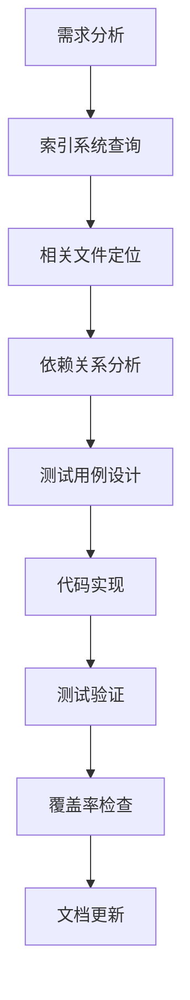
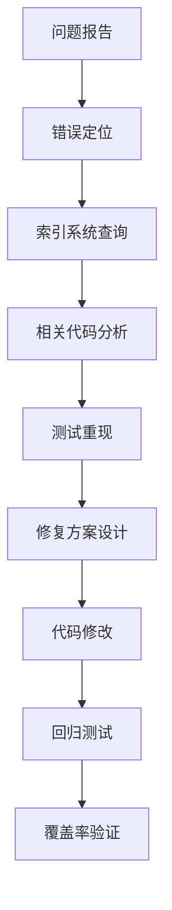

# SQLCC 测试集成、覆盖率提升与工具使用指南

## 概述

本指南全面介绍 SQLCC 项目的测试系统、覆盖率提升方法，以及如何使用项目提供的工具和索引系统。旨在帮助开发者理解测试架构、掌握覆盖率提升技术，并高效利用现有工具提升测试质量。

## 目录

1. [项目索引系统](#项目索引系统)
2. [测试集成系统](#测试集成系统)
3. [覆盖率提升方法](#覆盖率提升方法)
4. [测试脚本工具](#测试脚本工具)
5. [AI Agent 工作流程](#ai-agent-工作流程)
6. [最佳实践](#最佳实践)

## 项目索引系统

### 1. 文件索引系统概述

SQLCC 提供了完整的项目索引系统，帮助快速定位文件和理解依赖关系：

#### 核心索引文件
- `docs/project/header_index.md` - 完整的头文件索引
- `docs/project/project_index_usage_guide.md` - 索引使用指南
- `docs/project/overview.md` - 项目概述
- `docs/project/history.md` - 项目发展历史

#### 索引系统架构
```
项目索引系统
├── 头文件索引 (header_index.md)
│   ├── 目录结构概览
│   ├── 核心头文件索引表格
│   ├── 关键文件定位
│   └── 统计信息
├── 源码文件索引 (规划中)
├── 测试文件索引 (规划中)
└── 依赖关系映射
```

### 2. 使用方法

#### 快速文件定位
```bash
# 查找缓冲池相关文件
grep -A 10 -B 5 "buffer_pool" docs/project/header_index.md

# 查找SQL解析器相关文件
grep -A 20 "SQL解析器" docs/project/header_index.md

# 查找B+树相关文件
grep -i "b.*plus.*tree\|bplus" docs/project/header_index.md
```

#### 依赖关系分析
```bash
# 查看某个头文件的依赖
grep -A 15 "sql_parser/data_types.h" docs/project/header_index.md

# 查找测试对应的源码
grep -B 5 -A 5 "测试" docs/project/header_index.md
```

## 测试集成系统

### 1. 测试层次架构

SQLCC 采用7层测试架构，确保全面的测试覆盖：

#### 层次结构
```
层次1: 基础工具类测试 (Logger, Config, Exception)
层次2: 存储引擎基础测试 (Buffer Pool, Page, Disk I/O)
层次3: 索引系统测试 (B+树, 索引管理, 并发控制)
层次4: SQL解析器测试 (Lexer, Parser, AST)
层次5: 执行引擎测试 (Query Plan, Executor, Optimizer)
层次6: 网络通信测试 (Protocol, Connection, Session)
层次7: 高层功能测试 (Transaction, Trigger, Procedure)
```

#### 各层次覆盖率目标
- **层次1**: 100% (基础工具，质量保证)
- **层次2**: 85%+ (存储基础，性能关键)
- **层次3**: 82%+ (索引核心，数据一致性)
- **层次4**: 50%+ (解析复杂，逐步提升)
- **层次5**: 40%+ (执行复杂，持续改进)
- **层次6**: 35%+ (网络稳定，集成测试)
- **层次7**: 30%+ (高级功能，业务验证)

### 2. 测试文件组织

#### 标准测试结构
```
tests/
├── unit/                     # 单元测试
│   ├── basic/               # 基础工具测试
│   ├── storage/             # 存储引擎测试
│   ├── parser/              # 解析器测试
│   ├── execution/           # 执行引擎测试
│   └── network/             # 网络测试
├── integration/             # 集成测试
├── performance/             # 性能测试
├── security/                # 安全测试
└── demo/                    # 演示测试
```

#### 测试文件命名规范
```cpp
// 单元测试命名
{component}_{functionality}_test.cpp
例如: buffer_pool_lru_test.cpp

// 集成测试命名
{component}_integration_test.cpp
例如: client_server_integration_test.cpp

// 性能测试命名
{component}_performance_test.cpp
例如: index_performance_test.cpp
```

## 覆盖率提升方法

### 1. 层次化覆盖率提升策略

#### 阶段1: 基础巩固 (层次1-3)
```cpp
// 重点提升内容
- Logger 测试覆盖 (100%)
- Config 管理测试 (100%)
- Buffer Pool 核心功能 (85%)
- B+树算法覆盖 (82%)
- 并发控制测试 (80%)
```

#### 阶段2: 核心扩展 (层次4-5)
```cpp
// 重点提升内容
- SQL解析器测试 (50% → 70%)
- 执行引擎测试 (40% → 60%)
- 查询优化测试 (新增)
- 错误处理测试 (完善)
```

#### 阶段3: 系统集成 (层次6-7)
```cpp
// 重点提升内容
- 网络协议测试 (35% → 55%)
- 事务完整性测试 (30% → 50%)
- 存储过程测试 (新增)
- 触发器功能测试 (新增)
```

### 2. 覆盖率提升技术

#### 白盒测试方法
```cpp
// 1. 路径覆盖
TEST(PathCoverage, AllBranches) {
    // 测试所有条件分支
    // if/else, switch/case, 循环
}

// 2. 条件覆盖
TEST(ConditionCoverage, AllConditions) {
    // 测试所有条件组合
    // 边界值, 等价类
}

// 3. 循环覆盖
TEST(LoopCoverage, AllLoops) {
    // 测试循环边界
    // 0次, 1次, 多轮, 最大值
}
```

#### 灰盒测试方法
```cpp
// 1. 功能接口测试
TEST(InterfaceCoverage, AllAPIs) {
    // 测试所有公开接口
    // 参数组合, 返回值验证
}

// 2. 边界值测试
TEST(BoundaryCoverage, EdgeCases) {
    // 最大值, 最小值, 溢出值
    // 空值, 异常输入
}
```

#### 集成测试方法
```cpp
// 1. 模块间接口测试
TEST(IntegrationCoverage, ModuleInterfaces) {
    // 测试模块间调用
    // 数据传递, 状态同步
}

// 2. 端到端测试
TEST(E2ECoverage, FullWorkflow) {
    // 完整业务流程测试
    // 用户操作到数据持久化
}
```

### 3. 自动化覆盖率收集

#### 覆盖率数据收集脚本
```bash
# scripts/generate_crud_coverage_data.sh
# CRUD操作覆盖率数据收集
# 生成详细的覆盖率报告

# scripts/run_crud_coverage_tests.sh
# 执行CRUD测试并收集覆盖率

# scripts/verify_crud_coverage.sh
# 验证覆盖率达标情况
```

#### 覆盖率分析工具
```bash
# scripts/analyze_module_coverage.sh
# 分析各模块覆盖率详情

# scripts/enhanced_coverage_analyzer.py
# 智能覆盖率分析和建议
```

## 测试脚本工具

### 1. 核心测试脚本

#### 构建和测试脚本
```bash
# scripts/test_pipeline.sh
# 完整的测试流水线
# 包括编译, 单元测试, 集成测试

# scripts/prepare_test_environment.sh
# 测试环境准备
# 依赖安装, 环境配置

# scripts/run_integration_tests.sh
# 集成测试执行
# 端到端测试流程
```

#### 覆盖率相关脚本
```bash
# scripts/generate_test_report.sh
# 生成测试报告
# HTML/XML/JSON格式

# scripts/analyze_coverage_trends.sh
# 覆盖率趋势分析
# 历史数据对比

# scripts/comprehensive_coverage_test.sh
# 全面覆盖率测试
# 全系统覆盖率评估
```

#### 性能测试脚本
```bash
# scripts/benchmark_compile_time.sh
# 编译时间基准测试

# scripts/monitor_compile_performance.sh
# 编译性能监控

# scripts/run_performance_tests.sh
# 性能测试执行
```

### 2. 工具脚本使用指南

#### 测试执行流程
```bash
# 1. 环境准备
./scripts/prepare_test_environment.sh

# 2. 构建验证
bazel build //...

# 3. 单元测试
bazel test //tests/unit/...

# 4. 集成测试
./scripts/run_integration_tests.sh

# 5. 覆盖率分析
./scripts/comprehensive_coverage_test.sh

# 6. 报告生成
./scripts/generate_test_report.sh
```

#### 问题诊断流程
```bash
# 1. 编译错误检查
bazel build --verbose_failures //...

# 2. 测试失败分析
bazel test --test_output=errors //tests/unit/...

# 3. 覆盖率问题定位
./scripts/analyze_module_coverage.sh

# 4. 性能瓶颈分析
./scripts/run_performance_tests.sh
```

## AI Agent 工作流程

### 1. 代码分析流程

#### 新功能开发


#### 问题修复流程


### 2. 测试开发最佳实践

#### 测试用例设计原则
```cpp
// 1. AAA模式 (Arrange-Act-Assert)
TEST(TestSuite, TestCase) {
    // Arrange: 准备测试数据和环境
    auto test_data = prepareTestData();

    // Act: 执行被测试的功能
    auto result = functionUnderTest(test_data);

    // Assert: 验证结果
    EXPECT_EQ(expected_result, result);
}

// 2. 边界值测试
TEST(BoundaryTest, EdgeCases) {
    // 测试边界条件
    testBoundaryValue(MIN_VALUE);
    testBoundaryValue(MAX_VALUE);
    testBoundaryValue(ZERO_VALUE);
}

// 3. 异常处理测试
TEST(ExceptionTest, ErrorHandling) {
    // 测试异常情况
    EXPECT_THROW(functionUnderTest(invalid_input), ExpectedException);
}
```

#### 测试覆盖率目标
```cpp
// 行覆盖率目标: 80%+
// 分支覆盖率目标: 75%+
// 函数覆盖率目标: 90%+
// 类覆盖率目标: 85%+
```

## 最佳实践

### 1. 开发流程最佳实践

#### 代码提交前检查
```bash
# 1. 编译检查
bazel build //...

# 2. 单元测试
bazel test //tests/unit/...

# 3. 覆盖率检查
./scripts/comprehensive_coverage_test.sh

# 4. 代码格式检查
./scripts/check_code_style.sh

# 5. 文档更新
./scripts/update_documentation.sh
```

#### 持续集成流程
```yaml
# .github/workflows/ci.yml
name: CI
on: [push, pull_request]
jobs:
  test:
    runs-on: ubuntu-latest
    steps:
      - uses: actions/checkout@v2
      - name: Setup Bazel
        uses: bazelbuild/setup-bazelisk@v1
      - name: Build
        run: bazel build //...
      - name: Test
        run: bazel test //...
      - name: Coverage
        run: ./scripts/comprehensive_coverage_test.sh
```

### 2. 覆盖率提升最佳实践

#### 增量式提升策略
```cpp
// 1. 识别低覆盖率模块
// 使用覆盖率报告定位问题

// 2. 优先级排序
// 核心功能 > 边界情况 > 错误处理

// 3. 渐进式改进
// 每次提交提升1-2个百分点

// 4. 可持续维护
// 建立覆盖率监控机制
```

#### 自动化测试策略
```cpp
// 1. 测试用例模板化
// 为常用功能建立测试模板

// 2. 参数化测试
// 使用TEST_P进行参数化测试

// 3. Mock和Stub
// 使用Google Mock进行依赖隔离

// 4. 测试数据工厂
// 建立测试数据生成器
```

### 3. 文档维护最佳实践

#### 索引系统维护
```markdown
# 更新时机
- 新增头文件时
- 删除或重命名文件时
- 组件结构发生变化时
- 发现索引信息不准确时

# 更新步骤
1. 分析新文件: 确定功能分类和依赖关系
2. 更新索引文档: 在相应位置添加条目
3. 验证完整性: 确保依赖关系正确标注
4. 更新统计信息: 同步更新文件数量统计
```

#### 测试文档维护
```markdown
# 测试文档结构
- 测试用例说明
- 覆盖范围描述
- 已知问题记录
- 性能基准数据

# 更新频率
- 新增测试用例时立即更新
- 每周检查覆盖率变化
- 每月全面审查和优化
```

## 总结

通过系统性的测试集成和覆盖率提升方法，结合完善的工具链和索引系统，SQLCC项目建立了高质量的测试体系。本指南提供了完整的使用方法和最佳实践，帮助开发者高效地进行测试开发和质量保障工作。

### 核心价值

1. **质量保证**: 全面的测试覆盖确保代码质量
2. **效率提升**: 工具链和索引系统提高开发效率
3. **可持续性**: 自动化流程支持持续集成和交付
4. **可维护性**: 完善的文档体系便于知识传承

### 持续改进

测试系统是一个持续演进的过程，需要：
- 定期审查和更新测试策略
- 引入新的测试技术和工具
- 优化测试执行效率
- 提升覆盖率分析的智能化水平

---

**文档版本**: v1.0
**最后更新**: 2025年12月29日
**维护者**: SQLCC AI Assistant
**适用范围**: SQLCC项目测试和质量保障
