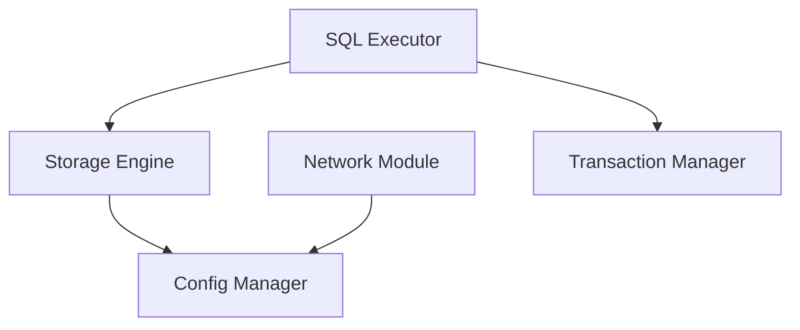

# SQLCC 组件交互关系文档

本文档描述了SQLCC项目中各组件之间的交互关系。

## 组件交互图

## 交互详情

### Storage Engine

Storage Engine 与以下组件存在交互关系：

#### 与 Config Manager 的交互

- Usage: ConfigManager&
- Usage: ConfigManager &

---

### Network Module

Network Module 与以下组件存在交互关系：

#### 与 Config Manager 的交互

- Usage: ConfigManager&

---

### SQL Executor

SQL Executor 与以下组件存在交互关系：

#### 与 Transaction Manager 的交互

- Usage: TransactionManager*

#### 与 Storage Engine 的交互

- Usage: StorageEngine &
- Include: include/storage_engine

---

## 总结

SQLCC系统采用模块化设计，各组件间通过明确定义的接口进行交互。这种设计使得系统具有良好的可维护性和扩展性。