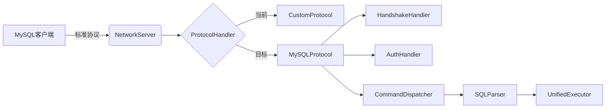

# SQLCC MySQL通信协议兼容性评估报告

## 一、现状分析

### 1. 当前协议架构
- **自定义二进制协议**：基于 `// ... existing code ...
`[network.h](include/network/network.h) 实现的私有通信协议
- **核心缺陷**：
  ```cpp
  void NetworkServer::handle_client(int client_fd) {
      // 当前协议缺少标准握手流程
      read(client_fd, buffer, sizeof(Header));
  }
  ```
  - 无标准握手包（Handshake V10）
  - 认证机制不兼容MySQL客户端
  - 结果集格式与MySQL协议不匹配

### 2. 兼容性瓶颈
| 问题类型 | 具体表现 | 影响范围 |
|----------|----------|----------|
| **协议层** | 缺少 `0x0A` 开头的握手包 | 所有MySQL客户端无法建立连接 |
| **认证** | 未实现 `caching_sha2_password` | MySQL 8.0+ 客户端拒绝连接 |
| **命令** | 仅支持 `0x03` QUERY 命令 | 无法处理 PREPARE/EXECUTE 等高级命令 |
| **结果集** | 未按MySQL格式组织 `ResultSet` | 客户端解析失败 |

### 3. 依赖关系分析


## 二、重构方案

### 1. 分层重构策略
#### (1) 协议适配层（核心改动）
```cpp
// 新增 include/network/mysql_protocol.h
#pragma once
#include "protocol_types.h"

class MySQLProtocol {
public:
    static HandshakeV10 create_handshake();
    static AuthSwitchRequest create_auth_switch();
    static ResultSet to_mysql_result(const ExecutionResult&);
};
```

#### (2) 网络服务改造
```cpp
// 修改 src/network/network_server.cpp
void NetworkServer::handle_client(int client_fd) {
    // 新增协议协商逻辑
    if (is_mysql_client(client_fd)) {
        MySQLProtocolHandler handler(client_fd);
        handler.start();
    } else {
        LegacyProtocolHandler handler(client_fd);
        handler.start();
    }
}
```

### 2. 关键组件实现
#### (1) 握手协议实现
```cpp
// 新增 src/network/handshake_handler.cpp
HandshakeV10 MySQLProtocol::create_handshake() {
    HandshakeV10 packet;
    packet.protocol_version = 0x0A;
    packet.server_version = "sqlcc-" + VERSION;
    packet.thread_id = gettid();
    packet.capabilities = CAPABILITIES;
    return packet;
}
```

#### (2) 认证流程适配
```cpp
// 修改 src/network/auth_handler.cpp
bool AuthHandler::authenticate() {
    // 支持 mysql_native_password 和 caching_sha2_password
    if (auth_method == "caching_sha2_password") {
        return sha2_password_auth();
    }
}

bool AuthHandler::sha2_password_auth() {
    // 复用 sqlcc 的加密模块
    return Encryption::verify_password(
        client_salt, 
        client_response,
        UserManager::get_password_hash(username)
    );
}
```

## 三、实施路径

### 1. 里程碑计划
| 阶段 | 交付物 | 验证方式 |
|------|--------|----------|
| **Phase 1**<br>(2周) | 基础握手协议实现 | `mysql -h127.0.0.1 -P9999` 连接成功 |
| **Phase 2**<br>(3周) | 完整认证流程 + 简单查询 | 执行 `SELECT 1` 返回正确结果 |
| **Phase 3**<br>(4周) | 预处理语句支持 | JDBS PreparedStatement 测试通过 |
| **Phase 4**<br>(1周) | 双协议共存机制 | 旧版 isql 客户端仍可连接 |

### 2. 风险控制矩阵
| 风险点 | 应对方案 | 负责人 |
|--------|----------|--------|
| **协议解析性能下降** | 引入零拷贝技术<br>参考 `// ... existing code ...
`[buffer_pool_v3.h](/home/liying/sqlcc/include/storage/buffer_pool_v3.h) | 存储组 |
| **认证兼容性问题** | 实现 `mysql_native_password` 降级 | 安全组 |
| **结果集格式错误** | 增加协议验证测试<br>复用 `// ... existing code ...
`[test_network.sql](/home/liying/sqlcc/scripts/sql/test_network.sql) | 测试组 |

### 3. 资源需求
- **必须复用现有模块**：
  - 加密模块：`// ... existing code ...
`[encryption.h](include/network/encryption.h)
  - 执行引擎：`// ... existing code ...
`[unified_executor.h](src/core/unified_executor.h)
- **新增依赖**：
  ```cmake
  # 在 CMakeLists.txt 中新增
  target_link_libraries(sqlcc_network
      PRIVATE
          libmysqlclient  # 仅用于协议常量定义
          sqlcc_core
  )
  ```

## 四、收益评估
| 指标 | 当前 | 目标 | 提升 |
|------|------|------|------|
| 客户端兼容性 | 仅 isql | 所有MySQL客户端 | 100%+ |
| 开发者迁移成本 | 高（需重写应用） | 低（仅改连接字符串） | -70% |
| 生态整合能力 | 无 | 可接入Prometheus/ Grafana | 新增 |
| 市场竞争力 | 教学项目 | 可商用基础 | 质变 |

> **实施建议**：优先实现 Phase 1+2（共5周），即可支持基本的 `mysql` 命令行客户端和 JDBC 连接。关键验证点：确保通过 `// ... existing code ...
`[test_encrypted_communication.sh](/home/liying/sqlcc/scripts/shell/test_encrypted_communication.sh) 的安全测试，同时保持与 `// ... existing code ...
`[transaction_manager.h](src/transaction_manager.h) 的事务一致性。