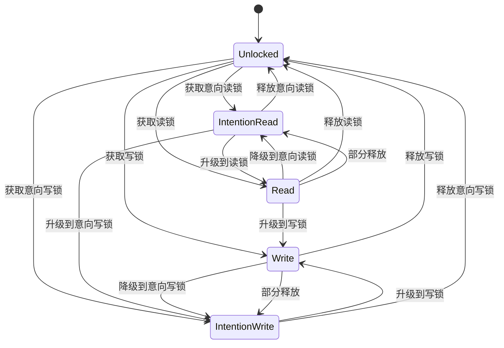
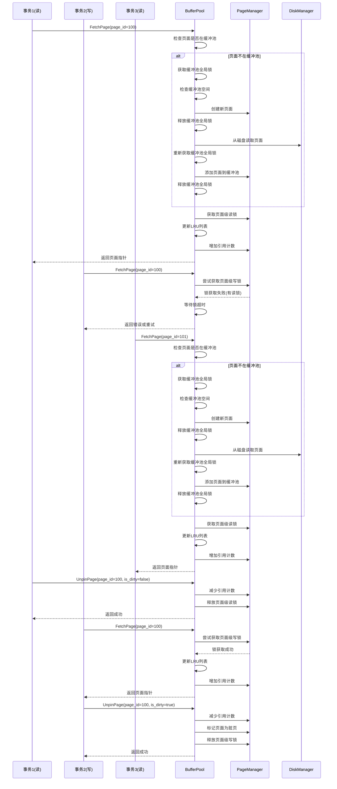

# BufferPool加锁机制设计文档

## 概述

本文档详细描述了SQLCC数据库系统中BufferPool的加锁机制设计，特别关注高并发读写操作场景下的锁策略和并发控制机制。BufferPool是数据库存储引擎的核心组件，负责管理内存中的页面缓存，通过减少磁盘I/O操作提高数据库性能。

## 设计目标

1. **高并发性能**：支持大量并发读写操作，最小化锁竞争
2. **死锁预防**：采用锁超时和锁顺序控制机制避免死锁
3. **数据一致性**：确保并发访问下的数据一致性
4. **可扩展性**：支持动态调整缓冲池大小和锁策略
5. **性能监控**：提供详细的锁竞争和性能指标

## 当前锁机制分析

### 锁类型

当前BufferPool使用`std::timed_mutex`作为主要锁机制，支持超时获取：

```cpp
mutable std::timed_mutex latch_;  // 主互斥锁
```

### 锁超时策略

系统采用分级超时策略，针对不同操作类型设置不同的超时时间：

```cpp
size_t read_lock_timeout_ms_;    // 读取操作锁超时（默认2000ms）
size_t write_lock_timeout_ms_;   // 写入操作锁超时（默认5000ms）
size_t lock_timeout_ms_;         // 默认锁超时（默认3000ms）
```

### 锁获取模式

所有BufferPool操作使用`std::unique_lock<std::timed_mutex>`获取锁，支持临时解锁：

```cpp
std::unique_lock<std::timed_mutex> lock(latch_, std::defer_lock);
if (!lock.try_lock_for(std::chrono::milliseconds(read_lock_timeout_ms_))) {
    // 锁获取失败处理
}
```

### 死锁预防机制

1. **锁超时**：使用`timed_mutex`避免无限等待
2. **锁外I/O**：磁盘操作前释放锁，操作后重新获取
3. **锁顺序控制**：确保所有操作以相同顺序获取锁

## 高级并发控制理论

### 多版本并发控制(MVCC)

MVCC是一种乐观并发控制机制，通过维护数据的多版本来避免读写冲突<mcreference link="https://blog.csdn.net/weixin_43633784/article/details/112132543" index="2">2</mcreference>。MVCC的核心思想是：

- 读操作不阻塞写操作
- 写操作不阻塞读操作
- 通过版本号或时间戳确定数据可见性

### 两阶段锁协议(2PL)

两阶段锁协议是数据库中最常用的并发控制机制<mcreference link="https://blog.csdn.net/weixin_38803409/article/details/124151599" index="4">4</mcreference>：

1. **扩展阶段**：事务可以获取锁但不能释放锁
2. **收缩阶段**：事务可以释放锁但不能获取锁

### 锁耦合(Lock Crabbing/Coupling)

锁耦合是一种用于B+树等索引结构的并发控制技术<mcreference link="https://juejin.cn/post/6964671390112808974" index="2">2</mcreference>：

1. 获取父节点的锁
2. 获取子节点的锁
3. 如果子节点是"安全的"，则释放父节点的锁

### 分层锁机制

分层锁机制在表和键之间增加更多锁粒度，通过锁的分级选择合适的加锁策略<mcreference link="https://juejin.cn/post/7069678293695332360" index="2">2</mcreference>。

## 改进的锁机制设计

### UML类图

```mermaid
classDiagram
    class BufferPool {
        -DiskManager* disk_manager_
        -ConfigManager& config_manager_
        -size_t pool_size_
        -unordered_map~int32_t, Page*~ page_table_
        -list~int32_t~ lru_list_
        -unordered_map~int32_t, list~int32_t~::iterator~ lru_map_
        -timed_mutex latch_
        -timed_mutex page_table_mutex_
        -timed_mutex lru_list_mutex_
        -unordered_map~int32_t, shared_mutex~ page_locks_
        -size_t read_lock_timeout_ms_
        -size_t write_lock_timeout_ms_
        -size_t lock_timeout_ms_
        -LockManager lock_manager_
        
        +FetchPage(int32_t page_id) Page*
        +BatchFetchPages(vector~int32_t~ page_ids) vector~Page*~
        +NewPage(int32_t* page_id) Page*
        +UnpinPage(int32_t page_id, bool is_dirty) bool
        +FlushPage(int32_t page_id) bool
        +FlushAllPages() void
        +DeletePage(int32_t page_id) bool
        +PrefetchPage(int32_t page_id) bool
        +BatchPrefetchPages(vector~int32_t~ page_ids) bool
        -FindVictimPage() int32_t
        -ReplacePage(int32_t victim_page_id, int32_t new_page_id) bool
        -UpdateLRUList(int32_t page_id) void
        -MoveToHead(int32_t page_id) void
        -RemoveFromLRUList(int32_t page_id) void
        -AcquirePageLock(int32_t page_id, LockType type) bool
        -ReleasePageLock(int32_t page_id, LockType type) void
    }
    
    class Page {
        -int32_t page_id_
        -char data_[PAGE_SIZE]
        -int pin_count_
        -bool is_dirty_
        -shared_mutex page_mutex_
        
        +GetPageId() int32_t
        +GetData() void*
        +GetPinCount() int
        +IsDirty() bool
        +Pin() void
        +Unpin(bool dirty) void
        +WLatch() bool
        +ULatch() bool
        +WUnlatch() void
        +UUnlatch() void
    }
    
    class LockManager {
        -unordered_map~int32_t, LockRequest~ lock_table_
        -timed_mutex lock_table_mutex_
        
        +AcquireLock(int32_t page_id, LockType type, TransactionId txn_id) bool
        +ReleaseLock(int32_t page_id, LockType type, TransactionId txn_id) void
        +UpgradeLock(int32_t page_id, TransactionId txn_id) bool
        -CheckCompatibility(LockType requested, vector~LockType~ held) bool
        -DetectDeadlock(TransactionId txn_id) bool
    }
    
    class LockRequest {
        +LockType type
        +TransactionId txn_id
        +bool granted
    }
    
    enum LockType {
        READ
        WRITE
        INTENTION_READ
        INTENTION_WRITE
    }
    
    BufferPool --> Page : contains
    BufferPool --> LockManager : uses
    LockManager --> LockRequest : manages
```

### 锁状态图



### 缓冲池操作活动图

```mermaid
activityDiagram
    start
    :接收页面请求;
    
    if (页面是否在缓冲池中?) then (是)
        :获取页面级读锁;
        :更新LRU列表;
        :增加引用计数;
        :释放页面级读锁;
        :返回页面指针;
    else (否)
        :获取缓冲池全局写锁;
        
        if (缓冲池是否已满?) then (是)
            :查找替换页面;
            :获取替换页面写锁;
            :检查页面是否为脏页;
            if (是脏页?) then (是)
                :释放缓冲池全局锁;
                :执行磁盘写入;
                :重新获取缓冲池全局锁;
            end
            :从页面表移除;
            :从LRU列表移除;
            :释放替换页面写锁;
        end
        
        :释放缓冲池全局锁;
        :执行磁盘读取;
        :重新获取缓冲池全局写锁;
        
        :创建新页面对象;
        :添加到页面表;
        :添加到LRU列表头部;
        :获取页面级写锁;
        :设置引用计数为1;
        :释放页面级写锁;
        :释放缓冲池全局写锁;
        :返回页面指针;
    end
    
    stop
```

### 高并发读写操作顺序图



## 分层锁机制设计

### 锁粒度层次

1. **缓冲池全局锁**：保护整个缓冲池结构
   - 保护页面表、LRU列表等全局数据结构
   - 用于缓冲池大小调整、批量操作等

2. **页面级锁**：保护单个页面
   - 使用读写锁(`shared_mutex`)支持多读单写
   - 每个页面有独立的锁，减少锁竞争

3. **页面区域锁**：保护页面区域(可选)
   - 将页面划分为多个区域，每个区域有独立锁
   - 适用于大页面场景，提高并发度

### 锁兼容性矩阵

| 请求锁 \ 持有锁 | 无 | 意向读 | 意向写 | 读 | 写 |
|----------------|----|--------|--------|----|----|
| 意向读         | ✓  | ✓      | ✗      | ✓  | ✗  |
| 意向写         | ✓  | ✗      | ✗      | ✗  | ✗  |
| 读             | ✓  | ✓      | ✗      | ✓  | ✗  |
| 写             | ✓  | ✗      | ✗      | ✗  | ✗  |

### 锁升级机制

1. **意向读 → 读**：直接升级
2. **意向读 → 意向写**：需要等待其他读锁释放
3. **读 → 写**：需要等待其他读锁释放
4. **意向写 → 写**：直接升级

## 死锁预防与检测

### 预防策略

1. **锁超时**：所有锁操作都有超时限制
2. **锁顺序**：按固定顺序获取锁
3. **锁外I/O**：磁盘操作前释放锁

### 检测机制

1. **等待图**：构建事务等待图检测循环等待
2. **超时检测**：检测长时间等待的锁请求
3. **优先级继承**：防止优先级反转

### 恢复策略

1. **事务回滚**：选择代价最小的事务回滚
2. **锁释放**：释放死锁事务持有的所有锁
3. **重试机制**：自动重试被中止的事务

## 性能优化策略

### 锁粒度优化

1. **细粒度锁**：使用页面级锁替代全局锁
2. **锁分区**：将锁空间分区减少竞争
3. **锁分离**：读写操作使用不同锁

### 锁持有时间优化

1. **早期释放**：尽早释放不需要的锁
2. **锁外I/O**：I/O操作前释放锁
3. **批量操作**：合并多个操作减少锁获取次数

### 缓存友好设计

1. **缓存行对齐**：锁数据结构对齐到缓存行
2. **伪共享避免**：避免频繁访问的数据在同一缓存行
3. **NUMA感知**：考虑NUMA架构的内存访问模式

## 监控与调优

### 性能指标

1. **锁竞争率**：锁获取失败次数/总获取次数
2. **锁等待时间**：平均锁等待时间
3. **死锁频率**：单位时间内死锁次数
4. **锁升级率**：锁升级次数/总锁操作次数

### 调优参数

1. **锁超时时间**：根据系统负载调整
2. **锁重试次数**：控制锁获取失败后的重试
3. **批量操作大小**：平衡并发度和效率

### 动态调整

1. **自适应锁粒度**：根据负载动态调整锁粒度
2. **热点页面检测**：识别热点页面应用特殊策略
3. **负载感知调度**：根据系统负载调整锁策略

## 实现建议

### 数据结构设计

```cpp
class BufferPool {
private:
    // 全局锁
    mutable std::timed_mutex global_latch_;
    
    // 页面表和LRU列表的细粒度锁
    mutable std::timed_mutex page_table_latch_;
    mutable std::timed_mutex lru_list_latch_;
    
    // 页面级锁
    std::unordered_map<int32_t, std::shared_mutex> page_latches_;
    
    // 锁管理器
    std::unique_ptr<LockManager> lock_manager_;
    
    // 页面数据
    std::unordered_map<int32_t, std::unique_ptr<Page>> pages_;
    std::list<int32_t> lru_list_;
    std::unordered_map<int32_t, std::list<int32_t>::iterator> lru_map_;
    
    // 锁配置
    size_t read_lock_timeout_ms_;
    size_t write_lock_timeout_ms_;
    size_t lock_retry_count_;
};
```

### 锁获取模式

```cpp
// 读操作锁获取
bool AcquireReadLock(int32_t page_id) {
    auto& page_latch = page_latches_[page_id];
    return page_latch.try_lock_shared_for(
        std::chrono::milliseconds(read_lock_timeout_ms_));
}

// 写操作锁获取
bool AcquireWriteLock(int32_t page_id) {
    auto& page_latch = page_latches_[page_id];
    return page_latch.try_lock_for(
        std::chrono::milliseconds(write_lock_timeout_ms_));
}
```

### 锁外I/O模式

```cpp
Page* FetchPage(int32_t page_id) {
    // 1. 获取全局锁检查页面
    std::unique_lock<std::timed_mutex> global_lock(global_latch_);
    auto it = pages_.find(page_id);
    if (it != pages_.end()) {
        // 页面在缓冲池中
        global_lock.unlock();
        
        // 获取页面级锁
        if (!AcquireReadLock(page_id)) {
            return nullptr;
        }
        
        // 更新LRU列表
        UpdateLRUList(page_id);
        return it->second.get();
    }
    
    // 2. 页面不在缓冲池中，需要加载
    global_lock.unlock();
    
    // 3. 锁外磁盘读取
    auto page = std::make_unique<Page>(page_id);
    if (!disk_manager_->ReadPage(page_id, page->GetData())) {
        return nullptr;
    }
    
    // 4. 重新获取全局锁添加页面
    global_lock.lock();
    // ... 添加页面到缓冲池
    global_lock.unlock();
    
    // 5. 获取页面级锁
    if (!AcquireReadLock(page_id)) {
        return nullptr;
    }
    
    return page.release();
}
```

## 总结

本文档设计了一个多层次、细粒度的BufferPool锁机制，通过以下关键技术实现高并发访问：

1. **分层锁机制**：全局锁+页面级锁减少锁竞争
2. **锁外I/O**：磁盘操作前释放锁避免死锁
3. **锁超时与重试**：防止无限等待和死锁
4. **锁兼容性矩阵**：支持多读单写并发模式
5. **性能监控与调优**：动态调整锁策略

这种设计在保证数据一致性的同时，显著提高了BufferPool的并发性能，适用于高负载的数据库系统。