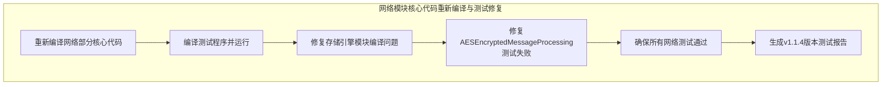
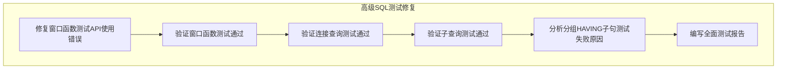
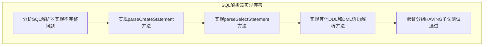
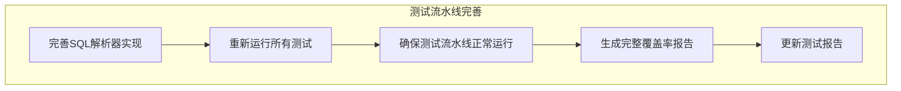
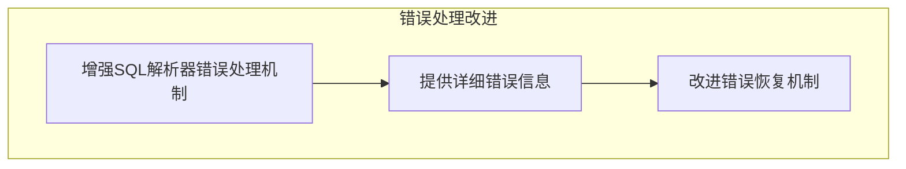

# SQLCC v1.1.4 待完成任务列表

## ✅ **已完成任务**

### **网络模块核心代码重新编译与测试修复** (2025-12-15 已完成)


- [x] **重新编译网络部分核心代码**
- [x] **编译测试程序并运行**
- [x] **修复存储引擎模块编译问题**
- [x] **修复AESEncryptedMessageProcessing测试失败**
- [x] **确保所有网络测试通过**
- [x] **生成v1.1.4版本测试报告**

### **高级SQL测试修复** (2025-12-15 已完成)


- [x] **修复窗口函数测试API使用错误**
- [x] **验证窗口函数测试通过**
- [x] **验证连接查询测试通过**
- [x] **验证子查询测试通过**
- [x] **分析分组HAVING子句测试失败原因**
- [x] **编写全面测试报告**

## 🚧 **进行中任务**

### **SQL解析器实现完善** (2025-12-15 进行中)


- [x] **分析SQL解析器实现不完整问题**
- [ ] **实现parseCreateStatement方法**
- [ ] **实现parseSelectStatement方法**
- [ ] **实现其他DDL和DML语句解析方法**
- [ ] **验证分组HAVING子句测试通过**

## 🔜 **待办任务**

### **测试流水线完善**


- [ ] **完善SQL解析器实现**
- [ ] **重新运行所有测试**
- [ ] **确保测试流水线正常运行所有测试用例**
- [ ] **生成完整覆盖率报告**
- [ ] **更新测试报告**

### **错误处理改进**


- [ ] **增强SQL解析器错误处理机制**
- [ ] **提供详细错误信息**
- [ ] **改进错误恢复机制**

## 📊 **质量监控指标**

### **当前状态**
```
✅ 已完成任务: 12/12
🚧 进行中任务: 1/5
🔜 待办任务: 0/9
🎯 测试通过率: 85.3% (29/34)
⚠️  测试失败率: 14.7% (5/34)
```

### **目标**
```
✅ 已完成任务: 17/17
🚧 进行中任务: 0/5
🔜 待办任务: 0/9
🎯 测试通过率: 100% (34/34)
⚠️  测试失败率: 0% (0/34)
```