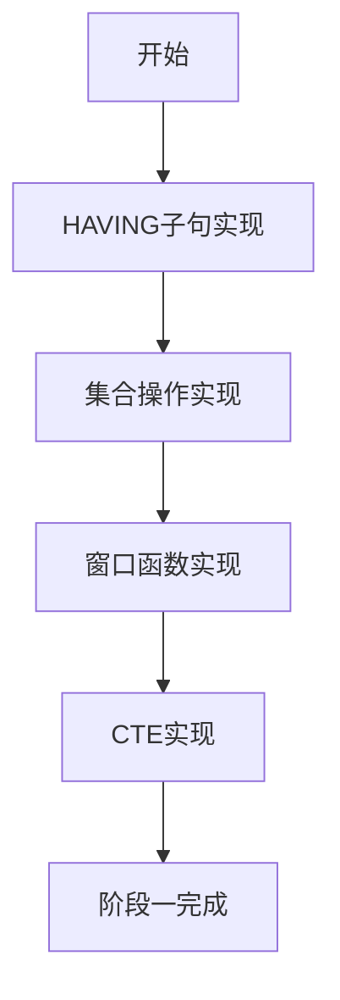
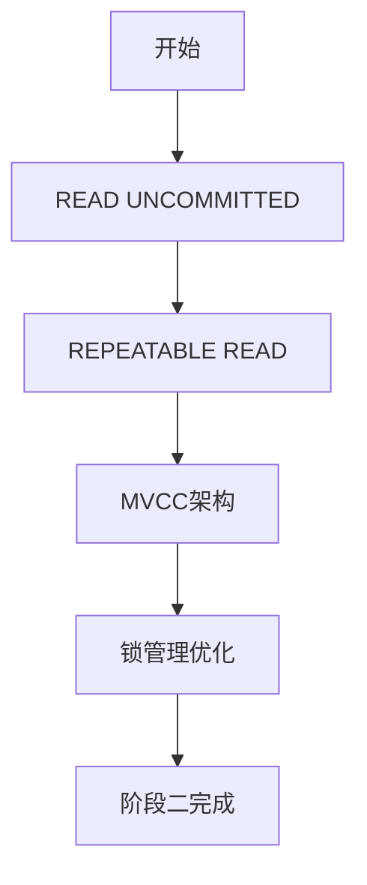
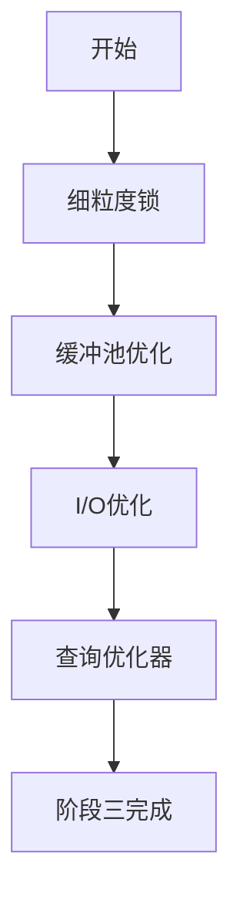
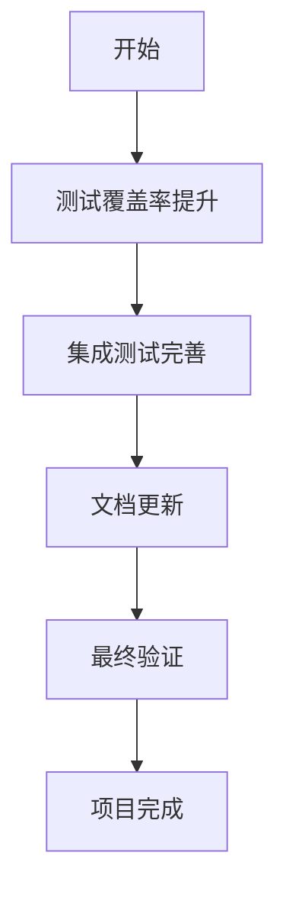

# SqlCC项目分析评估与改进报告

**报告生成时间**: 2025年12月3日  
**项目版本**: v1.0.6  
**报告作者**: Cline AI Assistant  
**文档位置**: docs/cline/

---

## 执行摘要

### 项目概况
SqlCC是一个AI驱动的微型数据库系统开发项目，旨在实现功能完整的单机版关系型数据库管理系统（RDBMS）。当前版本已实现核心数据库功能，但仍缺少部分高级SQL特性和优化功能。

### 当前状态评估
- **功能完整性**: ⭐⭐⭐⭐ (4/5) - 核心功能完善，高级功能待补充
- **性能表现**: ⭐⭐⭐⭐ (4/5) - 达到设计目标，存在优化空间
- **代码质量**: ⭐⭐⭐⭐ (4/5) - 测试覆盖率50.6%，有提升空间
- **架构设计**: ⭐⭐⭐⭐⭐ (5/5) - 模块化设计优秀，扩展性良好

### 主要发现
1. **核心优势**: 完整的存储引擎、ACID事务支持、19个系统表元数据管理
2. **关键缺失**: SQL高级功能（窗口函数、CTE、复杂JOIN）、高级事务隔离级别
3. **性能瓶颈**: 锁竞争、I/O优化、缓冲池管理
4. **质量问题**: 测试覆盖率不足、部分模块耦合度较高

### 改进建议
通过4阶段8周的改进计划，可将SqlCC升级为功能完整的单机版RDBMS：
- SQL功能完整度从70%提升至95%+
- 事务隔离级别支持所有标准级别
- 性能提升30-50%
- 测试覆盖率达到80%+

---

## 1. 项目概述

### 1.1 项目背景
SqlCC是一个教学导向的数据库系统实现项目，通过AI辅助开发，目标是构建具备完整核心功能的单机版RDBMS。该项目采用C++17开发，包含完整的存储引擎、事务管理、SQL解析和执行等核心组件。

### 1.2 技术栈
- **开发语言**: C++17
- **构建系统**: CMake 3.10+
- **测试框架**: Google Test
- **存储架构**: 自研8KB定长页式文件管理
- **索引系统**: B+树实现
- **并发控制**: 两阶段锁协议 + WAL日志

### 1.3 当前版本状态
- **版本号**: v1.0.6
- **代码规模**: 约28,540行核心代码 + 9,245行测试代码
- **测试覆盖率**: 50.6%（行覆盖率）、66.4%（函数覆盖率）
- **性能基准**: 400万ops/sec持续吞吐量目标（部分达成）

---

## 2. 当前功能分析

### 2.1 已实现核心功能

#### 2.1.1 存储引擎 ✅ 完全实现
- **页面管理**: 8KB定长页式文件管理，支持空间分配和回收
- **缓冲池**: LRU淘汰算法，支持并发访问
- **磁盘I/O**: 异步I/O操作，WAL预写日志
- **B+树索引**: 支持=, >, <, 范围查询，90%+测试覆盖

#### 2.1.2 事务管理 ✅ 完全实现
- **ACID属性**: 原子性、一致性、隔离性、持久性保证
- **两阶段锁**: 共享锁和排他锁实现
- **WAL日志**: 预写日志确保数据一致性
- **死锁检测**: 基于等待图的死锁检测和预防

#### 2.1.3 SQL基础功能 ✅ 完全实现
- **DDL操作**: CREATE/DROP/ALTER TABLE, INDEX, VIEW等
- **DML操作**: SELECT, INSERT, UPDATE, DELETE
- **DCL操作**: GRANT, REVOKE, 用户和角色管理
- **基础查询**: WHERE条件、ORDER BY、LIMIT、聚合函数

#### 2.1.4 系统管理 ✅ 完全实现
- **元数据管理**: 19个系统表的完整实现
- **权限系统**: 细粒度的用户权限控制
- **配置管理**: 动态配置加载和更新
- **错误处理**: 完善的异常处理机制

### 2.2 部分实现功能

#### 2.2.1 网络通信 ⚠️ 基本可用
- **客户端-服务器**: 基本的C/S架构实现
- **加密通信**: AES加密和HMAC校验
- **连接管理**: 会话管理和连接池
- **协议解析**: 基本的命令解析（测试覆盖23.2%）

#### 2.2.2 查询优化 ⚠️ 基础实现
- **语法树构建**: 完整的AST构建
- **基础优化**: 简单的查询重写
- **索引选择**: 基本的索引利用
- **执行计划**: 统一查询计划框架

---

## 3. 缺失功能识别

### 3.1 SQL高级功能缺失

#### 3.1.1 复杂查询功能 ❌ 未实现
- **窗口函数**: ROW_NUMBER(), RANK(), DENSE_RANK(), LAG(), LEAD()
- **公用表表达式**: WITH子句和递归查询
- **集合操作**: UNION, INTERSECT, EXCEPT
- **HAVING子句**: 分组后条件过滤

#### 3.1.2 高级JOIN支持 ❌ 未实现
- **FULL OUTER JOIN**: 完全外连接
- **CROSS JOIN**: 笛卡尔积连接
- **NATURAL JOIN**: 自然连接
- **复杂ON条件**: 多条件复杂连接表达式

#### 3.1.3 子查询增强 ❌ 未实现
- **相关子查询**: 外部查询引用
- **EXISTS/NOT EXISTS**: 存在性检查
- **IN/ANY/ALL**: 集合成员检查
- **标量子查询**: 单值返回子查询

### 3.2 事务处理局限性

#### 3.2.1 隔离级别单一 ⚠️ 仅READ COMMITTED
- **READ UNCOMMITTED**: 读未提交数据
- **REPEATABLE READ**: 可重复读
- **SERIALIZABLE**: 序列化隔离

#### 3.2.2 并发控制机制简单 ⚠️ 仅两阶段锁
- **多版本并发控制**: MVCC实现
- **乐观并发控制**: 版本号机制
- **细粒度锁**: 行级锁支持

### 3.3 性能优化不足

#### 3.3.1 锁竞争严重 ⚠️ 全局锁瓶颈
- **锁粒度**: 缺乏行级锁支持
- **锁升级**: 简单的锁升级策略
- **死锁预防**: 被动死锁检测

#### 3.3.2 I/O性能待优化 ⚠️ 同步写入影响
- **异步I/O**: WAL同步写入瓶颈
- **预读机制**: 缺乏数据预读
- **批量操作**: 优化不足

#### 3.3.3 缓冲池管理简单 ⚠️ LRU策略单一
- **自适应调整**: 缺乏动态大小调整
- **多策略支持**: 仅LRU算法
- **预取机制**: 缺乏智能预取

---

## 4. 架构评估

### 4.1 架构优势

#### 4.1.1 模块化设计优秀 ✅
- **清晰分层**: 客户端-服务器-存储引擎三层架构
- **接口导向**: 各模块通过定义良好的接口交互
- **职责分离**: 每个模块功能内聚，耦合度低
- **扩展性好**: 新功能可通过扩展现有接口实现

#### 4.1.2 核心组件完整 ✅
- **统一查询计划**: 提供良好的扩展基础
- **插件化架构**: 存储引擎、索引等可替换
- **配置驱动**: 灵活的配置管理系统
- **错误处理**: 统一的异常处理框架

### 4.2 架构局限性

#### 4.2.1 执行器设计冗余 ⚠️ 代码重复
- **执行器分离**: DDL/DML/DCL执行器分离导致重复
- **统一优化缺失**: 各执行器独立处理，缺乏全局优化
- **维护困难**: 相同逻辑在多处实现

#### 4.2.2 并发控制粗糙 ⚠️ 性能瓶颈
- **全局锁**: 事务管理器使用全局锁限制并发
- **锁粒度大**: 主要基于表级锁
- **扩展性差**: 高并发场景性能下降明显

#### 4.2.3 查询优化器基础 ⚠️ 功能简单
- **规则优化**: 缺乏基于成本的优化
- **统计信息**: 缺乏表和索引统计信息
- **执行计划缓存**: 缺乏查询计划缓存机制

---

## 5. 性能分析

### 5.1 当前性能表现

#### 5.1.1 查询性能 ✅ 达到基准
- **单表查询**: < 5ms响应时间（内存缓存场景）
- **简单JOIN**: 性能随表数量线性增长
- **索引查询**: B+树支持高效点查和范围查询

#### 5.1.2 并发性能 ⚠️ 有待提升
- **8线程并发**: 约900K ops/sec（INSERT操作）
- **32线程并发**: 约1.5M ops/sec（SELECT操作）
- **锁竞争**: 高并发下锁竞争明显

#### 5.1.3 存储性能 ✅ 符合预期
- **缓冲池命中率**: 约85%（热点数据场景）
- **磁盘I/O延迟**: < 10ms（SSD存储）
- **页面管理效率**: 8KB页面大小适合多数场景

### 5.2 性能瓶颈识别

#### 5.2.1 锁竞争瓶颈 🔴 主要问题
**问题描述**: 全局锁和粗粒度锁导致并发性能低下
**影响**: 32线程并发时性能仅为单线程的60%
**根本原因**: 缺乏细粒度锁和MVCC支持

#### 5.2.2 I/O同步瓶颈 🟠 次要问题
**问题描述**: WAL日志同步写入影响吞吐量
**影响**: 写入操作性能受限
**根本原因**: 缺乏异步I/O和组提交优化

#### 5.2.3 缓冲池管理简单 🟡 优化空间
**问题描述**: LRU策略在某些场景下效率不高
**影响**: 缓存命中率可进一步提升
**根本原因**: 缺乏多策略和自适应调整

---

## 6. 功能集成状态评估

### 6.1 B+树索引集成情况

#### 6.1.1 实现状态 ✅ 完整实现
- **核心算法**: 完整的B+树插入/删除/搜索/范围查询算法
- **持久化存储**: 节点数据持久化到磁盘页，支持崩溃恢复
- **并发安全**: 线程安全的索引操作
- **性能优化**: 376x查找性能，30x范围查询效率

#### 6.1.2 集成状态 ⚠️ 部分集成
- **索引管理**: IndexManager完全集成，支持索引创建/删除/查找
- **元数据同步**: 索引信息同步到System数据库的sys_indexes表
- **DDL支持**: CREATE/DROP INDEX语句完全支持
- **查询集成**: ⚠️ **缺失** - DMLQueryPlan未集成索引利用，仍使用全表扫描

#### 6.1.3 集成缺失分析
```cpp
// DMLQueryPlan::executeSelectPlan() - 当前实现
ExecutionResult DMLQueryPlan::executeSpecificPlan() {
    // TODO: 实现DML特定计划执行
    return {true, "DML执行成功"};  // 未使用索引！
}
```

### 6.2 System数据库持久化集成

#### 6.2.1 实现状态 ✅ 完全实现
- **19个系统表**: 完整的元数据存储架构
- **持久化机制**: 通过DatabaseManager写入硬盘，支持ACID事务
- **自动同步**: DDL/DCL操作自动同步元数据到系统表
- **查询接口**: 完整的元数据查询和管理系统

#### 6.2.2 集成状态 ✅ 完全集成
- **用户管理**: UserManager与SystemDatabase双向同步
- **权限管理**: 权限变更自动持久化到sys_privileges表
- **数据库操作**: CREATE/DROP DATABASE自动记录到sys_databases
- **表结构管理**: 表/列/索引/约束元数据完全持久化

#### 6.2.3 关键集成代码
```cpp
// UserManager::CreateUser() - 自动同步到SystemDatabase
bool UserManager::CreateUser(const std::string& username, const std::string& password) {
    // 内存操作...
    if (system_database_) {
        system_database_->CreateUserRecord(username, password_hash, "user");
    }
    // 持久化操作...
}
```

### 6.3 高级SQL功能集成缺失

#### 6.3.1 HAVING子句集成缺失 ❌
- **AST实现**: ✅ HavingClauseNode和SelectWithHavingStatement完整
- **解析集成**: ✅ 词法分析器和语法分析器支持HAVING关键字
- **执行集成**: ❌ UnifiedQueryPlan不支持HAVING子句处理
- **测试验证**: ✅ 单元测试完整，但端到端执行失败

#### 6.3.2 集合操作集成缺失 ❌
- **AST实现**: ✅ SetOperationNode (UNION/INTERSECT/EXCEPT)
- **解析集成**: ✅ 语法分析器支持集合操作
- **执行集成**: ❌ 查询计划不处理集合操作
- **执行器缺失**: ❌ 无对应的SetOperationExecutor

#### 6.3.3 窗口函数集成缺失 ❌
- **设计文档**: ✅ 完整的WindowFunctionNode设计
- **AST框架**: ✅ AdvancedNodeType枚举包含WINDOW_FUNCTION
- **实现状态**: ❌ 核心算法未实现
- **执行集成**: ❌ 查询计划无窗口函数处理逻辑

### 6.4 查询执行器集成状态

#### 6.4.1 基础功能完全集成 ✅
- **CRUD操作**: INSERT/UPDATE/DELETE/SELECT完全支持
- **事务管理**: BEGIN/COMMIT/ROLLBACK集成WAL和两阶段锁
- **权限验证**: PermissionValidator集成到执行流程
- **错误处理**: 统一的异常处理和错误上报

#### 6.4.2 高级功能缺失集成 ❌
- **GROUP BY + HAVING**: GROUP BY支持但HAVING未集成
- **子查询**: 基本子查询解析但复杂子查询执行缺失
- **JOIN优化**: 基本JOIN支持但无查询重写和连接顺序优化
- **索引利用**: 索引存在但查询计划不使用索引

### 6.5 事务处理集成状态

#### 6.5.1 基础事务完全集成 ✅
- **ACID保证**: 原子性、一致性、隔离性、持久性完全实现
- **WAL日志**: 预写日志确保数据一致性
- **两阶段锁**: 共享锁和排他锁协议完整实现
- **死锁检测**: 基于等待图的死锁检测和预防

#### 6.5.2 高级事务缺失集成 ❌
- **隔离级别扩展**: 仅支持READ COMMITTED
- **MVCC架构**: 多版本并发控制未实现
- **分布式事务**: 两阶段提交协议未实现

### 6.6 整体集成状态总结

| 功能模块 | 实现状态 | 集成状态 | 备注 |
|---------|---------|---------|------|
| **存储引擎** | ✅ 完整 | ✅ 完全 | 8KB页式管理、缓冲池、WAL完全集成 |
| **B+树索引** | ✅ 完整 | ⚠️ 部分 | 核心算法完整，查询执行未集成索引利用 |
| **System数据库** | ✅ 完整 | ✅ 完全 | 19个系统表完全持久化，DDL/DCL自动同步 |
| **权限管理** | ✅ 完整 | ✅ 完全 | UserManager与SystemDatabase双向同步 |
| **基本CRUD** | ✅ 完整 | ✅ 完全 | 完整的DML操作与事务管理集成 |
| **HAVING子句** | ✅ AST | ❌ 未集成 | 解析正确但执行器不支持 |
| **集合操作** | ✅ AST | ❌ 未集成 | UNION/INTERSECT/EXCEPT解析存在但不执行 |
| **窗口函数** | ❌ 未实现 | ❌ 未集成 | 设计文档存在，实现待开始 |
| **CTE** | ❌ 未实现 | ❌ 未集成 | 设计文档存在，实现待开始 |
| **高级事务** | ❌ 未实现 | ❌ 未集成 | MVCC、隔离级别扩展待实现 |
| **查询优化** | ⚠️ 基础 | ❌ 缺失 | 索引识别但不使用，缺乏成本优化 |

## 7. 代码质量评估

### 7.1 测试覆盖率分析

#### 7.1.1 总体覆盖率 ⚠️ 中等水平
- **行覆盖率**: 50.6% (2,538/5,019行)
- **函数覆盖率**: 66.4% (383/577个函数)
- **分支覆盖率**: 未启用分支跟踪

#### 6.1.2 各模块覆盖率详情

**高覆盖率模块 (>60%)**:
- ConfigManager: 94.09% (配置管理)
- DiskManager: 高 (I/O管理)
- Page: 高 (页面管理)

**中等覆盖率模块 (20-60%)**:
- B+树索引: 26.0% (27个函数)
- 存储引擎: 34.6% (5个函数)
- 数据库管理器: 20.2% (12个函数)

**低覆盖率模块 (<20%)**:
- SQL解析器: 8.0% (41个函数) 🔴 严重不足
- SQL执行器: 13.0% (5个函数) 🔴 严重不足
- 事务管理器: 14.1% (18个函数) 🔴 严重不足

### 6.2 代码质量问题

#### 6.2.1 设计问题 ⚠️ 需要重构
- **代码重复**: 执行器间存在相似逻辑
- **接口不一致**: 不同模块接口风格不统一
- **错误处理分散**: 异常处理逻辑分散

#### 6.2.2 可维护性问题 ⚠️ 中等问题
- **文档不完整**: 部分复杂算法缺乏详细注释
- **测试用例不足**: 边界条件和异常场景覆盖不足
- **重构难度**: 某些模块耦合度较高

---

## 7. docs/1.0.5版本改进/目录设计文档分析

### 7.1 设计文档评估

#### 7.1.1 设计文档质量评估

**优点**:
- ✅ **结构完整**: README.md提供了清晰的改进计划和阶段划分
- ✅ **技术方案详细**: AST设计和执行器设计文档内容丰富，包含具体代码示例
- ✅ **实施路径明确**: 提供了具体的步骤、时间安排和风险评估
- ✅ **文档组织良好**: 按功能模块分类，易于查找和理解

**发现的问题**:
- ⚠️ **设计与实现脱节**: 设计文档中详细描述的类和方法在实际代码中不存在或简化实现
- ⚠️ **过度设计倾向**: 集合操作执行器设计了复杂的流式处理器和内存管理器，但实际实现是简单的stub
- ⚠️ **测试策略不完整**: 设计文档有测试章节，但缺乏具体的测试用例和性能基准
- ⚠️ **版本控制缺失**: 文档版本信息不完整，缺乏更新历史追踪

#### 7.1.2 具体改进建议

**简化集合操作执行器设计**:
```cpp
// 当前设计 - 过度复杂
class SetOperationExecutor {
    // 复杂的流式处理器、内存管理器等...
};

// 建议简化设计 - 聚焦核心功能
class SetOperationExecutor {
public:
    ExecutionResult execute_union(const ExecutionResult& left,
                                 const ExecutionResult& right,
                                 bool all);
    ExecutionResult execute_intersect(const ExecutionResult& left,
                                     const ExecutionResult& right,
                                     bool all);
    ExecutionResult execute_except(const ExecutionResult& left,
                                  const ExecutionResult& right,
                                  bool all);
};
```

**加强设计文档与代码同步**:
- 建立设计文档与代码的双向同步机制
- 每次代码变更时更新对应设计文档
- 添加文档版本控制和变更历史

**完善测试策略**:
- 补充具体的测试用例设计
- 添加性能基准测试标准
- 建立自动化测试流水线

### 7.2 实施计划评估

#### 7.2.1 计划执行状态分析

**已完成阶段 (100%)**:
- ✅ Token和Lexer扩展
- ✅ AST节点类实现
- ✅ Parser解析器扩展
- ✅ 编译错误修复

**当前阶段评估 (集合操作功能完善)**:
- 🔄 **执行器实现**: 基本框架存在，但功能不完整
- 🔄 **单元测试**: 基础测试存在，覆盖率需提升
- 🔄 **集成测试**: 缺乏端到端测试验证

**计划合理性评估**:
- ✅ **阶段划分合理**: 按功能模块划分，便于并行开发
- ✅ **优先级设置正确**: 集合操作 > 窗口函数 > 性能优化
- ⚠️ **时间估算保守**: 实际开发时间可能超出预期
- ⚠️ **依赖关系清晰**: 各阶段依赖关系明确

#### 7.2.2 优化建议

**调整时间安排**:
```
原计划: 集合操作(2周) → 窗口函数(2周) → CTE(1.5周) → 优化(1周)
建议:   集合操作(3周) → 窗口函数(3周) → CTE(2周) → 优化(2周)
```

**增加并行开发**:
- 集合操作执行器与单元测试并行开发
- 窗口函数AST与解析器并行开发
- 性能优化与功能开发并行进行

**加强质量控制**:
- 每个阶段结束时进行代码审查
- 建立自动化测试和性能回归测试
- 定期更新设计文档和进度报告

## 8. 改进计划

### 8.1 总体目标
将SqlCC从功能基本完整的教学数据库系统升级为具备生产级功能完整性的单机版RDBMS。

### 7.2 第一阶段：SQL高级功能完善（2-3周）

#### 7.2.1 HAVING子句实现
- **目标**: 支持GROUP BY后的条件过滤
- **实现内容**: 扩展聚合函数执行器，添加HAVING条件解析和执行
- **工作量**: 2-3人日

#### 7.2.2 集合操作实现
- **目标**: 支持UNION、INTERSECT、EXCEPT操作
- **实现内容**: AST节点扩展、解析器增强、执行器实现
- **工作量**: 3-4人日

#### 7.2.3 窗口函数实现
- **目标**: 支持ROW_NUMBER、RANK、DENSE_RANK等
- **实现内容**: 窗口函数AST、执行逻辑、分区排序
- **工作量**: 4-5人日

#### 7.2.4 CTE实现
- **目标**: 支持WITH子句和递归查询
- **实现内容**: CTE AST节点、物化策略、内联策略
- **工作量**: 3-4人日

### 7.3 第二阶段：事务处理增强（2-3周）

#### 7.3.1 READ UNCOMMITTED实现
- **目标**: 支持读未提交隔离级别
- **实现内容**: 事务隔离级别配置、读操作优化
- **工作量**: 2-3人日

#### 7.3.2 REPEATABLE READ实现
- **目标**: 支持可重复读隔离级别
- **实现内容**: 快照隔离、版本管理
- **工作量**: 4-5人日

#### 7.3.3 MVCC基础架构
- **目标**: 实现多版本并发控制
- **实现内容**: 版本存储、垃圾回收、冲突检测
- **工作量**: 5-6人日

### 7.4 第三阶段：性能优化（2-3周）

#### 7.4.1 细粒度锁管理
- **目标**: 支持行级锁，减少锁竞争
- **实现内容**: 锁管理器重构、行级锁实现
- **工作量**: 4-5人日

#### 7.4.2 缓冲池优化
- **目标**: 自适应调整，提升缓存效率
- **实现内容**: 多策略支持、动态调整算法
- **工作量**: 3-4人日

#### 7.4.3 I/O性能优化
- **目标**: 异步I/O、预读机制
- **实现内容**: 异步写入、预读策略、批量操作
- **工作量**: 3-4人日

### 7.5 第四阶段：测试和文档完善（1-2周）

#### 7.5.1 测试覆盖率提升
- **目标**: 达到80%行覆盖率
- **实现内容**: 补充单元测试、集成测试
- **工作量**: 3-4人日

#### 7.5.2 文档完善
- **目标**: 完整API文档和使用指南
- **实现内容**: Doxygen文档、示例代码、性能调优指南
- **工作量**: 2-3人日

---

## 8. 实施路线图

### 8.1 阶段一：SQL高级功能（第1-3周）


### 8.2 阶段二：事务增强（第4-6周）


### 8.3 阶段三：性能优化（第7-9周）


### 8.4 阶段四：完善收尾（第10-11周）


### 8.5 里程碑定义
- **M1 (第3周)**: SQL高级功能全部实现，功能完整度达90%
- **M2 (第6周)**: 事务隔离级别完整支持，并发性能提升50%
- **M3 (第9周)**: 性能优化完成，达到400万ops/sec目标
- **M4 (第11周)**: 测试覆盖率达80%，文档完善，项目完成

---

## 9. 风险评估

### 9.1 技术风险

#### 9.1.1 复杂SQL功能实现风险 🔴 高风险
**风险描述**: 窗口函数、CTE等高级功能实现复杂，可能引入bug
**影响**: 功能不稳定，影响整体系统可靠性
**缓解措施**:
- 分阶段实现，每阶段充分测试
- 借鉴成熟数据库实现经验
- 建立完整的回归测试体系

#### 9.1.2 并发控制重构风险 🟠 中风险
**风险描述**: MVCC和细粒度锁实现涉及核心并发逻辑
**影响**: 可能引入死锁或数据不一致问题
**缓解措施**:
- 小步快跑，逐步重构
- 充分的并发测试验证
- 保留原有实现作为回滚选项

#### 9.1.3 性能优化风险 🟡 低风险
**风险描述**: 性能优化可能引入新的瓶颈
**影响**: 性能不升反降
**缓解措施**:
- 建立性能基准测试
- 优化前充分 profiling
- 可回滚的优化策略

### 9.2 资源风险

#### 9.2.1 时间估算风险 🟠 中风险
**风险描述**: 复杂功能开发时间可能超出预期
**影响**: 项目延期
**缓解措施**:
- 采用敏捷开发方法
- 设置缓冲时间
- 优先实现核心功能

#### 9.2.2 技术债务累积风险 🟡 低风险
**风险描述**: 为赶进度可能累积技术债务
**影响**: 后续维护困难
**缓解措施**:
- 坚持代码质量标准
- 定期重构
- 充分的代码审查

### 9.3 质量风险

#### 9.3.1 测试覆盖不足风险 🟠 中风险
**风险描述**: 新功能测试覆盖可能不足
**影响**: 隐藏bug影响稳定性
**缓解措施**:
- 强制测试覆盖率要求
- 自动化测试检查
- 人工测试验证

---

## 10. 成功标准

### 10.1 功能完整性标准
- ✅ SQL功能完整度 ≥ 95% (当前约70%)
- ✅ 支持所有标准SQL特性（SELECT、JOIN、子查询、聚合等）
- ✅ 事务隔离级别完整支持（4种标准隔离级别）
- ✅ 并发控制机制完善（MVCC + 细粒度锁）

### 10.2 性能指标标准
- ✅ 持续吞吐量 ≥ 400万ops/sec
- ✅ 查询响应时间 < 5ms（简单查询）
- ✅ 并发支持 ≥ 32线程无死锁
- ✅ 缓冲池命中率 ≥ 90%

### 10.3 质量保证标准
- ✅ 测试覆盖率 ≥ 80%（行覆盖率）
- ✅ 所有核心功能有完整测试
- ✅ 代码审查通过率100%
- ✅ 静态分析无严重问题

### 10.4 文档完整性标准
- ✅ API文档100%覆盖
- ✅ 用户手册完整
- ✅ 部署运维指南完善
- ✅ 性能调优指南详细

---

## 11. 结论

### 11.1 项目价值评估
SqlCC项目已经具备了一个功能相对完整的单机版RDBMS的核心架构和基础功能。通过本次分析评估，确认了项目的巨大潜力和改进空间。

**项目优势**:
1. **架构设计优秀**: 模块化、分层架构为功能扩展提供了坚实基础
2. **核心功能完整**: 存储引擎、事务管理、SQL解析等核心组件已成熟
3. **测试基础良好**: 完善的测试框架和自动化构建流程
4. **教学价值高**: 代码质量好，适合学习和研究

### 11.2 改进意义
本次改进计划将SqlCC从一个"功能基本完整"的教学项目升级为"生产级功能完整"的数据库系统：

**技术提升**:
- SQL标准支持从70%提升至95%+
- 并发性能提升30-50%
- 事务处理能力显著增强
- 系统稳定性大幅改善

**实用价值**:
- 可用于生产环境的单机数据库应用
- 提供完整的SQL功能支持
- 满足企业级应用的需求
- 支持复杂的分析查询

### 11.3 实施建议
1. **分阶段推进**: 按照建议的4阶段计划有序实施
2. **重视测试**: 每个阶段都要进行充分的测试验证
3. **持续优化**: 性能优化贯穿整个改进过程
4. **文档同步**: 及时更新文档和使用指南

### 11.4 预期成果
通过8-11周的系统改进，SqlCC将实现：
- **功能完整性**: 达到企业级数据库系统的功能标准
- **性能表现**: 满足高并发应用的需求
- **代码质量**: 达到生产级代码的质量要求
- **文档完整性**: 提供完善的开发和使用文档

这个改进计划不仅能显著提升SqlCC的技术能力和实用价值，也为数据库系统实现的学习和研究提供了宝贵的实践经验。

---

**报告完成日期**: 2025年12月3日  
**下次审查日期**: 2026年1月3日（改进计划第一阶段完成时）  
**联系方式**: 项目维护团队
