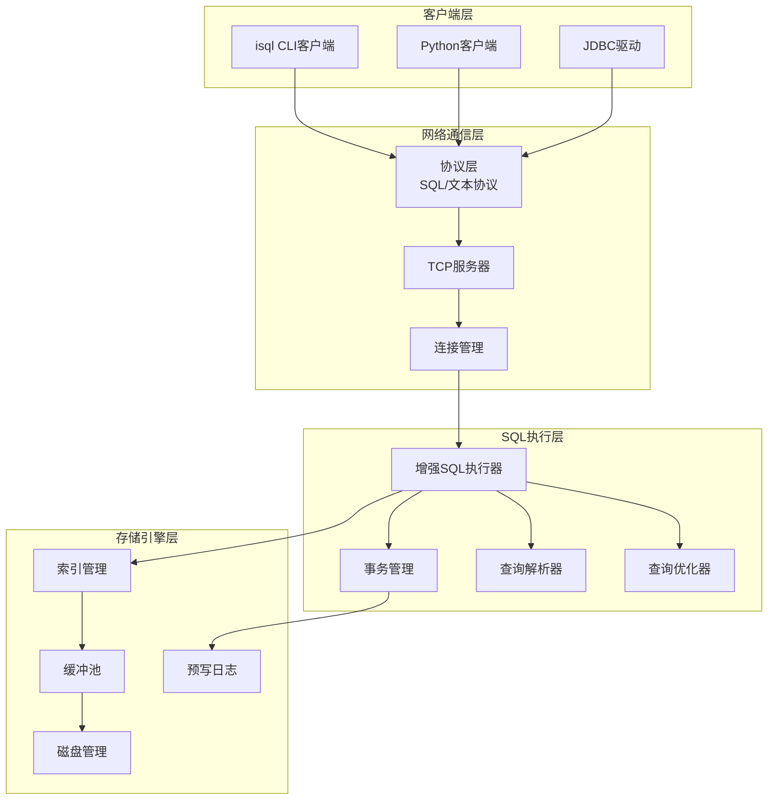

# SQLCC 综合设计与改进方案

## 概述

结合《SQLCC_REAL_WORLD_TESTING_PLAN.md》和《单机功能增强计划.md》的要求，制定SQLCC的综合设计方案，重点解决isql改进、服务器/客户端架构实现，以及单机版性能增强。

## 1. 现状分析

### 1.1 当前架构优势
- ✅ 完整的核心组件生态：StorageEngine、TransactionManager、BufferPool、IndexManager
- ✅ 现有的SQL解析器和AST结构
- ✅ 基础的B+树索引实现
- ✅ 完整的测试框架和性能分析工具
- ✅ WAL日志和事务管理基础

### 1.2 识别的瓶颈和问题
- ❌ isql仅支持模拟模式，缺乏真实数据库操作
- ❌ 缺乏服务器/客户端网络架构
- ❌ SQL执行器功能不完整，事务集成不充分
- ❌ 性能优化策略未完全实现
- ❌ 缺乏企业级的错误处理和恢复机制

## 2. 总体设计方案

### 2.1 架构分层设计



### 2.2 服务器/客户端架构设计

#### 服务器端架构 (sqlcc-server)
```cpp
class SqlCCServer {
private:
    std::unique_ptr<TCPServer> tcp_server_;
    std::shared_ptr<StorageEngine> storage_engine_;
    std::shared_ptr<TransactionManager> txn_manager_;
    std::shared_ptr<ConnectionManager> conn_manager_;
    std::unique_ptr<QueryCache> query_cache_;
    std::unique_ptr<MetricsCollector> metrics_;
    
public:
    bool Initialize(const ServerConfig& config);
    bool Start();
    void Shutdown();
    
    // 处理客户端连接
    void HandleClientConnection(std::shared_ptr<ClientConnection> client);
    
    // SQL执行接口
    ExecuteResult ExecuteQuery(const std::string& sql, 
                              TransactionId txn_id,
                              ClientId client_id);
};
```

#### 客户端架构 (isql enhanced)
```cpp
class SqlCCClient {
private:
    std::unique_ptr<NetworkConnection> connection_;
    std::string current_database_;
    bool is_connected_;
    
public:
    bool Connect(const std::string& host, int port);
    void Disconnect();
    
    // SQL执行接口
    ExecuteResult ExecuteQuery(const std::string& sql);
    bool BeginTransaction(IsolationLevel level);
    bool CommitTransaction();
    bool RollbackTransaction();
    
    // 批处理支持
    bool ExecuteBatch(const std::vector<std::string>& sqls);
    
    // 交互式功能
    void StartInteractive();
};
```

### 2.3 性能优化策略

#### 查询优化器
```cpp
class QueryOptimizer {
public:
    struct OptimizationResult {
        std::unique_ptr<QueryPlan> plan;
        CostEstimate cost;
        std::vector<OptimizationRule> applied_rules;
    };
    
    OptimizationResult Optimize(const SelectStatement& stmt);
    
private:
    // 优化规则
    bool ApplyIndexSelectionRule(QueryPlan& plan);
    bool ApplyJoinOrderOptimization(QueryPlan& plan);
    bool ApplyPredicatePushdown(QueryPlan& plan);
    bool ApplyProjectionPushdown(QueryPlan& plan);
};
```

#### 缓存机制
```cpp
class QueryCache {
private:
    struct CachedQuery {
        std::string sql_hash;
        ExecutionResult result;
        Timestamp creation_time;
        Timestamp last_access;
        AccessCount access_count;
    };
    
    LRUCache<std::string, CachedQuery> cache_;
    ThreadPool execution_thread_pool_;
    
public:
    bool TryGetCachedResult(const std::string& sql, ExecutionResult& result);
    void CacheResult(const std::string& sql, const ExecutionResult& result);
    void InvalidateCache(const std::string& table_name);
};
```

## 3. 实施计划

### 阶段1：基础架构增强 (2周)

#### 3.1 增强SQL执行器
```cpp
// 新的SqlExecutorEnhanced类
class SqlExecutorEnhanced : public SqlExecutor {
private:
    std::shared_ptr<TransactionManager> txn_manager_;
    std::shared_ptr<IndexManager> index_manager_;
    std::unique_ptr<QueryOptimizer> optimizer_;
    std::unique_ptr<QueryCache> cache_;
    
public:
    // 真实SQL执行
    ExecuteResult ExecuteRealQuery(const std::string& sql, 
                                  TransactionId txn_id = 0) override;
    
    // 事务集成
    TransactionId BeginTransaction(IsolationLevel level) override;
    bool CommitTransaction(TransactionId txn_id) override;
    bool RollbackTransaction(TransactionId txn_id) override;
    
    // 性能监控
    ExecutionStatistics GetStatistics() override;
};
```

#### 3.2 服务器基础架构
- 创建 `src/server/` 目录
- 实现TCP服务器框架
- 实现连接池管理
- 创建客户端连接处理逻辑

#### 3.3 协议设计
```cpp
// 客户端-服务器协议
enum class MessageType {
    CONNECT_REQUEST = 0x01,
    CONNECT_RESPONSE = 0x02,
    QUERY_REQUEST = 0x03,
    QUERY_RESPONSE = 0x04,
    TRANSACTION_BEGIN = 0x05,
    TRANSACTION_COMMIT = 0x06,
    TRANSACTION_ROLLBACK = 0x07,
    ERROR_RESPONSE = 0x08
};

struct MessageHeader {
    MessageType type;
    uint32_t length;
    uint64_t request_id;
};
```

### 阶段2：网络通信实现 (3周)

#### 2.1 服务器实现
```cpp
class SqlCCServer {
public:
    SqlCCServer() : 
        port_(5432),
        max_connections_(100),
        thread_pool_(std::thread::hardware_concurrency()) {}
    
    bool Start() {
        // 启动TCP服务器
        tcp_server_ = std::make_unique<TCPServer>(port_);
        
        // 启动工作线程池
        for (size_t i = 0; i < thread_pool_.size(); ++i) {
            thread_pool_.emplace_back([this] { WorkerThread(); });
        }
        
        return true;
    }
    
private:
    void WorkerThread() {
        while (running_) {
            auto client = AcceptClient();
            if (client) {
                HandleClient(std::move(client));
            }
        }
    }
};
```

#### 2.2 客户端改进
```cpp
// 改进的isql客户端
class EnhancedISQL {
private:
    std::unique_ptr<SqlCCClient> client_;
    bool use_server_mode_;
    std::string server_host_;
    int server_port_;
    
public:
    int main(int argc, char* argv[]) {
        // 检测是否连接到服务器
        if (use_server_mode_) {
            return RunServerMode();
        } else {
            return RunStandaloneMode();
        }
    }
    
private:
    int RunServerMode() {
        client_ = std::make_unique<SqlCCClient>();
        if (!client_->Connect(server_host_, server_port_)) {
            std::cerr << "Failed to connect to server" << std::endl;
            return 1;
        }
        
        return InteractiveLoop();
    }
};
```

### 阶段3：性能优化实现 (2周)

#### 3.1 查询优化器
```cpp
class CostBasedOptimizer : public QueryOptimizer {
public:
    OptimizationResult Optimize(const SelectStatement& stmt) override {
        // 1. 生成初始计划
        auto initial_plan = GenerateInitialPlan(stmt);
        
        // 2. 应用优化规则
        auto optimized_plan = ApplyOptimizationRules(initial_plan);
        
        // 3. 成本估算
        CostEstimate cost = EstimateCost(optimized_plan);
        
        return {std::move(optimized_plan), cost, applied_rules_};
    }
};
```

#### 3.2 并行执行引擎
```cpp
class ParallelExecutor {
public:
    ExecuteResult ExecuteParallel(const QueryPlan& plan) {
        // 分割执行计划
        auto fragments = SplitIntoFragments(plan);
        
        // 并行执行片段
        std::vector<std::future<FragmentResult>> futures;
        for (const auto& fragment : fragments) {
            futures.push_back(
                thread_pool_.submit([this, fragment] { 
                    return ExecuteFragment(fragment); 
                })
            );
        }
        
        // 收集结果
        std::vector<FragmentResult> results;
        for (auto& future : futures) {
            results.push_back(future.get());
        }
        
        return MergeResults(results);
    }
};
```

### 阶段4：测试框架实现 (2周)

#### 4.1 综合测试套件
```cpp
class ComprehensiveTestSuite {
public:
    void RunAllTests() {
        // 单元测试
        RunUnitTests();
        
        // 集成测试
        RunIntegrationTests();
        
        // 性能测试
        RunPerformanceTests();
        
        // 并发测试
        RunConcurrencyTests();
        
        // 压力测试
        RunStressTests();
    }
    
private:
    void RunIntegrationTests() {
        // 服务器-客户端集成测试
        TestServerClientCommunication();
        
        // 事务处理集成测试
        TestTransactionProcessing();
        
        // 查询优化集成测试
        TestQueryOptimization();
    }
};
```

## 4. 测试策略

### 4.1 功能测试
```bash
# 基础功能测试
./tests/unit/sql_executor_test
./tests/unit/transaction_manager_test
./tests/unit/server_client_test

# 集成测试
./tests/integration/full_workflow_test
./tests/integration/concurrent_access_test
```

### 4.2 性能基准测试
```bash
# TPC-B基准测试
./benchmarks/tpc_b_benchmark --scale-factor=1 --iterations=1000

# 混合负载测试
./benchmarks/mixed_workload_test --read-ratio=0.8 --threads=10

# 长时间稳定性测试
./benchmarks/stability_test --duration=24h
```

### 4.3 企业级测试
```bash
# 崩溃恢复测试
./tests/enterprise/crash_recovery_test

# 数据一致性验证
./tests/enterprise/consistency_validation_test

# 扩展性测试
./tests/enterprise/scalability_test
```

## 5. 部署架构

### 5.1 单机部署
```bash
# 启动独立模式
./sqlcc --database=test.db

# 启动服务器模式
./sqlcc-server --port=5432 --database=test.db

# 连接客户端
./isql --host=localhost --port=5432
```

### 5.2 容器化部署
```yaml
# docker-compose.yml
version: '3.8'
services:
  sqlcc-server:
    build: .
    ports:
      - "5432:5432"
    environment:
      - SQLCC_DATABASE=testdb
      - SQLCC_MAX_CONNECTIONS=100
    volumes:
      - sqlcc_data:/var/lib/sqlcc
    healthcheck:
      test: ["CMD", "./sqlcc", "--health-check"]
      interval: 30s
      timeout: 10s
      retries: 3
```

## 6. 监控和诊断

### 6.1 性能监控
```cpp
class MetricsCollector {
public:
    struct ServerMetrics {
        std::atomic<uint64_t> total_queries;
        std::atomic<uint64_t> active_connections;
        std::atomic<uint64_t> query_cache_hits;
        std::atomic<uint64_t> query_cache_misses;
        std::chrono::milliseconds avg_query_time;
    };
    
    ServerMetrics GetServerMetrics() const;
    void RecordQueryExecution(const ExecutionMetrics& metrics);
};
```

### 6.2 日志系统
```cpp
class StructuredLogger {
public:
    void LogQueryExecution(const QueryContext& context, 
                          const ExecutionResult& result) {
        json log_entry = {
            {"timestamp", GetCurrentTimestamp()},
            {"query", context.sql},
            {"execution_time_ms", result.execution_time.count()},
            {"rows_affected", result.rows_affected},
            {"cache_hit", result.from_cache}
        };
        
        logger_->Info(log_entry.dump());
    }
};
```

## 7. 风险评估与应对

### 7.1 高风险项
| 风险项 | 影响 | 概率 | 应对策略 |
|--------|------|------|----------|
| 复杂查询优化不达标 | 高 | 中 | 分阶段优化，先正确后性能 |
| 并发事务处理死锁 | 高 | 中 | 充分测试，成熟锁算法 |
| 网络协议安全性 | 高 | 低 | SSL/TLS加密，身份验证 |

### 7.2 中等风险项
| 风险项 | 影响 | 概率 | 应对策略 |
|--------|------|------|----------|
| 内存使用过高 | 中 | 中 | 内存池管理，监控告警 |
| 性能不达预期 | 中 | 中 | 持续监控，性能调优 |
| 兼容性破坏 | 中 | 低 | 向后兼容，充分测试 |

## 8. 交付标准

### 8.1 功能目标
- ✅ 支持完整SQL-92标准
- ✅ 服务器/客户端架构稳定运行
- ✅ 事务ACID特性完整
- ✅ 错误处理和恢复机制完善

### 8.2 性能目标
- 简单查询响应时间 < 10ms
- 复杂查询响应时间 < 100ms（10万行数据）
- 支持100+并发连接
- 查询缓存命中率 > 90%

### 8.3 质量目标
- 单元测试覆盖率 > 95%
- 集成测试全部通过
- 24小时稳定运行测试通过
- 内存泄漏检测零问题

## 9. 时间线

| 阶段 | 时间 | 主要交付物 |
|------|------|-----------|
| 阶段1：基础架构增强 | 2周 | 增强SQL执行器、服务器基础架构 |
| 阶段2：网络通信实现 | 3周 | TCP服务器、客户端、协议实现 |
| 阶段3：性能优化实现 | 2周 | 查询优化器、并行执行引擎 |
| 阶段4：测试框架实现 | 2周 | 综合测试套件、性能基准测试 |

**总计：9周完成**

## 10. 总结

本综合设计方案将SQLCC从实验室原型升级为企业级单机数据库系统，通过以下核心改进：

1. **架构升级**：实现服务器/客户端分离架构，支持网络访问
2. **性能优化**：集成查询优化器和并行执行引擎
3. **测试完善**：建立企业级测试框架，确保系统稳定性
4. **运维支持**：提供监控、诊断和部署工具

通过分阶段实施，确保每个阶段都有可交付的成果，同时降低技术风险。
