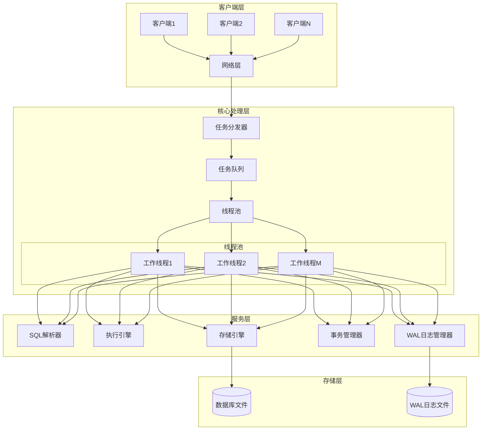
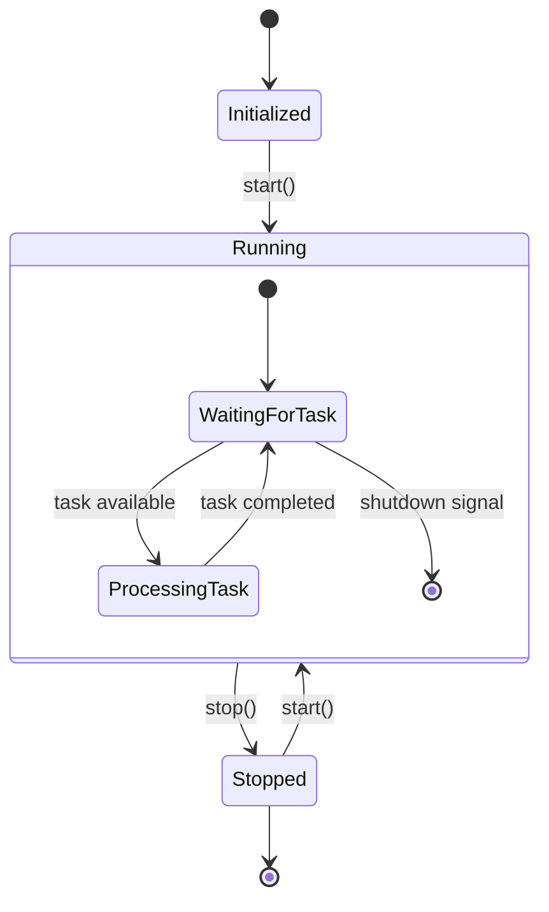
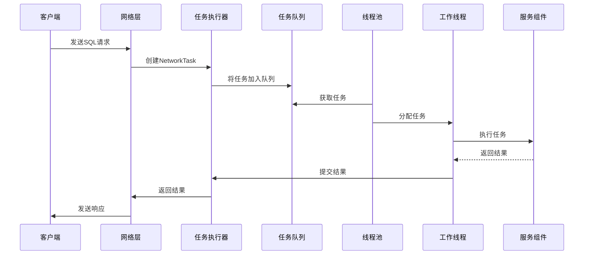
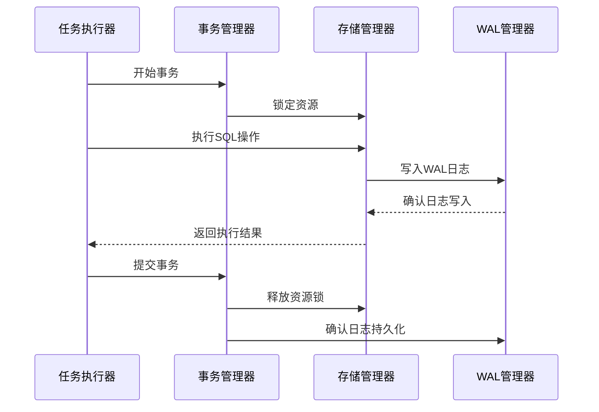
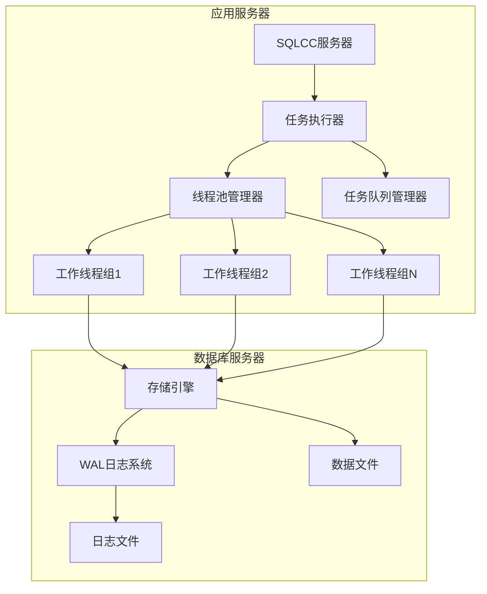

# SQLCC多任务执行器详细设计报告

## 1. 概述

本报告详细设计了一个支持多线程的多任务执行器，用于满足SQLCC数据库系统在网络连接、SQL解析和执行、WAL日志以及事务处理等方面的多任务需求。该执行器将提供高效的并发处理能力，确保系统在高负载情况下仍能保持良好的性能和稳定性。

## 2. 需求分析

### 2.1 功能需求
1. **网络连接管理**：处理多个客户端连接，支持并发请求处理
2. **SQL解析和执行**：并行处理SQL语句的解析和执行
3. **WAL日志处理**：异步处理写前日志，确保数据持久性
4. **事务管理**：支持并发事务处理，保证ACID特性

### 2.2 非功能需求
1. **高性能**：支持高并发处理，低延迟响应
2. **可扩展性**：易于扩展以支持更多任务类型
3. **可靠性**：具备错误处理和恢复机制
4. **监控能力**：提供执行状态监控和统计信息

## 3. 架构设计

### 3.1 整体架构



### 3.2 组件说明

1. **网络层**：负责接收客户端连接和请求，将请求转换为任务
2. **任务分发器**：将任务分发到合适的任务队列
3. **任务队列**：按任务类型分类存储待处理任务
4. **线程池**：包含多个工作线程，并行处理任务
5. **SQL解析器**：解析SQL语句，生成抽象语法树
6. **执行引擎**：执行解析后的SQL语句
7. **WAL日志管理器**：管理写前日志，确保数据持久性
8. **事务管理器**：管理事务的生命周期，保证ACID特性
9. **存储引擎**：管理数据的存储和检索

## 4. 详细设计

### 4.1 类结构设计

```mermaid
classDiagram
    class TaskExecutor {
        - threadPool : std::unique_ptr~ThreadPool~
        - taskQueues : std::map~TaskType, std::unique_ptr~TaskQueue~~
        - isRunning : std::atomic~bool~
        - mutex : std::mutex
        - condition : std::condition_variable
        + start() : void
        + stop() : void
        + submitTask(task: std::unique_ptr~Task~) : void
        - dispatchTask(task: std::unique_ptr~Task~) : void
        - workerThread() : void
    }
    
    class ThreadPool {
        - threads : std::vector~std::thread~
        - activeThreads : std::atomic~int~
        - mutex : std::mutex
        - condition : std::condition_variable
        + execute(runnable: std::function~void()~) : void
        + resize(size: int) : void
        - workerThread() : void
    }
    
    class Task {
        <<abstract>>
        - taskId : std::string
        - taskType : TaskType
        - priority : int
        - createdAt : std::chrono::time_point
        - completed : std::atomic~bool~
        - result : std::shared_ptr~TaskResult~
        + execute() : std::shared_ptr~TaskResult~
        + getTaskType() : TaskType
        + getTaskId() : std::string
        + isCompleted() : bool
        + getResult() : std::shared_ptr~TaskResult~
        + setResult(result: std::shared_ptr~TaskResult~) : void
    }
    
    class NetworkTask {
        - connection : std::shared_ptr~Connection~
        - requestData : std::string
        + execute() : std::shared_ptr~TaskResult~
    }
    
    class SQLTask {
        - sqlStatement : std::string
        - transactionId : TransactionId
        - parsedAST : std::unique_ptr~ASTNode~
        + execute() : std::shared_ptr~TaskResult~
    }
    
    class WALTask {
        - logEntries : std::vector~LogEntry~
        - flushRequired : bool
        + execute() : std::shared_ptr~TaskResult~
    }
    
    class TransactionTask {
        - transactionId : TransactionId
        - operation : TransactionOperation
        - isolationLevel : IsolationLevel
        + execute() : std::shared_ptr~TaskResult~
    }
    
    class TaskQueue {
        - queue : std::queue~std::unique_ptr~Task~~
        - mutex : std::mutex
        - condition : std::condition_variable
        - maxSize : size_t
        + push(task: std::unique_ptr~Task~) : bool
        + pop() : std::unique_ptr~Task~
        + size() : size_t
        + isEmpty() : bool
    }
    
    class TaskResult {
        - taskId : std::string
        - success : bool
        - resultData : std::string
        - errorMessage : std::string
        - executionTime : std::chrono::duration
        - timestamp : std::chrono::time_point
        + TaskResult(taskId: std::string)
        + isSuccess() : bool
        + getErrorMessage() : std::string
        + getResultData() : std::string
        + getExecutionTime() : std::chrono::duration
    }
    
    Task <|-- NetworkTask
    Task <|-- SQLTask
    Task <|-- WALTask
    Task <|-- TransactionTask
    TaskExecutor --> ThreadPool
    TaskExecutor --> "多" TaskQueue
    Task --> TaskResult
```



### 4.2 线程池设计



### 4.3 任务处理流程



### 4.4 事务处理流程



### 4.5 部署架构



## 5. 智能指针使用设计

### 5.1 内存管理策略
1. **std::unique_ptr**：用于独占所有权的对象，如任务对象、解析后的AST等
2. **std::shared_ptr**：用于共享所有权的对象，如连接对象、事务对象、任务结果等
3. **std::weak_ptr**：用于打破循环引用，如任务执行器与线程池之间的引用

### 5.2 资源生命周期管理
```cpp
// 任务对象使用unique_ptr确保独占所有权
std::unique_ptr<Task> task = std::make_unique<SQLTask>(sqlStatement);

// 连接对象使用shared_ptr支持多处引用
std::shared_ptr<Connection> connection = networkLayer->getConnection();

// 任务结果使用shared_ptr便于多处访问
std::shared_ptr<TaskResult> result = task->getResult();
```

## 6. 线程同步机制设计

### 6.1 互斥锁使用
1. **std::mutex**：保护共享资源，如任务队列、统计数据等
2. **std::shared_mutex**：读写锁，适用于读多写少的场景，如配置信息访问
3. **std::recursive_mutex**：递归锁，用于可能重入的代码段

### 6.2 条件变量
1. **std::condition_variable**：用于线程间同步，如任务队列的等待和通知机制

### 6.3 原子操作
1. **std::atomic**：用于简单的原子操作，如标志位、计数器等

### 6.4 同步机制示例
```cpp
class TaskQueue {
private:
    std::queue<std::unique_ptr<Task>> queue_;
    mutable std::mutex mutex_;  // 保护队列访问
    std::condition_variable condition_;  // 任务可用时通知等待线程
    const size_t maxSize_;

public:
    bool push(std::unique_ptr<Task> task) {
        std::lock_guard<std::mutex> lock(mutex_);
        if (queue_.size() >= maxSize_) {
            return false;  // 队列已满
        }
        queue_.push(std::move(task));
        condition_.notify_one();  // 通知等待的线程
        return true;
    }
    
    std::unique_ptr<Task> pop() {
        std::unique_lock<std::mutex> lock(mutex_);
        // 等待直到队列非空
        condition_.wait(lock, [this] { return !queue_.empty(); });
        
        auto task = std::move(queue_.front());
        queue_.pop();
        return task;
    }
};
```

## 7. 任务同步设计

### 7.1 依赖管理
1. **任务依赖图**：使用有向无环图(DAG)表示任务间的依赖关系
2. **依赖解析**：在任务执行前解析依赖，确保依赖任务已完成

### 7.2 异步处理
1. **Future/Promise模式**：用于异步任务的结果获取
2. **回调机制**：任务完成后触发回调函数

### 7.3 同步示例
```cpp
class DependentTask : public Task {
private:
    std::vector<std::shared_future<std::shared_ptr<TaskResult>>> dependencies_;
    
public:
    void addDependency(std::shared_future<std::shared_ptr<TaskResult>> dependency) {
        dependencies_.push_back(dependency);
    }
    
    std::shared_ptr<TaskResult> execute() override {
        // 等待所有依赖任务完成
        for (auto& dependency : dependencies_) {
            dependency.wait();
        }
        
        // 执行当前任务
        return performTask();
    }
};
```

## 8. 性能优化设计

### 8.1 线程池优化
1. **动态调整**：根据系统负载动态调整线程池大小
2. **任务窃取**：工作线程间可以窃取任务，提高负载均衡
3. **线程本地存储**：减少锁竞争，提高缓存命中率

### 8.2 内存优化
1. **对象池**：重用频繁创建和销毁的对象
2. **内存对齐**：优化数据结构布局，提高缓存效率
3. **无锁数据结构**：在特定场景下使用无锁队列等数据结构

### 8.3 缓存优化
1. **局部性原理**：合理安排数据布局，提高空间局部性和时间局部性
2. **预取机制**：提前加载可能需要的数据
3. **缓存友好的算法**：选择对缓存友好的算法和数据结构

### 8.4 I/O优化
1. **异步I/O**：使用异步I/O操作避免阻塞
2. **批量处理**：合并多个小的I/O操作为大的批量操作
3. **缓冲机制**：使用缓冲区减少系统调用次数

### 8.5 性能优化示例
```cpp
class OptimizedThreadPool {
private:
    // 线程本地任务队列，减少锁竞争
    std::vector<std::queue<std::unique_ptr<Task>>> localQueues_;
    
    // 全局任务队列，用于负载均衡
    TaskQueue globalQueue_;
    
    // 任务窃取机制
    std::unique_ptr<Task> stealTask(int thiefThreadId) {
        // 从其他线程的本地队列窃取任务
        for (int i = 0; i < localQueues_.size(); ++i) {
            int victimId = (thiefThreadId + i + 1) % localQueues_.size();
            std::lock_guard<std::mutex> lock(localMutexes_[victimId]);
            if (!localQueues_[victimId].empty()) {
                auto task = std::move(localQueues_[victimId].front());
                localQueues_[victimId].pop();
                return task;
            }
        }
        return nullptr;
    }
    
public:
    void execute(std::unique_ptr<Task> task, int preferredThread = -1) {
        if (preferredThread >= 0 && preferredThread < localQueues_.size()) {
            // 放入指定线程的本地队列
            std::lock_guard<std::mutex> lock(localMutexes_[preferredThread]);
            localQueues_[preferredThread].push(std::move(task));
        } else {
            // 放入全局队列
            globalQueue_.push(std::move(task));
        }
    }
};
```

## 9. 关键设计决策

### 9.1 线程池管理
- 采用固定大小的线程池，避免频繁创建和销毁线程的开销
- 使用任务队列分离任务提交和执行，提高系统响应性
- 支持动态调整线程池大小以适应不同负载

### 9.2 任务分类处理
- 根据任务类型将任务分发到不同的队列，避免不同类型任务间的干扰
- 为不同类型任务设置不同的优先级，确保关键任务优先执行
- 实现任务超时机制，防止个别任务长时间占用资源

### 9.3 并发控制
- 使用读写锁优化读多写少场景的并发性能
- 实现细粒度锁机制，降低锁竞争
- 采用无锁数据结构提高特定场景下的性能

### 9.4 错误处理与恢复
- 实现任务执行的异常捕获和处理机制
- 提供任务重试机制，增强系统容错能力
- 记录详细的执行日志，便于问题排查和系统监控

## 10. 监控与诊断

### 10.1 性能指标
- 任务执行时间统计
- 线程池利用率监控
- 队列长度监控
- 内存使用情况监控

### 10.2 诊断工具
- 实时性能监控面板
- 任务执行轨迹追踪
- 系统资源使用情况分析
- 异常事件记录和报警

## 11. 安全性考虑

### 11.1 访问控制
- 实现基于角色的访问控制(RBAC)
- 支持任务级别的权限验证
- 实现安全审计日志记录

### 11.2 数据保护
- 敏感数据加密存储
- 网络传输加密
- 实现数据完整性校验

## 12. 可扩展性设计

### 12.1 插件化架构
- 支持自定义任务类型扩展
- 提供标准接口便于集成第三方组件
- 实现配置驱动的组件加载机制

### 12.2 微服务支持
- 支持分布式部署模式
- 实现服务注册与发现机制
- 提供RESTful API接口

## 13. 部署建议

### 13.1 硬件要求
- CPU：至少4核心，推荐8核心以上
- 内存：至少8GB，推荐16GB以上
- 存储：SSD硬盘，足够的I/O性能

### 13.2 软件环境
- 操作系统：Linux发行版（推荐Ubuntu 20.04+）
- 编译器：GCC 9.0+或Clang 10.0+
- 构建工具：Bazel 4.0+

### 13.3 配置建议
- 线程池大小：根据CPU核心数设置，一般为CPU核心数的1-2倍
- 任务队列长度：根据系统负载情况调整，避免队列溢出
- 超时设置：合理设置各类任务的超时时间，防止资源长时间占用

## 14. 总结

本设计报告详细阐述了SQLCC多任务执行器的设计方案，重点关注了以下几个方面：

1. **智能指针使用**：通过合理的智能指针使用策略，确保内存安全和资源正确释放
2. **线程同步机制**：采用多种同步原语，确保线程安全的同时最大化并发性能
3. **任务同步设计**：实现了任务依赖管理和异步处理机制
4. **性能优化**：从多个维度进行了性能优化设计，包括线程池优化、内存优化、缓存优化和I/O优化

该设计充分考虑了SQLCC数据库系统的特殊需求，在保证高性能的同时，兼顾了系统的可维护性和可扩展性。通过使用现代C++特性，如智能指针、原子操作、条件变量等，确保了系统的健壮性和高效性。