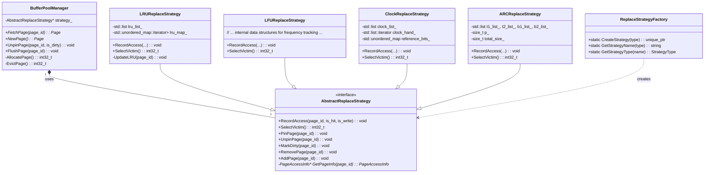

# Page Replacement Algorithms Design Document

**Document Version**: 1.0  
**Last Updated**: 2026-01-31  
**Author**: Gemini AI Agent  
**Related Files**: `src/storage_engine/buffer_pool/replace_strategy.h`, `src/storage_engine/buffer_pool/replace_strategy.cpp`, `src/storage_engine/buffer_pool/buffer_pool_manager.h`

---

## 1. WHY: 为什么要使用页面替换算法？

在数据库管理系统 (DBMS) 中，**缓冲池 (Buffer Pool)** 是核心组件之一，它在内存中缓存磁盘数据页，以减少昂贵的磁盘 I/O 操作。然而，缓冲池的内存大小是有限的。当应用程序需要的数据页不在内存中（发生 **“缓存未命中”**，Cache Miss），并且缓冲池已满时，数据库必须选择一个内存中的数据页将其从缓冲池中移除（**“逐出”**，Evict），以便为新页腾出空间。

选择哪个页来逐出是至关重要的，因为它直接影响到：

1.  **缓存命中率 (Cache Hit Rate)**：如果能准确预测哪些页在未来最不可能被访问，并将其逐出，那么新页被请求时很可能仍在缓存中，从而提高缓存命中率。
2.  **系统性能 (System Performance)**：每次缓存未命中并需要逐出页时，都会导致一次磁盘 I/O 操作（如果被逐出的页是“脏”的，还需要先写回磁盘），这会显著降低数据库的整体性能。
3.  **资源利用率 (Resource Utilization)**：高效的算法可以确保宝贵的内存资源被用于存储最重要或最常访问的数据。

一个优秀的页面替换算法目标是：在相对较低的开销下，尽可能地提高缓存命中率，从而优化数据库的响应速度和吞吐量。

---

## 2. WHAT: 页面替换算法的核心功能和组件？

本设计通过采用 **策略设计模式 (Strategy Design Pattern)** 实现了多种可插拔的页面替换算法。

### 2.1. 核心设计原则：策略模式

*   **Context (上下文)**：`BufferPoolManager`，它使用 `AbstractReplaceStrategy` 接口来选择受害者页面，而不知道具体使用哪种算法。
*   **Strategy (策略接口)**：`AbstractReplaceStrategy` 接口，定义了所有具体页面替换算法必须遵循的通用接口。
*   **Concrete Strategies (具体策略)**：实现 `AbstractReplaceStrategy` 接口的各个具体类，每个类封装了一种页面替换算法。

### 2.2. 核心组件

1.  **`AbstractReplaceStrategy` (抽象替换策略接口)**：
    *   **职责**: 定义所有页面替换算法必须实现的通用接口。
    *   **核心方法**:
        *   `RecordAccess(page_id, is_hit, is_write)`: 当页面被访问时调用，用于算法记录访问信息（例如，更新时间戳、访问频率）。
        *   `SelectVictim()`: 当需要腾出空间时调用，算法根据其策略选择一个合适的页 ID 作为受害者进行逐出。
        *   `PinPage(page_id)`: 标记一个页为“钉住”（Pinned），表示该页正在被使用，不能被逐出。
        *   `UnpinPage(page_id)`: 解除“钉住”状态。
        *   `MarkDirty(page_id)`: 标记页为“脏”（Dirty），表示其内容已被修改，逐出时需要写回磁盘。
        *   `RemovePage(page_id)`: 当页从缓冲池中移除时，从算法内部状态中移除该页。
        *   `AddPage(page_id)`: 当页被加载到缓冲池时，添加到算法内部状态。
    *   **优点**: 强制统一接口，使得 `BufferPoolManager` 可以多态地调用不同的替换策略，实现了缓冲池管理逻辑与替换策略的解耦。

2.  **具体替换策略实现**：

    *   **`LRUReplaceStrategy` (Least Recently Used，最近最少使用)**
        *   **WHY**: 基于“时间局部性”原理，认为最近被访问的页在未来也最有可能被访问。因此，当需要逐出页时，选择最久未被使用的页。
        *   **WHAT**: 维护一个页 ID 列表，按照访问时间排序。最近访问的页在列表前端，最久未访问的页在列表尾部。
        *   **HOW**:
            *   **数据结构**: `std::list<int32_t> lru_list_` (双向链表，维护访问顺序) 和 `std::unordered_map<int32_t, std::list<int32_t>::iterator> lru_map_` (哈希表，实现 O(1) 查找和移动)。
            *   **`RecordAccess`**: 将被访问的页移动到 `lru_list_` 的前端。
            *   **`SelectVictim`**: 从 `lru_list_` 的尾部开始查找第一个未钉住的页作为受害者。
        *   **优点**: 性能较好，实现相对简单，对大多数工作负载表现良好。
        *   **缺点**: 对“扫描污染”敏感（一次大的顺序扫描可能冲刷掉缓存中的热点数据）。

    *   **`LFUReplaceStrategy` (Least Frequently Used，最不经常使用)**
        *   **WHY**: 基于“频率局部性”原理，认为被访问频率最高的页在未来最有可能被访问。因此，选择访问频率最低的页作为受害者。
        *   **WHAT**: 维护每个页的访问计数。
        *   **HOW**:
            *   **数据结构**: `page_info_` 结构中存储 `access_count`。高效实现通常需要一个按频率排序的数据结构（例如，最小堆或多级链表）。
            *   **`RecordAccess`**: 增加页的 `access_count`。
            *   **`SelectVictim`**: 查找 `access_count` 最低且未钉住的页。
        *   **优点**: 对“扫描污染”不敏感。
        *   **缺点**: 对访问模式变化适应慢（一个旧的热点页即使不再访问，也可能因高计数而长时间留在缓存中）；实现复杂性相对较高。

    *   **`ClockReplaceStrategy` (CLOCK，时钟算法)**
        *   **WHY**: 作为 LRU 的一种近似算法，它在保持接近 LRU 性能的同时，显著降低了实现复杂度和运行时开销。LRU 需要频繁地移动链表节点，而 CLOCK 避免了这种开销。
        *   **WHAT**: 将缓冲池中的所有页视为一个环形列表（“时钟”）。每个页有一个“引用位”（Reference Bit）。一个“时钟指针”（Clock Hand）在环形列表中移动。
        *   **HOW**:
            *   **数据结构**: `std::list<int32_t> clock_list_` (环形列表的线性表示) 和 `std::list<int32_t>::iterator clock_hand_` (时钟指针)，以及 `std::unordered_map<int32_t, bool> reference_bits_` (存储引用位)。
            *   **`RecordAccess`**: 简单地将访问页的引用位设置为 `true`。
            *   **`SelectVictim`**: 时钟指针从当前位置开始扫描：
                *   如果遇到引用位为 `true` 的页：将其引用位设为 `false`（给它“第二次机会”），并移动指针。
                *   如果遇到引用位为 `false` 且未钉住的页：选中该页为受害者。
        *   **优点**: 性能接近 LRU，但开销远低于精确 LRU，实现简单。
        *   **缺点**: 对某些工作负载可能不如 LRU 精确。

    *   **`ARCReplaceStrategy` (Adaptive Replacement Cache，自适应替换缓存)**
        *   **WHY**: 旨在结合 LRU（侧重最近性）和 LFU（侧重频率）的优点，并克服它们的缺点。ARC 能够自适应地调整缓存的 LRU 和 LFU 部分的比例，以更好地适应不同的工作负载。
        *   **WHAT**: 维护四个列表：
            *   `T1`: 存储只访问过一次的页（类似 LRU 的最近性）。
            *   `T2`: 存储访问过至少两次的页（类似 LFU 的频率性）。
            *   `B1`: “幽灵列表”，存储从 T1 逐出的页 ID，用于判断这些页是否再次被引用。
            *   `B2`: “幽灵列表”，存储从 T2 逐出的页 ID。
        *   **HOW**: 算法非常复杂，涉及根据页在 T1、T2、B1、B2 中的命中情况，动态调整 T1 和 T2 的目标大小 `p`。
            *   **命中 T1/T2**: 页被移动到 T2 的 MRU 端。
            *   **命中 B1/B2**: 表明曾被逐出的页再次被请求。根据是 B1 还是 B2 命中，调整 `p`（T1 的目标大小），并将页提升到 T2。
            *   **缓存未命中**: 新页通常添加到 T1。
            *   **`SelectVictim`**: 根据 T1 和 T2 的当前大小以及 `p` 值，从 T1 或 T2 中选择受害者。
        *   **优点**: 对各种工作负载（包括混合工作负载和扫描）具有强大的适应性，通常比 LRU 和 LFU 有更高的缓存命中率。
        *   **缺点**: 算法复杂，实现开销较大，且有专利问题（但专利已过期）。

### 2.3. 辅助组件

*   **`ReplaceStrategyFactory`**: 一个工厂类，根据配置的策略类型（枚举 `StrategyType`）创建并返回相应的 `AbstractReplaceStrategy` 实例。这进一步解耦了策略的创建与使用。

---

## 3. HOW: 页面替换算法的工作流程和实现细节？

### 3.1. 缓冲池与替换策略的交互

1.  **初始化**:
    *   `BufferPoolManager` 在启动时，通过 `ReplaceStrategyFactory` 创建一个具体的 `AbstractReplaceStrategy` 实例（例如 `LRUReplaceStrategy`），并持有其指针。
2.  **页面的生命周期管理**:
    *   当 `BufferPoolManager` 从磁盘加载新页到缓冲池时，它会调用 `strategy->AddPage(page_id)`。
    *   当用户代码请求访问页时，`BufferPoolManager` 会调用 `strategy->RecordAccess(page_id, is_hit, is_write)`。
    *   当页被用户“钉住”或“解除钉住”时，`BufferPoolManager` 会调用 `strategy->PinPage(page_id)` 或 `strategy->UnpinPage(page_id)`。
    *   当页被修改时，`BufferPoolManager` 会调用 `strategy->MarkDirty(page_id)`。
3.  **受害者选择**:
    *   当 `BufferPoolManager` 需要从满的缓冲池中逐出页时，它会调用 `strategy->SelectVictim()`。
    *   `SelectVictim()` 方法会返回一个符合替换策略且未钉住的页 ID。
    *   `BufferPoolManager` 接收到受害者页 ID 后，将其写回磁盘（如果页是脏的），然后移除该页，为新页腾出空间，并调用 `strategy->RemovePage(victim_id)`。

### 3.2. 实现要点

1.  **多态性**: `BufferPoolManager` 始终通过 `AbstractReplaceStrategy` 接口与具体的策略交互，体现了多态性。
2.  **线程安全**: 各个替换策略内部需要维护自身的数据结构，并且这些数据结构会被并发访问（例如，多个线程同时访问不同的页，导致 `RecordAccess` 被调用）。因此，策略内部必须使用适当的同步原语（如 `std::mutex` 或 `std::shared_mutex`）来保护其内部状态。
3.  **钉住机制的重要性**: 任何页面替换算法都必须尊重“钉住”状态。被钉住的页表示正在被活跃地使用，绝对不能被逐出。这是为了防止正在进行的操作在页被移除后立即崩溃。
4.  **脏页处理**: 如果 `SelectVictim()` 选择了一个脏页，`BufferPoolManager` 在将其逐出之前必须将其内容写回磁盘，以保证数据的持久性。

### 3.3. 简化的类图

---

## 4. 总结

页面替换算法是数据库缓冲池管理的核心，直接影响到系统的性能。通过采用策略模式，SQLCC 数据库实现了多种页面替换算法（LRU, LFU, CLOCK, ARC），使得替换策略可以灵活地选择和切换，以适应不同的工作负载需求。这种设计不仅提升了系统的可维护性和可扩展性，也为学生理解不同缓存算法的原理和权衡提供了一个清晰的范例。未来的工作可以探索更先进的替换算法，如 LIRS (Low Inter-reference Recency Set) 或 2Q (Two Queue) 算法，以及根据工作负载动态调整替换策略的自适应机制。
