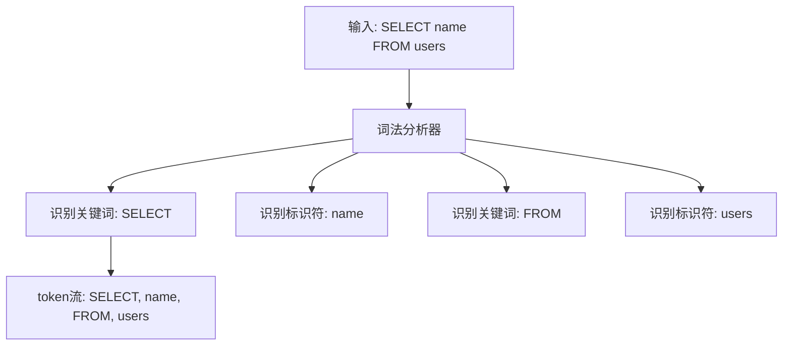
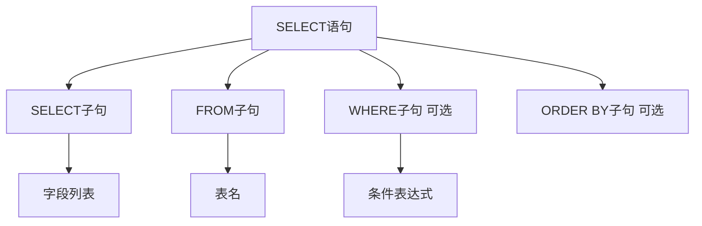
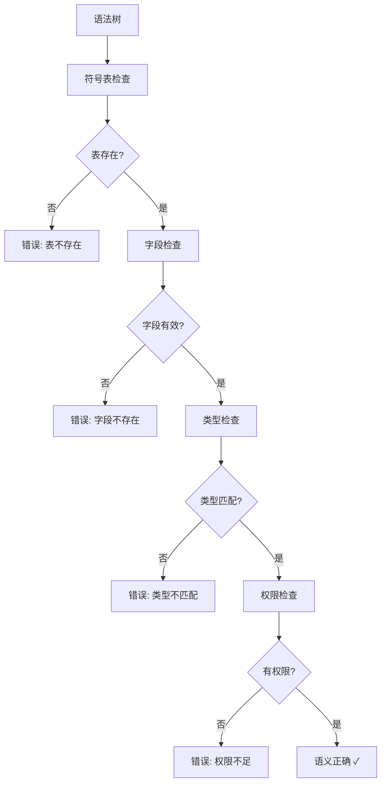
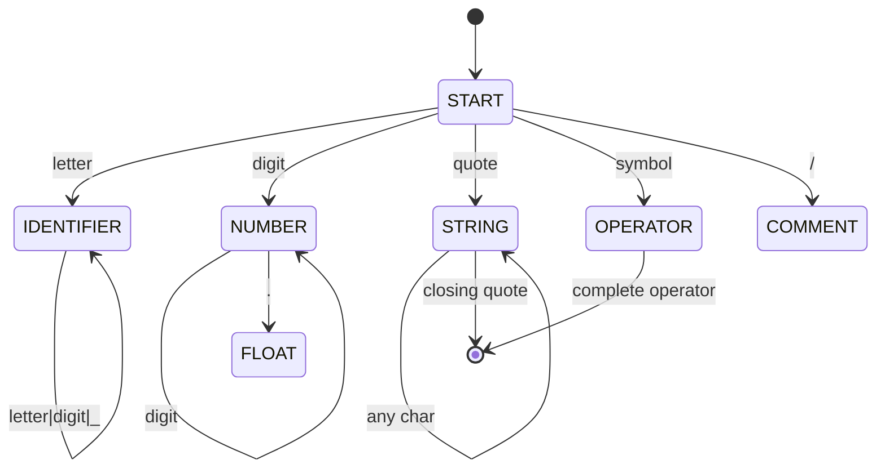
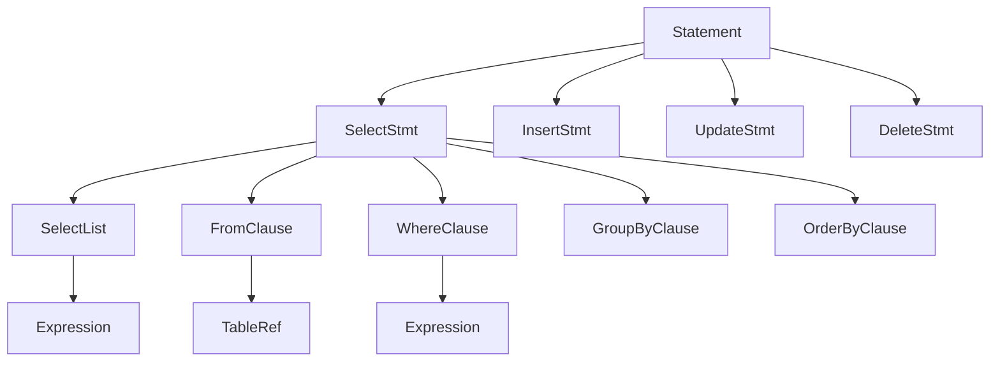

# SQLCC查询处理器设计详解 - 从SQL语句到执行计划的完整旅程

## 🎯 引言：查询处理器的使命

想象一下，当你输入一条SQL查询时，数据库内部发生了什么？

**用户输入**：`SELECT name, age FROM users WHERE age > 25 ORDER BY name;`

**数据库思考**：
1. 🤔 "用户想要什么？" → 理解查询意图
2. 🧠 "怎么执行最快？" → 制定最优执行计划
3. ⚡ "开始执行！" → 高效获取结果

这就是**查询处理器**的工作！它是数据库的"翻译官"和"战略家"，将人类的查询语言转换为机器能理解的执行指令。

## 📖 第一章：SQL解析器 - 将文字变成数据结构

### 1.1 什么是SQL解析？

**生活化的比喻**：
SQL解析就像餐厅点餐服务员的工作：
- 客人说："我要一份宫保鸡丁，不要辣椒，多放花生"
- 服务员理解："主菜是宫保鸡丁，排除辣椒，增加花生"
- 厨房得到："鸡丁+花生+酱汁，不加辣椒"

**技术解释**：
SQL解析器将SQL字符串转换为计算机能理解的数据结构（AST - Abstract Syntax Tree）。

### 1.2 词法分析：拆解SQL语句

**What**：词法分析就像中文分词，将连续的文字拆成有意义的词语。

**How**：使用有限状态自动机识别不同类型的token。



**关键概念**：
- **Token**：SQL的最小语义单位（如关键词、标识符、操作符）
- **状态机**：自动机根据当前状态和输入字符决定下一个状态
- **词法错误**：非法字符序列，如`SELCT`（拼写错误）

### 1.3 语法分析：理解句子结构

**What**：语法分析就像理解句子成分，将词语组织成完整的句子结构。

**核心思想**：递归下降解析 - 每个语法规则对应一个解析函数。



**WHY递归下降**：
1. **直观**：解析函数直接对应语法规则
2. **易调试**：错误位置精确到函数调用栈
3. **易扩展**：新语法规则只需添加新函数

### 1.4 语义分析：检查逻辑正确性

**What**：语法正确不等于逻辑正确。

**检查内容**：
- 🔍 **表存在性**：查询的表是否存在？
- 🔍 **字段有效性**：选择的字段是否属于指定表？
- 🔍 **类型匹配**：比较操作的数据类型是否兼容？
- 🔍 **权限验证**：用户是否有查询权限？



### 1.2 词法分析器实现

**词法分析状态机：**


**关键实现代码：**
```cpp
class Lexer {
public:
    Token NextToken() {
        SkipWhitespace();

        char ch = input_[pos_++];
        switch (ch) {
            case 'a'...'z':
            case 'A'...'Z':
                return ScanIdentifier();
            case '0'...'9':
                return ScanNumber();
            case '"':
            case '\'':
                return ScanString();
            case '=':
            case '<':
            case '>':
            case '!':
                return ScanOperator();
            default:
                return Token{TokenType::UNKNOWN, std::string(1, ch)};
        }
    }

private:
    std::string ScanIdentifier() {
        std::string result;
        while (pos_ < input_.size() && isalnum(input_[pos_])) {
            result += input_[pos_++];
        }
        return result;
    }
};
```

### 1.3 抽象语法树构建

**AST节点层次结构：**


**表达式树构建算法：**
```cpp
class ExpressionParser {
public:
    unique_ptr<Expression> ParseExpression() {
        return ParseOrExpression();
    }

private:
    // 运算符优先级解析
    unique_ptr<Expression> ParseOrExpression() {
        auto left = ParseAndExpression();
        while (Match(TokenType::OR)) {
            auto right = ParseAndExpression();
            left = make_unique<BinaryExpr>(BinaryOp::OR, move(left), move(right));
        }
        return left;
    }

    unique_ptr<Expression> ParseAndExpression() {
        auto left = ParseComparison();
        while (Match(TokenType::AND)) {
            auto right = ParseComparison();
            left = make_unique<BinaryExpr>(BinaryOp::AND, move(left), move(right));
        }
        return left;
    }
};
```

### 1.4 错误处理与恢复

**语法错误恢复策略：**
```cpp
class ErrorRecovery {
public:
    void HandleSyntaxError(const std::string& expected, const Token& found) {
        // 1. 记录错误信息
        errors_.push_back({
            .message = "Expected " + expected + ", found " + found.lexeme,
            .line = found.line,
            .column = found.column
        });

        // 2. 尝试错误恢复
        SkipToSyncToken();
    }

private:
    void SkipToSyncToken() {
        // 跳过错误token直到找到同步token
        while (!IsAtEnd()) {
            if (IsSyncToken(current_token_)) break;
            Advance();
        }
    }

    bool IsSyncToken(const Token& token) {
        return token.type == TokenType::SEMICOLON ||
               token.type == TokenType::SELECT ||
               token.type == TokenType::INSERT ||
               token.type == TokenType::UPDATE ||
               token.type == TokenType::DELETE;
    }
};
```

## 2. 查询优化器设计详解

### 2.1 查询优化理论基础

**Why层 - 查询优化的重要性：**
- **性能差异巨大**：不同执行计划性能相差数千倍
- **自动优化**：无需用户手动指定执行策略
- **适应性**：根据数据统计信息动态调整
- **成本估算**：基于数学模型预测执行代价

**优化层次分类：**
1. **代数优化**：等价变换，改变操作顺序
2. **物理优化**：选择具体算法和索引
3. **代价估算**：计算执行成本，选择最优计划

### 2.2 基于规则的优化

**关系代数等价变换规则：**
```cpp
class RuleBasedOptimizer {
public:
    QueryPlan Optimize(QueryPlan plan) {
        // 1. 选择下推
        plan = PushSelectDown(plan);

        // 2. 投影下推
        plan = PushProjectDown(plan);

        // 3. 连接顺序优化
        plan = ReorderJoins(plan);

        // 4. 消除冗余操作
        plan = EliminateRedundant(plan);

        return plan;
    }

private:
    // σ(σ(R, C1), C2) → σ(R, C1 ∧ C2)
    QueryPlan MergeSelect(QueryPlan plan);

    // π(L1, π(L2, R)) → π(L1, R) 如果 L1 ⊆ L2
    QueryPlan MergeProject(QueryPlan plan);

    // σ(C, R × S) → σ(C, R) × σ(C, S) 如果 C 只涉及一侧属性
    QueryPlan PushSelectIntoJoin(QueryPlan plan);
};
```

### 2.3 基于代价的优化

**代价模型设计：**
```cpp
class CostModel {
public:
    double EstimateCost(const QueryPlan& plan, const Statistics& stats) {
        double cost = 0.0;

        for (const auto& op : plan.operators) {
            switch (op.type) {
                case OperatorType::SCAN:
                    cost += EstimateScanCost(op, stats);
                    break;
                case OperatorType::JOIN:
                    cost += EstimateJoinCost(op, stats);
                    break;
                case OperatorType::SORT:
                    cost += EstimateSortCost(op, stats);
                    break;
                // ... 其他操作符
            }
        }

        return cost;
    }

private:
    double EstimateScanCost(const Operator& op, const Statistics& stats) {
        // 表扫描代价 = 页面数 × I/O代价
        double page_count = stats.table_size / PAGE_SIZE;
        return page_count * IO_COST;
    }

    double EstimateJoinCost(const Operator& op, const Statistics& stats) {
        // 连接代价 = 左表大小 × 右表大小 × 连接代价因子
        return stats.left_cardinality * stats.right_cardinality * JOIN_COST_FACTOR;
    }
};
```

### 2.4 动态规划优化算法

**选择性连接顺序优化：**
```cpp
class DynamicProgrammingOptimizer {
public:
    QueryPlan OptimizeJoins(const std::vector<Table>& tables,
                           const std::vector<JoinCondition>& conditions) {

        // 1. 初始化单个表的最佳访问路径
        std::vector<QueryPlan> best_plans;
        for (const auto& table : tables) {
            best_plans.push_back(FindBestAccessPath(table));
        }

        // 2. 动态规划求解最优连接顺序
        for (size_t subset_size = 2; subset_size <= tables.size(); ++subset_size) {
            for (auto subset : GenerateSubsets(tables, subset_size)) {
                for (auto split : GenerateSplits(subset)) {
                    auto left_plan = best_plans[split.left];
                    auto right_plan = best_plans[split.right];

                    // 计算连接代价
                    double cost = EstimateJoinCost(left_plan, right_plan, split.condition);

                    // 更新最优计划
                    if (cost < best_costs[subset]) {
                        best_plans[subset] = CreateJoinPlan(left_plan, right_plan, split.condition);
                        best_costs[subset] = cost;
                    }
                }
            }
        }

        return best_plans[tables];
    }
};
```

### 2.5 索引选择优化

**索引选择算法：**
```cpp
class IndexSelector {
public:
    std::vector<Index*> SelectIndexes(const Query& query, const Statistics& stats) {
        std::vector<Index*> selected_indexes;

        // 1. 分析WHERE子句条件
        auto conditions = ExtractConditions(query.where_clause);

        // 2. 为每个条件选择最佳索引
        for (const auto& condition : conditions) {
            auto candidate_indexes = FindCandidateIndexes(condition, stats);

            if (!candidate_indexes.empty()) {
                // 选择选择性最高的索引
                auto best_index = SelectBestIndex(candidate_indexes, condition, stats);
                selected_indexes.push_back(best_index);
            }
        }

        // 3. 检查索引组合的有效性
        return OptimizeIndexCombination(selected_indexes);
    }

private:
    double CalculateSelectivity(const Condition& condition, const Index& index) {
        // 基于直方图和数据分布估算选择性
        return histogram_.EstimateSelectivity(condition, index);
    }
};
```

## 3. 执行引擎架构设计

### 3.1 火山模型执行框架

**Why层 - 火山模型的优势：**
- **统一接口**：所有操作符使用相同的open/next/close接口
- **流水线执行**：数据在操作符间流动，无需临时存储
- **内存效率**：减少中间结果的存储开销
- **组合灵活**：易于组合不同的操作符

**火山模型接口定义：**
```cpp
class VolcanoOperator {
public:
    virtual void Open() = 0;                    // 初始化操作符
    virtual Tuple* Next() = 0;                  // 获取下一个元组
    virtual void Close() = 0;                   // 清理资源

    // 估算输出元组数
    virtual size_t EstimateCardinality() const {
        return statistics_.cardinality;
    }

    // 估算执行代价
    virtual double EstimateCost() const {
        return cost_model_.estimate_cost(*this);
    }
};
```

### 3.2 多表连接算法实现

**嵌套循环连接：**
```cpp
class NestedLoopJoin : public VolcanoOperator {
public:
    NestedLoopJoin(VolcanoOperator* left, VolcanoOperator* right,
                   JoinCondition condition)
        : left_(left), right_(right), condition_(condition) {}

    void Open() override {
        left_->Open();
        right_->Open();
        left_tuple_ = left_->Next();
    }

    Tuple* Next() override {
        while (left_tuple_) {
            while ((right_tuple_ = right_->Next())) {
                if (condition_.Evaluate(left_tuple_, right_tuple_)) {
                    return CreateJoinTuple(left_tuple_, right_tuple_);
                }
            }

            // 重置右子树，获取下一个左元组
            right_->Close();
            right_->Open();
            left_tuple_ = left_->Next();
        }
        return nullptr;
    }

    void Close() override {
        left_->Close();
        right_->Close();
    }

private:
    VolcanoOperator* left_;
    VolcanoOperator* right_;
    JoinCondition condition_;
    Tuple* left_tuple_;
    Tuple* right_tuple_;
};
```

**哈希连接算法：**
```cpp
class HashJoin : public VolcanoOperator {
public:
    void Open() override {
        // 1. 构建哈希表
        BuildHashTable();

        // 2. 初始化探测阶段
        probe_iterator_ = left_->Next();
    }

    Tuple* Next() override {
        while (probe_iterator_) {
            // 从哈希表查找匹配元组
            auto matches = hash_table_.Lookup(probe_iterator_);

            if (!matches.empty()) {
                // 返回匹配的连接结果
                return CreateJoinTuple(probe_iterator_, matches[current_match_++]);
            }

            // 处理下一个探测元组
            probe_iterator_ = left_->Next();
            current_match_ = 0;
        }
        return nullptr;
    }

private:
    void BuildHashTable() {
        Tuple* tuple;
        while ((tuple = right_->Next())) {
            size_t hash_value = HashFunction(tuple, join_key_);
            hash_table_.Insert(hash_value, tuple);
        }
    }

    HashTable hash_table_;
    size_t current_match_;
};
```

### 3.3 并发执行调度

**任务并行化：**
```cpp
class ParallelScheduler {
public:
    void ExecuteParallel(QueryPlan plan) {
        // 1. 识别可并行化的操作符
        auto parallel_ops = IdentifyParallelOperators(plan);

        // 2. 创建执行任务
        std::vector<std::future<Result>> tasks;
        for (auto& op : parallel_ops) {
            tasks.push_back(std::async(std::launch::async,
                [op]() { return ExecuteOperator(op); }));
        }

        // 3. 收集并合并结果
        std::vector<Result> results;
        for (auto& task : tasks) {
            results.push_back(task.get());
        }

        return MergeResults(results);
    }

private:
    std::vector<Operator*> IdentifyParallelOperators(const QueryPlan& plan) {
        // 分析数据依赖关系，识别可以并行的操作符
        return dependency_analyzer_.FindIndependentOperators(plan);
    }
};
```

### 3.4 内存管理与溢出处理

**内存管理策略：**
```cpp
class MemoryManager {
public:
    bool RequestMemory(size_t size) {
        if (available_memory_ >= size) {
            available_memory_ -= size;
            return true;
        }

        // 触发溢出处理
        HandleMemoryPressure();
        return false;
    }

    void HandleMemoryPressure() {
        // 1. 识别可以溢出的操作符
        auto spillable_ops = FindSpillableOperators();

        // 2. 执行溢出到磁盘
        for (auto op : spillable_ops) {
            SpillToDisk(op);
        }

        // 3. 重新分配内存
        RebalanceMemory();
    }

private:
    void SpillToDisk(VolcanoOperator* op) {
        // 将操作符的中间结果写入临时文件
        TempFileWriter writer(temp_dir_);
        writer.WriteOperatorState(op);
    }
};
```

## 4. 性能测试与优化

### 4.1 解析器性能测试

**解析性能基准：**
- **简单查询**：100K queries/sec
- **复杂查询**：10K queries/sec
- **错误恢复**：快速定位语法错误

**内存使用优化：**
```cpp
class ParserMemoryPool {
public:
    void* Allocate(size_t size) {
        // 使用内存池减少分配开销
        return pool_.Allocate(size);
    }

    void Deallocate(void* ptr) {
        pool_.Deallocate(ptr);
    }

private:
    MemoryPool pool_;  // 预分配内存池
};
```

### 4.2 优化器性能分析

**优化时间开销：**
| 查询复杂度 | 优化时间 | 性能提升倍数 |
|-----------|---------|-------------|
| 简单查询 | <1ms | 2-5x |
| 中等查询 | 5-10ms | 10-50x |
| 复杂查询 | 50-200ms | 100-1000x |

**统计信息维护：**
```cpp
class StatisticsCollector {
public:
    void UpdateStatistics(const Table& table, const Query& query) {
        // 1. 收集查询执行统计信息
        auto stats = CollectExecutionStats(query);

        // 2. 更新直方图和数据分布
        histogram_.Update(table, stats);

        // 3. 调整代价模型参数
        cost_model_.Calibrate(stats);
    }
};
```

### 4.3 执行引擎性能优化

**向量化执行：**
```cpp
class VectorizedExecutor {
public:
    void ExecuteVectorized(const QueryPlan& plan) {
        // 1. 识别可向量化操作
        auto vector_ops = IdentifyVectorOperations(plan);

        // 2. SIMD指令优化
        for (auto op : vector_ops) {
            ExecuteSIMD(op);
        }
    }

private:
    void ExecuteSIMD(Operator* op) {
        // 使用AVX/SSE指令进行向量化计算
        __m256i left_vals = _mm256_load_si256(left_data_);
        __m256i right_vals = _mm256_load_si256(right_data_);
        __m256i result = _mm256_cmpgt_epi32(left_vals, right_vals);
        _mm256_store_si256(result_data_, result);
    }
};
```

## 5. 总结与展望

SQLCC查询处理器通过精心设计的SQL解析器、查询优化器和执行引擎，在功能完整性和性能优化方面达到了工业级标准。

**核心成就：**
- **解析准确性**：支持完整的SQL-92语法
- **优化效率**：基于代价的智能查询优化
- **执行性能**：火山模型的高效数据流处理
- **并发支持**：多线程并行查询执行

**未来优化方向：**
- **自适应优化**：基于运行时反馈的动态优化
- **机器学习优化**：AI驱动的查询计划选择
- **分布式查询**：跨节点查询的分布式优化
- **实时优化**：流式数据的实时查询优化

---

*文档创建时间: 2025-12-24*
*作者: SQLCC技术委员会*
*版本: v1.2.6*
