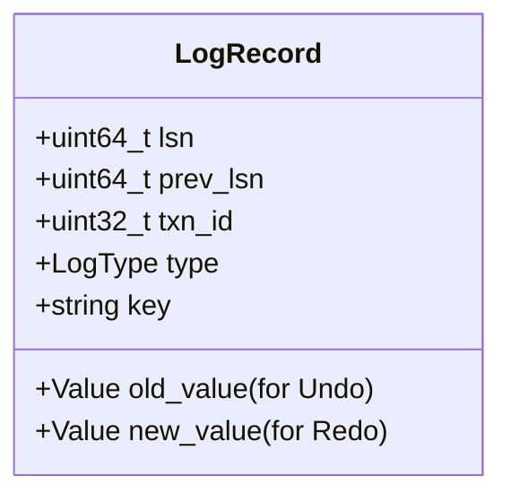

# SQLCC 故障恢复与 WAL 设计文档

## 1. WHY: 为什么要进行故障恢复？

数据库系统必须保证在任何时刻（包括突然断电、系统崩溃）之后，重启时能够恢复到一致的状态。
*   **原子性 (Atomicity)**: 如果事务在执行中崩溃，已做的修改必须撤销。
*   **持久性 (Durability)**: 如果事务已提交，即使系统崩溃，其修改也必须永久保留。

传统的直接修改磁盘（原地更新）无法同时保证这两点。**WAL (Write-Ahead Logging)** 是实现这一目标的行业标准协议。

## 2. WHAT: WAL 与故障恢复系统是什么？

SQLCC 的故障恢复系统基于 **ARIES (Algorithm for Recovery and Isolation Exploiting Semantics)** 算法简化版。

### 核心组件：
1.  **WAL Manager (日志管理器)**:
    *   管理顺序的日志流。
    *   分配全局单调递增的 **LSN (Log Sequence Number)**。
    *   维护内存日志缓冲区，并执行高效的刷盘。
2.  **Log Records (日志记录)**:
    *   记录了数据修改的“前像” (Before Image) 用于 UNDO。
    *   记录了数据修改的“后像” (After Image) 用于 REDO。
3.  **Checkpoint (检查点)**:
    *   定期将系统当前状态（脏页表、活跃事务表）持久化。
    *   用于缩短崩溃恢复时的扫描时间。

## 3. HOW: 核心算法与机制

### 3.1. WAL 协议三大原则
1.  **日志先行**: 在修改数据页之前，必须先将对应的日志记录写入磁盘。
2.  **提交前刷盘**: 事务提交前，其所有的日志记录必须全部完成刷盘。
3.  **强制顺序**: 日志必须按 LSN 顺序写入磁盘。

### 3.2. ARIES 恢复三阶段
1.  **分析阶段 (Analysis Phase)**:
    *   从最后一个成功的检查点开始扫描日志。
    *   确定哪些页面是“脏”的，哪些事务是活跃的（未提交）。
2.  **重做阶段 (Redo Phase)**:
    *   从分析阶段确定的 Redo LSN 开始扫描。
    *   重新执行所有已刷盘日志中的操作，无论事务是否提交。
    *   **WHY**: 确保数据库状态完全恢复到崩溃那一刻。
3.  **撤销阶段 (Undo Phase)**:
    *   反向扫描日志。
    *   对所有崩溃时仍处于活跃状态的事务进行回滚。
    *   生成 **CLR (Compensation Log Records)** 补偿日志，防止回滚过程中再次崩溃导致的重复撤销。

### 3.3. 组提交 (Group Commit)
为了提升性能，WAL Manager 不会为每个小事务都执行一次物理 `fsync`。
*   它将多个事务的日志合并在缓冲区中。
*   当缓冲区满、或者达到时间阈值（如 10ms）时，进行一次批量刷盘。

## 4. 日志记录结构

## 5. 性能优化与权衡

*   **异步刷盘**: 允许用户配置 `force_sync=false` 以获得极高性能，但会面临断电丢失最后几毫秒数据的风险。
*   **日志压缩**: 定期清理已经通过检查点并确认持久化的旧日志，防止磁盘占满。
*   **并行恢复**: (未来) 在重做阶段，对互不干扰的页面进行并行重演。

## 6. 故障场景处理

*   **写入一半断电**: 页面校验和 (Checksum) 失败，通过 WAL 重做覆盖损坏页面。
*   **回滚中崩溃**: 补偿日志记录 (CLR) 确保系统最终总能达到一致状态。
