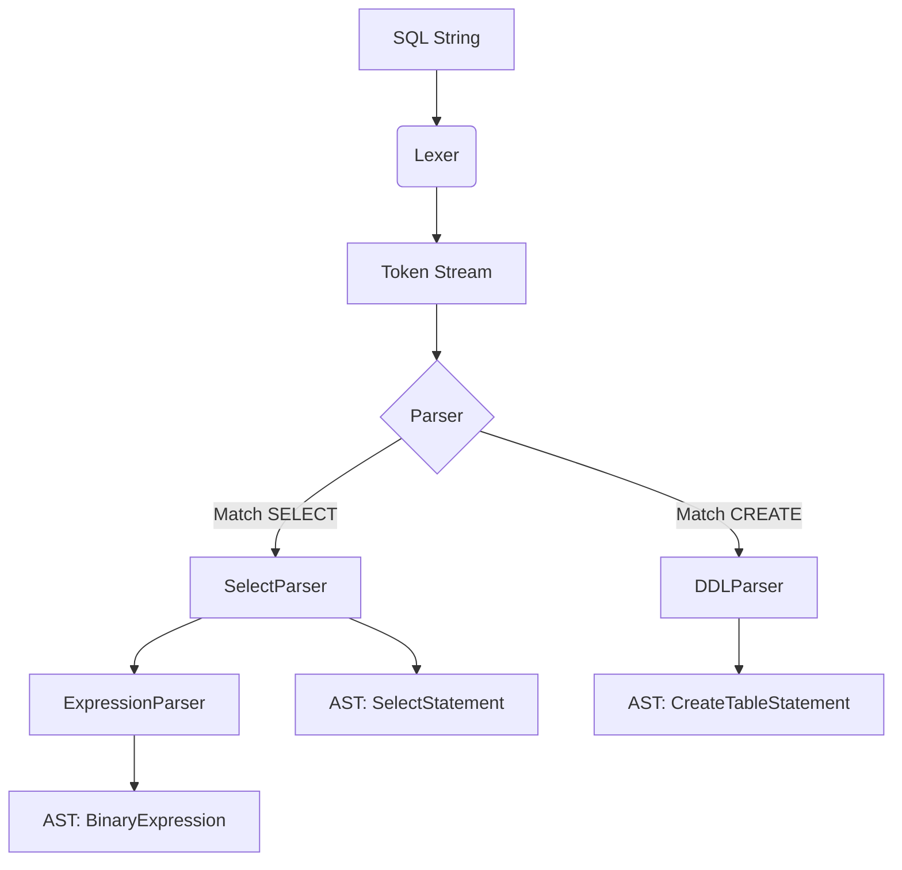

# SQLCC SQL 解析器设计文档

## 1. WHY: 为什么要设计专门的 SQL 解析器？

SQL（结构化查询语言）是人与数据库交互的桥梁。一个专门的解析器对于数据库系统至关重要：

*   **语言翻译**: 将人类可读的 SQL 字符串转换为计算机可理解和执行的结构化表示（抽象语法树，AST）。
*   **语法验证**: 在执行之前拦截错误的语法，防止系统崩溃。
*   **语义检查**: 验证 SQL 是否符合逻辑（例如：表是否存在，列名是否匹配，类型是否兼容）。
*   **安全防范**: 防御 SQL 注入等安全威胁。
*   **标准化**: 确保系统严格遵循 SQL-92 等行业标准。

## 2. WHAT: SQL 解析器是什么？

SQL 解析器是 SQLCC 的前端核心组件。它采用**自顶向下 (Top-Down)** 的解析策略，将 SQL 文本拆解并重构为内部对象。

### 核心组件：
1.  **词法分析器 (Lexer)**: 将原始字符串流切分为一个个有意义的标记（Tokens），如关键字 `SELECT`、标识符 `users`、运算符 `+` 等。
2.  **标记流 (TokenStream)**: 管理 Token 的前进、回退和预看 (Lookahead)，为解析器提供稳定的数据源。
3.  **解析器核心 (Parser)**: 实现**递归下降解析 (Recursive Descent Parsing)** 逻辑。
4.  **抽象语法树 (AST)**: 解析的结果，一组相互关联的节点对象，代表了 SQL 的逻辑结构。
5.  **错误处理器 (ErrorHandler)**: 收集解析过程中的语法错误，并提供精确的行号和错误描述。

### 支持的语句类型：
*   **DDL (Data Definition Language)**: `CREATE`, `ALTER`, `DROP`
*   **DML (Data Manipulation Language)**: `SELECT`, `INSERT`, `UPDATE`, `DELETE`
*   **DCL (Data Control Language)**: `GRANT`, `REVOKE`
*   **TCL (Transaction Control Language)**: `COMMIT`, `ROLLBACK`, `SAVEPOINT`

## 3. HOW: SQL 解析器是如何实现的？

###  recursive-descent-parsing 3.1. 递归下降解析 (Recursive Descent Parsing)
解析器的结构与 SQL 的文法规则直接对应。每个语法规则（如 `SelectStatement`, `Expression`, `WhereClause`）在代码中都对应一个专有的解析函数。

```cpp
// 伪代码示例
unique_ptr<Statement> Parser::parseStatement() {
    if (match(TokenType::SELECT)) return parseSelectStatement();
    if (match(TokenType::INSERT)) return parseInsertStatement();
    // ...
}
```

### 3.2. 运算符优先级处理
表达式解析是解析器中最复杂的部分。SQLCC 采用基于优先级的爬升算法或多层递归函数来处理：
*   乘除 > 加减
*   比较运算符 > 逻辑运算符 (`AND`, `OR`)

### 3.3. 错误恢复 (Error Recovery)
当遇到语法错误时，解析器不会立即停止，而是进入“恐慌模式”并尝试**同步 (Synchronize)**。
*   寻找下一个语句的分隔符（分号 `;`）。
*   跳过当前的错误片段，尝试解析后续的语句。
*   这允许解析器在一次运行中报告多个错误，提升用户体验。

### 3.4. 模块化设计 (Modular Sub-parsers)
为了防止单一解析类变得过于庞大，SQLCC 将逻辑拆分为多个专门的子解析器：
*   `ParserDDL`: 负责定义类语句。
*   `ParserDML`: 负责查询和修改类语句。
*   `ParserDCL`: 负责权限类语句。
*   `ExpressionParser`: 专门负责处理复杂的递归表达式。

### 3.5. 词法分析与 Token 映射
`Lexer` 使用有限状态机 (FSM) 思想识别标记。关键字使用哈希表进行快速查找，以区分标识符和系统保留字。

## 4. 解析流程示意图



## 5. 性能与扩展性

*   **Lookahead**: 支持 1 个或多个 Token 的预看，解决语法歧义。
*   **内存管理**: 所有的 AST 节点都由 `std::unique_ptr` 管理，确保解析失败或完成后内存能自动释放。
*   **方言支持**: 核心解析逻辑相对独立，易于通过扩展 `Parser` 类来支持不同数据库的 SQL 方言。
