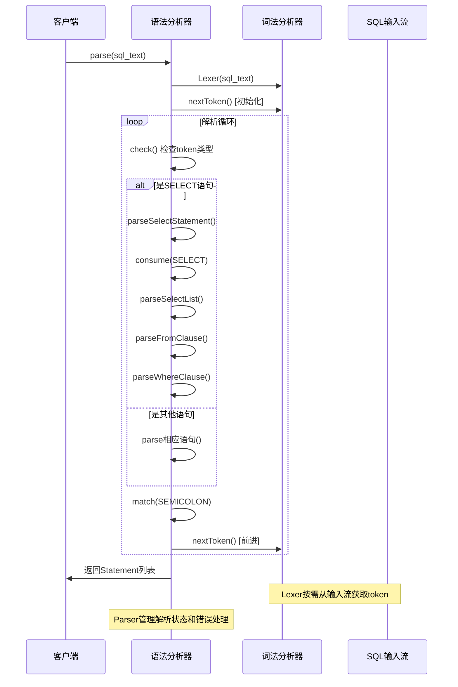
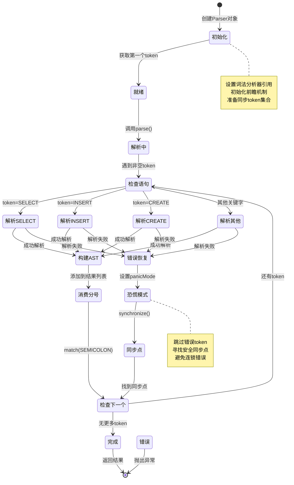
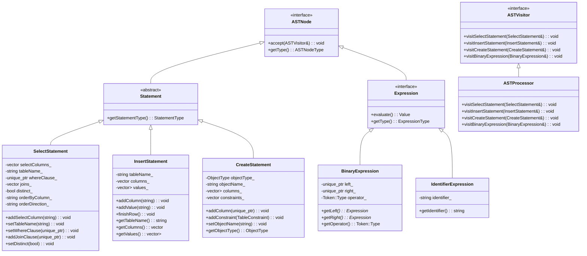
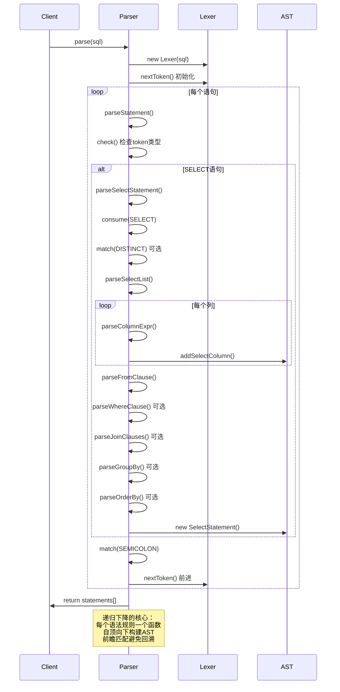

# SQLCC SQL语法解析器设计文档

## 概述

SQLCC的SQL语法解析器是基于递归下降法（Recursive Descent Parsing）实现的SQL-92标准语法分析器。本文档从编译原理的角度，系统性地介绍SQL语法解析器的设计原理、实现机制和核心算法。

**📚 配套教材参考**：
- [第5章：SQL解析器实现](../../textbook/《数据库系统原理与开发实践》.md#第五部分核心组件深度实现)
- [5.1 词法分析：从字符流到标记序列](../../textbook/《数据库系统原理与开发实践》.md#51-词法分析从字符流到标记序列)
- [5.2 语法分析：构建抽象语法树](../../textbook/《数据库系统原理与开发实践》.md#52-语法分析构建抽象语法树)
- [5.3 语义分析与查询优化](../../textbook/《数据库系统原理与开发实践》.md#53-语义分析与查询优化)

## 目录
1. [编译原理基础](#编译原理基础)
2. [SQL语法特点分析](#sql语法特点分析)
3. [递归下降法原理](#递归下降法原理)
4. [SQLCC Parser架构设计](#sqlcc-parser架构设计)
5. [词法分析集成](#词法分析集成)
6. [AST构建机制](#ast构建机制)
7. [错误处理和恢复](#错误处理和恢复)
8. [性能优化策略](#性能优化策略)
9. [扩展性设计](#扩展性设计)
10. [可视化图表](#可视化图表)

## 编译原理基础

### 语法分析的基本概念

**语法分析器（Parser）**是编译器的重要组成部分，负责将词法分析器产生的token序列转换为抽象语法树（AST）或语法树。

**递归下降法**是一种自顶向下的语法分析技术，通过为每个语法规则定义相应的递归函数来实现语法分析。

### 上下文无关文法（CFG）

SQL语法可以用上下文无关文法描述：

```
G = (N, Σ, P, S)
- N: 非终结符集合（语法规则名）
- Σ: 终结符集合（token类型）
- P: 产生式规则集合
- S: 开始符号（通常是<statement>或<sql>）
```

### 递归下降法的核心思想

递归下降法的基本思想是为每个非终结符定义一个对应的函数，该函数尝试识别由该非终结符定义的语法结构。

```cpp
// 伪代码示例
ReturnType parseNonTerminal() {
    // 尝试匹配第一个产生式
    if (lookaheadMatches(FIRST_SET_1)) {
        // 处理产生式1的匹配逻辑
        matchTerminal1();
        matchTerminal2();
        // ...
    }
    // 尝试匹配第二个产生式
    else if (lookaheadMatches(FIRST_SET_2)) {
        // 处理产生式2的匹配逻辑
        // ...
    }
    // 错误处理
    else {
        reportError("Unexpected token");
    }
}
```

## SQL语法特点分析

### SQL的语法层次结构

SQL语法具有典型的层次结构：

```
SQL Script
├── Statement 1
├── Statement 2
├── ...
└── Statement N
```

每个Statement可以是：
- DDL语句（CREATE, DROP, ALTER）
- DML语句（SELECT, INSERT, UPDATE, DELETE）
- DCL语句（GRANT, REVOKE）
- TCL语句（COMMIT, ROLLBACK）

### SQL的关键语法特征

1. **关键字驱动**：每个语句都以特定的关键字开头
   ```sql
   SELECT ...  -- 以SELECT开头
   INSERT ...  -- 以INSERT开头
   CREATE ...  -- 以CREATE开头
   ```

2. **分号终止**：语句以分号`;`结束
3. **子句结构**：复杂语句包含多个子句（如SELECT子句、FROM子句、WHERE子句等）
4. **嵌套结构**：支持子查询、复杂表达式等嵌套结构

### SQL-92语法复杂度分析

SQL-92标准定义了完整的SQL语法，包含：
- **基本数据类型**：INTEGER, VARCHAR, DATE等
- **复杂表达式**：算术表达式、逻辑表达式、函数调用
- **集合操作**：UNION, INTERSECT, EXCEPT
- **连接操作**：INNER JOIN, LEFT JOIN, RIGHT JOIN, FULL JOIN
- **聚合函数**：COUNT, SUM, AVG, MIN, MAX
- **分组和排序**：GROUP BY, ORDER BY, HAVING
- **约束定义**：PRIMARY KEY, FOREIGN KEY, CHECK, UNIQUE

## 递归下降法原理

### 基本原理

递归下降法的工作原理：

1. **自顶向下**：从语法树的根节点开始，逐步向下构建
2. **递归调用**：每个语法规则对应一个递归函数
3. **前瞻匹配**：通过lookahead token决定匹配哪个产生式
4. **回溯避免**：通过FIRST集合和FOLLOW集合避免回溯

### FIRST集合和FOLLOW集合

**FIRST集合**：一个非终结符可能推导出的所有句型的开头终结符集合

**FOLLOW集合**：可能出现在某个非终结符之后的终结符集合

在SQL Parser中：
- FIRST(SELECT_statement) = {SELECT}
- FIRST(INSERT_statement) = {INSERT}
- FIRST(CREATE_statement) = {CREATE}

### 递归下降法的优势

1. **直观易懂**：代码结构直接反映语法结构
2. **易于实现**：每个语法规则对应一个函数
3. **错误定位准确**：可以精确定位语法错误位置
4. **易于扩展**：添加新语法规则只需要添加新函数
5. **调试友好**：可以通过调试跟踪解析过程

### 递归下降法的局限性

1. **左递归问题**：不能直接处理左递归文法
2. **回溯开销**：在存在歧义时需要回溯
3. **效率问题**：对于复杂文法可能效率较低

## SQLCC Parser架构设计

### 整体架构

SQLCC的SQL Parser采用经典的递归下降架构：

```cpp
class Parser {
private:
    Lexer& lexer_;                    // 词法分析器引用
    Token currentToken_;              // 当前token
    Token lookaheadToken_;            // 前瞻token
    bool hasLookahead_;               // 是否有前瞻token
    bool panicMode_;                  // 恐慌模式标志
    std::vector<std::string> errors_; // 错误信息列表
    std::unordered_set<Token::Type> syncTokens_; // 同步token集合

public:
    // 核心解析方法
    std::vector<std::unique_ptr<Statement>> parse();
    std::unique_ptr<Statement> parseStatement();
    // 各种语句解析方法
    std::unique_ptr<SelectStatement> parseSelectStatement();
    std::unique_ptr<InsertStatement> parseInsertStatement();
    std::unique_ptr<CreateStatement> parseCreateStatement();
    // ...
};
```

### 核心方法设计

#### parse() - 主入口函数

```cpp
std::vector<std::unique_ptr<Statement>> Parser::parse() {
    std::vector<std::unique_ptr<Statement>> statements;

    // 主解析循环
    while (!isAtEnd()) {
        try {
            // 跳过空语句
            if (match(Token::SEMICOLON)) {
                continue;
            }

            // 解析单个语句
            std::unique_ptr<Statement> stmt = parseStatement();
            if (stmt) {
                statements.push_back(std::move(stmt));
            }

            // 消费语句结束分号
            if (check(Token::SEMICOLON)) {
                consume(Token::SEMICOLON);
            }
        } catch (const std::exception& e) {
            // 错误处理和恢复
            if (!panicMode_) {
                reportError(e.what());
            }
            synchronize();
        }
    }

    return statements;
}
```

#### parseStatement() - 语句分派函数

```cpp
std::unique_ptr<Statement> Parser::parseStatement() {
    // 基于当前token进行语句类型识别和分派
    if (check(Token::KEYWORD_SELECT)) {
        return parseSelectStatement();
    } else if (check(Token::KEYWORD_INSERT)) {
        return parseInsertStatement();
    } else if (check(Token::KEYWORD_UPDATE)) {
        return parseUpdateStatement();
    } else if (check(Token::KEYWORD_DELETE)) {
        return parseDeleteStatement();
    } else if (check(Token::KEYWORD_CREATE)) {
        // CREATE语句需要特殊处理（VIEW vs TABLE等）
        if (isCreateViewStatement()) {
            return parseCreateViewStatement();
        } else {
            return parseCreateStatement();
        }
    }
    // ... 其他语句类型

    // 未知语句类型
    throw std::runtime_error("Unknown statement type");
}
```

### 辅助方法设计

#### Token操作方法

```cpp
// 前瞻检查（不消费token）
bool check(Token::Type type) const {
    if (isAtEnd()) return false;
    return currentToken_.getType() == type;
}

// 匹配并消费token
bool match(Token::Type type) {
    if (check(type)) {
        advance();
        return true;
    }
    return false;
}

// 消费指定token（必须匹配）
void consume(Token::Type type) {
    if (check(type)) {
        advance();
    } else {
        // 抛出语法错误
        throw std::runtime_error("Expected token: " + Token::getTypeName(type));
    }
}

// 前进到下一个token
void advance() {
    if (hasLookahead_) {
        currentToken_ = lookaheadToken_;
        hasLookahead_ = false;
    } else {
        currentToken_ = lexer_.nextToken();
    }
}
```

## 词法分析集成

### Lexer-Parser协作机制

SQLCC采用经典的词法分析器-语法分析器分离架构：

```cpp
class Lexer {
public:
    Token nextToken();           // 获取下一个token
    Token peek();                // 前瞻下一个token
    size_t getLine();             // 获取当前行号
    size_t getColumn();          // 获取当前列号
};

class Parser {
private:
    Lexer& lexer_;               // 词法分析器引用
    // ...
};
```

### Token类型定义

```cpp
enum class TokenType {
    // 关键字
    KEYWORD_SELECT, KEYWORD_FROM, KEYWORD_WHERE,
    KEYWORD_INSERT, KEYWORD_UPDATE, KEYWORD_DELETE,
    KEYWORD_CREATE, KEYWORD_DROP, KEYWORD_ALTER,
    // 标识符和字面量
    IDENTIFIER,
    STRING_LITERAL, INTEGER_LITERAL, FLOAT_LITERAL,
    // 操作符
    OPERATOR_EQUAL, OPERATOR_PLUS, OPERATOR_MINUS,
    // 分隔符
    LPAREN, RPAREN, COMMA, SEMICOLON,
    // 特殊token
    END_OF_INPUT, UNKNOWN
};
```

### 前瞻机制

Parser通过前瞻机制实现无回溯解析：

```cpp
Token peek() const {
    if (!hasLookahead_) {
        lookaheadToken_ = lexer_.nextToken();
        hasLookahead_ = true;
    }
    return lookaheadToken_;
}

bool lookaheadMatches(Token::Type type) {
    return peek().getType() == type;
}
```

## AST构建机制

### AST节点层次结构

SQLCC的AST采用层次化设计：

```cpp
// 基类
class ASTNode {
public:
    virtual ~ASTNode() = default;
    virtual void accept(ASTVisitor& visitor) = 0;
};

// 语句基类
class Statement : public ASTNode {
public:
    virtual StatementType getType() const = 0;
};

// 具体语句类型
class SelectStatement : public Statement {
private:
    std::vector<std::string> selectColumns_;
    std::string tableName_;
    std::unique_ptr<Expression> whereClause_;
    // ... 其他成员
};

class CreateStatement : public Statement {
private:
    CreateStatement::ObjectType objectType_;
    std::string objectName_;
    std::vector<std::unique_ptr<ColumnDefinition>> columns_;
    std::vector<TableConstraint> constraints_;
};
```

### AST构建流程

以SELECT语句为例：

```cpp
std::unique_ptr<SelectStatement> Parser::parseSelectStatement() {
    // 消费SELECT关键字
    consume(Token::KEYWORD_SELECT);

    auto stmt = std::make_unique<SelectStatement>();

    // 解析DISTINCT（可选）
    if (match(Token::KEYWORD_DISTINCT)) {
        stmt->setDistinct(true);
    }

    // 解析选择列表
    if (match(Token::OPERATOR_MULTIPLY)) {
        stmt->setSelectAll(true);
    } else {
        // 解析列名和表达式列表
        parseSelectList(*stmt);
    }

    // 解析FROM子句
    if (match(Token::KEYWORD_FROM)) {
        parseFromClause(*stmt);
    }

    // 解析WHERE子句
    if (match(Token::KEYWORD_WHERE)) {
        stmt->setWhereClause(parseWhereClause());
    }

    // ... 其他子句

    return stmt;
}
```

### 访问者模式集成

AST支持访问者模式便于遍历和处理：

```cpp
class ASTVisitor {
public:
    virtual void visitSelectStatement(SelectStatement& stmt) = 0;
    virtual void visitInsertStatement(InsertStatement& stmt) = 0;
    virtual void visitCreateStatement(CreateStatement& stmt) = 0;
    // ... 其他visit方法
};

class ASTProcessor : public ASTVisitor {
public:
    void visitSelectStatement(SelectStatement& stmt) override {
        // 处理SELECT语句
        processSelectColumns(stmt.getSelectColumns());
        processTableName(stmt.getTableName());
        if (stmt.getWhereClause()) {
            stmt.getWhereClause()->accept(*this);
        }
    }
};
```

## 错误处理和恢复

### 错误检测机制

Parser采用多层次错误检测：

1. **语法错误**：token序列不符合语法规则
2. **语义错误**：语法正确但语义有误（如表不存在）
3. **类型错误**：数据类型不匹配

### 恐慌模式错误恢复

```cpp
void Parser::synchronize() {
    panicMode_ = false;

    // 跳过token直到找到同步点
    while (!isAtEnd()) {
        if (currentToken_.getType() == Token::SEMICOLON) {
            advance();
            return;
        }

        // 检查是否是语句开始关键字
        if (syncTokens_.count(currentToken_.getType()) > 0) {
            return;
        }

        advance(); // 跳过当前token
    }
}
```

### 错误报告机制

```cpp
void Parser::reportError(const std::string& message) {
    std::string fullMessage = "Parse error at line " +
        std::to_string(currentToken_.getLine()) + ", column " +
        std::to_string(currentToken_.getColumn()) + ": " + message;

    errors_.push_back(fullMessage);
    panicMode_ = true;

    // 输出调试信息
    std::cout << "[PARSER ERROR] " << fullMessage << std::endl;
}
```

## 性能优化策略

### 单遍扫描优化

Parser采用单遍扫描策略，只遍历token流一次：

```cpp
// 高效的单遍解析
while (!isAtEnd()) {
    Token current = currentToken_;
    std::unique_ptr<Statement> stmt = parseStatement();

    if (stmt) {
        statements.push_back(std::move(stmt));
    }

    // 不需要回溯，直接前进
    advance();
}
```

### 内存管理优化

使用智能指针避免内存泄漏：

```cpp
// RAII原则，自动内存管理
std::vector<std::unique_ptr<Statement>> statements;

// 自动清理资源
std::unique_ptr<SelectStatement> selectStmt = std::make_unique<SelectStatement>();
std::unique_ptr<Expression> whereClause = std::make_unique<BinaryExpression>(...);

// 所有权转移，无需手动delete
selectStmt->setWhereClause(std::move(whereClause));
statements.push_back(std::move(selectStmt));
```

### 缓存和预分配

```cpp
// 预分配容器容量
std::vector<std::unique_ptr<Statement>> statements;
statements.reserve(64); // 预估语句数量

// 重用字符串对象
std::string tableName = parseIdentifier();
// 直接move，避免拷贝
stmt->setTableName(std::move(tableName));
```

## 扩展性设计

### 新语法规则添加

添加新的SQL语法规则的步骤：

1. **定义AST节点**
```cpp
class NewStatement : public Statement {
    // 新语句的AST结构
};
```

2. **添加Token类型**
```cpp
enum TokenType {
    // ...
    KEYWORD_NEW_KEYWORD,
    // ...
};
```

3. **实现解析方法**
```cpp
std::unique_ptr<NewStatement> Parser::parseNewStatement() {
    // 解析逻辑
}
```

4. **更新分派函数**
```cpp
std::unique_ptr<Statement> Parser::parseStatement() {
    // ...
    if (check(Token::KEYWORD_NEW_KEYWORD)) {
        return parseNewStatement();
    }
    // ...
}
```

### 语法扩展机制

支持语法扩展的设计模式：

1. **策略模式**：不同SQL方言的解析策略
2. **模板方法**：通用解析框架，具体步骤可扩展
3. **插件架构**：动态加载新的语法解析器

### 版本兼容性

SQL标准的版本兼容性处理：

```cpp
enum SQLStandard {
    SQL_92,
    SQL_99,
    SQL_2003,
    SQL_2011,
    SQL_2016
};

class Parser {
private:
    SQLStandard standard_;
public:
    void setSQLStandard(SQLStandard std) {
        standard_ = std;
    }

    bool isFeatureSupported(Feature feature) {
        return standard_ >= getRequiredStandard(feature);
    }
};
```

## 总结

SQLCC的SQL语法解析器是编译原理理论与实践的完美结合：

### 核心优势

1. **理论严谨**：基于递归下降法，实现清晰，易于理解
2. **实践高效**：单遍扫描，无回溯，性能优异
3. **扩展灵活**：模块化设计，易于添加新语法
4. **错误友好**：详细错误信息，强大的恢复机制
5. **内存安全**：智能指针管理，避免内存泄漏

### 学习价值

这个实现为学习编译原理提供了宝贵的实践参考：

- **递归下降法**的实际应用
- **语法分析**的工程实现
- **错误处理**的最佳实践
- **AST设计**的架构模式
- **C++现代特性**的高效运用

### 未来发展方向

1. **LL(1)文法优化**：消除左递归，提高解析效率
2. **语法分析器生成器**：自动生成解析代码
3. **增量解析**：支持SQL脚本的增量解析
4. **并行解析**：多线程解析大型SQL文件
5. **语法高亮**：为IDE提供语法高亮支持

## 可视化图表

### 1. SQL Parser整体架构图

```mermaid
graph TB
    subgraph "输入层"
        SQL[SQL文本]
        Lexer[词法分析器<br/>Lexer]
    end

    subgraph "语法分析层"
        Parser[语法分析器<br/>Parser]
        subgraph "解析方法"
            Parse[parse()]
            ParseStmt[parseStatement()]
            ParseSelect[parseSelectStatement()]
            ParseInsert[parseInsertStatement()]
            ParseCreate[parseCreateStatement()]
        end
    end

    subgraph "AST构建层"
        AST[抽象语法树<br/>AST Nodes]
        subgraph "AST节点类型"
            Stmt[Statement<br/>语句基类]
            Select[SelectStatement<br/>SELECT语句]
            Insert[InsertStatement<br/>INSERT语句]
            Create[CreateStatement<br/>CREATE语句]
            Expr[Expression<br/>表达式]
        end
    end

    subgraph "输出层"
        Result[解析结果<br/>Statement List]
        Error[错误信息<br/>Error List]
    end

    SQL --> Lexer
    Lexer --> Parser
    Parser --> Parse
    Parse --> ParseStmt
    ParseStmt --> ParseSelect
    ParseStmt --> ParseInsert
    ParseStmt --> ParseCreate
    ParseSelect --> AST
    ParseInsert --> AST
    ParseCreate --> AST
    AST --> Select
    AST --> Insert
    AST --> Create
    AST --> Expr
    Stmt --> Select
    Stmt --> Insert
    Stmt --> Create
    AST --> Result
    Parser --> Error

    style Parser fill:#e1f5fe
    style AST fill:#f3e5f5
    style Result fill:#e8f5e8
```

### 2. 词法分析器-语法分析器协作图



### 3. 递归下降法工作流程活动图

```mermaid
flowchart TD
    Start([开始解析]) --> Init[初始化Parser<br/>设置词法分析器<br/>获取第一个token]
    Init --> Loop{还有token?}

    Loop -->|是| CheckEmpty{是分号?}
    CheckEmpty -->|是| Skip[跳过空语句] --> Loop

    CheckEmpty -->|否| Dispatch[语句分派<br/>parseStatement()]
    Dispatch --> CheckSelect{SELECT?} -->|是| ParseSelect[parseSelectStatement()]
    CheckSelect -->|否| CheckInsert{INSERT?} -->|是| ParseInsert[parseInsertStatement()]
    CheckInsert -->|否| CheckCreate{CREATE?} -->|是| ParseCreate[parseCreateStatement()]
    CheckCreate -->|否| Other[其他语句解析]

    ParseSelect --> BuildAST[构建AST节点<br/>SelectStatement]
    ParseInsert --> BuildAST
    ParseCreate --> BuildAST
    Other --> BuildAST

    BuildAST --> AddResult[添加到结果列表]
    AddResult --> ConsumeSemi[消费分号<br/>match(SEMICOLON)]
    ConsumeSemi --> Loop

    Loop -->|否| CheckError{有错误?}
    CheckError -->|是| ReportError[报告错误信息] --> End([结束])
    CheckError -->|否| Return[返回解析结果] --> End

    Note right of Init: 初始化解析器状态
    Note right of Dispatch: 基于当前token分派到具体解析方法
    Note right of BuildAST: 创建对应的AST节点
    Note right of ReportError: 收集所有解析过程中的错误
```

### 4. Parser状态转换状态图



### 5. AST节点层次结构类图



### 6. 错误处理和恢复流程图

```mermaid
flowchart TD
    A[解析过程] --> B{遇到异常?}
    B -->|否| C[继续解析]
    B -->|是| D{是否恐慌模式?}
    D -->|否| E[记录错误信息]
    D -->|是| F[跳过错误处理]
    E --> G[设置恐慌模式]
    G --> H[调用synchronize()]
    H --> I[寻找同步点]

    I --> J{找到分号?}
    J -->|是| K[消费分号]
    J -->|否| L{找到语句关键字?}
    L -->|是| M[停止同步]
    L -->|否| N[继续前进]
    N --> I

    K --> O[重置恐慌模式]
    M --> O
    O --> P[继续解析]
    F --> P

    C --> Q{解析完成?}
    P --> Q
    Q -->|否| A
    Q -->|是| R[返回结果]

    style D fill:#ffebee
    style G fill:#ffebee
    style H fill:#ffebee
    style E fill:#ffebee
    style I fill:#ffebee

    style O fill:#e8f5e8
    style R fill:#e8f5e8
```

### 7. 递归下降法核心算法时序图



### 8. 性能优化策略流程图

```mermaid
flowchart TD
    A[输入SQL文本] --> B[词法分析<br/>单遍扫描]
    B --> C[语法分析<br/>递归下降]

    C --> D{前瞻缓存?}
    D -->|是| E[使用缓存token<br/>避免重复调用]
    D -->|否| F[调用lexer.nextToken()<br/>获取新token]

    E --> G[匹配检查<br/>check/match/advance]
    F --> G

    G --> H[AST构建<br/>智能指针管理]
    H --> I[内存优化<br/>RAII + 移动语义]

    I --> J[错误处理<br/>恐慌模式恢复]
    J --> K[同步点查找<br/>集合查找优化]

    K --> L[结果输出<br/>Statement列表]

    style B fill:#e3f2fd
    style C fill:#e3f2fd
    style H fill:#f3e5f5
    style I fill:#f3e5f5
    style L fill:#e8f5e8

    subgraph "单遍扫描优化"
        B
        C
    end

    subgraph "内存管理优化"
        H
        I
    end

    subgraph "前瞻机制优化"
        D
        E
        F
    end
```

---

*本文档创建时间: 2025-12-24*
*作者: SQLCC技术委员会*
*版本: v1.2.6*
*更新时间: 2025-12-24*
