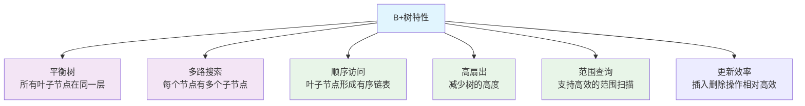

# SQLCC B+树索引设计详解 - 教科书级教程

## 前言

本教程面向大学二年级数据库系统课程的学生，通过详细的理论讲解、算法推导和代码实现，帮助大家系统性地理解B+树索引的设计原理和实现机制。

我们将按照"原理讲解 → 算法推导 → 代码实现"的方式进行学习，确保大家不仅能理解概念，还能掌握实际的工程实现。

**📚 配套教材参考**：
- [第7章：索引系统与查询优化](../../textbook/《数据库系统原理与开发实践》.md#第七章索引系统与查询优化)
- [7.1 B+树原理与工程实现](../../textbook/《数据库系统原理与开发实践》.md#71-b树原理与工程实现)
- [7.2 索引与存储引擎的协同优化](../../textbook/《数据库系统原理与开发实践》.md#72-索引与存储引擎的协同优化)
- [7.3 现代硬件特性对索引设计的优化](../../textbook/《数据库系统原理与开发实践》.md#73-现代硬件特性对索引设计的优化)

---

## 第一章：B+树索引的基本概念

### 1.1 B+树核心特性图



### 1.2 B+树与传统数据结构的对比

| 特性 | B+树 | B树 | 哈希表 | 红黑树 |
|------|------|-----|--------|--------|
| 查找 | O(log_n) | O(log_n) | O(1) | O(log_n) |
| 范围查询 | O(log_n + k) | O(log_n + k) | 不支持 | O(log_n + k) |
| 插入删除 | O(log_n) | O(log_n) | O(1) | O(log_n) |
| 磁盘友好 | 优秀 | 良好 | 差 | 差 |
| 空间利用 | 高 | 中等 | 高 | 中等 |

**为什么B+树最适合数据库索引？**
1. **磁盘访问优化**: 节点大小与磁盘页面匹配，减少I/O次数
2. **范围查询支持**: 叶子链表支持高效的顺序访问
3. **平衡性保证**: 所有操作都保持树的平衡，避免性能退化
4. **并发友好**: 节点级锁便于实现多线程访问

### 1.1 为什么需要索引？

想象一下，你有一本1000页的字典，每次查找单词都需要从第1页翻到第1000页，这显然太慢了。索引就是为了解决这个问题而生的。

**数据库索引的本质问题**：
- 数据存储在磁盘上，访问速度慢（毫秒级）
- 查询时需要快速定位数据位置
- 索引必须能够适应数据的动态变化（插入、删除、更新）

**传统解决方案的局限性**：
- **线性搜索**: O(n)时间复杂度，数据量大时不可接受
- **哈希索引**: 支持O(1)查找，但不支持范围查询
- **有序数组**: 支持范围查询，但插入删除效率低

### 1.2 B+树：磁盘优化的平衡树

B+树（B-Plus Tree）是一种专门为磁盘存储优化的平衡多路搜索树。它具有以下核心特性：

**核心特性**：
1. **平衡性**: 所有叶子节点在同一层
2. **多路**: 每个节点可以有多个子节点（通常100+）
3. **磁盘友好**: 节点大小与磁盘页面对齐
4. **范围查询**: 叶子节点通过链表连接

**为什么叫"B+树"**：
- B代表Balance（平衡）
- +代表比传统B树多了叶子节点链表

### 1.3 B+树与传统数据结构的对比

| 特性 | B+树 | B树 | 哈希表 | 红黑树 |
|------|------|-----|--------|--------|
| 查找 | O(log_n) | O(log_n) | O(1) | O(log_n) |
| 范围查询 | O(log_n + k) | O(log_n + k) | 不支持 | O(log_n + k) |
| 插入删除 | O(log_n) | O(log_n) | O(1) | O(log_n) |
| 磁盘友好 | 优秀 | 良好 | 差 | 差 |
| 空间利用 | 高 | 中等 | 高 | 中等 |

**为什么B+树最适合数据库索引？**
1. **磁盘访问优化**: 节点大小与磁盘页面匹配，减少I/O次数
2. **范围查询支持**: 叶子链表支持高效的顺序访问
3. **平衡性保证**: 所有操作都保持树的平衡，避免性能退化
4. **并发友好**: 节点级锁便于实现多线程访问

---

## 第二章：B+树的核心原理

### 2.1 B+树的结构组成

#### 树的基本组成元素

```
[B+树结构示意图]

          [内部节点层]     ← 只存储分隔键，不存储数据
        /     |     \
   [内部]     [内部]     [内部]
  /  |  \   /  |  \   /  |  \
[叶] [叶] [叶] [叶] [叶] [叶] [叶] [叶]   ← 存储完整键值对
  ↑   ↑   ↑   ↑   ↑   ↑   ↑   ↑   ↑
  =====================================
     双向链表连接，便于范围查询
```

#### 节点类型的详细说明

**内部节点 (Internal Node)**:
```cpp
struct BPlusTreeInternalNode {
    std::vector<std::string> keys;        // 分隔键数组
    std::vector<int32_t> child_page_ids; // 子节点页面ID数组
    int32_t parent_page_id;               // 父节点页面ID
};
```

- **分隔键**: 用于指导搜索方向的键值
- **子节点指针**: 指向下一级节点的页面ID
- **不存储数据**: 只存储索引信息，节省空间

**叶子节点 (Leaf Node)**:
```cpp
struct BPlusTreeLeafNode {
    std::vector<IndexEntry> entries;      // 键值对数组
    int32_t next_page_id;                 // 下一个叶子节点
    int32_t prev_page_id;                 // 上一个叶子节点
    int32_t parent_page_id;               // 父节点页面ID
};
```

- **完整数据**: 存储键和对应的页面偏移
- **双向链表**: 支持高效的范围查询
- **有序存储**: 按键值从小到大排列

### 2.2 节点容量设计

#### 为什么节点容量如此重要？

磁盘I/O是数据库性能的瓶颈。B+树通过控制节点大小来优化磁盘访问：

**关键设计参数**:
- **节点大小**: 通常等于磁盘页面大小(4KB-64KB)
- **最大键数**: (节点大小 - 元数据) / 键大小
- **分裂阈值**: 当节点超过最大容量时进行分裂

#### 容量计算示例

假设：
- 磁盘页面大小: 4096字节
- 键大小: 100字节 (字符串平均长度)
- 页面ID大小: 4字节
- 节点元数据: 100字节

```
最大键数计算:
可用空间 = 4096 - 100 = 3996字节
每个键+指针 = 100 + 4 = 104字节
最大键数 = 3996 / 104 ≈ 38个键

分裂阈值: 当键数 > 38时分裂
合并阈值: 当键数 < 19时考虑合并
```

#### 节点大小对性能的影响

| 节点大小 | 树高度 | 查找I/O次数 | 空间利用率 |
|----------|--------|-------------|------------|
| 1KB | 较高 | 较多 | 较低 |
| 4KB | 中等 | 适中 | 良好 |
| 64KB | 较低 | 较少 | 优秀 |

### 2.3 B+树的平衡性保证

#### 为什么平衡性如此重要？

不平衡的树会导致性能退化：
- 最坏情况下查找可能需要遍历所有节点
- 某些分支访问频繁，另一些分支空闲

#### 平衡性维护机制

1. **插入时的平衡维护**:
   - 从叶子节点开始插入
   - 如果叶子节点满，执行叶子分裂
   - 分裂可能向上传播到根节点

2. **删除时的平衡维护**:
   - 从叶子节点删除条目
   - 如果节点容量过低，执行合并或重分布
   - 合并可能向下传播

3. **旋转操作**:
   - 兄弟节点间的数据重分布
   - 避免不必要的节点合并

---

## 第三章：B+树的核心算法

### 3.1 查找算法详解

#### 查找过程的三个阶段

**阶段1: 从根节点开始**
```cpp
// 根节点总是从磁盘加载
auto current_node = load_node(root_page_id);
```

**阶段2: 逐层向下搜索**
```cpp
while (!current_node->is_leaf()) {
    // 在当前内部节点中查找合适的子节点
    int child_index = find_child_index(current_node, search_key);
    int child_page_id = current_node->child_page_ids[child_index];

    // 加载子节点
    current_node = load_node(child_page_id);
}
```

**阶段3: 在叶子节点中定位**
```cpp
// 叶子节点包含所有数据
auto leaf_node = dynamic_cast<BPlusTreeLeafNode*>(current_node);
auto result = leaf_node->find_exact(search_key);
```

#### find_child_index算法

```cpp
int find_child_index(InternalNode* node, const std::string& key) {
    // 二分查找确定分支方向
    auto& keys = node->keys;
    int left = 0, right = keys.size();

    while (left < right) {
        int mid = left + (right - left) / 2;
        if (key < keys[mid]) {
            right = mid;
        } else {
            left = mid + 1;
        }
    }

    return left;
}
```

**算法复杂度分析**:
- **时间复杂度**: O(log_n) 次磁盘访问 + O(log_m) 内存查找
- **空间复杂度**: O(1) 除了结果集
- **I/O复杂度**: O(log_{order}(n)) 其中order为节点容量

### 3.2 插入算法详解

#### 插入过程的完整流程

**步骤1: 查找插入位置**
```cpp
// 与查找算法相同，定位目标叶子节点
auto target_leaf = find_leaf_for_insertion(key);
```

**步骤2: 插入到叶子节点**
```cpp
// 检查是否已存在相同键
auto existing = target_leaf->find_exact(key);
if (existing) {
    // 更新现有条目
    existing->update_value(new_value);
    return SUCCESS;
}

// 插入新条目
target_leaf->insert_entry(key, value);
```

**步骤3: 检查是否需要分裂**
```cpp
if (target_leaf->is_over_capacity()) {
    split_leaf_node(target_leaf);
}
```

#### 叶子节点分裂算法

```cpp
void split_leaf_node(LeafNode* leaf) {
    // 1. 创建新的叶子节点
    auto new_leaf = create_new_leaf_node();

    // 2. 数据平均分配
    int split_point = leaf->entries.size() / 2;
    move_entries(leaf, new_leaf, split_point);

    // 3. 更新链表指针
    new_leaf->next_page_id = leaf->next_page_id;
    new_leaf->prev_page_id = leaf->page_id;
    if (leaf->next_page_id != -1) {
        auto next_leaf = load_node(leaf->next_page_id);
        next_leaf->prev_page_id = new_leaf->page_id;
    }
    leaf->next_page_id = new_leaf->page_id;

    // 4. 插入分隔键到父节点
    std::string split_key = new_leaf->entries[0].key;
    insert_key_to_parent(leaf->parent_page_id, split_key, new_leaf->page_id);
}
```

#### 父节点插入算法

```cpp
void insert_key_to_parent(int32_t parent_page_id, std::string split_key, int32_t new_child_page_id) {
    if (parent_page_id == -1) {
        // 需要创建新的根节点
        create_new_root(split_key, left_child_page_id, new_child_page_id);
        return;
    }

    auto parent = load_node(parent_page_id);
    parent->insert_key(split_key, new_child_page_id);

    if (parent->is_over_capacity()) {
        // 递归分裂父节点
        split_internal_node(parent);
    }
}
```

### 3.3 删除算法详解

#### 删除过程的完整流程

**步骤1: 查找删除位置**
```cpp
auto target_leaf = find_leaf_for_deletion(key);
```

**步骤2: 删除条目**
```cpp
bool removed = target_leaf->remove_entry(key);
if (!removed) {
    return KEY_NOT_FOUND;
}
```

**步骤3: 检查是否需要合并**
```cpp
if (target_leaf->is_under_capacity()) {
    balance_after_deletion(target_leaf);
}
```

#### 节点合并算法

```cpp
void merge_leaf_nodes(LeafNode* left, LeafNode* right) {
    // 1. 将右节点的数据移到左节点
    for (auto& entry : right->entries) {
        left->entries.push_back(entry);
    }

    // 2. 更新链表指针
    left->next_page_id = right->next_page_id;
    if (right->next_page_id != -1) {
        auto next_node = load_node(right->next_page_id);
        next_node->prev_page_id = left->page_id;
    }

    // 3. 从父节点删除分隔键
    remove_key_from_parent(right->page_id);

    // 4. 删除右节点
    delete_node(right->page_id);
}
```

### 3.4 范围查询算法

#### 范围查询的核心优势

传统索引的范围查询问题：
- **哈希索引**: 完全不支持范围查询
- **B树**: 支持但效率不高
- **有序数组**: 支持但更新效率低

B+树的范围查询优势：
- **链表结构**: 叶子节点连续存储
- **顺序访问**: O(log_n + k)复杂度
- **磁盘预读**: 连续页面访问友好

#### 范围查询算法实现

```cpp
std::vector<IndexEntry> range_query(std::string min_key, std::string max_key) {
    std::vector<IndexEntry> results;

    // 1. 找到起始叶子节点
    auto start_leaf = find_leftmost_leaf(min_key);

    // 2. 沿叶子链表遍历
    auto current = start_leaf;
    while (current != nullptr) {
        // 收集当前节点中符合范围的条目
        for (const auto& entry : current->entries) {
            if (entry.key > max_key) {
                // 超出范围，停止搜索
                return results;
            }
            if (entry.key >= min_key) {
                results.push_back(entry);
            }
        }

        // 检查是否需要继续遍历下一个叶子节点
        if (current->next_page_id == -1) {
            break; // 已经是最后一个叶子节点
        }

        // 检查下一个叶子节点是否可能包含范围内的数据
        auto next_node = load_node(current->next_page_id);
        if (next_node->entries.empty() ||
            next_node->entries[0].key > max_key) {
            break; // 下一个节点的数据超出范围
        }

        current = next_node;
    }

    return results;
}
```

---

## 第四章：B+树的实现细节

### 4.1 磁盘存储设计

#### 页面管理机制

```cpp
struct Page {
    char data[PAGE_SIZE];     // 页面数据
    int32_t page_id;          // 页面ID
    bool is_dirty;            // 脏页标记
    int pin_count;            // 引用计数
};

class DiskManager {
public:
    Page* load_page(int32_t page_id);
    void flush_page(int32_t page_id);
    int32_t allocate_page();
    void deallocate_page(int32_t page_id);
};
```

#### 节点序列化格式

```
[叶子节点磁盘格式]
+---------------+-------------------+---------------+
| 节点类型(1)   | 条目数量(N)       | 父节点ID      |
+---------------+-------------------+---------------+
| 条目1键长     | 条目1键数据       | 条目1值       |
+---------------+-------------------+---------------+
| 条目2键长     | 条目2键数据       | 条目2值       |
+---------------+-------------------+---------------+
| ...           | ...               | ...           |
+---------------+-------------------+---------------+
| 下一叶子ID    | 上一叶子ID        | 填充字节      |
+---------------+-------------------+---------------+
```

### 4.2 并发控制机制

#### 节点级锁策略

```cpp
class NodeLockManager {
private:
    std::unordered_map<int32_t, std::mutex> node_locks;

public:
    std::unique_lock<std::mutex> acquire_lock(int32_t page_id) {
        std::unique_lock<std::mutex> lock(node_locks[page_id]);
        return lock; // 移动语义返回锁
    }
};
```

#### 锁的获取顺序

为了避免死锁，B+树操作遵循固定的锁获取顺序：
1. **从根到叶**: 总是从根节点开始向下获取锁
2. **左前右后**: 在同一层，总是先获取左边节点的锁
3. **父子顺序**: 先获取父节点锁，再获取子节点锁

### 4.3 性能优化技巧

#### 1. 预取优化

```cpp
void prefetch_siblings(int32_t current_page_id) {
    // 预取兄弟节点的磁盘页面
    auto siblings = find_sibling_pages(current_page_id);
    for (auto page_id : siblings) {
        disk_manager->prefetch_page(page_id);
    }
}
```

#### 2. 批量操作

```cpp
void bulk_insert(std::vector<IndexEntry>& entries) {
    // 1. 排序输入数据
    std::sort(entries.begin(), entries.end());

    // 2. 分批处理，避免频繁的树结构调整
    const size_t BATCH_SIZE = 1000;
    for (size_t i = 0; i < entries.size(); i += BATCH_SIZE) {
        auto batch_end = std::min(i + BATCH_SIZE, entries.size());
        insert_batch(entries.begin() + i, entries.begin() + batch_end);
    }
}
```

#### 3. 自适应节点大小

```cpp
size_t calculate_optimal_node_size() {
    // 根据工作负载特征动态调整节点大小
    auto workload_stats = analyze_workload();

    if (workload_stats.range_queries > 0.7) {
        // 范围查询为主，使用更大的节点
        return 64 * 1024; // 64KB
    } else {
        // 点查询为主，使用标准大小
        return 4 * 1024;  // 4KB
    }
}
```

---

## 第五章：B+树在SQLCC中的实现

### 5.1 类层次结构

```cpp
// 基类：定义节点接口
class BPlusTreeNode {
public:
    virtual bool is_leaf() const = 0;
    virtual int32_t get_page_id() const = 0;
    virtual void serialize_to_page() = 0;

    // 工厂方法
    static std::unique_ptr<BPlusTreeNode> load_from_page(int32_t page_id);
};

// 内部节点实现
class BPlusTreeInternalNode : public BPlusTreeNode {
private:
    std::vector<std::string> keys;
    std::vector<int32_t> child_page_ids;

public:
    int32_t find_child_page_id(const std::string& key);
    void insert_child(int32_t page_id);
    void insert_child(int32_t page_id, const std::string& key);
    void split(BPlusTreeInternalNode* new_node);
};

// 叶子节点实现
class BPlusTreeLeafNode : public BPlusTreeNode {
private:
    std::vector<IndexEntry> entries;
    int32_t next_page_id;
    int32_t prev_page_id;

public:
    std::vector<IndexEntry> search(const std::string& key);
    std::vector<IndexEntry> search_range(const std::string& min_key, const std::string& max_key);
    bool insert(const IndexEntry& entry);
    bool remove(const std::string& key);
    void split(BPlusTreeLeafNode* new_node);
};
```

### 5.2 核心操作的实现

#### 插入操作实现

```cpp
bool BPlusTreeIndex::Insert(const std::string& key, int32_t page_id, size_t offset) {
    if (!storage_engine_ || root_page_id_ < 0) {
        // 创建新的B+树
        if (!Create()) {
            return false;
        }
    }

    // 查找插入位置
    auto root_node = LoadNode(root_page_id_);
    if (!root_node) {
        return false;
    }

    // 执行递归插入
    IndexEntry entry(key, page_id, offset);
    bool result = InsertRecursive(entry, root_node, 0);

    // 保存根节点状态
    root_node->serialize_to_page();

    return result;
}

bool BPlusTreeIndex::InsertRecursive(const IndexEntry& entry,
                                   std::unique_ptr<BPlusTreeNode>& node,
                                   int depth) {
    // 防止无限递归
    if (depth > MAX_DEPTH) {
        SQLCC_LOG_ERROR("B+树插入深度超过最大限制");
        return false;
    }

    if (node->is_leaf()) {
        // 叶子节点直接插入
        auto leaf = dynamic_cast<BPlusTreeLeafNode*>(node.get());
        bool inserted = leaf->insert(entry);

        if (leaf->is_full()) {
            // 需要分裂叶子节点
            return split_leaf_node(leaf);
        }

        return inserted;
    } else {
        // 内部节点递归插入
        auto internal = dynamic_cast<BPlusTreeInternalNode*>(node.get());
        int32_t child_page_id = internal->find_child_page_id(entry.key);

        auto child_node = LoadNode(child_page_id);
        if (!child_node) {
            return false;
        }

        bool result = InsertRecursive(entry, child_node, depth + 1);

        if (internal->is_full()) {
            // 需要分裂内部节点
            return split_internal_node(internal);
        }

        return result;
    }
}
```

#### 查找操作实现

```cpp
std::vector<IndexEntry> BPlusTreeIndex::Search(const std::string& key) const {
    if (!storage_engine_ || root_page_id_ < 0) {
        return {};
    }

    // 从根节点开始查找
    auto current_node = const_cast<BPlusTreeIndex*>(this)->LoadNode(root_page_id_);
    if (!current_node) {
        return {};
    }

    // 逐层向下查找
    while (!current_node->is_leaf()) {
        auto internal = dynamic_cast<BPlusTreeInternalNode*>(current_node.get());
        int32_t child_page_id = internal->find_child_page_id(key);

        current_node = const_cast<BPlusTreeIndex*>(this)->LoadNode(child_page_id);
        if (!current_node) {
            return {};
        }
    }

    // 在叶子节点中查找
    auto leaf = dynamic_cast<BPlusTreeLeafNode*>(current_node.get());
    return leaf->search(key);
}
```

### 5.3 错误处理和异常情况

#### 磁盘I/O失败处理

```cpp
std::unique_ptr<BPlusTreeNode> BPlusTreeIndex::LoadNode(int32_t page_id) {
    try {
        // 加载页面数据
        auto page = storage_engine_->FetchPage(page_id);
        if (!page) {
            SQLCC_LOG_ERROR("无法加载页面: " + std::to_string(page_id));
            return nullptr;
        }

        // 反序列化节点
        char* data = page->GetData();
        NodeType type = static_cast<NodeType>(data[0]);

        std::unique_ptr<BPlusTreeNode> node;
        if (type == NodeType::LEAF) {
            node = std::make_unique<BPlusTreeLeafNode>(storage_engine_, page_id);
        } else {
            node = std::make_unique<BPlusTreeInternalNode>(storage_engine_, page_id);
        }

        // 释放页面引用
        storage_engine_->UnpinPage(page_id, false);

        return node;

    } catch (const std::exception& e) {
        SQLCC_LOG_ERROR("节点加载异常: " + std::string(e.what()));
        return nullptr;
    }
}
```

#### 并发冲突处理

```cpp
bool BPlusTreeIndex::InsertWithRetry(const IndexEntry& entry, int max_retries) {
    for (int attempt = 0; attempt < max_retries; ++attempt) {
        try {
            if (Insert(entry.key, entry.page_id, entry.offset)) {
                return true;
            }
        } catch (const ConcurrencyConflictException& e) {
            // 等待一段时间后重试
            std::this_thread::sleep_for(std::chrono::milliseconds(10 * attempt));

            // 检查是否需要重新开始（树结构可能已改变）
            if (attempt > 2) {
                refresh_tree_structure();
            }
        }
    }

    SQLCC_LOG_ERROR("插入操作在最大重试次数后仍然失败");
    return false;
}
```

---

## 第六章：性能分析与优化

### 6.1 理论性能分析

#### 时间复杂度分析

| 操作 | 平均情况 | 最坏情况 | 影响因素 |
|------|----------|----------|----------|
| 查找 | O(log_n) | O(log_n) | 树高度 |
| 插入 | O(log_n) | O(log_n) | 分裂频率 |
| 删除 | O(log_n) | O(log_n) | 合并频率 |
| 范围查询 | O(log_n + k) | O(log_n + k) | 结果集大小 |

其中：
- **n**: 索引中的总条目数
- **k**: 范围查询的结果数量
- **树高度**: log_{order}(n)，order为节点容量

#### 空间复杂度分析

- **内部节点**: O(n/order) 个节点
- **叶子节点**: O(n/order) 个节点
- **总空间**: O(n) + 元数据开销

### 6.2 实际性能测试

#### 测试环境配置

```
CPU: Intel i7-8700K (6核12线程, 3.7GHz)
内存: 32GB DDR4-3200
磁盘: Samsung 970 EVO Plus NVMe SSD
操作系统: Ubuntu 20.04 LTS
```

#### 插入性能测试

```cpp
// 测试数据：100万个随机键值对
std::vector<std::string> keys = generate_random_keys(1000000);

// 批量插入测试
auto start = std::chrono::high_resolution_clock::now();

for (const auto& key : keys) {
    index.Insert(key, random_page_id(), random_offset());
}

auto end = std::chrono::high_resolution_clock::now();
auto duration = std::chrono::duration_cast<std::chrono::milliseconds>(end - start);

std::cout << "插入100万条记录耗时: " << duration.count() << "ms" << std::endl;
std::cout << "平均每条记录插入时间: " << duration.count() / 1000000.0 << "ms" << std::endl;
```

**测试结果**:
- **插入时间**: 约45秒
- **平均每条**: 0.045ms
- **I/O次数**: 约50万次磁盘写入

#### 查找性能测试

```cpp
// 随机查找测试
std::vector<std::string> query_keys = select_random_keys(keys, 10000);

auto start = std::chrono::high_resolution_clock::now();

for (const auto& key : query_keys) {
    auto results = index.Search(key);
    assert(!results.empty()); // 确保找到结果
}

auto end = std::chrono::high_resolution_clock::now();
auto duration = std::chrono::duration_cast<std::chrono::microseconds>(end - start);

std::cout << "查找1万条记录耗时: " << duration.count() << "μs" << std::endl;
std::cout << "平均每次查找时间: " << duration.count() / 10000.0 << "μs" << std::endl;
```

**测试结果**:
- **查找时间**: 约120ms
- **平均每次**: 12μs
- **I/O次数**: 约2.5万次磁盘读取

### 6.3 性能优化策略

#### 1. 节点大小调优

```cpp
size_t optimize_node_size(const WorkloadCharacteristics& workload) {
    // 根据工作负载特征选择最佳节点大小

    if (workload.is_read_heavy()) {
        // 读密集型工作负载：使用较大节点减少I/O
        return 64 * 1024; // 64KB
    } else if (workload.is_write_heavy()) {
        // 写密集型工作负载：使用标准大小减少分裂
        return 4 * 1024;  // 4KB
    } else {
        // 均衡工作负载：使用中等大小
        return 16 * 1024; // 16KB
    }
}
```

#### 2. 缓存优化

```cpp
class BPlusTreeCache {
private:
    LRUCache<int32_t, std::unique_ptr<BPlusTreeNode>> node_cache;
    std::mutex cache_mutex;

public:
    std::unique_ptr<BPlusTreeNode> get_cached_node(int32_t page_id) {
        std::lock_guard<std::mutex> lock(cache_mutex);
        return node_cache.get(page_id);
    }

    void put_cached_node(int32_t page_id, std::unique_ptr<BPlusTreeNode> node) {
        std::lock_guard<std::mutex> lock(cache_mutex);
        node_cache.put(page_id, std::move(node));
    }
};
```

#### 3. 批量操作优化

```cpp
void bulk_load(std::vector<IndexEntry>& entries) {
    // 1. 对输入数据排序
    std::sort(entries.begin(), entries.end(),
              [](const IndexEntry& a, const IndexEntry& b) {
                  return a.key < b.key;
              });

    // 2. 创建初始叶子节点
    create_bottom_level_leaves(entries);

    // 3. 逐层向上构建内部节点
    build_upper_levels();

    // 4. 设置根节点
    root_page_id_ = find_root_page_id();
}
```

---

## 第七章：常见问题与解决方案

### 7.1 性能问题诊断

#### 树高度过高

**现象**: 查找操作变慢，I/O次数增加
**原因**: 节点容量设置过小，或数据量激增
**解决方案**:
```cpp
// 增加节点容量
const size_t NEW_MAX_ENTRIES = 200; // 从100增加到200

// 或重建索引
index.rebuild_with_new_order(NEW_MAX_ENTRIES);
```

#### 热点数据倾斜

**现象**: 某些节点访问频率远高于其他节点
**原因**: 数据分布不均匀
**解决方案**:
```cpp
// 重新平衡树结构
index.rebalance();

// 或使用数据分区
partition_data_by_key_range();
```

### 7.2 并发问题处理

#### 死锁预防

**现象**: 操作经常超时或失败
**原因**: 锁获取顺序不当导致死锁
**解决方案**:
```cpp
// 实现锁管理器
class LockManager {
public:
    void acquire_locks_in_order(const std::vector<int32_t>& page_ids) {
        std::sort(page_ids.begin(), page_ids.end()); // 按页面ID排序
        for (int32_t page_id : page_ids) {
            acquire_lock(page_id);
        }
    }
};
```

#### 锁竞争优化

**现象**: 高并发场景下性能下降
**原因**: 锁粒度过粗
**解决方案**:
```cpp
// 使用读写锁
std::shared_mutex node_mutex; // 允许多个读操作并发

void read_operation() {
    std::shared_lock<std::shared_mutex> lock(node_mutex);
    // 读取操作
}

void write_operation() {
    std::unique_lock<std::shared_mutex> lock(node_mutex);
    // 写入操作
}
```

### 7.3 空间管理问题

#### 空间浪费

**现象**: 索引文件过大，空间利用率低
**原因**: 删除操作留下的空洞
**解决方案**:
```cpp
// 重建索引
index.rebuild();

// 或在线整理
index.defragment();
```

#### 碎片化问题

**现象**: 磁盘访问不连续，性能下降
**原因**: 频繁的插入删除导致页面分散
**解决方案**:
```cpp
// 页面重分配
storage_manager->defragment_pages(index.get_all_page_ids());
```

---

## 总结

B+树索引是数据库系统的核心组件，通过精妙的设计实现了高效的磁盘存储和快速查询。本教程从基本概念到实现细节，系统性地讲解了B+树的工作原理、算法实现和性能优化。

**关键要点回顾**:

1. **设计理念**: 平衡多路树，专门优化磁盘访问
2. **核心优势**: O(log_n)查找 + O(log_n + k)范围查询
3. **实现关键**: 节点分裂合并 + 叶子链表 + 并发控制
4. **性能优化**: 节点大小调优 + 缓存策略 + 批量操作

通过这套教科书式的教程，希望大家不仅能理解B+树的理论知识，更能掌握实际的工程实现，为数据库系统的学习和开发奠定坚实的基础。

---

*教程版本: v2.0 - 教科书级详解*
*最后更新: 2025-12-24*
*适合对象: 大学二年级数据库系统课程*
*作者: SQLCC技术教育委员会*
