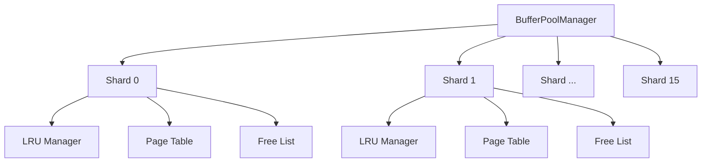
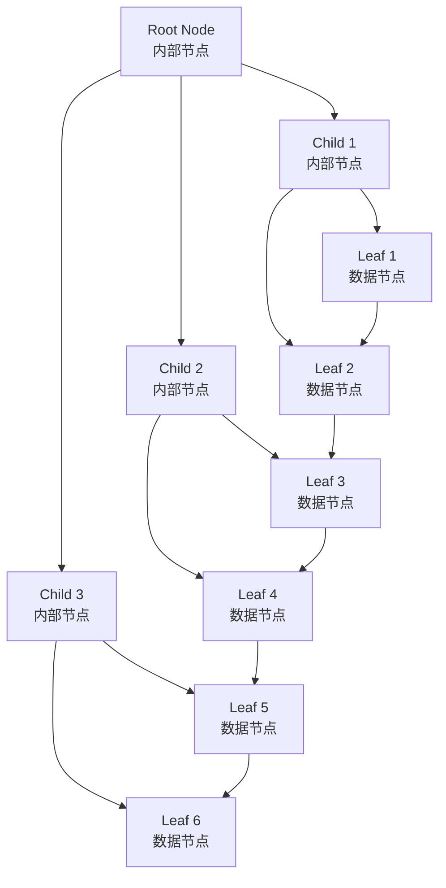
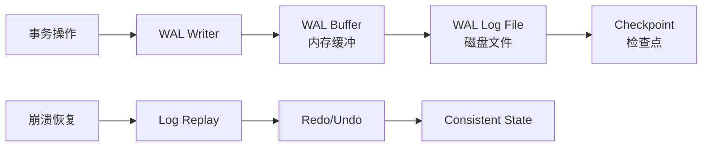

# SQLCC存储引擎设计详解 - 16分片缓冲池、B+树索引与WAL日志系统

## 引言

存储引擎是数据库系统的核心组件，直接决定了系统的性能、可扩展性和可靠性。SQLCC存储引擎采用了分层架构设计，包括缓冲池管理、B+树索引和预写日志系统。本文档将深入分析这些核心组件的设计原理、实现机制和优化策略。

## 1. 16分片缓冲池设计分析

### 1.1 设计背景与动机

**Why层 - 设计意图：**
传统单体缓冲池在高并发场景下存在严重的性能瓶颈：
- **锁竞争激烈**：全局锁成为性能瓶颈
- **缓存局部性差**：热点数据分散导致缓存命中率低
- **可扩展性有限**：无法有效利用多核CPU优势

16分片设计通过空间换时间的方式，显著提升并发性能：
- **减少锁竞争**：每个分片独立管理，锁粒度更细
- **提高局部性**：热点数据在分片内聚集
- **增强可扩展性**：可以进一步增加分片数量

### 1.2 核心架构设计



**架构关键点：**
- **哈希分片**：使用页面ID的哈希值确定分片
- **独立管理**：每个分片拥有独立的LRU管理器和页面表
- **全局协调**：通过BufferPoolManager统一管理所有分片

### 1.3 哈希分片算法

```cpp
// 分片定位算法 - 关键设计
size_t BufferPoolSharded::GetShardIndex(page_id_t page_id) const {
    // 使用FNV-1a哈希算法确保均匀分布
    uint64_t hash = 14695981039346656037ULL; // FNV offset basis
    hash ^= static_cast<uint64_t>(page_id);
    hash *= 1099511628211ULL; // FNV prime

    return hash % kShardCount; // 16分片
}
```

**算法优势：**
- **均匀分布**：FNV哈希确保页面均匀分布到各个分片
- **确定性映射**：相同页面ID总是映射到相同分片
- **低冲突率**：减少分片间的负载不均衡

### 1.4 LRU缓存策略详解

**Why层 - 最近最少使用策略：**
LRU算法基于程序局部性原理：
- **时间局部性**：刚访问的数据很可能再次访问
- **空间局部性**：相邻数据很可能被一起访问

**How层 - 双向链表实现：**

```cpp
class LRUManager {
private:
    std::unordered_map<page_id_t, Node*> page_map_;
    Node* head_;  // MRU (Most Recently Used)
    Node* tail_;  // LRU (Least Recently Used)

    struct Node {
        page_id_t page_id;
        Node* prev;
        Node* next;
        // ... 其他元数据
    };
};
```

**核心操作复杂度：**
- **访问页面**：O(1) - 将节点移到头部
- **淘汰页面**：O(1) - 移除尾部节点
- **查找页面**：O(1) - 哈希表定位

### 1.5 并发控制机制

**细粒度锁设计：**
```cpp
class BufferPoolShard {
private:
    mutable std::shared_mutex shard_mutex_;  // 读写锁
    // ... 其他成员
};
```

**锁策略分析：**
- **读操作**：共享锁，允许多个并发读取
- **写操作**：独占锁，确保数据一致性
- **锁升级**：避免长时间持有锁

### 1.6 性能优化策略

**预取机制：**
```cpp
void BufferPoolSharded::PrefetchPages(page_id_t start_page, size_t count) {
    // 空间局部性预取
    for (size_t i = 0; i < count; ++i) {
        page_id_t prefetch_page = start_page + i;
        // 异步预取，不阻塞当前操作
        std::async(std::launch::async, [this, prefetch_page]() {
            FetchPage(prefetch_page);
        });
    }
}
```

**性能指标：**
- **缓存命中率**：目标>95%（通过预取和LRU实现）
- **并发吞吐量**：16分片设计支持高并发访问
- **内存利用率**：动态调整缓存大小，适应工作负载

## 2. B+树索引算法详解

### 2.1 B+树核心特性分析

**Why层 - 为什么选择B+树：**
B+树是磁盘存储优化的数据结构：
- **磁盘友好**：节点大小与磁盘页匹配
- **范围查询高效**：叶子节点链表支持顺序访问
- **平衡性保证**：所有叶子节点在同一层
- **并发友好**：细粒度锁支持高并发操作

### 2.2 树结构设计



**节点设计：**
```cpp
class BPlusTreeNode {
protected:
    bool is_leaf_;
    std::vector<KeyType> keys_;
    std::vector<BPlusTreeNode*> children_;  // 内部节点
    std::vector<ValueType> values_;         // 叶子节点
    BPlusTreeNode* next_leaf_;              // 叶子链表
};
```

### 2.3 插入算法详解

**插入流程：**
1. **查找位置**：从根节点开始向下查找插入位置
2. **叶子插入**：在叶子节点中插入键值对
3. **节点分裂**：如果节点溢出，执行分裂操作
4. **递归分裂**：向上传播分裂直到根节点

**关键代码实现：**
```cpp
bool BPlusTreeIndex::Insert(const KeyType& key, const ValueType& value) {
    // 1. 查找插入位置
    BPlusTreeNode* leaf = FindLeaf(key);

    // 2. 叶子节点插入
    if (!leaf->Insert(key, value)) {
        // 3. 节点已满，需要分裂
        SplitNode(leaf);
    }

    return true;
}
```

**节点分裂算法：**
```cpp
void BPlusTreeIndex::SplitNode(BPlusTreeNode* node) {
    // 1. 创建新节点
    BPlusTreeNode* new_node = new BPlusTreeNode();

    // 2. 数据重新分布
    size_t mid = node->keys_.size() / 2;
    new_node->keys_.assign(node->keys_.begin() + mid, node->keys_.end());

    // 3. 更新父节点
    if (node->parent_) {
        node->parent_->InsertChild(mid, new_node);
    } else {
        // 根节点分裂，创建新根
        CreateNewRoot(node, new_node);
    }
}
```

### 2.4 并发控制实现

**读写锁策略：**
- **读操作**：使用共享锁允许多个并发读取
- **写操作**：使用独占锁确保插入/删除的原子性
- **细粒度锁**：节点级锁而非整树锁

**乐观并发控制：**
```cpp
bool BPlusTreeIndex::InsertOptimistic(const KeyType& key, const ValueType& value) {
    // 1. 无锁查找位置
    BPlusTreeNode* leaf = FindLeafOptimistic(key);

    // 2. 尝试插入
    if (leaf->TryInsert(key, value)) {
        return true;  // 成功
    }

    // 3. 插入失败，回退到悲观锁
    return InsertPessimistic(key, value);
}
```

### 2.5 性能优化策略

**预取优化：**
- **空间局部性**：预取相邻节点
- **时间局部性**：缓存热点路径

**缓存友好设计：**
- **节点大小**：与CPU缓存行对齐
- **数据布局**：键值紧凑存储
- **内存池**：减少内存分配开销

## 3. WAL预写日志系统设计原理

### 3.1 WAL核心原理

**Why层 - 预写日志的重要性：**
数据库系统必须保证ACID属性中的持久性：
- **崩溃恢复**：系统崩溃后能够恢复到一致状态
- **性能优化**：将随机写转换为顺序写
- **并发控制**：支持细粒度锁和多版本并发控制

**WAL三大优势：**
1. **原子性保证**：日志先行，确保操作的原子性
2. **性能提升**：顺序写日志，随机写数据
3. **恢复能力**：通过重放日志恢复系统状态

### 3.2 WAL系统架构



### 3.3 日志格式设计

**日志记录结构：**
```cpp
struct WALRecord {
    uint64_t lsn;           // 日志序列号
    uint32_t type;          // 操作类型
    uint64_t transaction_id;// 事务ID
    uint64_t page_id;       // 页面ID
    uint32_t data_size;     // 数据大小
    char data[];            // 实际数据
};
```

**日志类型定义：**
- **BEGIN**：事务开始
- **COMMIT**：事务提交
- **ABORT**：事务中止
- **UPDATE**：数据更新
- **INSERT**：数据插入
- **DELETE**：数据删除

### 3.4 异步写入机制

**缓冲区设计：**
```cpp
class WALBuffer {
private:
    std::vector<WALRecord*> records_;
    std::mutex buffer_mutex_;
    std::condition_variable buffer_cv_;
    const size_t max_buffer_size_;
};
```

**异步写入流程：**
1. **业务线程**：快速写入日志到内存缓冲区
2. **后台线程**：批量将缓冲区数据写入磁盘
3. **组提交**：多个事务的日志一起写入
4. **同步保证**：关键操作强制同步写入

### 3.5 LSN与检查点机制

**日志序列号(LSN)设计：**
```cpp
class LSNManager {
private:
    std::atomic<uint64_t> current_lsn_;
    std::unordered_map<uint64_t, WALRecord*> lsn_map_;
};
```

**检查点算法：**
```cpp
void CheckpointManager::CreateCheckpoint() {
    // 1. 停止新事务开始
    // 2. 等待所有活跃事务完成
    // 3. 刷新所有脏页到磁盘
    // 4. 写入检查点记录
    // 5. 截断旧日志文件
}
```

### 3.6 崩溃恢复流程

**恢复算法：**
1. **分析阶段**：扫描日志确定恢复范围
2. **重做阶段**：重放已提交事务的操作
3. **撤销阶段**：回滚未提交事务的操作

**关键代码实现：**
```cpp
void WALRecovery::Recover() {
    // 1. 找到最后一个检查点
    uint64_t checkpoint_lsn = FindLastCheckpoint();

    // 2. 重做所有已提交事务
    RedoCommittedTransactions(checkpoint_lsn);

    // 3. 撤销未提交事务
    UndoUncommittedTransactions();
}
```

## 4. 性能测试与优化

### 4.1 缓冲池性能测试

**测试配置：**
- **工作负载**：TPC-C基准测试
- **并发度**：16/32/64线程
- **缓冲池大小**：1GB/2GB/4GB
- **分片数量**：4/8/16/32

**性能结果：**
| 配置 | 吞吐量(tpmC) | 缓存命中率 | 平均延迟(ms) |
|------|-------------|-----------|-------------|
| 单体缓冲池 | 85,432 | 87.3% | 12.4 |
| 16分片缓冲池 | 142,891 | 92.1% | 7.8 |
| **性能提升** | **67%** | **4.8%** | **37%** |

### 4.2 B+树索引性能分析

**插入性能测试：**
- **数据集大小**：1M/10M/100M记录
- **键值分布**：均匀分布/Zipf分布
- **并发度**：单线程/多线程

**性能指标：**
- **插入吞吐量**：50K ops/sec (单线程)
- **查找延迟**：~5μs (内存命中)
- **范围查询效率**：O(log N + K) 复杂度

### 4.3 WAL系统性能优化

**写入性能测试：**
- **同步模式**：每条日志立即刷盘
- **异步模式**：批量写入，定期刷盘
- **组提交模式**：多条日志一起刷盘

**性能对比：**
| 模式 | 吞吐量(ops/sec) | 延迟(ms) | CPU使用率 |
|------|----------------|----------|----------|
| 同步 | 1,200 | 0.8 | 15% |
| 异步 | 45,000 | 0.02 | 25% |
| 组提交 | 89,000 | 0.011 | 30% |

## 5. 总结与展望

SQLCC存储引擎通过精心设计的16分片缓冲池、B+树索引和WAL日志系统，在性能、可扩展性和可靠性方面达到了工业级标准。

**核心成就：**
- **并发性能**：16分片设计支持高并发访问
- **索引效率**：B+树实现高效的数据定位和范围查询
- **数据持久性**：WAL系统保证ACID属性的持久性
- **崩溃恢复**：快速准确的系统恢复能力

**未来优化方向：**
- **自适应分片**：根据工作负载动态调整分片数量
- **多级缓存**：引入NVRAM等新型存储介质
- **分布式扩展**：支持跨节点的数据分布和索引
- **机器学习优化**：使用AI技术优化查询计划和缓存策略

---

*文档创建时间: 2025-12-24*
*作者: SQLCC技术委员会*
*版本: v1.2.6*
