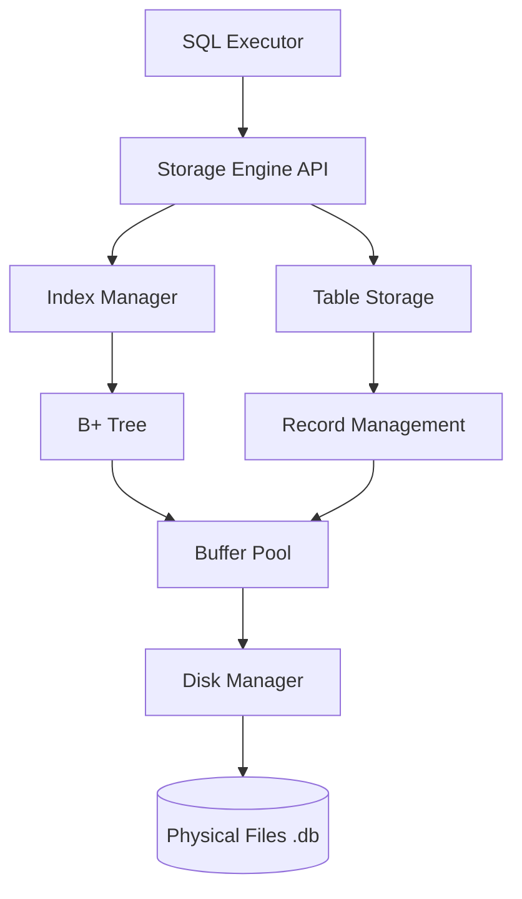

# SQLCC 存储引擎设计总览

## 1. WHY: 为什么要设计存储引擎？

存储引擎是数据库系统的底层核心，负责数据的物理存储、提取和组织。一个优秀的存储引擎需要解决以下挑战：

*   **性能瓶颈**: 磁盘 I/O 速度远慢于内存。存储引擎必须通过缓存（缓冲池）和高效的组织（索引）来最小化物理磁盘访问。
*   **可靠性**: 数据库必须保证在系统崩溃后数据不丢失，且不发生损坏。
*   **并发访问**: 多个事务可能同时读写同一份数据。存储引擎需要提供锁定机制来保证数据的一致性。
*   **空间管理**: 高效地分配和回收磁盘空间，避免碎片化。

## 2. WHAT: 存储引擎架构总览

SQLCC 的存储引擎采用了模块化的分层设计，每一层都专注于特定的职责。

### 核心架构图：

### 核心组件说明：

1.  **Disk Manager (磁盘管理器)**:
    *   负责直接与文件系统交互。
    *   将数据库文件抽象为一系列连续的 **8KB 页面 (Pages)**。
    *   处理物理页面的读取、写入、分配和回收。

2.  **Buffer Pool (缓冲池)**:
    *   数据库在内存中的“缓存”。
    *   **分片 (Sharding)**: 为了减少多线程竞争，缓冲池被拆分为多个独立的分片，每个分片有自己的锁。
    *   **替换策略**: 支持 LRU, LFU, CLOCK, ARC 等算法，决定当内存不足时淘汰哪些页面。

3.  **Page (页面)**:
    *   数据库存储的最小单位（8KB）。
    *   包含页面 ID 和原始字节数组。

4.  **Table Storage (表存储)**:
    *   定义了记录（Records）在页面内的组织方式。
    *   管理插入、删除记录后的空间空隙（Free List）。

5.  **Index Manager (索引管理器)**:
    *   管理数据库的所有 B+ 树索引。
    *   提供基于键的高效单条记录查找和范围扫描。

6.  **Advanced Lock Manager (高级锁管理器)**:
    *   提供读写锁，支持行级或页级锁定，确保事务的隔离性。

## 3. HOW: 核心工作机制

### 3.1. 页面读写流程 (FetchPage)
1.  **检查缓存**: `BufferPool` 首先检查请求的 `page_id` 是否已在内存中。
2.  **缓存命中**: 若在内存中，直接增加页面的引用计数（Pin），并返回。
3.  **缓存失效**: 若不在内存中，`BufferPool` 调用 `DiskManager` 从磁盘读取 8KB 数据。
4.  **淘汰与替换**: 若缓冲池已满，根据 `ReplaceStrategy` 选出一个牺牲页（Victim），若是脏页则写回磁盘，然后腾出空间给新页。

### 3.2. B+ 树索引机制
*   **非叶子节点**: 存储索引键和指向子页面的指针，用于导航。
*   **叶子节点**: 存储索引键和实际的数据记录（或 RID），并通过双向链表连接，支持高效的范围查询。
*   **并发安全**: 采用“螃蟹走位 (Latch Crabbing)”协议，通过在父节点和子节点上交替加锁，实现 B+ 树的高效并发操作。

### 3.3. 分页管理与分配
*   存储引擎维护一个 `PageAllocator`。
*   已删除的页面 ID 会被放入 `FreeList` 循环使用，避免数据库文件空洞无序扩张。

## 4. 关键技术特性

*   **固定 8KB 页长**: 常见的行业标准，平衡了 I/O 效率和内存碎片。
*   **内存安全**: 整个存储引擎大规模使用 `std::unique_ptr` 和 `std::shared_ptr` 管理资源，有效杜绝内存泄漏。
*   **线程安全**: 各级组件（缓冲池、磁盘管理器、索引）均通过细粒度锁保证并发正确性。
*   **配置驱动**: 缓冲池大小、分片数量、替换策略均可通过 `ConfigManager` 进行动态调整。

## 5. 未来演进方向

*   **异步 I/O (io_uring)**: 进一步提升高负载下的磁盘吞吐。
*   **直接 I/O (O_DIRECT)**: 绕过操作系统内核缓存，由数据库完全控制缓存。
*   **压缩存储**: 支持页面级别的透明压缩，节省磁盘空间。
