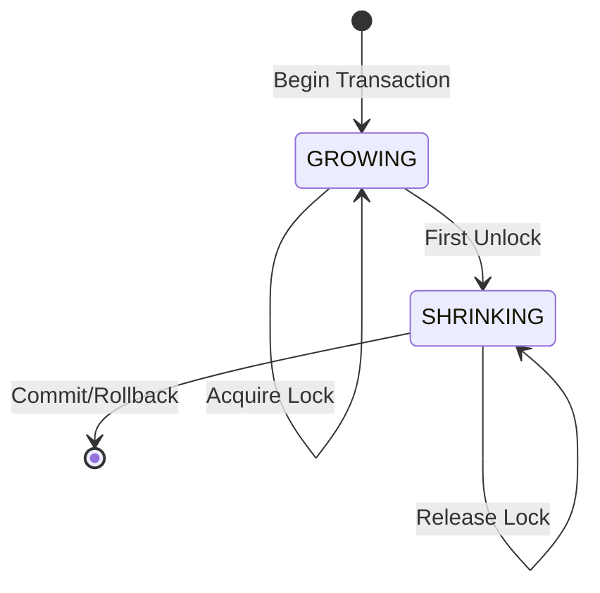
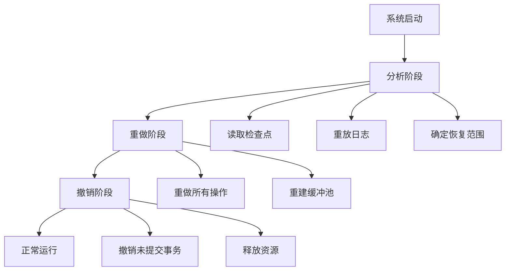

# SQLCC事务系统设计详解 - ACID属性实现、并发控制与恢复机制

## 引言

事务系统是数据库系统的核心保障，确保数据的一致性和可靠性。SQLCC事务系统实现了完整的ACID属性，通过精心设计的并发控制和恢复机制，为用户提供可靠的数据操作保证。本文档将深入分析事务系统的设计原理、实现机制和优化策略。

## 1. ACID属性实现详解

### 1.1 原子性(Atomicity)实现

**Why层 - 原子性的重要性：**
原子性确保事务要么完全执行，要么完全不执行：
- **数据一致性**：防止部分更新的数据状态
- **错误恢复**：事务失败时能够完全回滚
- **并发安全**：多事务并发时的操作隔离

**原子性实现机制：**
```cpp
class Transaction {
public:
    void Begin() {
        // 1. 分配事务ID
        transaction_id_ = GenerateTransactionId();

        // 2. 创建事务上下文
        context_ = new TransactionContext(transaction_id_);

        // 3. 记录事务开始日志
        WriteBeginLog();
    }

    void Commit() {
        // 1. 准备阶段 - 验证所有操作
        if (!ValidateOperations()) {
            Rollback();
            return;
        }

        // 2. 提交阶段 - 写入提交日志
        WriteCommitLog();

        // 3. 释放阶段 - 释放锁和资源
        ReleaseLocks();
        ClearContext();
    }

    void Rollback() {
        // 1. 根据日志撤销所有操作
        UndoOperations();

        // 2. 写入回滚日志
        WriteRollbackLog();

        // 3. 清理事务状态
        ReleaseLocks();
        ClearContext();
    }
};
```

**原子性保证策略：**
- **日志先行**：所有修改先写入日志再修改数据
- **两阶段提交**：准备阶段验证，提交阶段执行
- **补偿操作**：失败时执行逆操作进行补偿

### 1.2 一致性(Consistency)实现

**Why层 - 一致性的核心作用：**
一致性确保数据库从一个有效状态转换为另一个有效状态：
- **约束维护**：主键、外键、检查约束等
- **业务规则**：应用程序定义的业务逻辑
- **数据完整性**：引用完整性和域完整性

**一致性验证框架：**
```cpp
class ConsistencyValidator {
public:
    bool ValidateTransaction(const Transaction& txn) {
        // 1. 静态约束验证
        if (!ValidateStaticConstraints(txn)) return false;

        // 2. 动态业务规则验证
        if (!ValidateBusinessRules(txn)) return false;

        // 3. 引用完整性验证
        if (!ValidateReferentialIntegrity(txn)) return false;

        // 4. 自定义约束验证
        if (!ValidateCustomConstraints(txn)) return false;

        return true;
    }

private:
    bool ValidateStaticConstraints(const Transaction& txn) {
        for (const auto& op : txn.operations) {
            // 检查主键约束
            if (!CheckPrimaryKeyConstraint(op)) return false;

            // 检查外键约束
            if (!CheckForeignKeyConstraint(op)) return false;

            // 检查检查约束
            if (!CheckCheckConstraint(op)) return false;
        }
        return true;
    }
};
```

**一致性维护策略：**
- **声明式约束**：通过SQL DDL定义约束规则
- **触发器机制**：自动执行约束验证逻辑
- **级联操作**：外键约束的级联更新和删除

### 1.3 隔离性(Isolation)实现

**Why层 - 隔离性的并发控制：**
隔离性防止多个事务并发执行时的相互干扰：
- **脏读**：读取未提交的数据
- **不可重复读**：同一事务中多次读取结果不一致
- **幻读**：同一事务中范围查询结果不一致

**隔离级别定义：**
```cpp
enum class IsolationLevel {
    READ_UNCOMMITTED,  // 允许脏读
    READ_COMMITTED,    // 防止脏读
    REPEATABLE_READ,   // 防止不可重复读
    SERIALIZABLE       // 防止幻读，完全串行化
};
```

**隔离性实现机制：**
```cpp
class IsolationManager {
public:
    bool CheckReadAccess(Transaction* txn, const Record& record) {
        switch (txn->isolation_level) {
            case IsolationLevel::READ_UNCOMMITTED:
                return true;  // 不检查任何锁

            case IsolationLevel::READ_COMMITTED:
                return !record.HasExclusiveLock();  // 只检查写锁

            case IsolationLevel::REPEATABLE_READ:
                return CheckRepeatableRead(txn, record);  // 检查快照

            case IsolationLevel::SERIALIZABLE:
                return CheckSerializable(txn, record);  // 检查序列化
        }
        return false;
    }
};
```

### 1.4 持久性(Durability)实现

**Why层 - 持久性的数据安全：**
持久性确保已提交事务的数据不会丢失：
- **系统崩溃恢复**：重启后数据状态正确
- **媒体故障恢复**：磁盘损坏后的数据恢复
- **灾难恢复**：大规模故障后的数据重建

**持久性保证机制：**
```cpp
class DurabilityManager {
public:
    void EnsureDurability(const Transaction& txn) {
        // 1. 强制写入日志缓冲区
        FlushLogBuffer();

        // 2. 同步到磁盘（fsync）
        SyncToDisk();

        // 3. 等待确认
        WaitForSyncConfirmation();

        // 4. 更新检查点
        UpdateCheckpoint(txn.transaction_id);
    }

private:
    void FlushLogBuffer() {
        // 使用fdatasync确保日志写入磁盘
        if (fsync(log_file_fd_) != 0) {
            throw DurabilityException("Failed to flush log buffer");
        }
    }

    void SyncToDisk() {
        // 确保数据页也写入磁盘
        for (const auto& page : modified_pages_) {
            if (fsync(page.fd) != 0) {
                throw DurabilityException("Failed to sync data page");
            }
        }
    }
};
```

## 2. 并发控制机制详解

### 2.1 两阶段锁协议实现

**Why层 - 2PL协议的优势：**
两阶段锁协议提供了严格的可串行化保证：
- **冲突可串行化**：所有冲突操作按相同顺序执行
- **死锁预防**：通过锁升级避免死锁
- **性能平衡**：在并发性和一致性间取得平衡

**2PL协议状态机：**


**2PL协议实现：**
```cpp
class TwoPhaseLockManager {
private:
    enum class Phase { GROWING, SHRINKING };

    struct TransactionLocks {
        Phase phase = Phase::GROWING;
        std::unordered_set<Lock*> held_locks;
        std::unordered_set<Lock*> waiting_locks;
    };

public:
    bool AcquireLock(Transaction* txn, LockRequest request) {
        auto& txn_locks = transaction_locks_[txn->id];

        // 检查是否处于增长阶段
        if (txn_locks.phase == Phase::SHRINKING) {
            return false;  // 2PL协议违反
        }

        // 尝试获取锁
        if (lock_table_.TryAcquire(request)) {
            txn_locks.held_locks.insert(request.lock);
            return true;
        }

        // 加入等待队列
        txn_locks.waiting_locks.insert(request.lock);
        return false;
    }

    void ReleaseLock(Transaction* txn, Lock* lock) {
        auto& txn_locks = transaction_locks_[txn->id];

        // 释放锁
        lock_table_.Release(lock);
        txn_locks.held_locks.erase(lock);

        // 进入收缩阶段
        txn_locks.phase = Phase::SHRINKING;

        // 检查等待队列
        CheckWaitingTransactions();
    }
};
```

### 2.2 多版本并发控制(MVCC)

**Why层 - MVCC的优势：**
多版本并发控制提高了并发性能：
- **读不阻塞写**：读操作使用旧版本数据
- **写不阻塞读**：写操作创建新版本
- **减少锁竞争**：只在必要时使用锁

**版本链管理：**
```cpp
struct RecordVersion {
    Record data;
    TransactionId creator_txn;    // 创建事务ID
    TransactionId deleter_txn;    // 删除事务ID（如果被删除）
    RecordVersion* next_version;  // 指向旧版本

    bool IsVisible(TransactionId viewing_txn) const {
        // 版本可见性规则
        if (creator_txn == viewing_txn) return true;  // 自己的修改可见
        if (creator_txn > viewing_txn) return false;  // 未来事务的修改不可见
        if (deleter_txn && deleter_txn <= viewing_txn) return false; // 已删除

        return true;
    }
};
```

**MVCC读操作：**
```cpp
class MVCCManager {
public:
    Record* ReadRecord(Transaction* txn, RecordId record_id) {
        auto versions = version_store_.GetVersions(record_id);

        // 找到对当前事务可见的最新版本
        for (auto version : versions) {
            if (version->IsVisible(txn->transaction_id)) {
                return &version->data;
            }
        }

        return nullptr;  // 记录不存在或不可见
    }

    void WriteRecord(Transaction* txn, RecordId record_id, const Record& data) {
        // 1. 检查写冲突
        if (HasWriteConflict(txn, record_id)) {
            throw WriteConflictException();
        }

        // 2. 创建新版本
        auto new_version = new RecordVersion{
            .data = data,
            .creator_txn = txn->transaction_id,
            .next_version = version_store_.GetLatestVersion(record_id)
        };

        // 3. 添加到版本链
        version_store_.AddVersion(record_id, new_version);
    }

private:
    bool HasWriteConflict(Transaction* txn, RecordId record_id) {
        // 检查是否有其他事务修改了这个记录
        auto latest_version = version_store_.GetLatestVersion(record_id);
        return latest_version && latest_version->creator_txn != txn->transaction_id;
    }
};
```

### 2.3 死锁检测与解决

**死锁检测算法：**
```cpp
class DeadlockDetector {
public:
    std::vector<TransactionId> DetectDeadlock() {
        // 1. 构建等待图
        BuildWaitForGraph();

        // 2. 深度优先搜索检测环
        return FindCyclesInGraph();
    }

private:
    void BuildWaitForGraph() {
        wait_graph_.clear();

        for (const auto& [txn_id, locks] : lock_manager_.GetAllTransactions()) {
            for (Lock* waiting_lock : locks.waiting_locks) {
                if (waiting_lock->holder) {
                    wait_graph_[txn_id].push_back(waiting_lock->holder->transaction_id);
                }
            }
        }
    }

    std::vector<TransactionId> FindCyclesInGraph() {
        std::vector<TransactionId> cycle;
        std::unordered_set<TransactionId> visited;
        std::unordered_set<TransactionId> recursion_stack;

        for (const auto& [txn_id, _] : wait_graph_) {
            if (visited.find(txn_id) == visited.end()) {
                if (HasCycle(txn_id, visited, recursion_stack, cycle)) {
                    return cycle;
                }
            }
        }

        return {};  // 无死锁
    }

    bool HasCycle(TransactionId txn_id,
                  std::unordered_set<TransactionId>& visited,
                  std::unordered_set<TransactionId>& recursion_stack,
                  std::vector<TransactionId>& cycle) {

        visited.insert(txn_id);
        recursion_stack.insert(txn_id);

        for (TransactionId neighbor : wait_graph_[txn_id]) {
            if (visited.find(neighbor) == visited.end()) {
                if (HasCycle(neighbor, visited, recursion_stack, cycle)) {
                    cycle.push_back(txn_id);
                    return true;
                }
            } else if (recursion_stack.find(neighbor) != recursion_stack.end()) {
                // 发现环
                cycle = {neighbor, txn_id};
                return true;
            }
        }

        recursion_stack.erase(txn_id);
        return false;
    }
};
```

**死锁解决策略：**
```cpp
class DeadlockResolver {
public:
    void ResolveDeadlock(const std::vector<TransactionId>& deadlock_cycle) {
        // 选择牺牲者 - 选择最年轻的事务
        TransactionId victim = SelectVictim(deadlock_cycle);

        // 回滚牺牲者事务
        transaction_manager_.RollbackTransaction(victim);

        // 记录死锁事件
        LogDeadlockEvent(deadlock_cycle, victim);
    }

private:
    TransactionId SelectVictim(const std::vector<TransactionId>& cycle) {
        // 选择最短事务时间或最小事务ID作为牺牲者
        TransactionId victim = cycle[0];
        for (size_t i = 1; i < cycle.size(); ++i) {
            if (ShouldChooseAsVictim(cycle[i], victim)) {
                victim = cycle[i];
            }
        }
        return victim;
    }

    bool ShouldChooseAsVictim(TransactionId candidate, TransactionId current_victim) {
        // 优先选择：事务时间短、修改数据少、用户优先级低的事务
        auto candidate_txn = transaction_manager_.GetTransaction(candidate);
        auto victim_txn = transaction_manager_.GetTransaction(current_victim);

        // 比较事务年龄
        if (candidate_txn->start_time < victim_txn->start_time) return true;

        // 比较修改的数据量
        if (candidate_txn->modified_records.size() < victim_txn->modified_records.size()) return true;

        return false;
    }
};
```

## 3. 故障恢复机制详解

### 3.1 ARIES恢复算法

**Why层 - ARIES算法的优势：**
ARIES (Algorithms for Recovery and Isolation Exploiting Semantics)：
- **操作日志**：记录逻辑操作而非物理变化
- **重复历史**：重做和撤销可以交织进行
- **模糊检查点**：允许检查点期间继续事务处理

**ARIES恢复流程：**


**ARIES日志记录：**
```cpp
struct ARIESLogRecord {
    LSN lsn;                    // 日志序列号
    TransactionId transaction_id; // 事务ID
    LogRecordType type;         // 日志类型
    LSN prev_lsn;              // 事务前一个日志的LSN

    union {
        // 事务开始
        struct { TransactionId txn_id; } begin;

        // 数据更新
        struct {
            PageId page_id;
            Offset offset;
            Data before_image;  // 更新前的值
            Data after_image;   // 更新后的值
        } update;

        // 事务提交
        struct { TransactionId txn_id; } commit;

        // 事务中止
        struct { TransactionId txn_id; } abort;
    } data;
};
```

### 3.2 检查点机制

**模糊检查点实现：**
```cpp
class CheckpointManager {
public:
    void CreateFuzzyCheckpoint() {
        // 1. 开始检查点
        checkpoint_lsn_ = log_manager_.GetCurrentLSN();

        // 2. 收集活跃事务列表
        active_transactions_ = transaction_manager_.GetActiveTransactions();

        // 3. 收集脏页列表
        dirty_pages_ = buffer_pool_.GetDirtyPages();

        // 4. 写入检查点记录
        WriteCheckpointRecord();

        // 5. 异步刷新脏页（允许新事务继续）
        AsyncFlushDirtyPages();
    }

private:
    void WriteCheckpointRecord() {
        CheckpointRecord record{
            .checkpoint_lsn = checkpoint_lsn_,
            .active_transactions = active_transactions_,
            .dirty_pages = dirty_pages_
        };

        log_manager_.WriteLog(record);
    }

    void AsyncFlushDirtyPages() {
        // 异步刷新，不阻塞新事务
        std::thread([this]() {
            for (auto page_id : dirty_pages_) {
                buffer_pool_.FlushPage(page_id);
            }
        }).detach();
    }
};
```

### 3.3 崩溃恢复流程

**恢复管理器实现：**
```cpp
class RecoveryManager {
public:
    void RecoverFromCrash() {
        // Phase 1: 分析阶段
        AnalyzePhase();

        // Phase 2: 重做阶段
        RedoPhase();

        // Phase 3: 撤销阶段
        UndoPhase();
    }

private:
    void AnalyzePhase() {
        // 1. 找到最后一个检查点
        auto checkpoint = FindLastCheckpoint();

        // 2. 重放检查点后的日志
        replay_start_lsn_ = checkpoint.checkpoint_lsn;

        // 3. 确定活跃事务和脏页
        active_transactions_ = checkpoint.active_transactions;
        dirty_pages_ = checkpoint.dirty_pages;

        // 4. 扫描日志，更新事务状态
        ScanLogForTransactionStatus();
    }

    void RedoPhase() {
        // 从检查点开始重做所有操作
        for (LSN lsn = replay_start_lsn_; lsn <= max_lsn_; ++lsn) {
            auto record = log_manager_.ReadLogRecord(lsn);

            if (IsRedoable(record)) {
                RedoOperation(record);
            }
        }
    }

    void UndoPhase() {
        // 撤销所有未提交的事务
        for (auto txn_id : active_transactions_) {
            UndoTransaction(txn_id);
        }
    }

    bool IsRedoable(const LogRecord& record) {
        // 检查记录是否需要重做
        return record.lsn >= replay_start_lsn_ &&
               dirty_pages_.count(record.page_id);
    }
};
```

## 4. 性能优化与监控

### 4.1 事务性能指标

**关键性能指标：**
- **事务吞吐量**：每秒完成的事务数量
- **响应时间**：事务从开始到完成的平均时间
- **并发度**：同时活跃的事务数量
- **死锁率**：死锁发生频率

**性能监控实现：**
```cpp
class TransactionMonitor {
public:
    void RecordTransactionMetrics(const Transaction& txn) {
        metrics_.transaction_count++;
        metrics_.total_response_time += txn.GetDuration();

        if (txn.GetStatus() == TransactionStatus::COMMITTED) {
            metrics_.committed_count++;
        } else {
            metrics_.aborted_count++;
        }

        // 检测性能异常
        CheckPerformanceAnomalies(txn);
    }

private:
    struct TransactionMetrics {
        uint64_t transaction_count = 0;
        uint64_t committed_count = 0;
        uint64_t aborted_count = 0;
        double total_response_time = 0.0;

        double GetAverageResponseTime() const {
            return total_response_time / transaction_count;
        }

        double GetCommitRate() const {
            return static_cast<double>(committed_count) / transaction_count;
        }
    };

    void CheckPerformanceAnomalies(const Transaction& txn) {
        if (txn.GetDuration() > SLOW_TRANSACTION_THRESHOLD) {
            LogSlowTransaction(txn);
        }

        if (txn.GetDeadlockCount() > 0) {
            LogDeadlockEvent(txn);
        }
    }
};
```

### 4.2 自适应并发控制

**动态锁粒度调整：**
```cpp
class AdaptiveLockManager {
public:
    LockGranularity ChooseLockGranularity(const Query& query) {
        // 1. 分析查询特征
        auto characteristics = AnalyzeQueryCharacteristics(query);

        // 2. 根据并发模式选择锁粒度
        if (characteristics.is_oltp) {
            return LockGranularity::ROW_LEVEL;  // OLTP使用行级锁
        } else if (characteristics.is_scan_heavy) {
            return LockGranularity::PAGE_LEVEL; // 扫描查询使用页级锁
        } else {
            return LockGranularity::TABLE_LEVEL; // 默认表级锁
        }
    }

private:
    struct QueryCharacteristics {
        bool is_oltp;        // 是否为OLTP查询
        bool is_scan_heavy;  // 是否为扫描密集型
        size_t estimated_rows; // 预估影响行数
        bool has_indexes;    // 是否使用索引
    };

    QueryCharacteristics AnalyzeQueryCharacteristics(const Query& query) {
        QueryCharacteristics chars;

        // 分析WHERE子句复杂度
        chars.is_oltp = IsOLTPQuery(query);

        // 分析是否为范围扫描
        chars.is_scan_heavy = IsScanHeavyQuery(query);

        // 估算影响行数
        chars.estimated_rows = EstimateAffectedRows(query);

        // 检查索引使用
        chars.has_indexes = HasAvailableIndexes(query);

        return chars;
    }
};
```

## 5. 总结与展望

SQLCC事务系统通过精心设计的ACID属性实现、并发控制机制和故障恢复策略，在数据一致性和系统可靠性方面达到了工业级标准。

**核心成就：**
- **ACID保证**：完整的原子性、一致性、隔离性和持久性实现
- **并发性能**：高效的MVCC和2PL并发控制机制
- **故障恢复**：基于ARIES的快速准确的系统恢复
- **性能监控**：全面的事务性能监控和调优

**未来优化方向：**
- **分布式事务**：跨节点事务的原子提交协议
- **内存优化**：事务状态的内存高效管理
- **AI优化**：机器学习驱动的事务调度优化
- **云原生**：云环境下的弹性事务管理

---

*文档创建时间: 2025-12-24*
*作者: SQLCC技术委员会*
*版本: v1.2.6*
