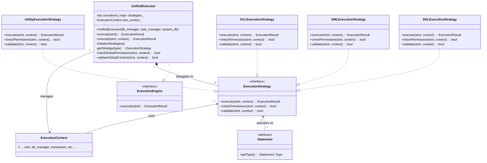

# Unified Execution Engine Design Document (Strategy Pattern)

**Document Version**: 1.0  
**Last Updated**: 2026-01-31  
**Author**: Gemini AI Agent  
**Related Files**: `src/execution/unified_executor.h`, `src/execution/unified_executor.cpp`, `src/execution/execution_engine.h`, `src/execution/ddl_execution_strategy.h`, `src/execution/dml_execution_strategy.h`, `src/sql_parser/ast/ast_nodes.h`

---

## 1. WHY: 为什么要设计统一执行引擎（策略模式）？

在数据库管理系统 (DBMS) 中，SQL 语句的种类繁多，包括数据定义语言 (DDL - `CREATE`, `DROP`), 数据操作语言 (DML - `SELECT`, `INSERT`, `UPDATE`, `DELETE`), 数据控制语言 (DCL - `GRANT`, `REVOKE`)，以及各种实用工具类语句 (Utility - `USE`, `SHOW`)。如果用一个单一的执行函数来处理所有这些不同类型的语句，将面临以下挑战：

1.  **代码膨胀与复杂性 (Code Bloat & Complexity)**：
    *   一个巨大的 `switch-case` 语句，每个 `case` 分支处理一种 SQL 语句类型，会导致函数体过于庞大，难以阅读和理解。
    *   各种语句类型的执行逻辑、权限检查、验证规则混杂在一起，使得代码变得极其复杂。
2.  **维护困难 (Maintenance Difficulty)**：
    *   修改或优化某种语句的执行逻辑可能会不小心引入其他语句的 bug。
    *   定位问题变得非常困难，因为所有逻辑都紧密耦合。
3.  **扩展性差 (Poor Extensibility)**：
    *   每当需要支持一个新的 SQL 语句类型时，都必须修改核心的执行函数，这违反了“开闭原则”（对扩展开放，对修改封闭）。
    *   新的修改有引入现有功能缺陷的风险。
4.  **责任不明 (Unclear Responsibilities)**：
    *   单个函数承担了过多的职责，从语句类型识别、权限检查、验证到实际执行，导致模块的职责界限模糊。

为了解决这些问题，我们需要一个高度解耦、可维护且易于扩展的执行引擎。**策略设计模式 (Strategy Design Pattern)** 正是为此而生。

---

## 2. WHAT: 统一执行引擎（策略模式）的核心功能和组件？

本统一执行引擎通过采用 **策略设计模式**，实现了 SQL 语句执行的高度模块化和可扩展性。

### 2.1. 核心设计原则：策略模式

策略模式允许在运行时选择算法的行为。在我们的场景中：
*   **Context (上下文)**：`UnifiedExecutor`，它持有一个 `ExecutionStrategy` 对象的引用，并委托它来执行 SQL 语句。它不直接实现算法，而是将算法的行为封装在独立的策略对象中。
*   **Strategy (策略接口)**：`ExecutionStrategy` 接口，定义了所有具体策略必须遵循的通用执行接口。
*   **Concrete Strategies (具体策略)**：实现 `ExecutionStrategy` 接口的各个具体类，每个类封装了针对特定 SQL 语句类别的执行算法。

### 2.2. 核心组件

1.  **`ExecutionStrategy` (策略接口 - `src/execution/execution_engine.h`)**：
    *   **职责**: 定义所有 SQL 执行策略必须实现的通用接口。
    *   **核心方法**:
        *   `execute(std::unique_ptr<sql_parser::Statement> stmt, ExecutionContext& context)`: 抽象方法，所有具体策略必须实现，负责实际的语句执行逻辑。
        *   `checkPermission(const sql_parser::Statement& stmt, const ExecutionContext& context)`: 负责检查当前用户是否有权限执行该语句。默认实现是允许，具体策略可以覆盖以实现特定权限。
        *   `validate(const sql_parser::Statement& stmt, const ExecutionContext& context)`: 负责验证语句的语义和上下文是否合法（例如，表是否存在，列是否匹配）。默认实现是有效，具体策略可以覆盖。
    *   **优点**: 强制统一接口，使得 `UnifiedExecutor` 可以多态地调用不同的策略。

2.  **具体策略实现 (`DDLExecutionStrategy`, `DMLExecutionStrategy`, `DCLExecutionStrategy`, `UtilityExecutionStrategy` 等)**：
    *   **职责**: 每个具体策略类负责实现 `ExecutionStrategy` 接口，并封装特定类别 SQL 语句的完整执行逻辑。
    *   **示例**:
        *   `DDLExecutionStrategy`: 处理 `CREATE DATABASE`, `CREATE TABLE`, `DROP TABLE` 等语句。
        *   `DMLExecutionStrategy`: 处理 `SELECT`, `INSERT`, `UPDATE`, `DELETE` 等语句。
        *   `DCLExecutionStrategy`: 处理 `GRANT`, `REVOKE` 等语句。
        *   `UtilityExecutionStrategy`: 处理 `USE`, `SHOW` 等语句。
    *   **优点**: 实现了**单一职责原则**。每个策略只关心自己的语句类型，代码清晰，易于维护和测试。

3.  **`UnifiedExecutor` (上下文/调度器)**：
    *   **职责**: 整个执行引擎的中心协调者。它不直接执行任何 SQL 语句，而是根据语句类型将其**调度**到对应的 `ExecutionStrategy`。
    *   **核心数据结构**: 维护一个 `std::unordered_map<sql_parser::Statement::Type, std::unique_ptr<ExecutionStrategy>> strategies_`。这个映射将解析后的 SQL 语句类型（来自 AST）与具体的执行策略对象关联起来。
    *   **执行流程**:
        1.  接收一个已解析的 `sql_parser::Statement` 对象。
        2.  根据 `Statement::Type` 查询 `strategies_` 映射，找到对应的 `ExecutionStrategy` 实例。
        3.  执行通用的前置检查（例如，全局权限、上下文验证）。
        4.  委托找到的策略执行权限检查、验证和实际执行。
    *   **优点**: 实现了**开闭原则**。要添加新的 SQL 语句类型支持，只需创建新的 `ExecutionStrategy` 子类并将其注册到 `UnifiedExecutor` 的映射中，而无需修改 `UnifiedExecutor` 的核心代码。

### 2.3. 辅助组件

*   **`ExecutionContext`**: 封装了当前 SQL 语句执行的所有上下文信息，例如当前用户、当前数据库、事务、数据库管理器引用等。它贯穿整个执行过程，传递给各个策略。
*   **`QueryOptimizer` / `ExecutionPlanGenerator`**: (概念性组件) 在 DML 语句执行时，可能会由 `DMLExecutionStrategy` 调用，用于生成高效的查询执行计划。

---

## 3. HOW: 统一执行引擎的工作流程和实现细节？

### 3.1. 初始化流程 (`UnifiedExecutor::initializeStrategies()`)

1.  **实例创建**: 在系统启动时， `UnifiedExecutor` 实例被创建。
2.  **策略注册**: `UnifiedExecutor` 的构造函数会调用 `initializeStrategies()` 方法。
3.  **填充映射**: 在 `initializeStrategies()` 内部，`strategies_` (`std::unordered_map`) 会被填充。每种 SQL 语句类型（如 `sql_parser::Statement::Type::CREATE`）都会与一个 `std::unique_ptr` 指向的 `ExecutionStrategy` 具体实现（如 `DDLExecutionStrategy` 的实例）关联起来。
    ```cpp
    // 示例: 注册DDL策略
    strategies_[sql_parser::Statement::Type::CREATE] = std::make_unique<DDLExecutionStrategy>();
    strategies_[sql_parser::Statement::Type::DROP] = std::make_unique<DDLExecutionStrategy>();
    strategies_[sql_parser::Statement::Type::ALTER] = std::make_unique<DDLExecutionStrategy>();

    // 示例: 注册DML策略
    strategies_[sql_parser::Statement::Type::SELECT] = std::make_unique<DMLExecutionStrategy>();
    // ...
    ```

### 3.2. SQL 语句执行流程 (`UnifiedExecutor::execute()`)

当收到一个 SQL 语句的解析树（`std::unique_ptr<sql_parser::Statement> stmt`）时，`UnifiedExecutor::execute()` 方法将执行以下步骤：

1.  **参数校验**: 检查传入的 `stmt` 和 `ExecutionContext` 是否为空，确保基本有效性。
2.  **全局权限检查 (`checkGlobalPermission`)**: 执行一些不依赖具体语句类型，但适用于所有操作的通用权限检查（例如，数据库是否处于维护模式，或用户是否有系统级权限）。
3.  **获取语句类型**: 从 `stmt` 对象中提取 `Statement::Type`，以确定需要哪种执行策略。
4.  **查找策略 (`getStrategy`)**: 使用 `Statement::Type` 作为键，在 `strategies_` 映射中查找对应的 `ExecutionStrategy` 对象。如果找不到，则返回错误。
5.  **策略特定检查**: 委托找到的 `ExecutionStrategy` 对象执行两项操作：
    *   `strategy->checkPermission(*stmt, *context)`: 执行该语句类型特有的权限检查（例如，用户是否有 `SELECT` 权限在 `table_name` 上）。
    *   `strategy->validate(*stmt, *context)`: 执行该语句类型特有的验证（例如，`CREATE TABLE` 语句中指定的列类型是否合法，或 `SELECT` 语句中引用的表是否存在）。
6.  **委托执行 (`strategy->execute`)**: 如果所有权限和验证检查都通过，`UnifiedExecutor` 将 `stmt` 的所有权转移给找到的 `ExecutionStrategy` 对象，并调用其 `execute` 方法。此时，具体的执行逻辑（例如，DDL 语句的元数据更新，DML 语句的数据读写）完全由策略类负责。
7.  **结果返回与记录**: `execute` 方法返回 `ExecutionResult`，`UnifiedExecutor` 记录 `last_context_` 用于监控和调试。

### 3.3. 实现要点

1.  **`std::unique_ptr` 的所有权转移**: `execute` 方法接收 `std::unique_ptr<sql_parser::Statement>` 并将其 `std::move` 到具体的策略 `execute` 方法中。这确保了语句对象的单一所有权，避免了内存管理问题，并清晰地表明了所有权转移。
2.  **`ExecutionContext` 的共享**: `ExecutionContext` 是通过引用传递给策略的，允许策略在执行过程中更新上下文信息（例如，记录受影响的行数，更新统计信息）。
3.  **DIP (依赖倒置原则)**：`UnifiedExecutor` 依赖于 `ExecutionStrategy` 抽象，而不是具体的策略实现。这使得系统更加灵活，易于替换和测试不同的执行策略。
4.  **解耦与扩展**: `UnifiedExecutor` 自身无需知道如何处理所有语句类型。添加新的语句类型（例如，新的 DCL 命令）只需要：
    *   在 `sql_parser::Statement::Type` 中定义新的枚举。
    *   创建新的 `NewStatementExecutionStrategy` 类，继承 `ExecutionStrategy`。
    *   在 `UnifiedExecutor::initializeStrategies()` 中将新的枚举映射到新的策略实例。

### 3.4. 简化的类图



---

## 4. 总结

统一执行引擎通过巧妙地运用策略设计模式，成功地将 SQL 语句的执行逻辑解耦为一系列独立的、可插拔的策略。这种设计不仅极大地提高了代码的可维护性和可扩展性，而且使得整个执行流程清晰、责任明确。对于学生而言，这是一个理解如何使用设计模式构建复杂系统，以及如何应对多变需求的典范。未来的改进可以包括更复杂的查询优化器集成、分布式执行策略等。
