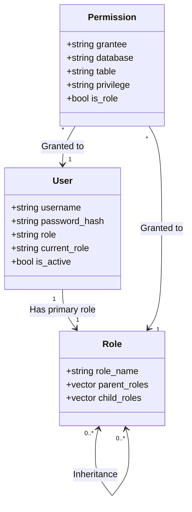

# SQLCC UserManager 设计文档

## 1. WHY: 为什么要设计 UserManager？

在多用户数据库管理系统（DBMS）中，安全性是系统的基石。`UserManager` 模块的设计旨在解决以下核心安全需求：

*   **身份验证 (Authentication)**: 确保只有合法的用户才能访问数据库。通过用户名和密码验证，防止非法闯入。
*   **权限授权 (Authorization)**: 确定用户在登录后可以执行哪些操作。不同用户应该有不同的访问级别，例如普通用户只能查询自己的数据，而管理员可以修改表结构。
*   **简化权限管理 (RBAC)**: 直接为成百上千个用户分配权限是极其低效且易错的。通过引入**基于角色的访问控制 (Role-Based Access Control)**，可以将权限赋予角色，再将角色分配给用户，从而实现高效的权限管理。
*   **数据持久化**: 用户和权限信息必须持久化存储，确保系统重启后安全配置依然有效。
*   **审计与合规**: 记录权限变更操作，满足企业级安全审计和合规性要求。

## 2. WHAT: UserManager 是什么？

`UserManager` 是 SQLCC 核心层的一个关键组件，负责管理所有与用户、角色和权限相关的元数据及其操作逻辑。

### 核心功能：
1.  **用户管理**: 创建、删除、修改密码、修改角色、身份认证。
2.  **角色管理**: 创建、删除、修改角色名，并支持复杂的**角色继承**体系。
3.  **权限管理**: 针对数据库、表级别授予或撤销特定的 SQL 权限（如 `SELECT`, `INSERT`, `CREATE` 等）。
4.  **高效权限检查**: 通过内存中的**权限矩阵**实现亚毫秒级的权限判定。
5.  **元数据同步**: 与 `SystemDatabase` 集成，将安全配置持久化到系统表中。

### 核心数据模型：

## 3. HOW: UserManager 是如何实现的？

### 3.1. 权限矩阵 (Permission Matrix)
为了避免每次 `CheckPermission` 都遍历复杂的权限列表和角色继承树，`UserManager` 维护了一个内存中的哈希表 `permission_matrix_`。

*   **Key**: `PermissionKey` (grantee, database, table, privilege)
*   **Value**: `PermissionValue` (has_permission, is_role)

这种设计将复杂的权限查找复杂度从 O(N) 降低到了 O(1)。

### 3.2. 角色继承处理
SQLCC 支持角色继承（例如 `ADMIN` 角色可以继承 `USER` 角色的所有权限）。
在进行权限检查时，如果用户的当前角色没有直接权限，`UserManager` 会采用递归或 BFS 算法向上遍历角色继承链，直到找到权限或到达根节点。

### 3.3. 安全的密码管理
*   **哈希存储**: 绝对不存储明文密码。
*   **加盐处理**: (计划中) 为每个用户生成随机盐值，防御彩虹表攻击。
*   **慢哈希算法**: 建议使用 bcrypt 或 Argon2 等计算密集型算法，增加暴力破解成本。

### 3.4. 线程安全与并发
由于 `UserManager` 是全局单例或核心共享组件，多个连接会并发进行权限检查。
*   使用 `std::mutex` 保护内部的 `unordered_map` 和 `vector`。
*   采用 `std::lock_guard` 确保在异常发生时锁能被正确释放 (RAII)。

### 3.5. 与 SystemDatabase 的解耦
`UserManager` 既可以独立运行（通过文件持久化），也可以通过 `SystemDatabase` 接口将数据存储到 `system` 数据库的 `sys_users`, `sys_roles`, `sys_privileges` 表中。这种双模式设计增加了系统的灵活性。

## 4. 关键工作流程

### 4.1. 权限检查流程 (CheckPermission)
1.  **快速路径**: 检查用户是否为 `SUPERUSER`，若是则直接通过。
2.  **直接权限**: 在权限矩阵中查找该用户在特定对象上的直接权限。
3.  **角色路径**: 获取用户当前激活角色，在矩阵中查找角色的权限。
4.  **继承路径**: 递归检查角色的父角色。
5.  **通配符检查**: 检查是否存在 `database.*` 或 `*.*` 的全局权限。

### 4.2. 用户认证流程 (AuthenticateUser)
1.  查找用户名是否存在。
2.  获取存储的 `password_hash`。
3.  对输入的明文密码应用相同的哈希算法。
4.  比较两个哈希值。

## 5. 性能优化与未来展望

*   **缓存预热**: 在系统启动时一次性加载所有权限到矩阵中。
*   **原子更新**: 权限变更时增量更新矩阵，而非全量重建。
*   **审计日志**: 集成专门的审计模块，记录每一次 `GRANT/REVOKE` 操作。