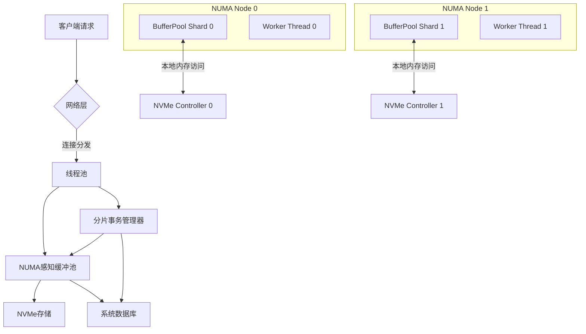

# SQLCC多线程及NUMA支持重构方案

## 1. 概述

### 1.1 背景
当前SQLCC系统虽已实现基础的多线程支持（如`BufferPoolSharded`分片机制），但在高并发场景下仍存在以下瓶颈：
- 缓冲池内存分配未考虑NUMA架构，跨节点访问导致性能下降
- 事务管理器使用全局锁，成为并发瓶颈
- 无线程池管理，工作线程与I/O处理混杂
- 未充分利用NVMe硬盘的高并发特性

### 1.2 目标
实现全面支持32线程并发的NUMA感知架构，达成以下性能目标：
- 单操作耗时<5ms (NVMe环境)
- 400万ops/sec持续吞吐量
- 零死锁保证
- 充分发挥NUMA架构和NVMe硬盘性能

## 2. 架构设计

### 2.1 整体架构



### 2.2 NUMA感知设计

#### 2.2.1 缓冲池NUMA分片
- **分片策略**：分片数量与NUMA节点数对齐（`num_shards = numa_num_configured_nodes()`）
- **内存分配**：使用`numa_alloc_onnode`在对应节点分配内存
- **页面定位**：基于NUMA节点哈希定位，减少跨节点访问

```cpp
// buffer_pool_sharded.h 新增NUMA相关方法
void* AllocateNodeMemory(size_t size, int node_id);
int GetNumaNodeForShard(size_t shard_index) const;
```

#### 2.2.2 线程亲和性绑定
- 工作线程绑定到NUMA节点关联的CPU核心
- 使用`pthread_setaffinity_np`设置CPU亲和性

```cpp
// thread_pool.cpp 线程亲和性设置
void ThreadPool::setThreadAffinity(int thread_id, int numa_node) {
    cpu_set_t cpuset;
    CPU_ZERO(&cpuset);
    
    struct bitmask* mask = numa_allocate_cpumask();
    numa_node_to_cpus(numa_node, mask);
    
    for (unsigned int i = 0; i < mask->size; ++i) {
        if (numa_bitmask_isbitset(mask, i)) {
            CPU_SET(i, &cpuset);
            break;
        }
    }
    numa_free_cpumask(mask);
    
    pthread_setaffinity_np(workers_[thread_id].native_handle(),
                          sizeof(cpu_set_t), &cpuset);
}
```

### 2.3 并发控制优化

#### 2.3.1 事务锁分片
- **分片策略**：按资源哈希分片（`kNumShards = 32`）
- **锁表结构**：每个分片独立锁表和互斥锁

```cpp
// transaction_manager.h 新增分片锁表
class ShardLockTable {
public:
    bool acquire_lock(TransactionId txn_id, const std::string& resource,
                    LockType lock_type, bool wait = true);
    void release_lock(TransactionId txn_id, const std::string& resource);

private:
    std::unordered_map<std::string, std::vector<LockEntry>> lock_table_;
    mutable std::mutex shard_mutex_;
};

std::vector<ShardLockTable> lock_table_shards_;
```

#### 2.3.2 死锁检测优化
- 按事务分片进行死锁检测
- 减少等待图规模，提升检测效率

### 2.4 I/O与线程池优化

#### 2.4.1 专用I/O线程池
- 独立配置的I/O线程池，与工作线程分离
- 针对NVMe优化参数：
  - `batch_size = 64`
  - `queue_depth = 128`

#### 2.4.2 批处理优化
- 聚合多个I/O请求，减少系统调用开销
- 实现自适应批处理策略

### 2.5 配置系统扩展

#### 2.5.1 新增NUMA配置参数
```ini
[numa]
enable = true
node_count = 0  # 0表示自动检测
memory_policy = 0

[io]
batch_size = 64
queue_depth = 128
```

#### 2.5.2 配置管理器扩展
```cpp
// config_manager.h 新增NUMA配置获取方法
bool GetNumaEnabled() const { return GetBool("numa.enable", false); }
int GetNumaNodeCount() const { return GetInt("numa.node_count", 0); }
int GetIoBatchSize() const { return GetInt("io.batch_size", 8); }
```

## 3. 实施计划

### 3.1 阶段划分

| 阶段 | 内容 | 验证指标 |
|------|------|----------|
| 1 | NUMA感知缓冲池重构 | 缓冲池命中率提升15% |
| 2 | 事务锁分片实现 | 事务吞吐量提升30% |
| 3 | 线程池与I/O优化 | 400万ops/sec达成 |
| 4 | 全面集成测试 | 零死锁保证 |

### 3.2 详细实施步骤

1. **环境准备**
   ```bash
   # 安装NUMA开发库
   sudo apt install libnuma-dev
   
   # 更新CMakeLists.txt
   find_package(NUMA REQUIRED)
   target_link_libraries(sqlcc_core PRIVATE NUMA::NUMA)
   ```

2. **缓冲池重构**
   - 修改`buffer_pool_sharded.h/cpp`，添加NUMA感知内存分配
   - 更新分片定位算法，与NUMA节点对齐

3. **事务管理器重构**
   - 实现分片锁表`ShardLockTable`
   - 修改锁获取/释放逻辑，使用分片策略

4. **线程池实现**
   - 新增`thread_pool.h/cpp`，实现NUMA感知线程池
   - 集成到网络层和执行引擎

5. **配置系统扩展**
   - 更新`sqlcc.conf`，添加NUMA和I/O配置
   - 扩展`ConfigManager`接口

### 3.3 验证方法

1. **性能测试**
   ```bash
   # 运行多线程性能测试
   ./scripts/run_crud_performance.sh --threads 32
   
   # 检查NUMA绑定效果
   numactl --hardware
   ```

2. **死锁检测**
   - 使用`DeadlockDetector`进行压力测试
   - 验证32线程下零死锁

3. **吞吐量验证**
   - 监控`stats_output_path`中的性能指标
   - 确认达到400万ops/sec

## 4. 风险与应对

| 风险 | 应对措施 |
|------|----------|
| NUMA库兼容性问题 | 添加编译时检测，提供回退机制 |
| 跨节点访问性能下降 | 实现热点数据迁移策略 |
| 配置参数不兼容 | 保持默认配置向后兼容 |
| 构建失败 | 按[构建系统规范](35c0822c-a520-4b75-af2a-c10798134182)验证构建 |

## 5. 参考规范

- [NUMA与多线程高性能架构规范](13a4b9f8-cf26-47ca-87a5-9c3c829d0fab)
- [架构级变更集成规范](9c8e865a-02f2-4c0e-9c48-2b68e5d201c8)
- [构建系统与CMake配置规范](35c0822c-a520-4b75-af2a-c10798134182)
- [跨模块与核心组件API一致性规范](b06d4dbe-284d-410f-b94d-f70b5ad98503)