# SQLCC审计功能与Undo/Redo系统设计方案

## 1. 概述

本文档设计了一套全面的数据库审计功能和完整的Undo/Redo系统，为SQLCC提供企业级的数据可追溯性和操作可恢复性。审计系统记录所有数据变更和访问行为，而Undo/Redo系统则提供事务级别的操作撤销和重做能力，确保数据的完整性和一致性。

### 1.1 设计目标

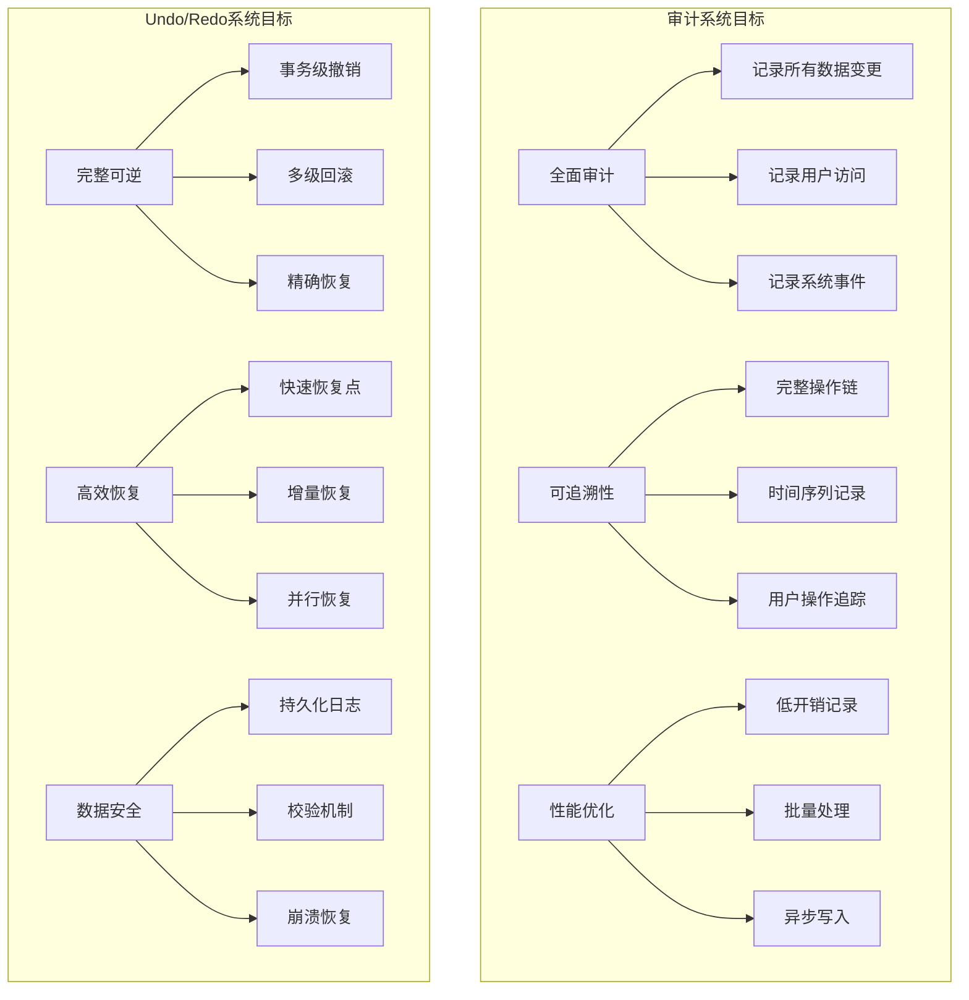
```mermaid
graph TD
    subgraph "审计系统目标"
        A[全面审计] --> A1[记录所有数据变更]
        A --> A2[记录用户访问]
        A --> A3[记录系统事件]
        
        B[可追溯性] --> B1[完整操作链]
        B --> B2[时间序列记录]
        B --> B3[用户操作追踪]
        
        C[性能优化] --> C1[低开销记录]
        C --> C2[批量处理]
        C --> C3[异步写入]
    end
    
    subgraph "Undo/Redo系统目标"
        D[完整可逆] --> D1[事务级撤销]
        D --> D2[多级回滚]
        D --> D3[精确恢复]
        
        E[高效恢复] --> E1[快速恢复点]
        E --> E2[增量恢复]
        E --> E3[并行恢复]
        
        F[数据安全] --> F1[持久化日志]
        F --> F2[校验机制]
        F --> F3[崩溃恢复]
    end
```

### 1.2 系统架构概览

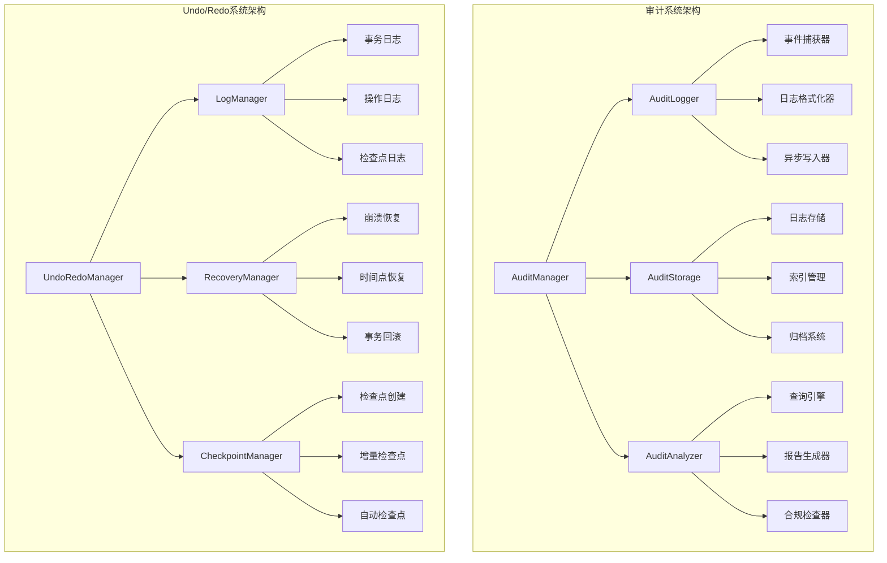
```mermaid
graph TB
    subgraph "审计系统架构"
        A[AuditManager] --> B[AuditLogger]
        A --> C[AuditStorage]
        A --> D[AuditAnalyzer]
        
        B --> B1[事件捕获器]
        B --> B2[日志格式化器]
        B --> B3[异步写入器]
        
        C --> C1[日志存储]
        C --> C2[索引管理]
        C --> C3[归档系统]
        
        D --> D1[查询引擎]
        D --> D2[报告生成器]
        D --> D3[合规检查器]
    end
    
    subgraph "Undo/Redo系统架构"
        E[UndoRedoManager] --> F[LogManager]
        E --> G[RecoveryManager]
        E --> H[CheckpointManager]
        
        F --> F1[事务日志]
        F --> F2[操作日志]
        F --> F3[检查点日志]
        
        G --> G1[崩溃恢复]
        G --> G2[时间点恢复]
        G --> G3[事务回滚]
        
        H --> H1[检查点创建]
        H --> H2[增量检查点]
        H --> H3[自动检查点]
    end
```

## 2. 审计系统设计

### 2.1 审计事件模型

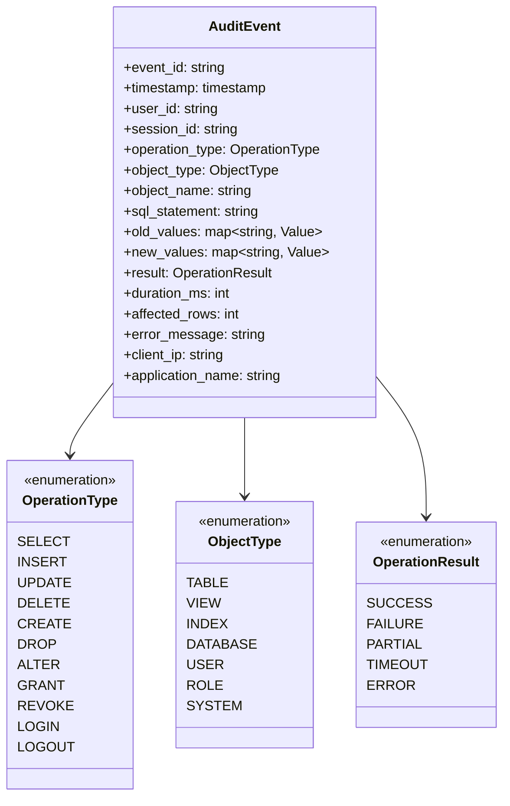
```mermaid
classDiagram
    class AuditEvent {
        +event_id: string
        +timestamp: timestamp
        +user_id: string
        +session_id: string
        +operation_type: OperationType
        +object_type: ObjectType
        +object_name: string
        +sql_statement: string
        +old_values: map~string, Value~
        +new_values: map~string, Value~
        +result: OperationResult
        +duration_ms: int
        +affected_rows: int
        +error_message: string
        +client_ip: string
        +application_name: string
    }
    
    class OperationType {
        <<enumeration>>
        SELECT
        INSERT
        UPDATE
        DELETE
        CREATE
        DROP
        ALTER
        GRANT
        REVOKE
        LOGIN
        LOGOUT
    }
    
    class ObjectType {
        <<enumeration>>
        TABLE
        VIEW
        INDEX
        DATABASE
        USER
        ROLE
        SYSTEM
    }
    
    class OperationResult {
        <<enumeration>>
        SUCCESS
        FAILURE
        PARTIAL
        TIMEOUT
        ERROR
    }
    
    AuditEvent --> OperationType
    AuditEvent --> ObjectType
    AuditEvent --> OperationResult
```

### 2.2 审计捕获器设计

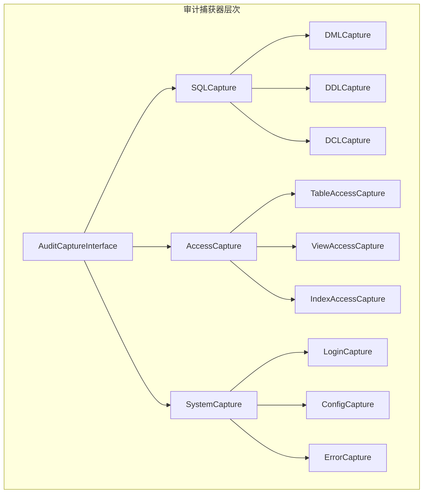
```mermaid
graph TD
    subgraph "审计捕获器层次"
        A[AuditCaptureInterface] --> B[SQLCapture]
        A --> C[AccessCapture]
        A --> D[SystemCapture]
        
        B --> B1[DMLCapture]
        B --> B2[DDLCapture]
        B --> B3[DCLCapture]
        
        C --> C1[TableAccessCapture]
        C --> C2[ViewAccessCapture]
        C --> C3[IndexAccessCapture]
        
        D --> D1[LoginCapture]
        D --> D2[ConfigCapture]
        D --> D3[ErrorCapture]
    end
```

### 2.3 审计存储系统

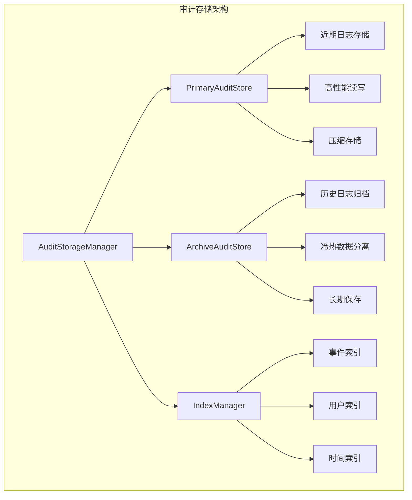
```mermaid
graph TD
    subgraph "审计存储架构"
        A[AuditStorageManager] --> B[PrimaryAuditStore]
        A --> C[ArchiveAuditStore]
        A --> D[IndexManager]
        
        B --> B1[近期日志存储]
        B --> B2[高性能读写]
        B --> B3[压缩存储]
        
        C --> C1[历史日志归档]
        C --> C2[冷热数据分离]
        C --> C3[长期保存]
        
        D --> D1[事件索引]
        D --> D2[用户索引]
        D --> D3[时间索引]
    end
```

### 2.4 审计查询与分析

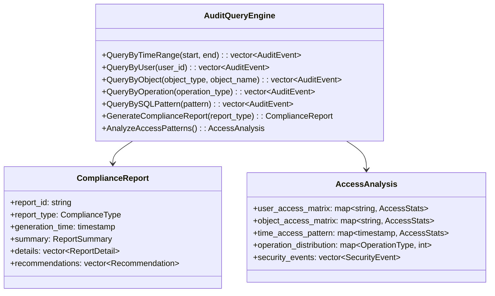
```mermaid
classDiagram
    class AuditQueryEngine {
        +QueryByTimeRange(start, end): vector~AuditEvent~
        +QueryByUser(user_id): vector~AuditEvent~
        +QueryByObject(object_type, object_name): vector~AuditEvent~
        +QueryByOperation(operation_type): vector~AuditEvent~
        +QueryBySQLPattern(pattern): vector~AuditEvent~
        +GenerateComplianceReport(report_type): ComplianceReport
        +AnalyzeAccessPatterns(): AccessAnalysis
    }
    
    class ComplianceReport {
        +report_id: string
        +report_type: ComplianceType
        +generation_time: timestamp
        +summary: ReportSummary
        +details: vector~ReportDetail~
        +recommendations: vector~Recommendation~
    }
    
    class AccessAnalysis {
        +user_access_matrix: map~string, AccessStats~
        +object_access_matrix: map~string, AccessStats~
        +time_access_pattern: map~timestamp, AccessStats~
        +operation_distribution: map~OperationType, int~
        +security_events: vector~SecurityEvent~
    }
    
    AuditQueryEngine --> ComplianceReport
    AuditQueryEngine --> AccessAnalysis
```

## 3. Undo/Redo系统设计

### 3.1 日志系统架构

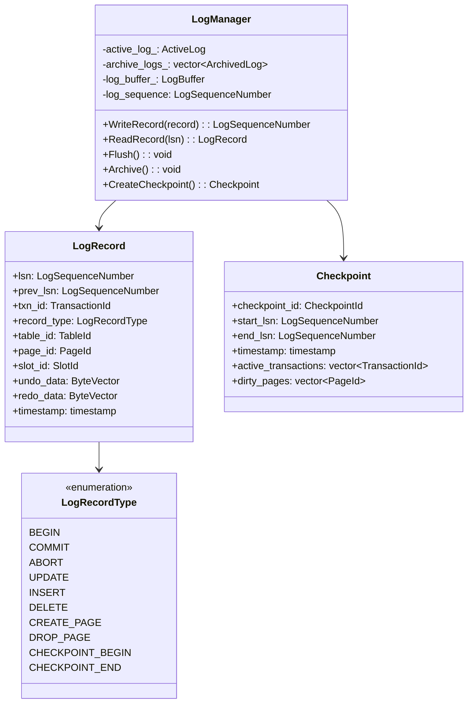
```mermaid
classDiagram
    class LogManager {
        -active_log_: ActiveLog
        -archive_logs_: vector~ArchivedLog~
        -log_buffer_: LogBuffer
        -log_sequence: LogSequenceNumber
        +WriteRecord(record): LogSequenceNumber
        +ReadRecord(lsn): LogRecord
        +Flush(): void
        +Archive(): void
        +CreateCheckpoint(): Checkpoint
    }
    
    class LogRecord {
        +lsn: LogSequenceNumber
        +prev_lsn: LogSequenceNumber
        +txn_id: TransactionId
        +record_type: LogRecordType
        +table_id: TableId
        +page_id: PageId
        +slot_id: SlotId
        +undo_data: ByteVector
        +redo_data: ByteVector
        +timestamp: timestamp
    }
    
    class LogRecordType {
        <<enumeration>>
        BEGIN
        COMMIT
        ABORT
        UPDATE
        INSERT
        DELETE
        CREATE_PAGE
        DROP_PAGE
        CHECKPOINT_BEGIN
        CHECKPOINT_END
    }
    
    class Checkpoint {
        +checkpoint_id: CheckpointId
        +start_lsn: LogSequenceNumber
        +end_lsn: LogSequenceNumber
        +timestamp: timestamp
        +active_transactions: vector~TransactionId~
        +dirty_pages: vector~PageId~
    }
    
    LogManager --> LogRecord
    LogRecord --> LogRecordType
    LogManager --> Checkpoint
```

### 3.2 完整Undo/Redo实现

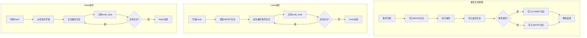
```mermaid
graph TD
    subgraph "事务生命周期"
        A[事务开始] --> B[写入BEGIN日志]
        B --> C[执行操作]
        C --> D[写入操作日志]
        D --> E{事务提交?}
        E -->|是| F[写入COMMIT日志]
        E -->|否| G[写入ABORT日志]
        F --> H[释放资源]
        G --> H
    end
    
    subgraph "Undo操作"
        I[开始Undo] --> J[读取ABORT日志]
        J --> K[逆向遍历事务日志]
        K --> L[应用undo_data]
        L --> M{还有日志?}
        M -->|是| K
        M -->|否| N[Undo完成]
    end
    
    subgraph "Redo操作"
        O[开始Redo] --> P[从检查点开始]
        P --> Q[正向遍历日志]
        Q --> R[应用redo_data]
        R --> S{还有日志?}
        S -->|是| Q
        S -->|否| T[Redo完成]
    end
```

### 3.3 崩溃恢复机制

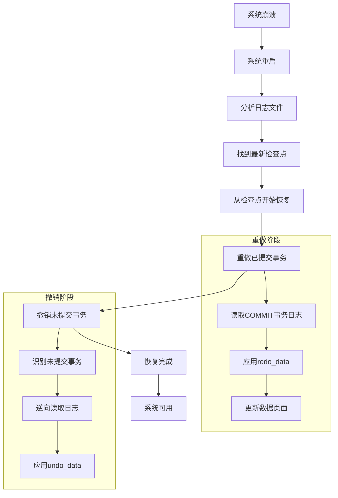
```mermaid
graph TD
    A[系统崩溃] --> B[系统重启]
    B --> C[分析日志文件]
    C --> D[找到最新检查点]
    D --> E[从检查点开始恢复]
    E --> F[重做已提交事务]
    F --> G[撤销未提交事务]
    G --> H[恢复完成]
    H --> I[系统可用]
    
    subgraph "重做阶段"
        F --> F1[读取COMMIT事务日志]
        F1 --> F2[应用redo_data]
        F2 --> F3[更新数据页面]
    end
    
    subgraph "撤销阶段"
        G --> G1[识别未提交事务]
        G1 --> G2[逆向读取日志]
        G2 --> G3[应用undo_data]
    end
```

### 3.4 时间点恢复

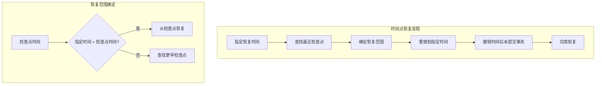
```mermaid
graph TD
    subgraph "时间点恢复流程"
        A[指定恢复时间] --> B[查找最近检查点]
        B --> C[确定恢复范围]
        C --> D[重做到指定时间]
        D --> E[撤销时间后未提交事务]
        E --> F[完成恢复]
    end
    
    subgraph "恢复范围确定"
        G[检查点时间] --> G1{指定时间 > 检查点时间?}
        G1 -->|是| H[从检查点恢复]
        G1 -->|否| I[查找更早检查点]
    end
```

## 4. 集成设计

### 4.1 审计与Undo/Redo集成

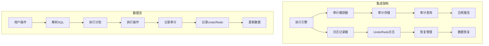
```mermaid
graph TD
    subgraph "集成架构"
        A[执行引擎] --> B[审计捕获器]
        A --> C[日志记录器]
        
        B --> D[审计存储]
        C --> E[Undo/Redo日志]
        
        D --> F[审计查询]
        E --> G[恢复管理]
        
        F --> H[合规报告]
        G --> I[数据恢复]
    end
    
    subgraph "数据流"
        J[用户操作] --> K[解析SQL]
        K --> L[执行计划]
        L --> M[执行操作]
        M --> N[记录审计]
        N --> O[记录Undo/Redo]
        O --> P[更新数据]
    end
```

### 4.2 性能优化策略

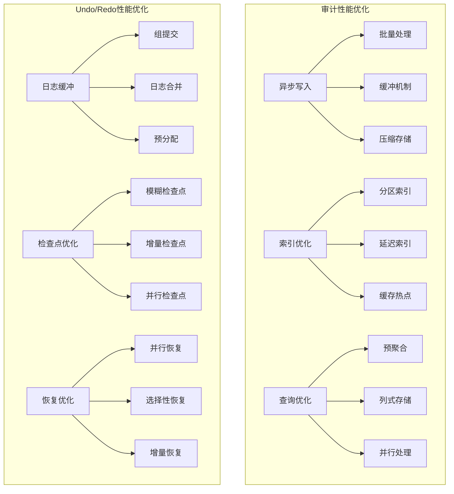
```mermaid
graph TD
    subgraph "审计性能优化"
        A[异步写入] --> A1[批量处理]
        A --> A2[缓冲机制]
        A --> A3[压缩存储]
        
        B[索引优化] --> B1[分区索引]
        B --> B2[延迟索引]
        B --> B3[缓存热点]
        
        C[查询优化] --> C1[预聚合]
        C --> C2[列式存储]
        C --> C3[并行处理]
    end
    
    subgraph "Undo/Redo性能优化"
        D[日志缓冲] --> D1[组提交]
        D --> D2[日志合并]
        D --> D3[预分配]
        
        E[检查点优化] --> E1[模糊检查点]
        E --> E2[增量检查点]
        E --> E3[并行检查点]
        
        F[恢复优化] --> F1[并行恢复]
        F --> F2[选择性恢复]
        F --> F3[增量恢复]
    end
```

## 5. 实施计划

### 5.1 审计系统实施

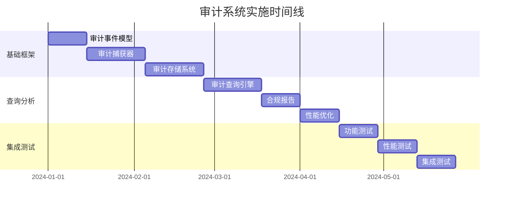
```mermaid
gantt
    title 审计系统实施时间线
    dateFormat  YYYY-MM-DD
    section 基础框架
    审计事件模型       :audit1, 2024-01-01, 2w
    审计捕获器        :audit2, after audit1, 3w
    审计存储系统       :audit3, after audit2, 3w
    
    section 查询分析
    审计查询引擎       :audit4, after audit3, 3w
    合规报告          :audit5, after audit4, 2w
    性能优化          :audit6, after audit5, 2w
    
    section 集成测试
    功能测试          :audit7, after audit6, 2w
    性能测试          :audit8, after audit7, 2w
    集成测试          :audit9, after audit8, 2w
```

### 5.2 Undo/Redo系统实施

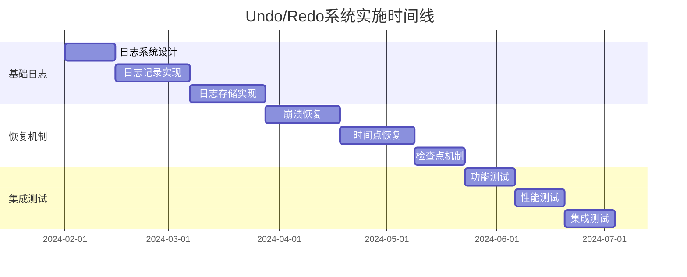
```mermaid
gantt
    title Undo/Redo系统实施时间线
    dateFormat  YYYY-MM-DD
    section 基础日志
    日志系统设计        :redo1, 2024-02-01, 2w
    日志记录实现        :redo2, after redo1, 3w
    日志存储实现        :redo3, after redo2, 3w
    
    section 恢复机制
    崩溃恢复          :redo4, after redo3, 3w
    时间点恢复         :redo5, after redo4, 3w
    检查点机制         :redo6, after redo5, 2w
    
    section 集成测试
    功能测试          :redo7, after redo6, 2w
    性能测试          :redo8, after redo7, 2w
    集成测试          :redo9, after redo8, 2w
```

## 6. 性能影响与优化

### 6.1 性能影响分析

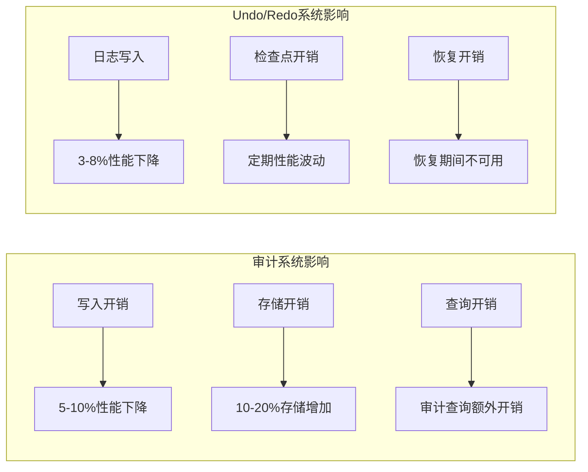
```mermaid
graph LR
    subgraph "审计系统影响"
        A[写入开销] --> A1[5-10%性能下降]
        B[存储开销] --> B1[10-20%存储增加]
        C[查询开销] --> C1[审计查询额外开销]
    end
    
    subgraph "Undo/Redo系统影响"
        D[日志写入] --> D1[3-8%性能下降]
        E[检查点开销] --> E2[定期性能波动]
        F[恢复开销] --> F1[恢复期间不可用]
    end
```

### 6.2 优化策略

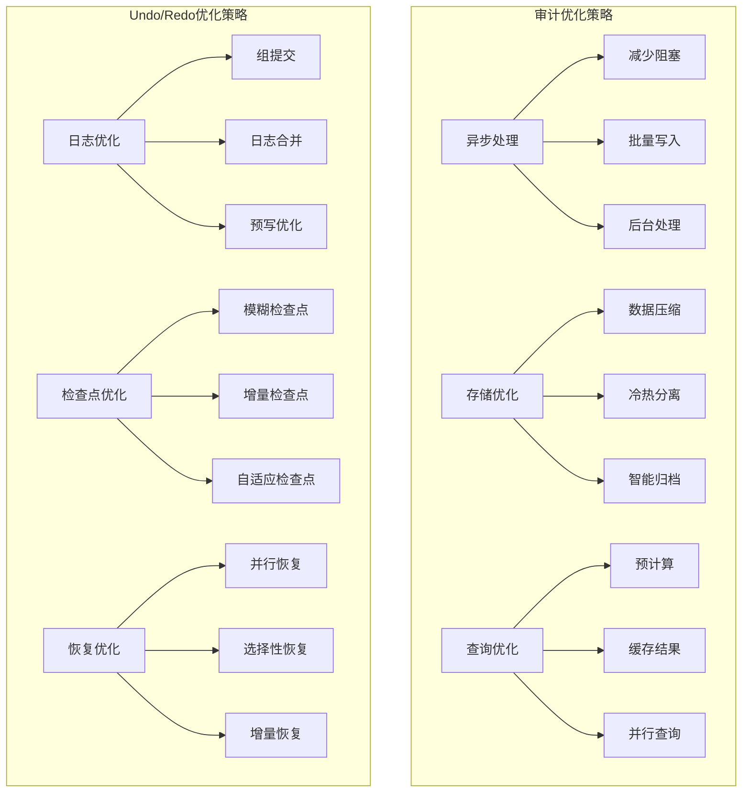
```mermaid
graph TD
    subgraph "审计优化策略"
        A[异步处理] --> A1[减少阻塞]
        A --> A2[批量写入]
        A --> A3[后台处理]
        
        B[存储优化] --> B1[数据压缩]
        B --> B2[冷热分离]
        B --> B3[智能归档]
        
        C[查询优化] --> C1[预计算]
        C --> C2[缓存结果]
        C --> C3[并行查询]
    end
    
    subgraph "Undo/Redo优化策略"
        D[日志优化] --> D1[组提交]
        D --> D2[日志合并]
        D --> D3[预写优化]
        
        E[检查点优化] --> E1[模糊检查点]
        E --> E2[增量检查点]
        E --> E3[自适应检查点]
        
        F[恢复优化] --> F1[并行恢复]
        F --> F2[选择性恢复]
        F --> F3[增量恢复]
    end
```

## 7. 应用场景

### 7.1 审计应用场景

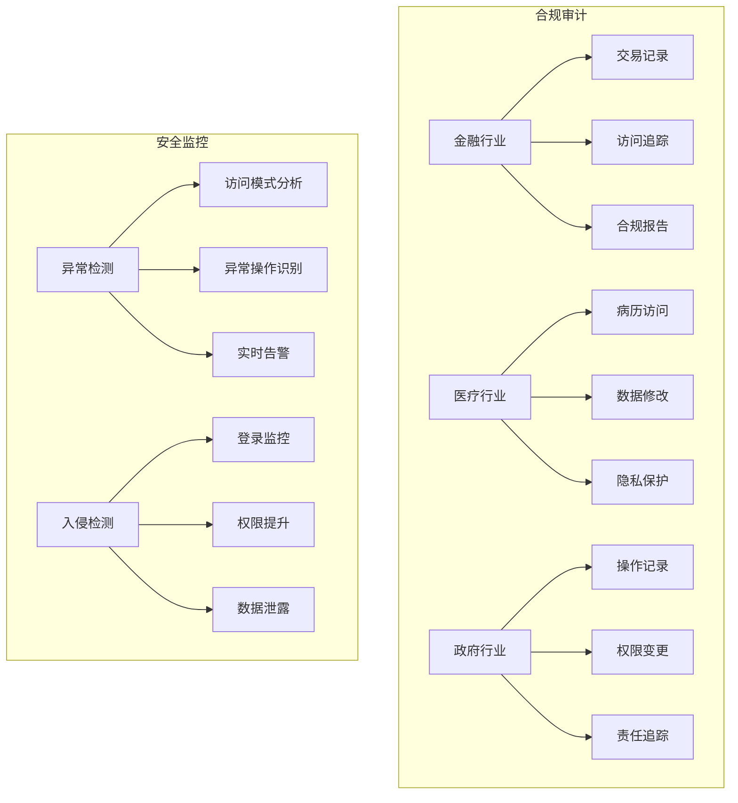
```mermaid
graph TD
    subgraph "合规审计"
        A[金融行业] --> A1[交易记录]
        A --> A2[访问追踪]
        A --> A3[合规报告]
        
        B[医疗行业] --> B1[病历访问]
        B --> B2[数据修改]
        B --> B3[隐私保护]
        
        C[政府行业] --> C1[操作记录]
        C --> C2[权限变更]
        C --> C3[责任追踪]
    end
    
    subgraph "安全监控"
        D[异常检测] --> D1[访问模式分析]
        D --> D2[异常操作识别]
        D --> D3[实时告警]
        
        E[入侵检测] --> E1[登录监控]
        E --> E2[权限提升]
        E --> E3[数据泄露]
    end
```

### 7.2 Undo/Redo应用场景

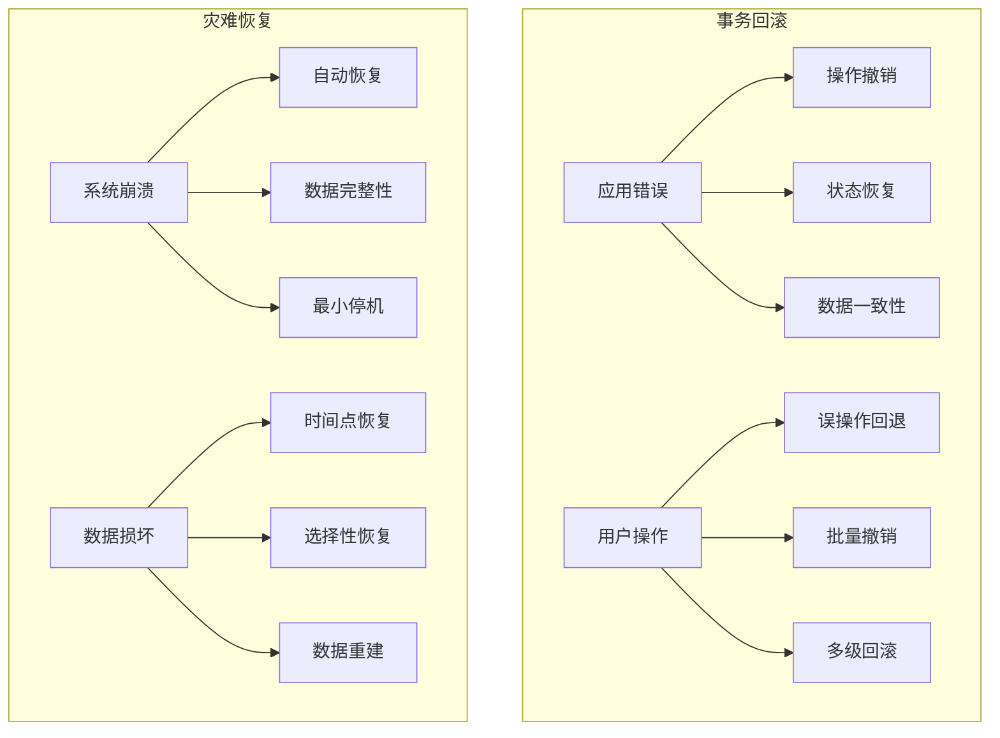
```mermaid
graph TD
    subgraph "事务回滚"
        A[应用错误] --> A1[操作撤销]
        A --> A2[状态恢复]
        A --> A3[数据一致性]
        
        B[用户操作] --> B1[误操作回退]
        B --> B2[批量撤销]
        B --> B3[多级回滚]
    end
    
    subgraph "灾难恢复"
        C[系统崩溃] --> C1[自动恢复]
        C --> C2[数据完整性]
        C --> C3[最小停机]
        
        D[数据损坏] --> D1[时间点恢复]
        D --> D2[选择性恢复]
        D --> D3[数据重建]
    end
```

## 8. 总结与建议

### 8.1 实施建议

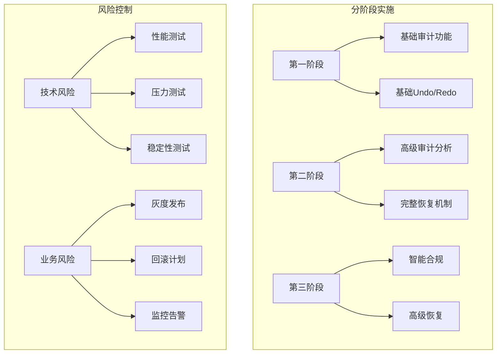
```mermaid
graph TD
    subgraph "分阶段实施"
        A[第一阶段] --> A1[基础审计功能]
        A --> A2[基础Undo/Redo]
        
        B[第二阶段] --> B1[高级审计分析]
        B --> B2[完整恢复机制]
        
        C[第三阶段] --> C1[智能合规]
        C --> C2[高级恢复]
    end
    
    subgraph "风险控制"
        D[技术风险] --> D1[性能测试]
        D --> D2[压力测试]
        D --> D3[稳定性测试]
        
        E[业务风险] --> E1[灰度发布]
        E --> E2[回滚计划]
        E --> E3[监控告警]
    end
```

### 8.2 预期收益

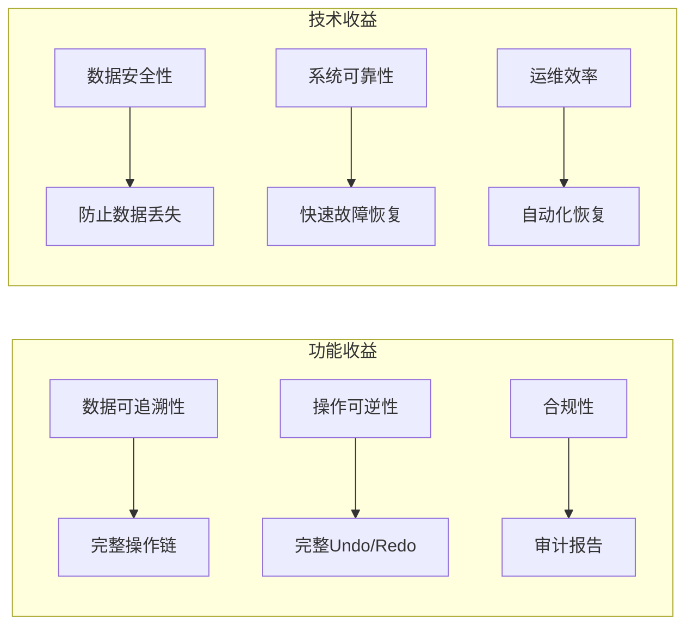
```mermaid
graph LR
    subgraph "功能收益"
        A[数据可追溯性] --> A1[完整操作链]
        B[操作可逆性] --> B1[完整Undo/Redo]
        C[合规性] --> C1[审计报告]
    end
    
    subgraph "技术收益"
        D[数据安全性] --> D1[防止数据丢失]
        E[系统可靠性] --> E1[快速故障恢复]
        F[运维效率] --> F1[自动化恢复]
    end
```

## 9. 结论

本设计方案提供了完整的数据库审计功能和Undo/Redo系统，使SQLCC具备企业级的数据可追溯性和操作可恢复性。审计系统可以记录所有数据变更和访问行为，满足不同行业的合规要求；Undo/Redo系统则提供完整的事务级撤销和重做能力，确保数据的完整性和一致性。

通过分阶段实施和性能优化策略，可以在保证功能完整性的同时，最小化对系统性能的影响，使SQLCC成为一个安全、可靠、可追溯的数据库系统。