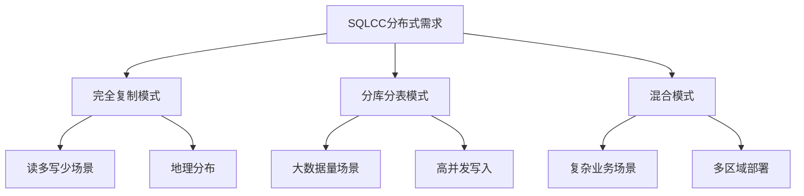
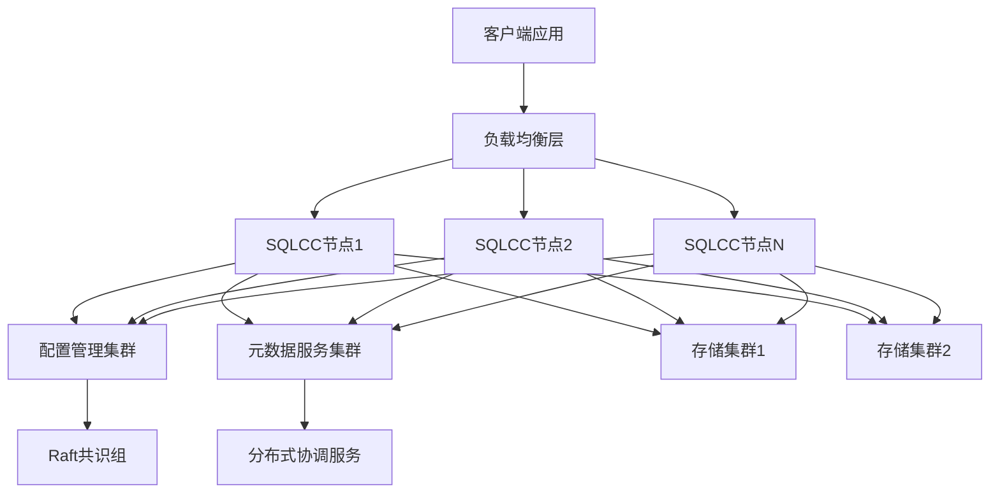
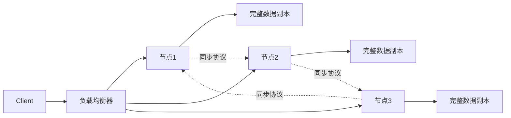
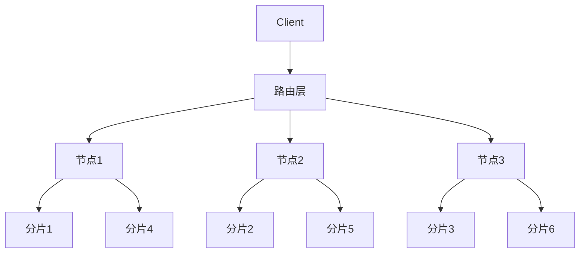
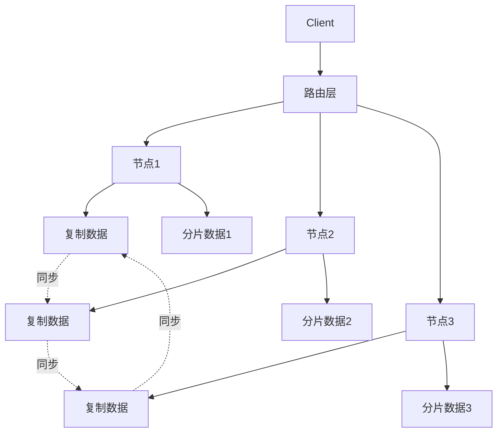
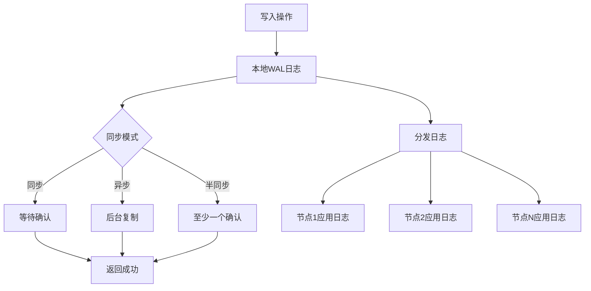

# SQLCC分布式架构设计方案

## 概述

本文档提出SQLCC分布式版本的改进方案，重点解决多个数据库节点之间的自动同步、分库分表和自动协作问题。通过分析业界主流分布式数据库解决方案，为SQLCC设计一套可扩展的分布式架构。

## 1. 分布式数据库需求分析

### 1.1 核心需求
1. **自动数据同步**：多个数据库节点之间自动同步数据和元数据
2. **灵活部署模式**：支持完全复制、分库分表、混合模式等多种部署方案
3. **高可用性**：节点故障时自动恢复和切换
4. **一致性保障**：根据应用场景提供不同级别的一致性保证
5. **透明扩展**：对应用层尽可能透明地扩展

### 1.2 部署场景分析


## 2. 业界分布式数据库解决方案分析

### 2.1 主流解决方案

#### 2.1.1 MySQL Group Replication
- **架构特点**：基于Paxos协议的多主复制，支持插件式一致性级别
- **同步机制**：全局事务序号(GTID)确保事务全局顺序
- **故障处理**：自动检测节点故障，自动重组集群

#### 2.1.2 PostgreSQL的流复制与逻辑复制
- **物理复制**：基于WAL的流复制，实现主从热备
- **逻辑复制**：支持表级订阅/发布，实现部分数据同步
- **集群方案**：Patroni+etcd实现高可用集群

#### 2.1.3 TiDB架构
- **分层架构**：TiDB(SQL层) + TiKV(存储层) + Placement Driver(PD)
- **分布式事务**：基于Percolator模型的2PC事务
- **自动数据分布**：基于Region的自动数据分片与负载均衡

#### 2.1.4 CockroachDB架构
- **一致性协议**：基于Raft保证分布式一致性
- **自动分片**：范围分片与自动重平衡
- **分布式事务**：分布式ACID事务支持

### 2.2 SQLCC可借鉴的设计点

1. **共识协议应用**：采用Raft协议保证元数据一致性与配置变更
2. **日志即数据**：借鉴WAL/LSM思想，使用日志作为核心数据结构
3. **混合时钟**：结合物理时钟与逻辑时钟解决分布式环境下的事件排序
4. **多级缓存**：结合本地缓存与分布式缓存提升性能

## 3. SQLCC分布式架构设计

### 3.1 整体架构



### 3.2 核心组件设计

#### 3.2.1 分布式协调服务
```cpp
/**
 * @brief 分布式协调服务接口
 * 
 * 提供节点发现、配置管理、领导者选举等分布式协调功能
 */
class DistributedCoordinator {
public:
    /**
     * @brief 初始化协调服务
     * @param cluster_config 集群配置
     * @param node_id 本节点ID
     */
    virtual bool Initialize(const ClusterConfig& cluster_config, 
                           const std::string& node_id) = 0;
    
    /**
     * @brief 注册节点
     * @param node_info 节点信息
     */
    virtual bool RegisterNode(const NodeInfo& node_info) = 0;
    
    /**
     * @brief 发现活跃节点
     * @return 活跃节点列表
     */
    virtual std::vector<NodeInfo> DiscoverActiveNodes() = 0;
    
    /**
     * @brief 创建分布式锁
     * @param lock_path 锁路径
     * @return 锁对象
     */
    virtual std::unique_ptr<DistributedLock> CreateLock(const std::string& lock_path) = 0;
    
    /**
     * @brief 监听配置变更
     * @param callback 变更回调
     */
    virtual bool WatchConfigChange(std::function<void(const ClusterConfig&)> callback) = 0;
    
    /**
     * @brief 创建分布式队列
     * @param queue_path 队列路径
     * @return 队列对象
     */
    virtual std::unique_ptr<DistributedQueue> CreateQueue(const std::string& queue_path) = 0;
};
```

#### 3.2.2 元数据管理服务
```cpp
/**
 * @brief 分布式元数据管理器
 * 
 * 管理数据库对象元信息、数据分片策略、节点拓扑等
 */
class DistributedMetadataManager {
public:
    /**
     * @brief 创建数据库
     * @param db_name 数据库名称
     * @param replication_mode 复制模式
     * @return 是否成功
     */
    virtual bool CreateDatabase(const std::string& db_name, 
                               ReplicationMode replication_mode) = 0;
    
    /**
     * @brief 创建表
     * @param db_name 数据库名称
     * @param table_info 表信息
     * @param shard_strategy 分片策略
     * @return 是否成功
     */
    virtual bool CreateTable(const std::string& db_name,
                           const TableInfo& table_info,
                           const ShardStrategy& shard_strategy) = 0;
    
    /**
     * @brief 获取表分片信息
     * @param db_name 数据库名称
     * @param table_name 表名称
     * @return 分片信息列表
     */
    virtual std::vector<ShardInfo> GetTableShards(const std::string& db_name,
                                                 const std::string& table_name) = 0;
    
    /**
     * @brief 获取数据分布节点
     * @param shard_id 分片ID
     * @return 节点信息列表
     */
    virtual std::vector<NodeInfo> GetShardNodes(const ShardId& shard_id) = 0;
    
    /**
     * @brief 更新分片路由
     * @param shard_id 分片ID
     * @param new_nodes 新节点列表
     * @return 是否成功
     */
    virtual bool UpdateShardRouting(const ShardId& shard_id,
                                   const std::vector<NodeInfo>& new_nodes) = 0;
};
```

#### 3.2.3 分布式事务管理器
```cpp
/**
 * @brief 分布式事务管理器
 * 
 * 协调跨节点事务，支持两阶段提交和乐观并发控制
 */
class DistributedTransactionManager {
public:
    /**
     * @brief 开始分布式事务
     * @param isolation_level 隔离级别
     * @return 事务ID
     */
    virtual TransactionId BeginTransaction(IsolationLevel isolation_level) = 0;
    
    /**
     * @brief 在指定节点上准备事务
     * @param txn_id 事务ID
     * @param node_ids 节点ID列表
     * @return 是否成功
     */
    virtual bool PrepareTransaction(TransactionId txn_id, 
                                 const std::vector<NodeId>& node_ids) = 0;
    
    /**
     * @brief 提交分布式事务
     * @param txn_id 事务ID
     * @return 是否成功
     */
    virtual bool CommitTransaction(TransactionId txn_id) = 0;
    
    /**
     * @brief 回滚分布式事务
     * @param txn_id 事务ID
     * @return 是否成功
     */
    virtual bool RollbackTransaction(TransactionId txn_id) = 0;
    
    /**
     * @brief 添加事务参与节点
     * @param txn_id 事务ID
     * @param node_id 节点ID
     * @return 是否成功
     */
    virtual bool AddParticipant(TransactionId txn_id, const NodeId& node_id) = 0;
};
```

#### 3.2.4 数据同步服务
```cpp
/**
 * @brief 数据同步服务接口
 * 
 * 支持多种同步模式：同步复制、异步复制、半同步复制
 */
class DataSyncService {
public:
    /**
     * @brief 配置复制源
     * @param source_node 源节点信息
     * @param sync_mode 同步模式
     * @return 是否成功
     */
    virtual bool ConfigureReplicationSource(const NodeInfo& source_node,
                                          SyncMode sync_mode) = 0;
    
    /**
     * @brief 添加复制目标
     * @param target_node 目标节点信息
     * @return 是否成功
     */
    virtual bool AddReplicationTarget(const NodeInfo& target_node) = 0;
    
    /**
     * @brief 同步特定数据
     * @param db_name 数据库名称
     * @param table_name 表名称
     * @param sync_options 同步选项
     * @return 是否成功
     */
    virtual bool SyncData(const std::string& db_name,
                         const std::string& table_name,
                         const SyncOptions& sync_options) = 0;
    
    /**
     * @brief 获取同步状态
     * @param target_node 目标节点
     * @return 同步状态
     */
    virtual SyncStatus GetSyncStatus(const NodeInfo& target_node) = 0;
    
    /**
     * @brief 处理同步冲突
     * @param conflict 冲突信息
     * @param resolution 解决方案
     * @return 是否成功
     */
    virtual bool ResolveSyncConflict(const DataConflict& conflict,
                                   const ConflictResolution& resolution) = 0;
};
```

## 4. 分布式部署模式实现

### 4.1 完全复制模式

在完全复制模式下，所有节点存储完整数据副本，适合读多写少场景。



实现方案：
```cpp
class FullReplicationStrategy : public ReplicationStrategy {
public:
    bool ExecuteOperation(const Operation& operation) override {
        // 1. 在本地执行操作
        auto result = ExecuteLocal(operation);
        
        // 2. 根据同步模式决定是否需要等待其他节点确认
        if (sync_mode_ == SyncMode::SYNC) {
            // 同步复制：等待大多数节点确认
            return ReplicateSync(operation);
        } else if (sync_mode_ == SyncMode::ASYNC) {
            // 异步复制：本地执行成功即返回，后台异步复制
            ReplicateAsync(operation);
            return result;
        } else { // SEMI_SYNC
            // 半同步复制：等待至少一个备份节点确认
            return ReplicateSemiSync(operation);
        }
    }
    
private:
    bool ReplicateSync(const Operation& operation);
    bool ReplicateSemiSync(const Operation& operation);
    void ReplicateAsync(const Operation& operation);
    
    SyncMode sync_mode_;
    std::unique_ptr<DistributedCoordinator> coordinator_;
};
```

### 4.2 分库分表模式

在分库分表模式下，数据按特定策略分布在多个节点上，适合大数据量场景。



实现方案：
```cpp
class ShardingStrategy : public ReplicationStrategy {
public:
    bool ExecuteOperation(const Operation& operation) override {
        // 1. 确定操作涉及的分片
        auto affected_shards = DetermineAffectedShards(operation);
        
        // 2. 根据分片位置将操作路由到对应节点
        std::vector<std::future<OperationResult>> futures;
        for (const auto& shard : affected_shards) {
            auto node_id = GetNodeForShard(shard.id);
            futures.push_back(AsyncExecuteOnNode(node_id, operation));
        }
        
        // 3. 等待所有操作完成
        std::vector<OperationResult> results;
        for (auto& future : futures) {
            results.push_back(future.get());
        }
        
        // 4. 聚合结果
        return AggregateResults(results);
    }
    
private:
    std::vector<ShardInfo> DetermineAffectedShards(const Operation& operation);
    NodeId GetNodeForShard(const ShardId& shard_id);
    OperationResult AggregateResults(const std::vector<OperationResult>& results);
};
```

### 4.3 混合模式

混合模式结合完全复制和分库分表的特点，对关键数据进行完全复制，对大容量数据进行分片。



实现方案：
```cpp
class HybridStrategy : public ReplicationStrategy {
public:
    bool ExecuteOperation(const Operation& operation) override {
        // 1. 根据操作类型确定策略
        if (IsReplicationTable(operation.table_name)) {
            // 复制表：使用完全复制策略
            return replication_strategy_->ExecuteOperation(operation);
        } else {
            // 分片表：使用分片策略
            return sharding_strategy_->ExecuteOperation(operation);
        }
    }
    
private:
    bool IsReplicationTable(const std::string& table_name);
    
    std::unique_ptr<FullReplicationStrategy> replication_strategy_;
    std::unique_ptr<ShardingStrategy> sharding_strategy_;
};
```

## 5. 自动同步机制实现

### 5.1 基于日志的同步



核心日志同步组件：
```cpp
class LogReplicationManager {
public:
    /**
     * @brief 写入本地日志
     * @param log_entry 日志条目
     * @return 日志序号
     */
    LogSequenceNumber AppendLog(const LogEntry& log_entry);
    
    /**
     * @brief 复制日志到其他节点
     * @param lsn 日志序号
     * @param target_nodes 目标节点列表
     * @return 复制结果
     */
    std::vector<ReplicationResult> ReplicateLog(
        LogSequenceNumber lsn, 
        const std::vector<NodeId>& target_nodes);
    
    /**
     * @brief 应用远程日志
     * @param log_entry 日志条目
     * @return 应用结果
     */
    bool ApplyRemoteLog(const LogEntry& log_entry);
    
    /**
     * @brief 获取已同步状态
     * @param node_id 节点ID
     * @return 已同步的日志序号
     */
    LogSequenceNumber GetSyncedLsn(const NodeId& node_id);
    
private:
    std::unique_ptr<WriteAheadLog> local_wal_;
    std::unique_ptr<ReplicationProtocol> replication_protocol_;
};
```

### 5.2 冲突检测与解决

```cpp
class ConflictResolver {
public:
    /**
     * @brief 检测冲突
     * @param local_changes 本地变更
     * @param remote_changes 远程变更
     * @return 冲突列表
     */
    std::vector<DataConflict> DetectConflicts(
        const std::vector<ChangeRecord>& local_changes,
        const std::vector<ChangeRecord>& remote_changes);
    
    /**
     * @brief 解决冲突
     * @param conflicts 冲突列表
     * @param resolution 解决策略
     * @return 解决后的数据
     */
    std::vector<ChangeRecord> ResolveConflicts(
        const std::vector<DataConflict>& conflicts,
        const ConflictResolutionStrategy& resolution);
    
private:
    // 基于时间戳的冲突解决
    std::vector<ChangeRecord> ResolveByTimestamp(
        const std::vector<DataConflict>& conflicts);
    
    // 基于优先级的冲突解决
    std::vector<ChangeRecord> ResolveByPriority(
        const std::vector<DataConflict>& conflicts);
    
    // 基于业务规则的冲突解决
    std::vector<ChangeRecord> ResolveByBusinessRules(
        const std::vector<DataConflict>& conflicts);
};
```

## 6. SQLCC集成方案

### 6.1 现有架构扩展

基于现有的SQLCC架构，扩展支持分布式功能：

```cpp
/**
 * @brief 分布式数据库管理器
 * 
 * 扩展原有DatabaseManager以支持分布式功能
 */
class DistributedDatabaseManager : public DatabaseManager {
public:
    /**
     * @brief 构造函数
     * @param config 分布式配置
     */
    DistributedDatabaseManager(const DistributedConfig& config);
    
    /**
     * @brief 加入集群
     * @param cluster_info 集群信息
     * @return 是否成功
     */
    bool JoinCluster(const ClusterInfo& cluster_info);
    
    /**
     * @brief 创建分布式数据库
     * @param db_name 数据库名称
     * @param replication_mode 复制模式
     * @return 是否成功
     */
    bool CreateDistributedDatabase(const std::string& db_name, 
                                  ReplicationMode replication_mode) override;
    
    /**
     * @brief 创建分布式表
     * @param table_name 表名称
     * @param columns 列定义
     * @param shard_strategy 分片策略
     * @return 是否成功
     */
    bool CreateDistributedTable(const std::string& table_name,
                               const std::vector<std::pair<std::string, std::string>>& columns,
                               const ShardStrategy& shard_strategy);
    
    /**
     * @brief 执行分布式查询
     * @param query SQL查询
     * @return 查询结果
     */
    std::unique_ptr<ResultSet> ExecuteDistributedQuery(const std::string& query);
    
private:
    std::unique_ptr<DistributedCoordinator> coordinator_;
    std::unique_ptr<DistributedMetadataManager> metadata_manager_;
    std::unique_ptr<DistributedTransactionManager> txn_manager_;
    std::unique_ptr<DataSyncService> sync_service_;
    
    std::unique_ptr<ReplicationStrategy> replication_strategy_;
};
```

### 6.2 查询路由与执行

```cpp
/**
 * @brief 分布式查询执行器
 */
class DistributedQueryExecutor {
public:
    /**
     * @brief 执行查询
     * @param query 解析后的查询
     * @return 查询结果
     */
    std::unique_ptr<ResultSet> Execute(const std::shared_ptr<QueryPlan> query);
    
private:
    /**
     * @brief 生成执行计划
     * @param query 查询
     * @return 执行计划
     */
    std::shared_ptr<DistributedExecutionPlan> CreateExecutionPlan(
        const std::shared_ptr<QueryPlan> query);
    
    /**
     * @brief 执行子查询
     * @param sub_plan 子执行计划
     * @return 子查询结果
     */
    std::unique_ptr<ResultSet> ExecuteSubquery(
        const std::shared_ptr<SubExecutionPlan> sub_plan);
};
```

## 7. 实施计划

### 7.1 第一阶段：基础分布式框架
1. 实现分布式协调服务基础功能
2. 实现节点发现与心跳机制
3. 实现基础元数据管理

### 7.2 第二阶段：数据同步
1. 实现基于日志的同步机制
2. 实现冲突检测与解决
3. 支持完全复制模式

### 7.3 第三阶段：分片支持
1. 实现数据分片算法
2. 实现分布式查询路由
3. 实现跨节点事务协调

### 7.4 第四阶段：高可用与优化
1. 实现自动故障检测与恢复
2. 实现数据自动重平衡
3. 性能优化与监控

## 8. 总结

SQLCC分布式架构采用模块化设计，能够支持多种部署模式和同步策略，满足不同应用场景的需求。通过借鉴业界成熟的分布式数据库设计，结合SQLCC现有的架构特点，可以构建出一套功能完备、高可用的分布式数据库系统。

关键优势：
1. **灵活的部署模式**：支持完全复制、分库分表和混合模式
2. **自动同步机制**：基于日志的同步，支持多种同步模式
3. **强一致性保障**：基于Raft的分布式一致性协议
4. **高可用性**：自动故障检测与恢复
5. **透明扩展**：对应用层尽可能透明的扩展能力

通过分阶段实施，可以逐步增强SQLCC的分布式能力，最终实现一个功能完备的分布式数据库系统。