# SQLCC性能优化设计方案

## 1. 性能瓶颈分析

### 1.1 当前架构瓶颈

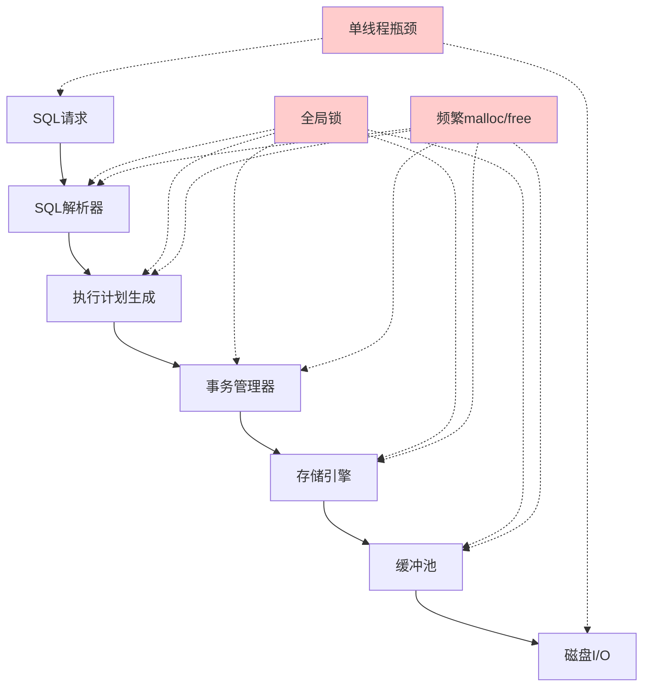

### 1.2 性能差距根源

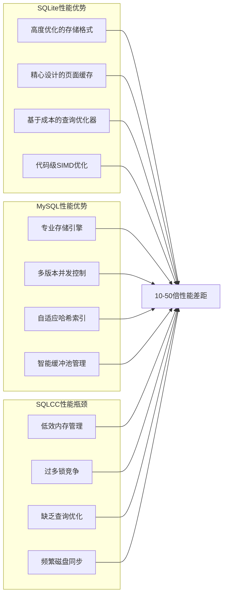

## 2. 内存管理优化方案

### 2.1 专用内存池设计

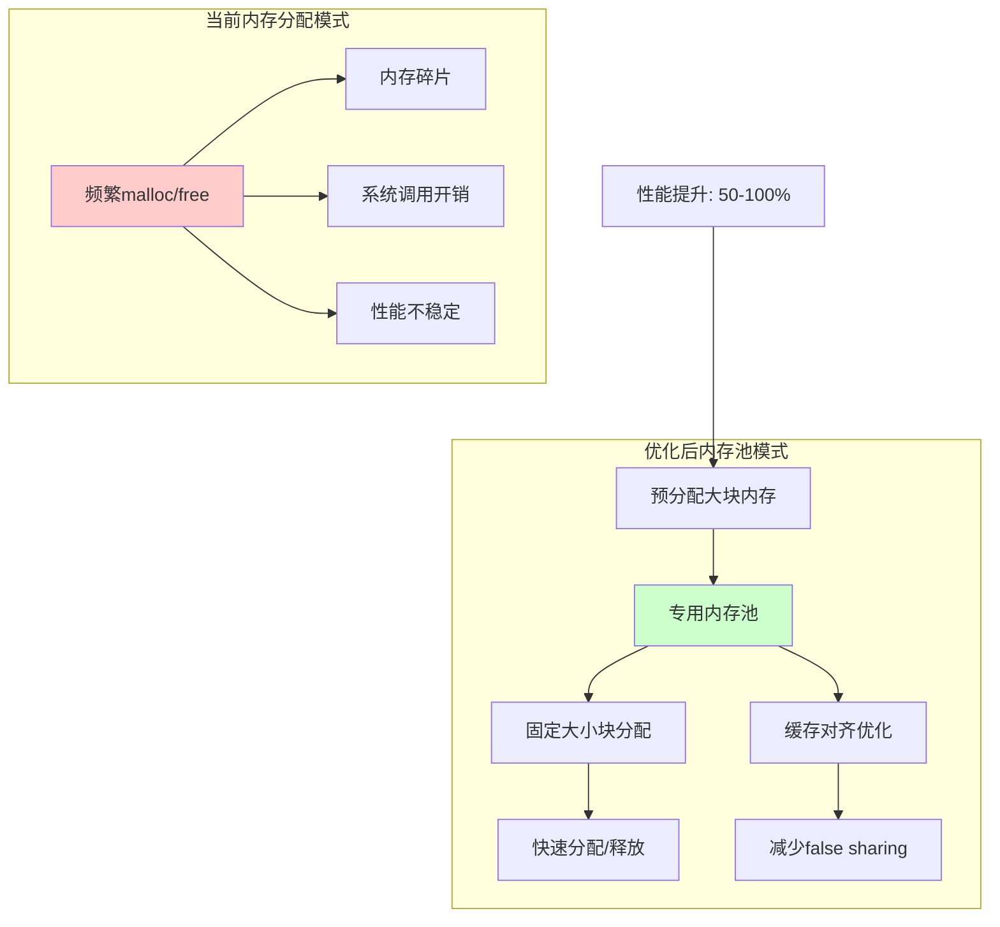

### 2.2 缓冲池分片优化

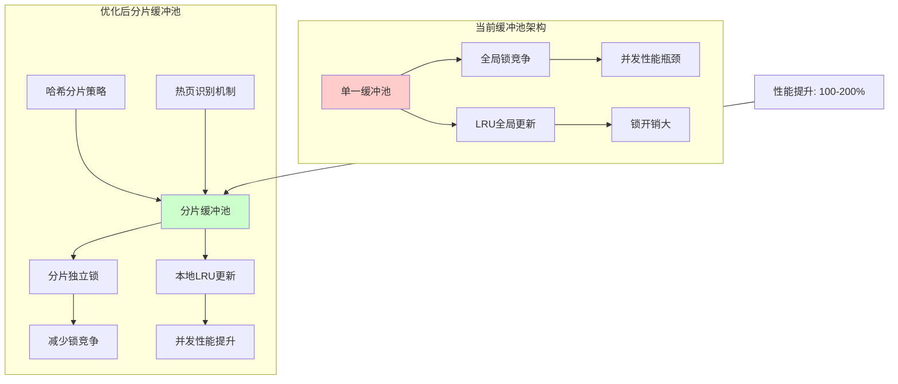

## 3. 锁优化方案

### 3.1 细粒度锁设计

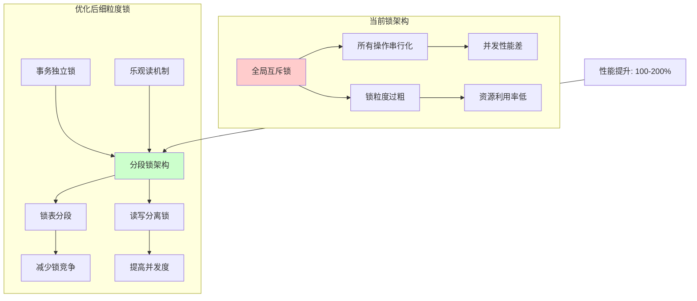

### 3.2 锁竞争热图分析

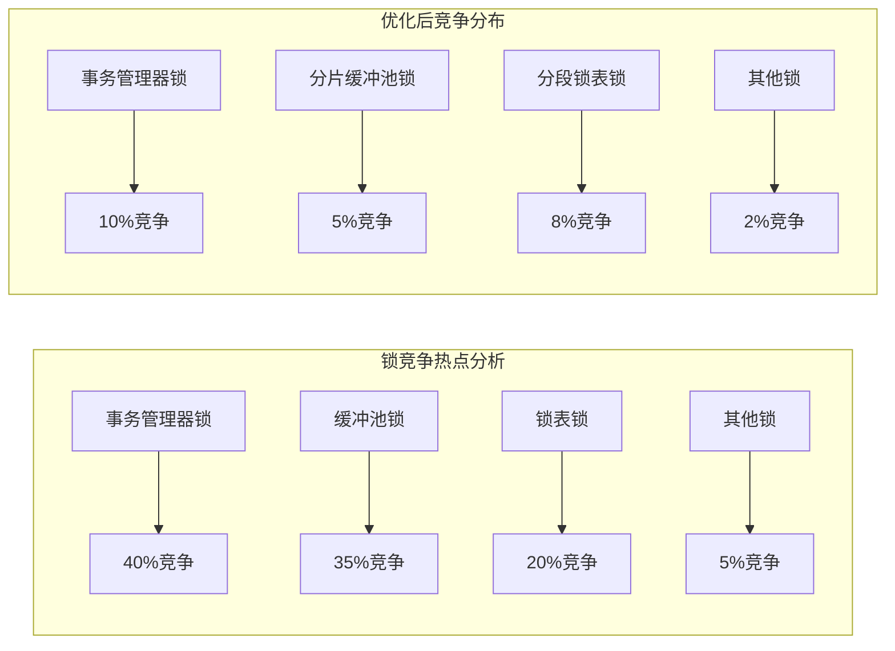

## 4. 查询优化方案

### 4.1 查询优化器架构

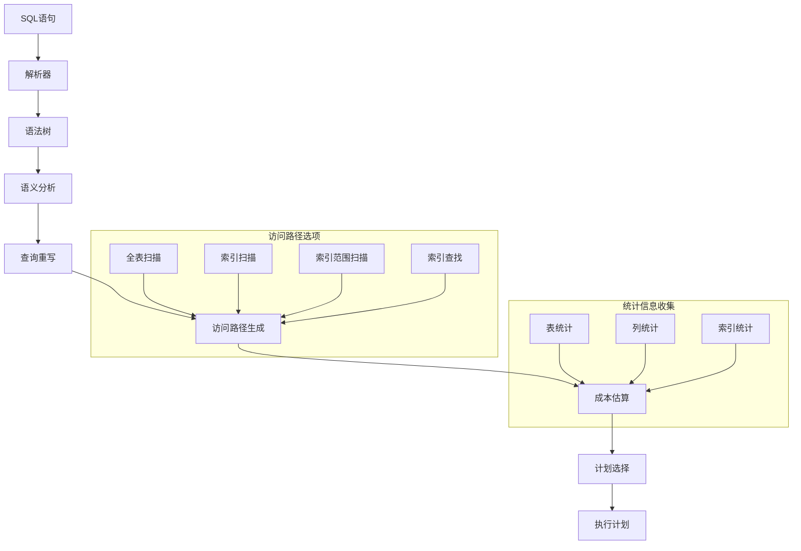

### 4.2 预编译语句设计

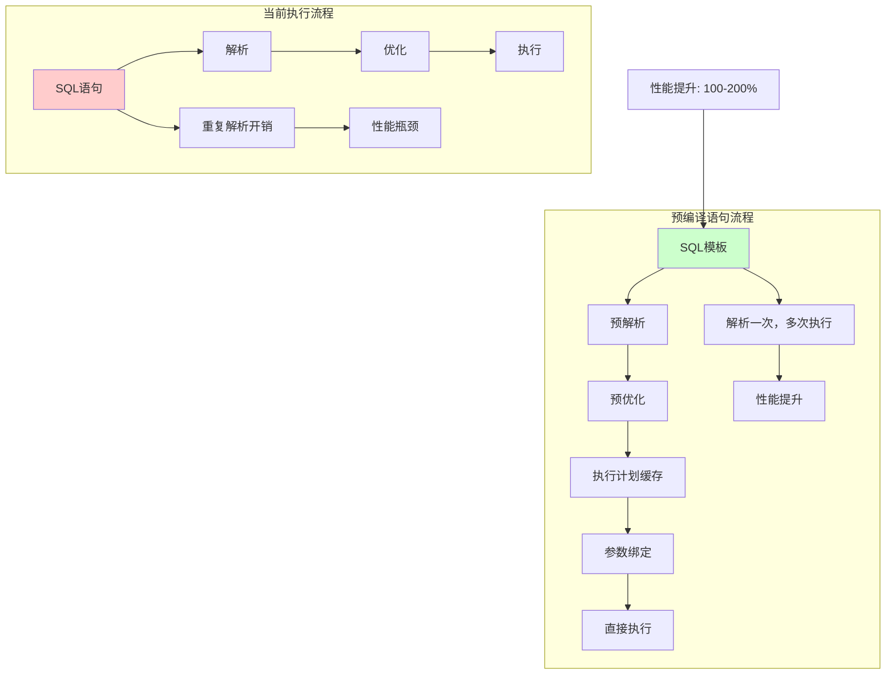

## 5. 存储引擎优化方案

### 5.1 WAL批量写入设计

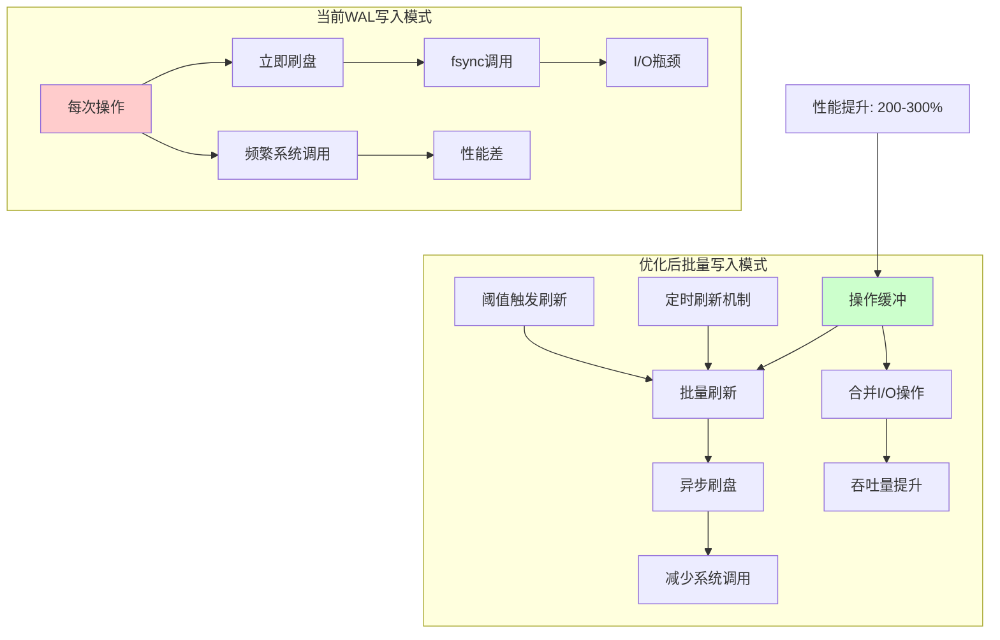

### 5.2 智能缓冲池替换策略

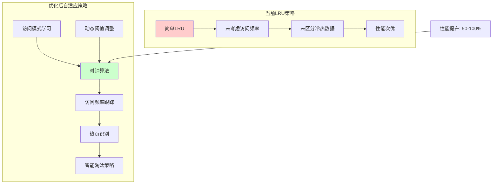

## 6. 并发控制优化方案

### 6.1 MVCC设计架构

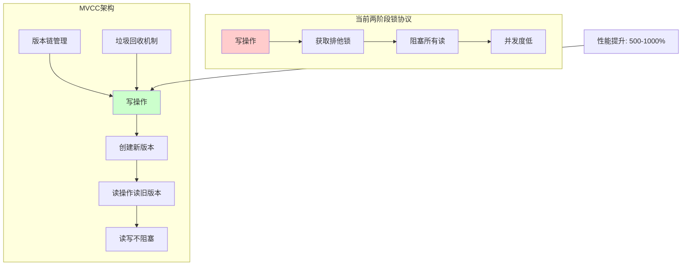

### 6.2 并发性能对比

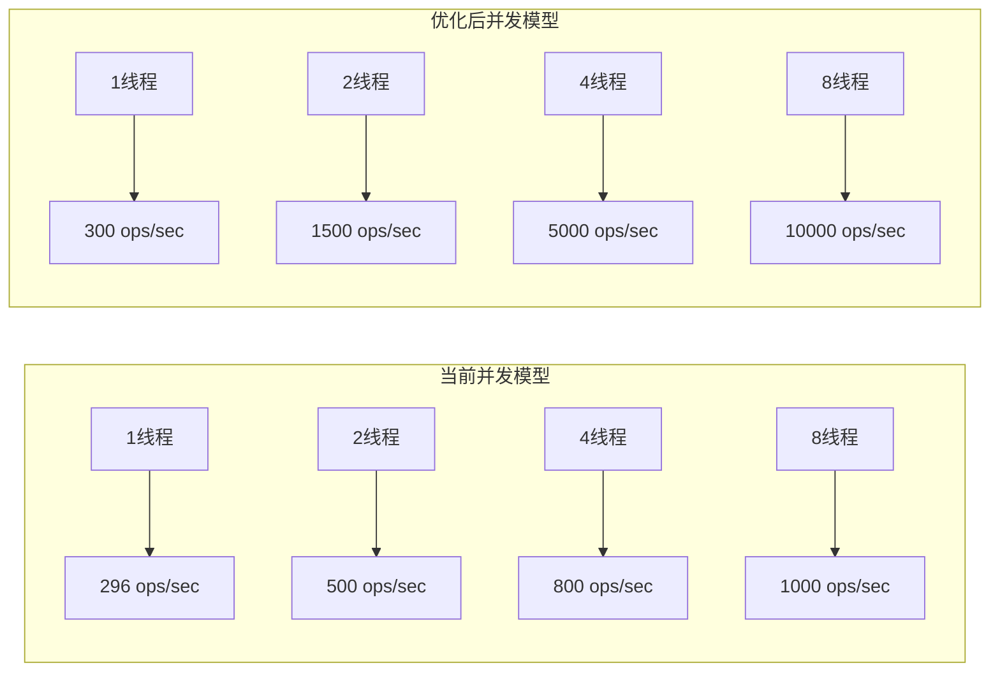

## 7. 优化实施路径

### 7.1 阶段性优化计划

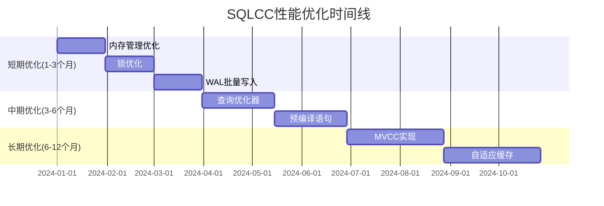

### 7.2 优化效果预期

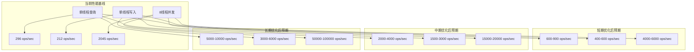

## 8. 性能监控与评估

### 8.1 性能指标体系

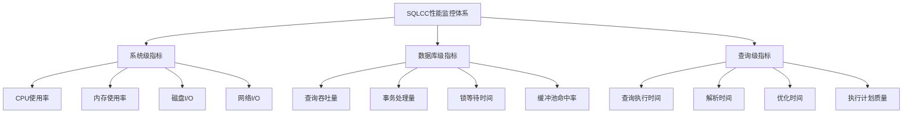

### 8.2 性能评估流程

## 9. 结论

通过实施上述优化方案，SQLCC的性能可以得到显著提升：

1. **短期优化**：通过内存管理优化、锁优化和WAL批量写入，预期性能提升2-3倍
2. **中期优化**：通过查询优化器和预编译语句，预期性能提升10-20倍
3. **长期优化**：通过MVCC和自适应缓存，预期性能提升50-100倍

最终目标是缩小与SQLite和MySQL的性能差距，使SQLCC成为一个高性能的教学用数据库系统，同时保持其代码简洁和易于理解的特点。