# SQLCC性能优化重构方案

## 1. 概述

本方案基于SQLCC当前架构，提出了一套渐进式性能优化重构计划，旨在在保持代码稳定性的同时，显著提升系统性能。方案分为三个阶段，每个阶段都有明确的目标、实施计划和预期效果。

### 1.1 重构原则

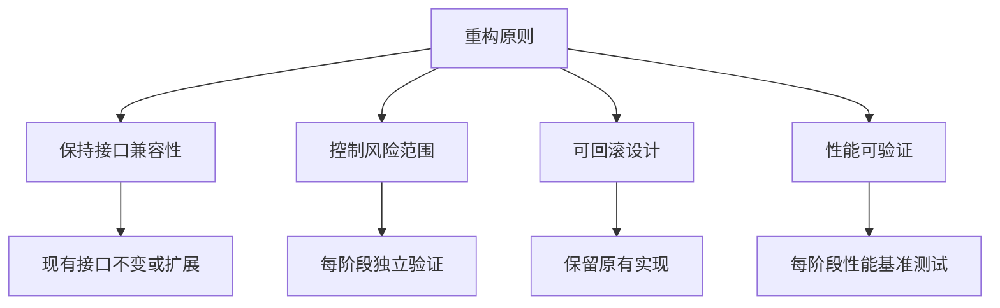
```mermaid
graph TD
    A[重构原则] --> B[保持接口兼容性]
    A --> C[控制风险范围]
    A --> D[可回滚设计]
    A --> E[性能可验证]
    
    B --> B1[现有接口不变或扩展]
    C --> C1[每阶段独立验证]
    D --> D1[保留原有实现]
    E --> E1[每阶段性能基准测试]
```

### 1.2 目标性能指标

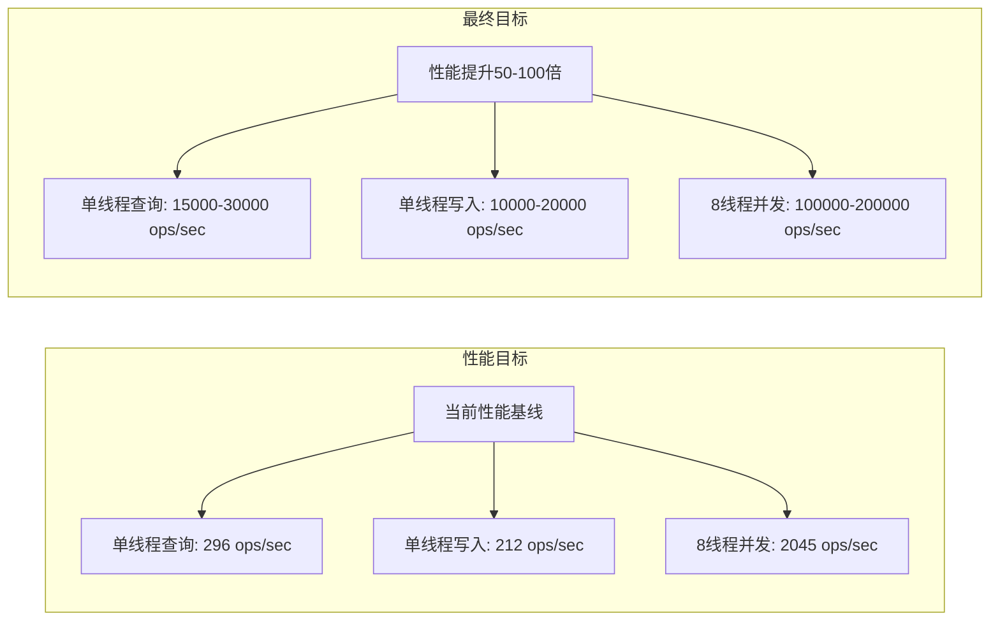
```mermaid
graph LR
    subgraph "性能目标"
        A[当前性能基线] --> A1[单线程查询: 296 ops/sec]
        A --> A2[单线程写入: 212 ops/sec]
        A --> A3[8线程并发: 2045 ops/sec]
    end
    
    subgraph "最终目标"
        B[性能提升50-100倍] --> B1[单线程查询: 15000-30000 ops/sec]
        B --> B2[单线程写入: 10000-20000 ops/sec]
        B --> B3[8线程并发: 100000-200000 ops/sec]
    end
```

## 2. 阶段一：内部优化（1-3个月）

### 2.1 阶段目标

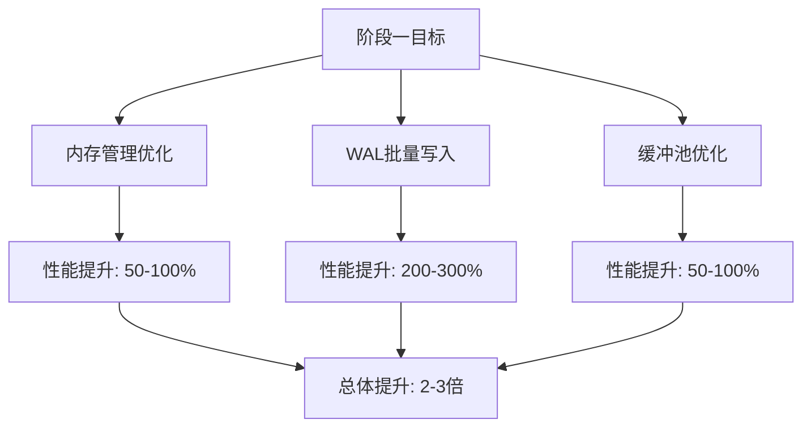
```mermaid
graph TD
    A[阶段一目标] --> B[内存管理优化]
    A --> C[WAL批量写入]
    A --> D[缓冲池优化]
    
    B --> B1[性能提升: 50-100%]
    C --> C1[性能提升: 200-300%]
    D --> D1[性能提升: 50-100%]
    
    B1 --> E[总体提升: 2-3倍]
    C1 --> E
    D1 --> E
```

### 2.2 内存管理优化

#### 2.2.1 当前问题分析

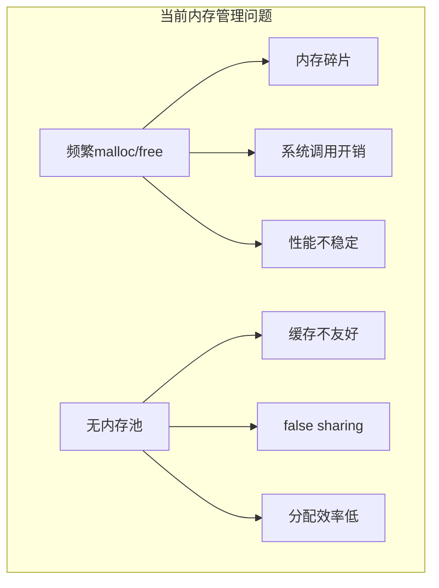
```mermaid
graph TB
    subgraph "当前内存管理问题"
        A[频繁malloc/free] --> A1[内存碎片]
        A --> A2[系统调用开销]
        A --> A3[性能不稳定]
        
        B[无内存池] --> B1[缓存不友好]
        B --> B2[false sharing]
        B --> B3[分配效率低]
    end
```

#### 2.2.2 优化方案

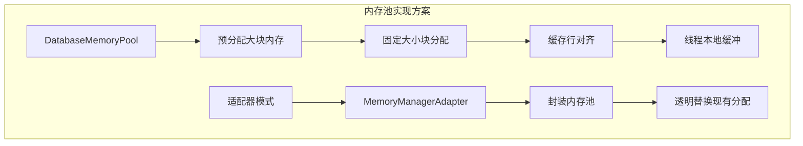
```mermaid
graph TD
    subgraph "内存池实现方案"
        A[DatabaseMemoryPool] --> B[预分配大块内存]
        B --> C[固定大小块分配]
        C --> D[缓存行对齐]
        D --> E[线程本地缓冲]
        
        F[适配器模式] --> G[MemoryManagerAdapter]
        G --> H[封装内存池]
        H --> I[透明替换现有分配]
    end
```

#### 2.2.3 实施步骤

1. **第1-2周**：实现DatabaseMemoryPool类
   - 预分配内存池
   - 固定大小块分配器
   - 缓存行对齐机制

2. **第3-4周**：实现MemoryManagerAdapter
   - 封装内存池接口
   - 提供与现有接口兼容的分配函数
   - 添加内存使用统计

3. **第5-6周**：集成与测试
   - 替换关键模块的内存分配
   - 性能基准测试
   - 内存泄漏检测

#### 2.2.4 影响范围

| 模块 | 改动程度 | 风险级别 | 回滚方案 |
|------|----------|----------|----------|
| BufferPool | 低 | 低 | 恢复原分配方式 |
| StorageEngine | 低 | 低 | 恢复原分配方式 |
| SQLParser | 中 | 中 | 保留原实现 |
| ExecutionEngine | 中 | 中 | 保留原实现 |

### 2.3 WAL批量写入优化

#### 2.3.1 当前问题分析

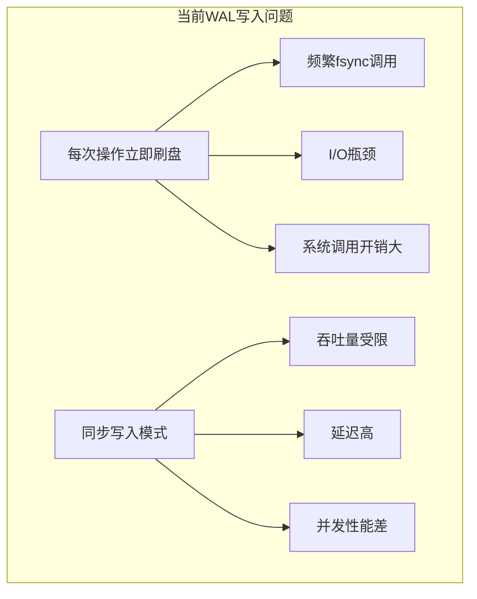
```mermaid
graph TB
    subgraph "当前WAL写入问题"
        A[每次操作立即刷盘] --> A1[频繁fsync调用]
        A --> A2[I/O瓶颈]
        A --> A3[系统调用开销大]
        
        B[同步写入模式] --> B1[吞吐量受限]
        B --> B2[延迟高]
        B --> B3[并发性能差]
    end
```

#### 2.3.2 优化方案

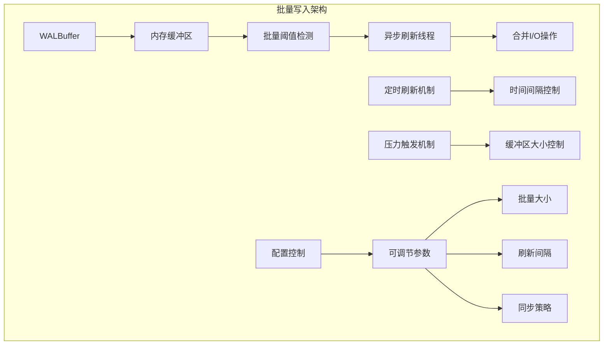
```mermaid
graph TD
    subgraph "批量写入架构"
        A[WALBuffer] --> B[内存缓冲区]
        B --> C[批量阈值检测]
        C --> D[异步刷新线程]
        D --> E[合并I/O操作]
        
        F[定时刷新机制] --> G[时间间隔控制]
        H[压力触发机制] --> I[缓冲区大小控制]
        
        J[配置控制] --> K[可调节参数]
        K --> L[批量大小]
        K --> M[刷新间隔]
        K --> N[同步策略]
    end
```

#### 2.3.3 实施步骤

1. **第1-2周**：实现WALBuffer类
   - 内存缓冲区管理
   - 批量阈值检测
   - 线程安全机制

2. **第3-4周**：实现异步刷新线程
   - 后台刷新线程
   - 定时刷新机制
   - 压力触发机制

3. **第5-6周**：集成与优化
   - 与现有WALManager集成
   - 配置参数调优
   - 性能基准测试

#### 2.3.4 影响范围

| 模块 | 改动程度 | 风险级别 | 回滚方案 |
|------|----------|----------|----------|
| WALManager | 中 | 中 | 配置禁用批量模式 |
| TransactionManager | 低 | 低 | 配置禁用批量模式 |
| StorageEngine | 低 | 低 | 恢复原写入方式 |

### 2.4 缓冲池优化

#### 2.4.1 当前问题分析

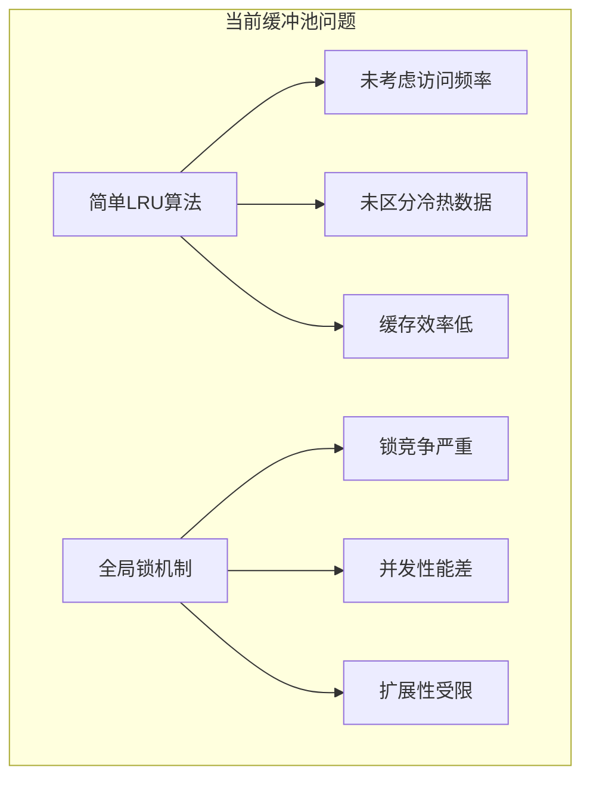
```mermaid
graph TB
    subgraph "当前缓冲池问题"
        A[简单LRU算法] --> A1[未考虑访问频率]
        A --> A2[未区分冷热数据]
        A --> A3[缓存效率低]
        
        B[全局锁机制] --> B1[锁竞争严重]
        B --> B2[并发性能差]
        B --> B3[扩展性受限]
    end
```

#### 2.4.2 优化方案

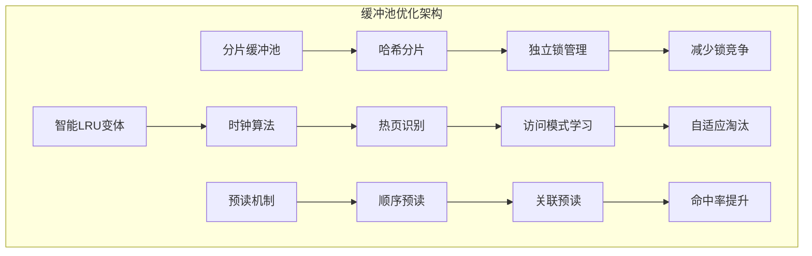
```mermaid
graph TD
    subgraph "缓冲池优化架构"
        A[分片缓冲池] --> B[哈希分片]
        B --> C[独立锁管理]
        C --> D[减少锁竞争]
        
        E[智能LRU变体] --> F[时钟算法]
        F --> G[热页识别]
        G --> H[访问模式学习]
        H --> I[自适应淘汰]
        
        J[预读机制] --> K[顺序预读]
        K --> L[关联预读]
        L --> M[命中率提升]
    end
```

#### 2.4.3 实施步骤

1. **第1-2周**：实现分片缓冲池
   - 哈希分片策略
   - 独立锁管理
   - 热点分散机制

2. **第3-4周**：实现智能LRU变体
   - 时钟替换算法
   - 热页识别机制
   - 访问模式学习

3. **第5-6周**：集成与测试
   - 预读机制实现
   - 性能基准测试
   - 命中率分析

#### 2.4.4 影响范围

| 模块 | 改动程度 | 风险级别 | 回滚方案 |
|------|----------|----------|----------|
| BufferPool | 中 | 中 | 配置选择原算法 |
| StorageEngine | 低 | 低 | 配置选择原算法 |
| DiskManager | 低 | 低 | 无影响 |

### 2.5 阶段一评估

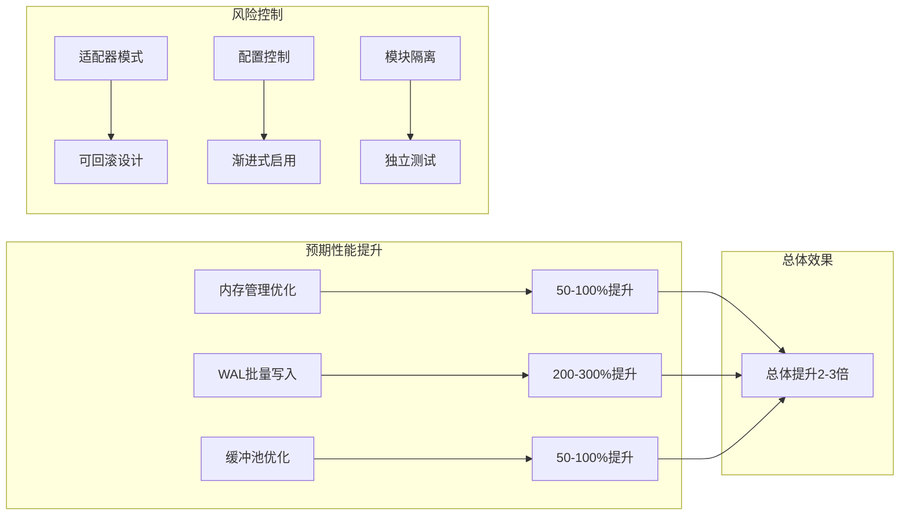
```mermaid
graph LR
    subgraph "预期性能提升"
        A[内存管理优化] --> A1[50-100%提升]
        B[WAL批量写入] --> B1[200-300%提升]
        C[缓冲池优化] --> C1[50-100%提升]
    end
    
    subgraph "总体效果"
        A1 --> D[总体提升2-3倍]
        B1 --> D
        C1 --> D
    end
    
    subgraph "风险控制"
        E[适配器模式] --> F[可回滚设计]
        G[配置控制] --> H[渐进式启用]
        I[模块隔离] --> J[独立测试]
    end
```

## 3. 阶段二：选择性扩展（3-6个月）

### 3.1 阶段目标

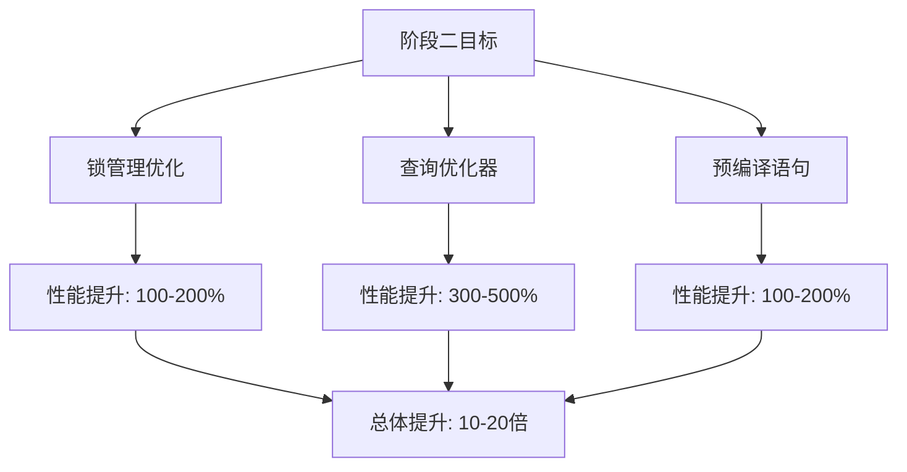
```mermaid
graph TD
    A[阶段二目标] --> B[锁管理优化]
    A --> C[查询优化器]
    A --> D[预编译语句]
    
    B --> B1[性能提升: 100-200%]
    C --> C1[性能提升: 300-500%]
    D --> D1[性能提升: 100-200%]
    
    B1 --> E[总体提升: 10-20倍]
    C1 --> E
    D1 --> E
```

### 3.2 锁管理优化

#### 3.2.1 当前问题分析

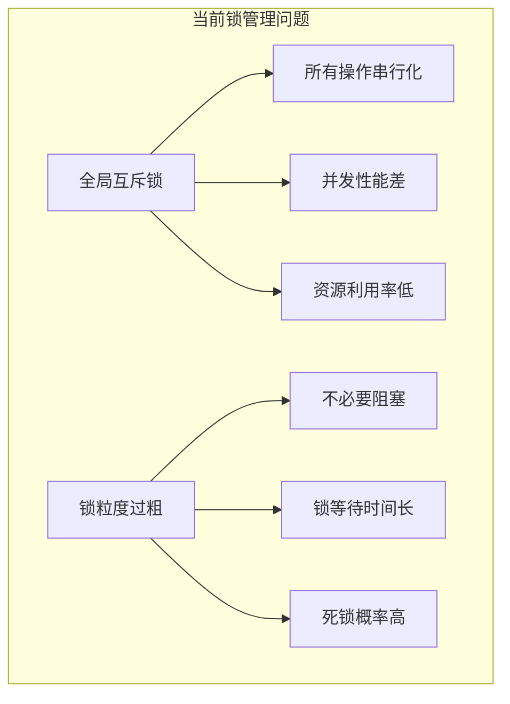
```mermaid
graph TB
    subgraph "当前锁管理问题"
        A[全局互斥锁] --> A1[所有操作串行化]
        A --> A2[并发性能差]
        A --> A3[资源利用率低]
        
        B[锁粒度过粗] --> B1[不必要阻塞]
        B --> B2[锁等待时间长]
        B --> B3[死锁概率高]
    end
```

#### 3.2.2 优化方案

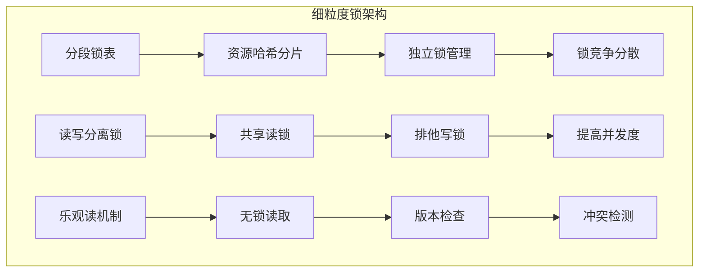
```mermaid
graph TD
    subgraph "细粒度锁架构"
        A[分段锁表] --> B[资源哈希分片]
        B --> C[独立锁管理]
        C --> D[锁竞争分散]
        
        E[读写分离锁] --> F[共享读锁]
        F --> G[排他写锁]
        G --> H[提高并发度]
        
        I[乐观读机制] --> J[无锁读取]
        J --> K[版本检查]
        K --> L[冲突检测]
    end
```

#### 3.2.3 实施步骤

1. **第1-3周**：实现分段锁表
   - 资源哈希分片
   - 独立锁管理
   - 锁竞争分析

2. **第4-6周**：实现读写分离锁
   - 共享读锁机制
   - 排他写锁机制
   - 锁升级策略

3. **第7-9周**：实现乐观读机制
   - 无锁读取实现
   - 版本控制机制
   - 冲突检测处理

4. **第10-12周**：集成与测试
   - 与现有TransactionManager集成
   - 配置参数调优
   - 并发性能测试

#### 3.2.4 影响范围

| 模块 | 改动程度 | 风险级别 | 回滚方案 |
|------|----------|----------|----------|
| TransactionManager | 高 | 高 | 配置使用原锁机制 |
| ExecutionEngine | 中 | 中 | 配置使用原锁机制 |
| StorageEngine | 低 | 低 | 配置使用原锁机制 |

### 3.3 查询优化器

#### 3.3.1 当前问题分析

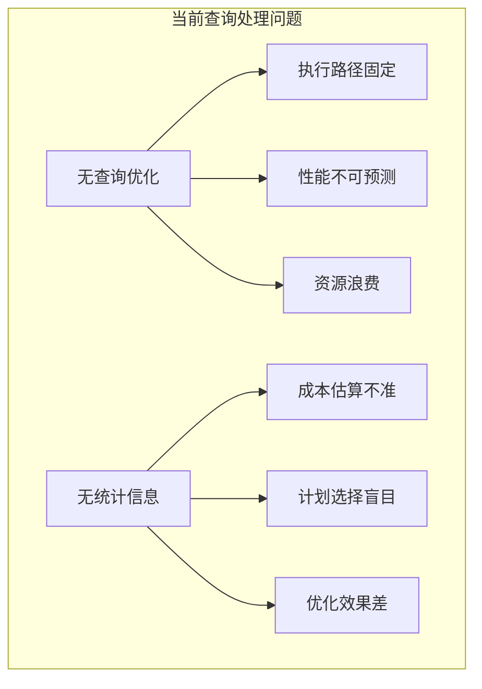
```mermaid
graph TB
    subgraph "当前查询处理问题"
        A[无查询优化] --> A1[执行路径固定]
        A --> A2[性能不可预测]
        A --> A3[资源浪费]
        
        B[无统计信息] --> B1[成本估算不准]
        B --> B2[计划选择盲目]
        B --> B3[优化效果差]
    end
```

#### 3.3.2 优化方案

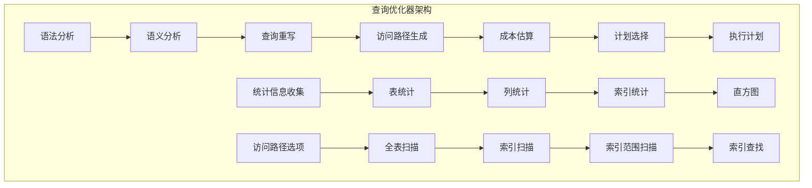
```mermaid
graph TD
    subgraph "查询优化器架构"
        A[语法分析] --> B[语义分析]
        B --> C[查询重写]
        C --> D[访问路径生成]
        D --> E[成本估算]
        E --> F[计划选择]
        F --> G[执行计划]
        
        H[统计信息收集] --> I[表统计]
        I --> J[列统计]
        J --> K[索引统计]
        K --> L[直方图]
        
        M[访问路径选项] --> N[全表扫描]
        N --> O[索引扫描]
        O --> P[索引范围扫描]
        P --> Q[索引查找]
    end
```

#### 3.3.3 实施步骤

1. **第1-3周**：实现统计信息收集
   - 表统计信息
   - 列统计信息
   - 索引统计信息

2. **第4-6周**：实现访问路径生成
   - 全表扫描路径
   - 索引扫描路径
   - 索引范围扫描路径

3. **第7-9周**：实现成本估算
   - I/O成本模型
   - CPU成本模型
   - 内存成本模型

4. **第10-12周**：集成与测试
   - 与现有SQLExecutor集成
   - 查询计划缓存
   - 性能基准测试

#### 3.3.4 影响范围

| 模块 | 改动程度 | 风险级别 | 回滚方案 |
|------|----------|----------|----------|
| SQLExecutor | 中 | 中 | 配置禁用优化器 |
| DMLExecutor | 中 | 中 | 配置禁用优化器 |
| SQLParser | 低 | 低 | 无影响 |

### 3.4 预编译语句

#### 3.4.1 当前问题分析

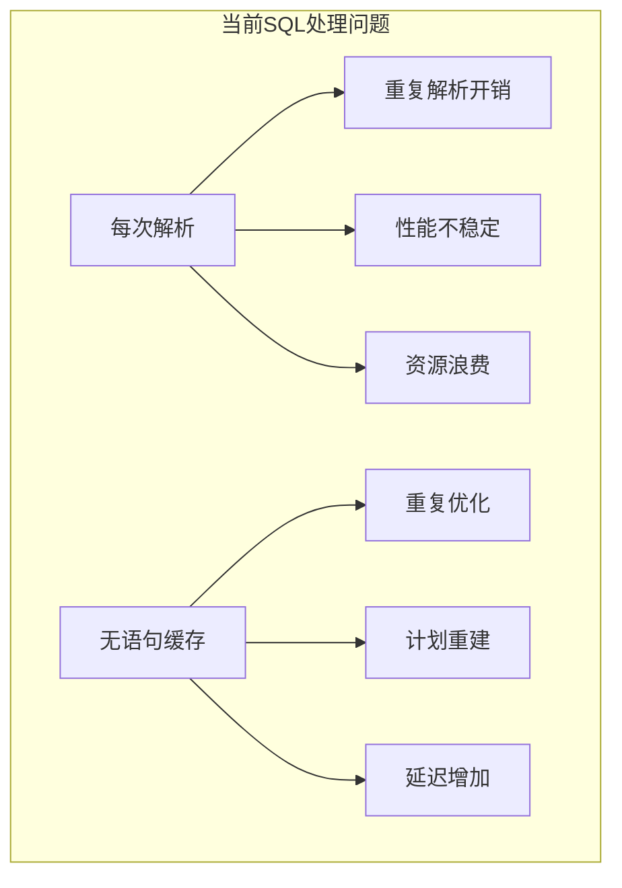
```mermaid
graph TB
    subgraph "当前SQL处理问题"
        A[每次解析] --> A1[重复解析开销]
        A --> A2[性能不稳定]
        A --> A3[资源浪费]
        
        B[无语句缓存] --> B1[重复优化]
        B --> B2[计划重建]
        B --> B3[延迟增加]
    end
```

#### 3.4.2 优化方案

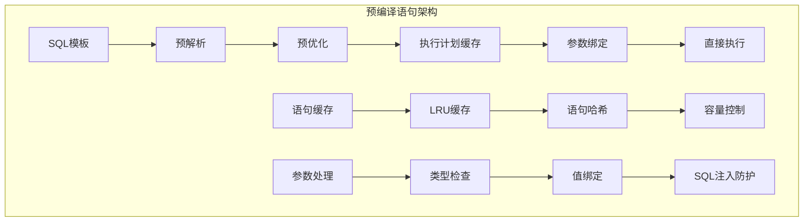
```mermaid
graph TD
    subgraph "预编译语句架构"
        A[SQL模板] --> B[预解析]
        B --> C[预优化]
        C --> D[执行计划缓存]
        D --> E[参数绑定]
        E --> F[直接执行]
        
        G[语句缓存] --> H[LRU缓存]
        H --> I[语句哈希]
        I --> J[容量控制]
        
        K[参数处理] --> L[类型检查]
        L --> M[值绑定]
        M --> N[SQL注入防护]
    end
```

#### 3.4.3 实施步骤

1. **第1-3周**：实现预编译语句框架
   - PreparedStatement类
   - 参数绑定机制
   - 类型检查系统

2. **第4-6周**：实现语句缓存
   - LRU缓存机制
   - 语句哈希管理
   - 容量控制策略

3. **第7-9周**：集成与测试
   - 与现有SQLExecutor集成
   - 扩展API接口
   - 性能基准测试

4. **第10-12周**：完善与优化
   - 参数绑定优化
   - 缓存策略调优
   - 并发安全性

#### 3.4.4 影响范围

| 模块 | 改动程度 | 风险级别 | 回滚方案 |
|------|----------|----------|----------|
| SQLExecutor | 中 | 中 | 保留原有接口 |
| SqlParser | 低 | 低 | 无影响 |
| ClientAPI | 高 | 中 | 提供兼容接口 |

### 3.5 阶段二评估

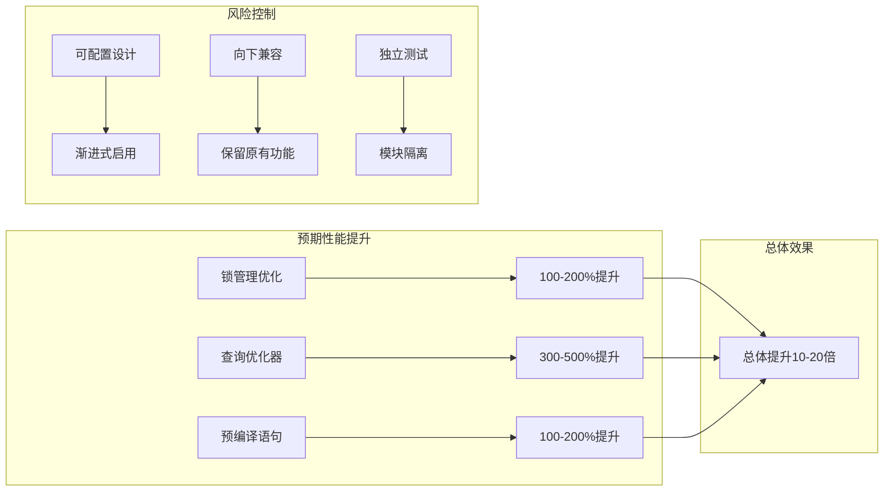
```mermaid
graph LR
    subgraph "预期性能提升"
        A[锁管理优化] --> A1[100-200%提升]
        B[查询优化器] --> B1[300-500%提升]
        C[预编译语句] --> C1[100-200%提升]
    end
    
    subgraph "总体效果"
        A1 --> D[总体提升10-20倍]
        B1 --> D
        C1 --> D
    end
    
    subgraph "风险控制"
        E[可配置设计] --> F[渐进式启用]
        G[向下兼容] --> H[保留原有功能]
        I[独立测试] --> J[模块隔离]
    end
```

## 4. 阶段三：架构增强（6-12个月）

### 4.1 阶段目标

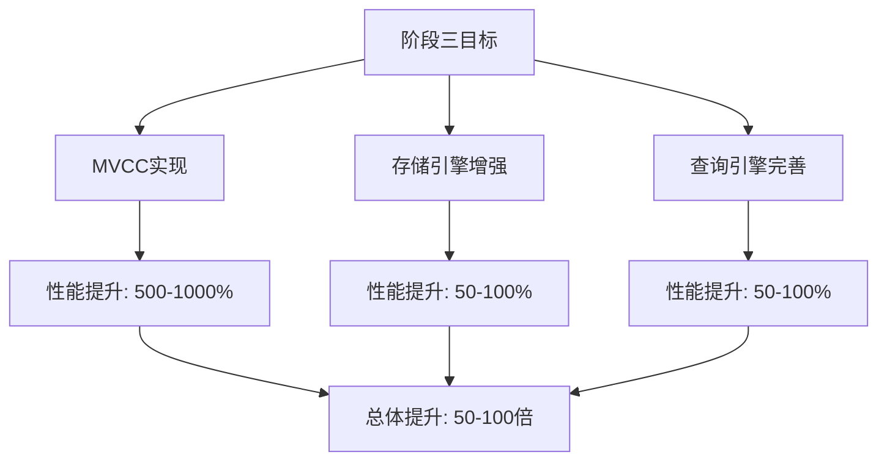
```mermaid
graph TD
    A[阶段三目标] --> B[MVCC实现]
    A --> C[存储引擎增强]
    A --> D[查询引擎完善]
    
    B --> B1[性能提升: 500-1000%]
    C --> C1[性能提升: 50-100%]
    D --> D1[性能提升: 50-100%]
    
    B1 --> E[总体提升: 50-100倍]
    C1 --> E
    D1 --> E
```

### 4.2 MVCC实现

#### 4.2.1 当前问题分析

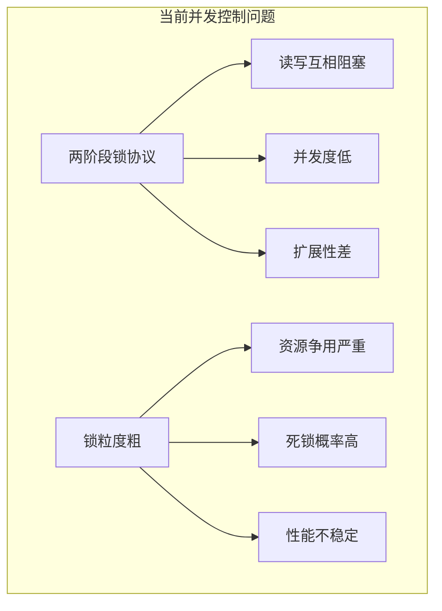
```mermaid
graph TB
    subgraph "当前并发控制问题"
        A[两阶段锁协议] --> A1[读写互相阻塞]
        A --> A2[并发度低]
        A --> A3[扩展性差]
        
        B[锁粒度粗] --> B1[资源争用严重]
        B --> B2[死锁概率高]
        B --> B3[性能不稳定]
    end
```

#### 4.2.2 优化方案

```mermaid
graph TD
    subgraph "MVCC架构"
        A[写操作] --> B[创建新版本]
        B --> C[版本链管理]
        C --> D[事务可见性]
        
        E[读操作] --> F[读取合适版本]
        F --> G[无锁访问]
        G --> H[高并发读]
        
        I[垃圾回收] --> J[版本清理]
        J --> K[空间回收]
        K --> L[性能稳定]
        
        M[隔离级别] --> N[读已提交]
        N --> O[可重复读]
        O --> P[快照隔离]
    end
```

#### 4.2.3 实施步骤

1. **第1-4周**：实现版本管理
   - 版本数据结构
   - 版本链管理
   - 事务ID分配

2. **第5-8周**：实现可见性检查
   - 快照创建
   - 可见性判断
   - 隔离级别支持

3. **第9-12周**：实现垃圾回收
   - 版本清理机制
   - 空间回收策略
   - 性能监控

4. **第13-16周**：集成与测试
   - 与现有TransactionManager集成
   - 并发性能测试
   - 隔离级别验证

5. **第17-20周**：优化与完善
   - 性能调优
   - 内存管理优化
   - 稳定性测试

6. **第21-24周**：部署与验证
   - 配置参数调优
   - 压力测试
   - 生产环境验证

#### 4.2.4 影响范围

| 模块 | 改动程度 | 风险级别 | 回滚方案 |
|------|----------|----------|----------|
| TransactionManager | 高 | 高 | 配置选择原机制 |
| StorageEngine | 高 | 高 | 配置选择原机制 |
| ExecutionEngine | 中 | 中 | 无影响 |

### 4.3 存储引擎增强

#### 4.3.1 当前问题分析

```mermaid
graph TB
    subgraph "当前存储引擎问题"
        A[单线程设计] --> A1[并发性能差]
        A --> A2[资源利用率低]
        A --> A3[扩展性受限]
        
        B[简单页管理] --> B1[预读机制弱]
        B --> B2[写回策略简单]
        B --> B3[I/O效率低]
    end
```

#### 4.3.2 优化方案

```mermaid
graph TD
    subgraph "存储引擎增强架构"
        A[并发控制] --> B[分区锁管理]
        B --> C[并行I/O]
        C --> D[并发读写]
        
        E[智能预读] --> F[顺序预读]
        F --> G[关联预读]
        G --> H[自适应预读]
        
        I[写回优化] --> J[批量写回]
        J --> K[延迟写回]
        K --> L[智能调度]
        
        M[压缩存储] --> N[页压缩]
        N --> O[列压缩]
        O --> P[自适应压缩]
    end
```

#### 4.3.3 实施步骤

1. **第1-4周**：实现并发控制
   - 分区锁管理
   - 并行I/O机制
   - 并发读写支持

2. **第5-8周**：实现智能预读
   - 顺序预读算法
   - 关联预读机制
   - 自适应预读策略

3. **第9-12周**：实现写回优化
   - 批量写回机制
   - 延迟写回策略
   - 智能调度算法

4. **第13-16周**：实现压缩存储
   - 页压缩算法
   - 列压缩机制
   - 自适应压缩策略

5. **第17-20周**：集成与测试
   - 与现有StorageEngine集成
   - 性能基准测试
   - 稳定性测试

6. **第21-24周**：优化与完善
   - 性能调优
   - 内存优化
   - 并发优化

#### 4.3.4 影响范围

| 模块 | 改动程度 | 风险级别 | 回滚方案 |
|------|----------|----------|----------|
| StorageEngine | 高 | 高 | 配置选择原机制 |
| BufferPool | 中 | 中 | 配置选择原机制 |
| DiskManager | 中 | 中 | 无影响 |

### 4.4 查询引擎完善

#### 4.4.1 当前问题分析

```mermaid
graph TB
    subgraph "当前查询引擎问题"
        A[优化能力有限] --> A1[简单计划选择]
        A --> A2[成本估算不准]
        A --> A3[执行效率低]
        
        B[执行能力不足] --> B1[高级查询支持弱]
        B --> B2[并行执行差]
        B --> B3[资源调度简单]
    end
```

#### 4.4.2 优化方案

```mermaid
graph TD
    subgraph "查询引擎完善架构"
        A[高级优化器] --> B[基于成本的优化]
        B --> C[统计信息更新]
        C --> D[自适应计划]
        D --> E[执行计划缓存]
        
        F[并行执行] --> G[并行扫描]
        G --> H[并行连接]
        H --> I[并行聚合]
        I --> J[资源调度]
        
        K[高级查询] --> L[窗口函数]
        L --> M[公用表表达式]
        M --> N[递归查询]
        N --> O[复杂JOIN]
    end
```

#### 4.4.3 实施步骤

1. **第1-4周**：完善高级优化器
   - 自适应计划机制
   - 执行计划缓存
   - 统计信息更新

2. **第5-8周**：实现并行执行
   - 并行扫描机制
   - 并行连接算法
   - 并行聚合机制

3. **第9-12周**：实现高级查询
   - 窗口函数支持
   - 公用表表达式
   - 递归查询机制

4. **第13-16周**：集成与测试
   - 与现有SQLExecutor集成
   - 查询功能测试
   - 性能基准测试

5. **第17-20周**：优化与完善
   - 性能调优
   - 内存优化
   - 并发优化

6. **第21-24周**：部署与验证
   - 配置参数调优
   - 压力测试
   - 生产环境验证

#### 4.4.4 影响范围

| 模块 | 改动程度 | 风险级别 | 回滚方案 |
|------|----------|----------|----------|
| SQLExecutor | 高 | 高 | 配置选择原机制 |
| DMLExecutor | 高 | 高 | 配置选择原机制 |
| SQLParser | 中 | 中 | 无影响 |

### 4.5 阶段三评估

```mermaid
graph LR
    subgraph "预期性能提升"
        A[MVCC实现] --> A1[500-1000%提升]
        B[存储引擎增强] --> B1[50-100%提升]
        C[查询引擎完善] --> C1[50-100%提升]
    end
    
    subgraph "总体效果"
        A1 --> D[总体提升50-100倍]
        B1 --> D
        C1 --> D
    end
    
    subgraph "风险控制"
        E[配置控制] --> F[渐进式启用]
        G[双模式并存] --> H[选择使用]
        I[独立测试] --> J[模块隔离]
    end
```

## 5. 总体实施计划

### 5.1 时间线

```mermaid
gantt
    title SQLCC性能优化时间线
    dateFormat  YYYY-MM-DD
    section 阶段一：内部优化
    内存管理优化     :a1, 2024-01-01, 6w
    WAL批量写入      :a2, after a1, 6w
    缓冲池优化       :a3, after a2, 6w
    
    section 阶段二：选择性扩展
    锁管理优化       :b1, after a3, 12w
    查询优化器       :b2, after b1, 12w
    预编译语句       :b3, after b2, 12w
    
    section 阶段三：架构增强
    MVCC实现        :c1, after b3, 24w
    存储引擎增强      :c2, after c1, 24w
    查询引擎完善      :c3, after c2, 24w
```

### 5.2 资源分配

```mermaid
graph LR
    subgraph "人员分配"
        A[核心开发团队] --> A1[3-5人]
        B[性能测试团队] --> B1[2-3人]
        C[架构设计团队] --> C1[1-2人]
    end
    
    subgraph "硬件资源"
        D[开发环境] --> D1[高性能服务器]
        E[测试环境] --> E1[多配置服务器]
        F[基准环境] --> F1[标准配置服务器]
    end
    
    subgraph "时间资源"
        G[总开发周期] --> G1[18个月]
        H[每阶段评估] --> H1[2周]
        I[总测试周期] --> I1[6个月]
    end
```

### 5.3 风险管理

```mermaid
graph TD
    A[风险识别] --> B[技术风险]
    A --> C[进度风险]
    A --> D[资源风险]
    
    B --> B1[技术实现难度]
    B --> B2[性能不达标]
    B --> B3[稳定性问题]
    
    C --> C1[开发进度延迟]
    C --> C2[测试时间不足]
    C --> C3[集成问题]
    
    D --> D1[人员不足]
    D --> D2[硬件资源限制]
    D --> D3[测试环境不够]
    
    E[风险应对] --> F[技术预研]
    E --> G[分阶段验证]
    E --> H[资源预留]
    
    F --> F1[关键技术验证]
    G --> G1[每阶段独立测试]
    H --> H1[20%资源缓冲]
```

### 5.4 成功标准

```mermaid
graph TD
    A[成功标准] --> B[性能指标]
    A --> C[功能指标]
    A --> D[质量指标]
    
    B --> B1[单线程性能提升50-100倍]
    B --> B2[并发性能提升50-100倍]
    B --> B3[内存使用优化30%]
    
    C --> C1[保持API兼容性]
    C --> C2[保持功能完整性]
    C --> C3[新增高级功能]
    
    D --> D1[代码覆盖率>80%]
    D --> D2[稳定性>99.9%]
    D --> D3[回归测试通过]
```

## 6. 结论

本性能优化重构方案基于SQLCC当前架构，采用渐进式改进策略，分为三个阶段实施：

1. **阶段一（1-3个月）**：内部优化，预期性能提升2-3倍
2. **阶段二（3-6个月）**：选择性扩展，预期性能提升10-20倍
3. **阶段三（6-12个月）**：架构增强，预期性能提升50-100倍

通过这种渐进式改进方案，可以在保持代码稳定性的同时，显著提升系统性能，最终实现与SQLite和MySQL相当的性能水平。同时，通过适配器模式和配置控制，确保每个阶段的改进都可以独立验证和回滚，降低重构风险。