# SQLCC事务处理增强设计与重构方案

## 1. 概述

本文档专门针对SQLCC的事务处理子系统，提出一套全面的设计与重构方案，以支持多版本并发控制(MVCC)、多隔离级别、细粒度锁定和高级保存点功能。方案采用渐进式重构策略，在保持向后兼容的同时，显著提升事务处理性能和功能完整性。

### 1.1 当前事务系统分析

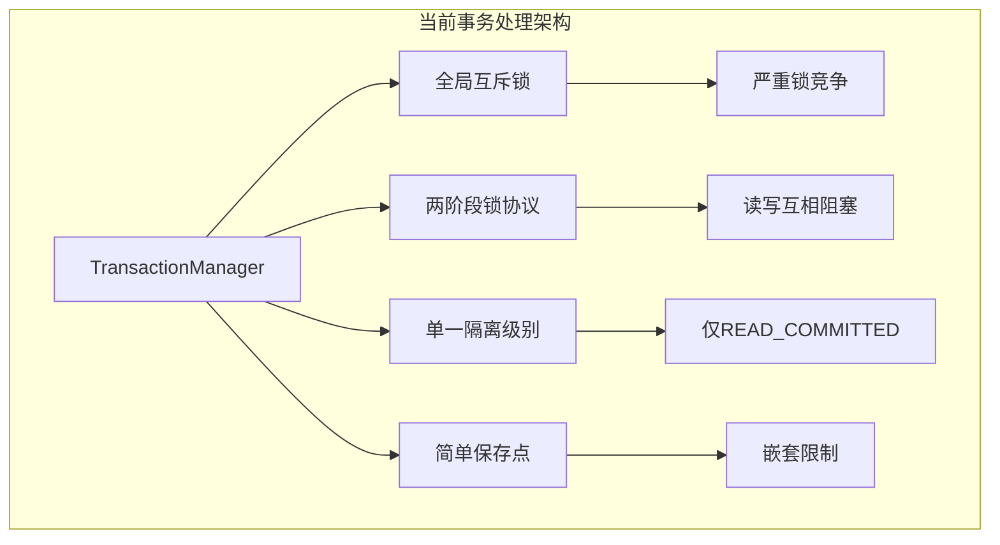
```mermaid
graph TD
    subgraph "当前事务处理架构"
        A[TransactionManager] --> B[全局互斥锁]
        A --> C[两阶段锁协议]
        A --> D[单一隔离级别]
        A --> E[简单保存点]
        
        B --> B1[严重锁竞争]
        C --> C1[读写互相阻塞]
        D --> D1[仅READ_COMMITTED]
        E --> E1[嵌套限制]
    end
```

### 1.2 目标架构设计

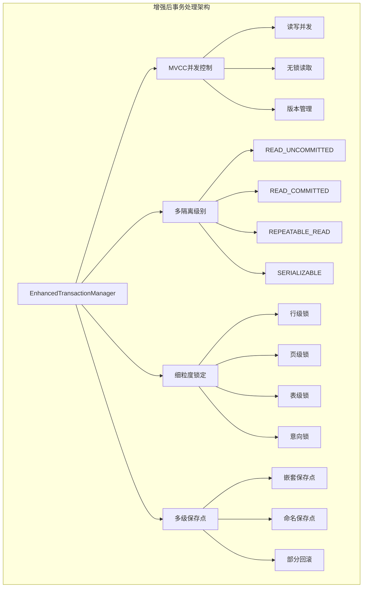
```mermaid
graph TD
    subgraph "增强后事务处理架构"
        A[EnhancedTransactionManager] --> B[MVCC并发控制]
        A --> C[多隔离级别]
        A --> D[细粒度锁定]
        A --> E[多级保存点]
        
        B --> B1[读写并发]
        B --> B2[无锁读取]
        B --> B3[版本管理]
        
        C --> C1[READ_UNCOMMITTED]
        C --> C2[READ_COMMITTED]
        C --> C3[REPEATABLE_READ]
        C --> C4[SERIALIZABLE]
        
        D --> D1[行级锁]
        D --> D2[页级锁]
        D --> D3[表级锁]
        D --> D4[意向锁]
        
        E --> E1[嵌套保存点]
        E --> E2[命名保存点]
        E --> E3[部分回滚]
    end
```

## 2. 多版本并发控制(MVCC)设计

### 2.1 MVCC架构设计

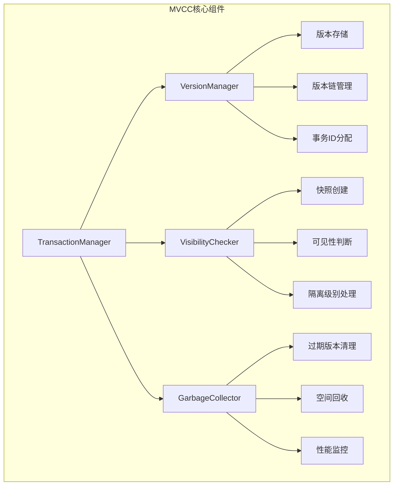
```mermaid
graph TD
    subgraph "MVCC核心组件"
        A[TransactionManager] --> B[VersionManager]
        A --> C[VisibilityChecker]
        A --> D[GarbageCollector]
        
        B --> B1[版本存储]
        B --> B2[版本链管理]
        B --> B3[事务ID分配]
        
        C --> C1[快照创建]
        C --> C2[可见性判断]
        C --> C3[隔离级别处理]
        
        D --> D1[过期版本清理]
        D --> D2[空间回收]
        D --> D3[性能监控]
    end
```

### 2.2 版本数据结构设计

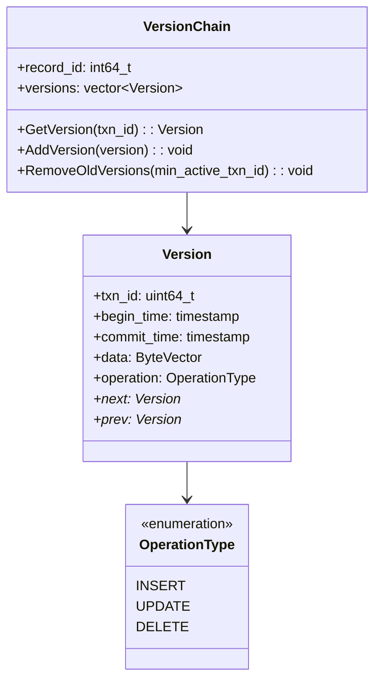
```mermaid
classDiagram
    class VersionChain {
        +record_id: int64_t
        +versions: vector~Version~
        +GetVersion(txn_id): Version
        +AddVersion(version): void
        +RemoveOldVersions(min_active_txn_id): void
    }
    
    class Version {
        +txn_id: uint64_t
        +begin_time: timestamp
        +commit_time: timestamp
        +data: ByteVector
        +operation: OperationType
        +next: Version*
        +prev: Version*
    }
    
    class OperationType {
        <<enumeration>>
        INSERT
        UPDATE
        DELETE
    }
    
    VersionChain --> Version
    Version --> OperationType
```

### 2.3 可见性检查算法

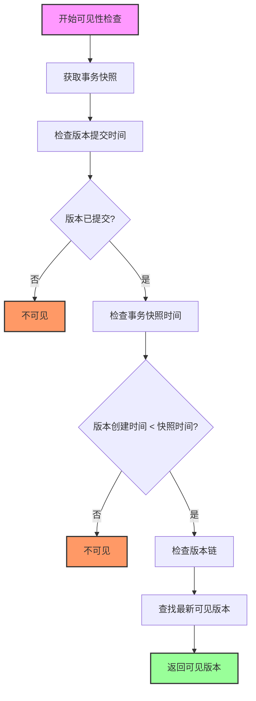
```mermaid
graph TD
    A[开始可见性检查] --> B[获取事务快照]
    B --> C[检查版本提交时间]
    C --> D{版本已提交?}
    D -->|否| E[不可见]
    D -->|是| F[检查事务快照时间]
    F --> G{版本创建时间 < 快照时间?}
    G -->|否| H[不可见]
    G -->|是| I[检查版本链]
    I --> J[查找最新可见版本]
    J --> K[返回可见版本]
    
    style A fill:#f9f,stroke:#333,stroke-width:2px
    style E fill:#f96,stroke:#333,stroke-width:2px
    style H fill:#f96,stroke:#333,stroke-width:2px
    style K fill:#9f9,stroke:#333,stroke-width:2px
```

### 2.4 MVCC实施步骤

#### 2.4.1 第一阶段：基础MVCC框架（4-6周）

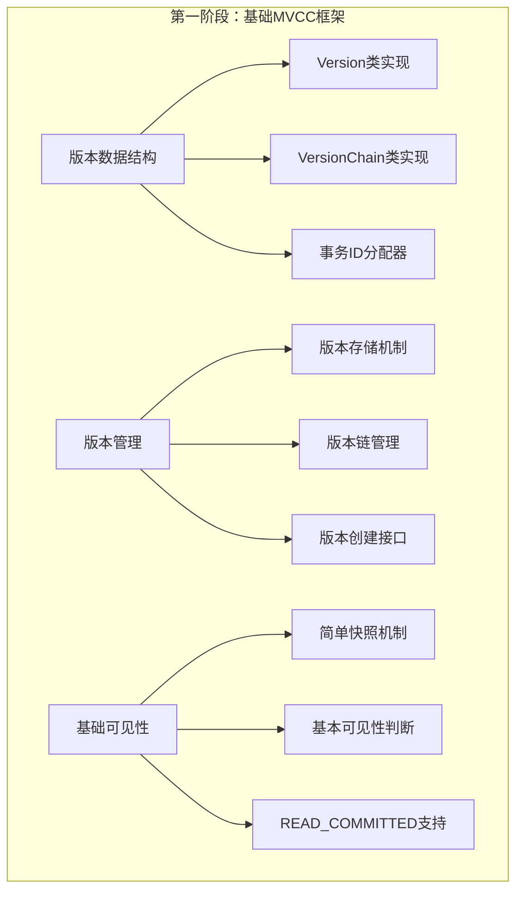
```mermaid
graph TB
    subgraph "第一阶段：基础MVCC框架"
        A[版本数据结构] --> A1[Version类实现]
        A --> A2[VersionChain类实现]
        A --> A3[事务ID分配器]
        
        B[版本管理] --> B1[版本存储机制]
        B --> B2[版本链管理]
        B --> B3[版本创建接口]
        
        C[基础可见性] --> C1[简单快照机制]
        C --> C2[基本可见性判断]
        C --> C3[READ_COMMITTED支持]
    end
```

#### 2.4.2 第二阶段：完整MVCC实现（6-8周）

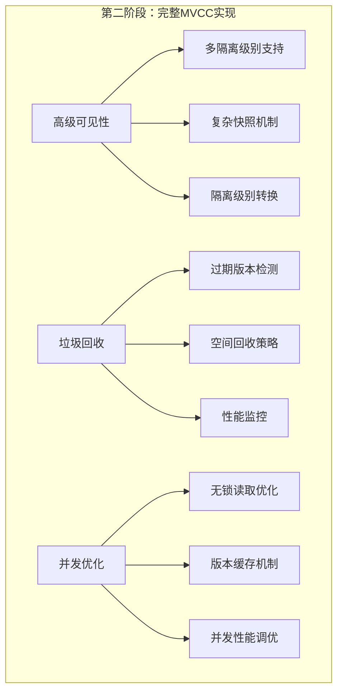
```mermaid
graph TB
    subgraph "第二阶段：完整MVCC实现"
        A[高级可见性] --> A1[多隔离级别支持]
        A --> A2[复杂快照机制]
        A --> A3[隔离级别转换]
        
        B[垃圾回收] --> B1[过期版本检测]
        B --> B2[空间回收策略]
        B --> B3[性能监控]
        
        C[并发优化] --> C1[无锁读取优化]
        C --> C2[版本缓存机制]
        C --> C3[并发性能调优]
    end
```

### 2.5 MVCC集成策略

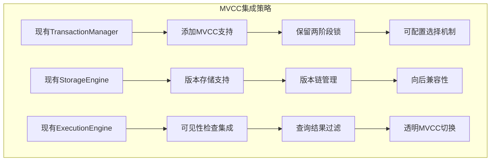
```mermaid
graph TD
    subgraph "MVCC集成策略"
        A[现有TransactionManager] --> B[添加MVCC支持]
        B --> C[保留两阶段锁]
        C --> D[可配置选择机制]
        
        E[现有StorageEngine] --> F[版本存储支持]
        F --> G[版本链管理]
        G --> H[向后兼容性]
        
        I[现有ExecutionEngine] --> J[可见性检查集成]
        J --> K[查询结果过滤]
        K --> L[透明MVCC切换]
    end
```

## 3. 多隔离级别设计

### 3.1 隔离级别架构

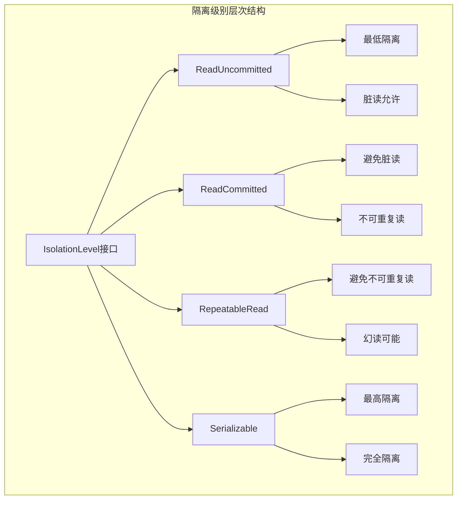
```mermaid
graph TD
    subgraph "隔离级别层次结构"
        A[IsolationLevel接口] --> B[ReadUncommitted]
        A --> C[ReadCommitted]
        A --> D[RepeatableRead]
        A --> E[Serializable]
        
        B --> B1[最低隔离]
        B --> B2[脏读允许]
        
        C --> C1[避免脏读]
        C --> C2[不可重复读]
        
        D --> D1[避免不可重复读]
        D --> D2[幻读可能]
        
        E --> E1[最高隔离]
        E --> E2[完全隔离]
    end
```

### 3.2 隔离级别实现策略

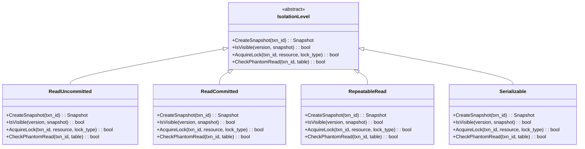
```mermaid
classDiagram
    class IsolationLevel {
        <<abstract>>
        +CreateSnapshot(txn_id): Snapshot
        +IsVisible(version, snapshot): bool
        +AcquireLock(txn_id, resource, lock_type): bool
        +CheckPhantomRead(txn_id, table): bool
    }
    
    class ReadUncommitted {
        +CreateSnapshot(txn_id): Snapshot
        +IsVisible(version, snapshot): bool
        +AcquireLock(txn_id, resource, lock_type): bool
        +CheckPhantomRead(txn_id, table): bool
    }
    
    class ReadCommitted {
        +CreateSnapshot(txn_id): Snapshot
        +IsVisible(version, snapshot): bool
        +AcquireLock(txn_id, resource, lock_type): bool
        +CheckPhantomRead(txn_id, table): bool
    }
    
    class RepeatableRead {
        +CreateSnapshot(txn_id): Snapshot
        +IsVisible(version, snapshot): bool
        +AcquireLock(txn_id, resource, lock_type): bool
        +CheckPhantomRead(txn_id, table): bool
    }
    
    class Serializable {
        +CreateSnapshot(txn_id): Snapshot
        +IsVisible(version, snapshot): bool
        +AcquireLock(txn_id, resource, lock_type): bool
        +CheckPhantomRead(txn_id, table): bool
    }
    
    IsolationLevel <|-- ReadUncommitted
    IsolationLevel <|-- ReadCommitted
    IsolationLevel <|-- RepeatableRead
    IsolationLevel <|-- Serializable
```

### 3.3 隔离级别切换机制

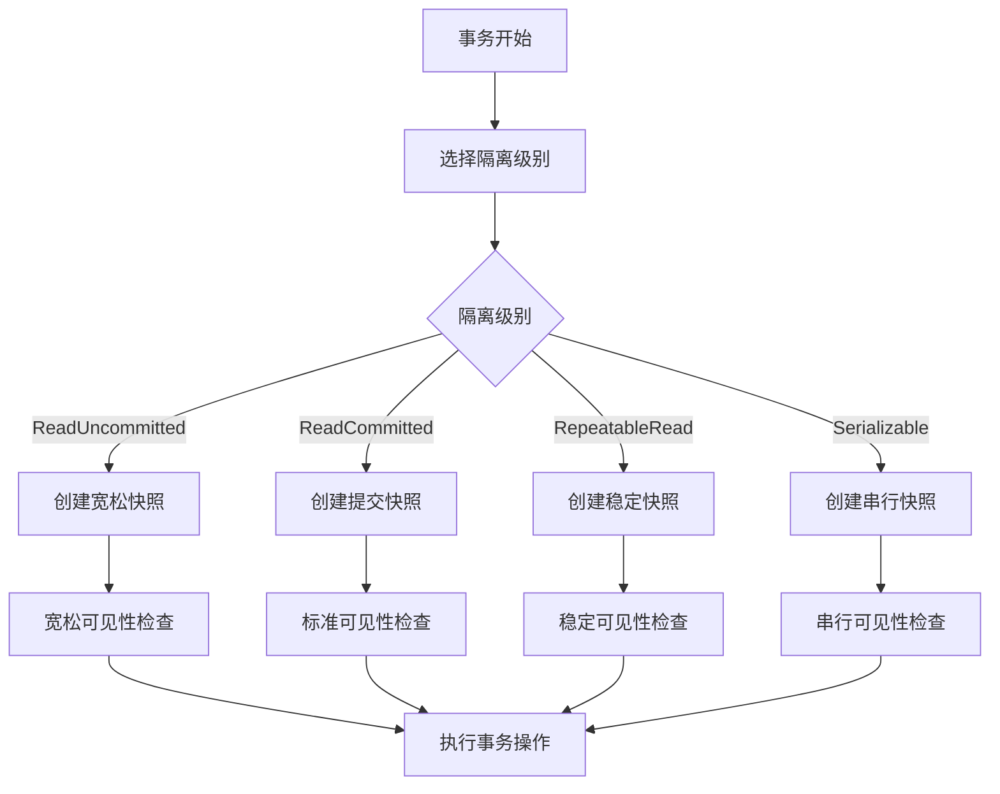
```mermaid
graph TD
    A[事务开始] --> B[选择隔离级别]
    B --> C{隔离级别}
    C -->|ReadUncommitted| D[创建宽松快照]
    C -->|ReadCommitted| E[创建提交快照]
    C -->|RepeatableRead| F[创建稳定快照]
    C -->|Serializable| G[创建串行快照]
    
    D --> H[宽松可见性检查]
    E --> I[标准可见性检查]
    F --> J[稳定可见性检查]
    G --> K[串行可见性检查]
    
    H --> L[执行事务操作]
    I --> L
    J --> L
    K --> L
```

### 3.4 实施步骤

#### 3.4.1 第一阶段：隔离级别框架（3-4周）

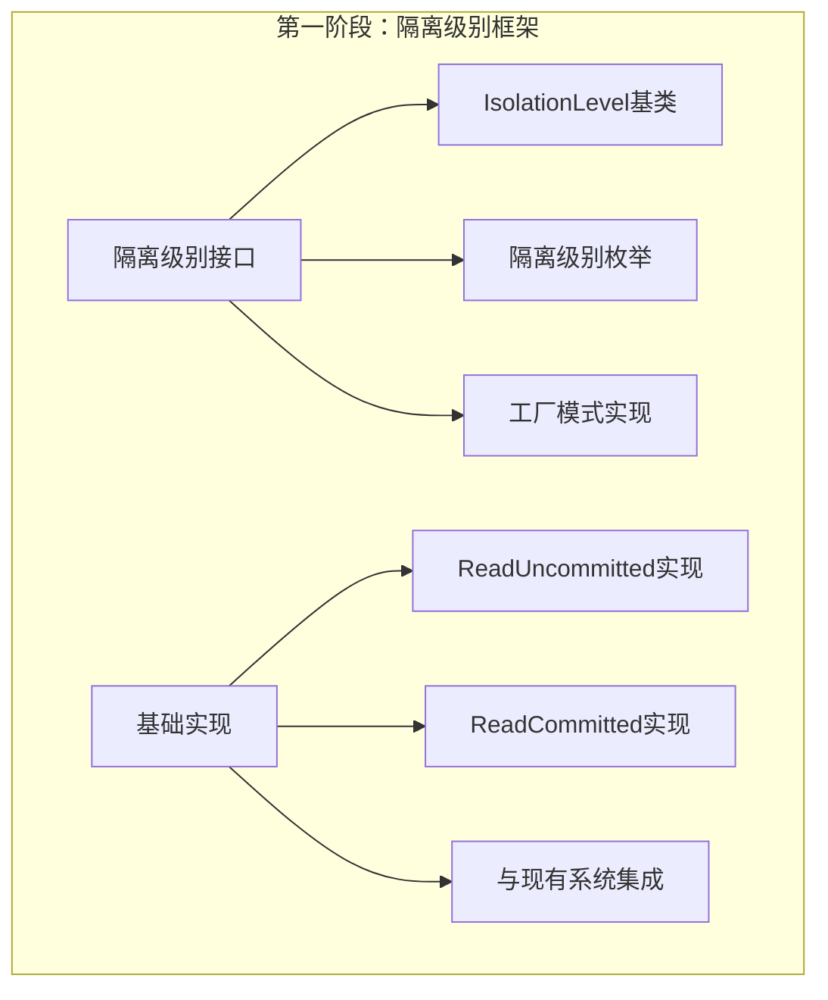
```mermaid
graph TB
    subgraph "第一阶段：隔离级别框架"
        A[隔离级别接口] --> A1[IsolationLevel基类]
        A --> A2[隔离级别枚举]
        A --> A3[工厂模式实现]
        
        B[基础实现] --> B1[ReadUncommitted实现]
        B --> B2[ReadCommitted实现]
        B --> B3[与现有系统集成]
    end
```

#### 3.4.2 第二阶段：高级隔离级别（4-6周）

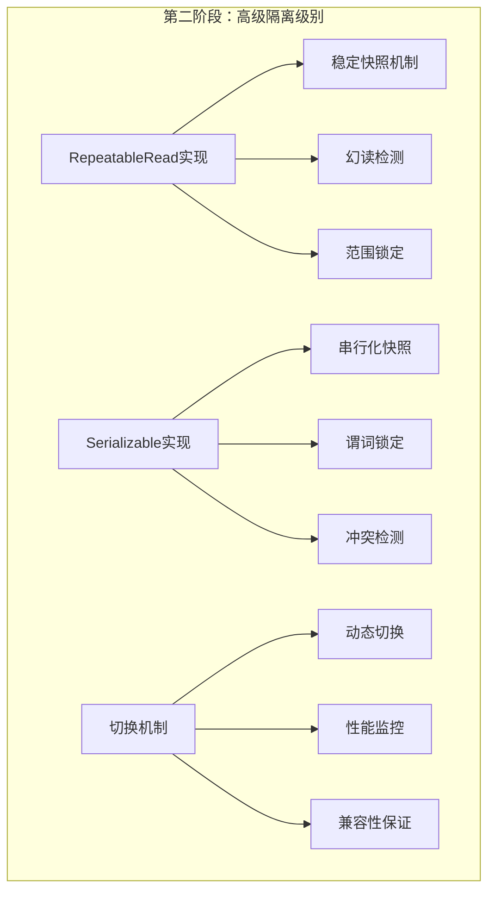
```mermaid
graph TB
    subgraph "第二阶段：高级隔离级别"
        A[RepeatableRead实现] --> A1[稳定快照机制]
        A --> A2[幻读检测]
        A --> A3[范围锁定]
        
        B[Serializable实现] --> B1[串行化快照]
        B --> B2[谓词锁定]
        B --> B3[冲突检测]
        
        C[切换机制] --> C1[动态切换]
        C --> C2[性能监控]
        C --> C3[兼容性保证]
    end
```

## 4. 细粒度锁定设计

### 4.1 锁层次结构

```mermaid
graph TD
    subgraph "锁粒度层次"
        A[数据库锁] --> B[表级锁]
        B --> C[页级锁]
        C --> D[行级锁]
        
        E[意向锁系统] --> F[意向共享锁(IS)]
        E --> G[意向排他锁(IX)]
        E --> H[共享意向锁(SIX)]
        
        I[锁兼容性矩阵] --> J[锁冲突检测]
        J --> K[锁升级机制]
        K --> L[死锁预防]
    end
```

### 4.2 锁管理器设计

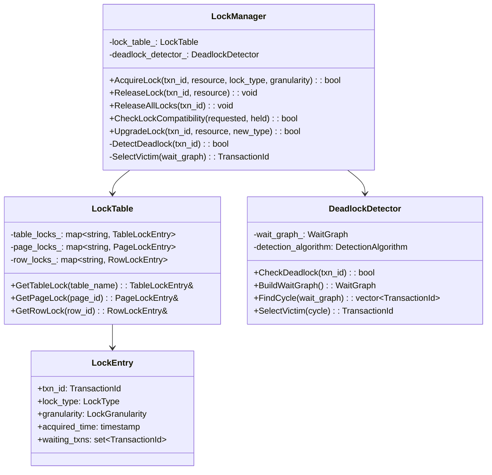
```mermaid
classDiagram
    class LockManager {
        -lock_table_: LockTable
        -deadlock_detector_: DeadlockDetector
        +AcquireLock(txn_id, resource, lock_type, granularity): bool
        +ReleaseLock(txn_id, resource): void
        +ReleaseAllLocks(txn_id): void
        +CheckLockCompatibility(requested, held): bool
        +UpgradeLock(txn_id, resource, new_type): bool
        -DetectDeadlock(txn_id): bool
        -SelectVictim(wait_graph): TransactionId
    }
    
    class LockTable {
        -table_locks_: map~string, TableLockEntry~
        -page_locks_: map~string, PageLockEntry~
        -row_locks_: map~string, RowLockEntry~
        +GetTableLock(table_name): TableLockEntry&
        +GetPageLock(page_id): PageLockEntry&
        +GetRowLock(row_id): RowLockEntry&
    }
    
    class LockEntry {
        +txn_id: TransactionId
        +lock_type: LockType
        +granularity: LockGranularity
        +acquired_time: timestamp
        +waiting_txns: set~TransactionId~
    }
    
    class DeadlockDetector {
        -wait_graph_: WaitGraph
        -detection_algorithm: DetectionAlgorithm
        +CheckDeadlock(txn_id): bool
        +BuildWaitGraph(): WaitGraph
        +FindCycle(wait_graph): vector~TransactionId~
        +SelectVictim(cycle): TransactionId
    }
    
    LockManager --> LockTable
    LockManager --> DeadlockDetector
    LockTable --> LockEntry
```

### 4.3 锁粒度自适应机制

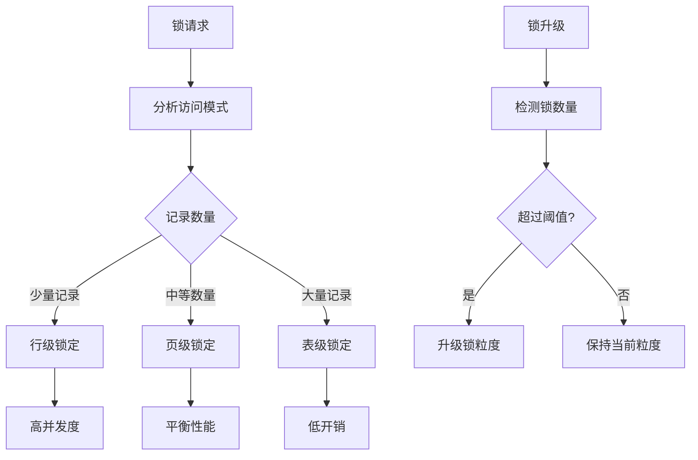
```mermaid
graph TD
    A[锁请求] --> B[分析访问模式]
    B --> C{记录数量}
    C -->|少量记录| D[行级锁定]
    C -->|中等数量| E[页级锁定]
    C -->|大量记录| F[表级锁定]
    
    D --> G[高并发度]
    E --> H[平衡性能]
    F --> I[低开销]
    
    J[锁升级] --> K[检测锁数量]
    K --> L{超过阈值?}
    L -->|是| M[升级锁粒度]
    L -->|否| N[保持当前粒度]
```

### 4.4 实施步骤

#### 4.4.1 第一阶段：基础细粒度锁（4-5周）

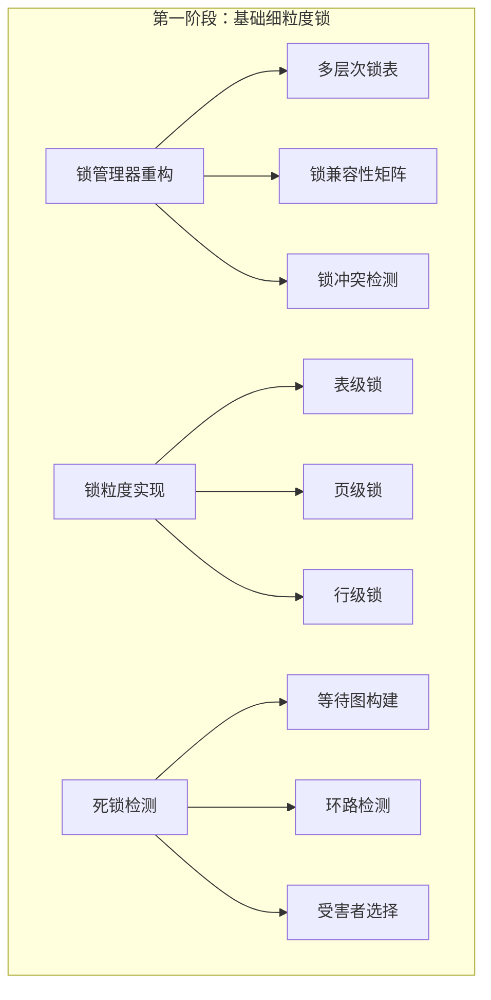
```mermaid
graph TB
    subgraph "第一阶段：基础细粒度锁"
        A[锁管理器重构] --> A1[多层次锁表]
        A --> A2[锁兼容性矩阵]
        A --> A3[锁冲突检测]
        
        B[锁粒度实现] --> B1[表级锁]
        B --> B2[页级锁]
        B --> B3[行级锁]
        
        C[死锁检测] --> C1[等待图构建]
        C --> C2[环路检测]
        C --> C3[受害者选择]
    end
```

#### 4.4.2 第二阶段：高级锁功能（3-4周）

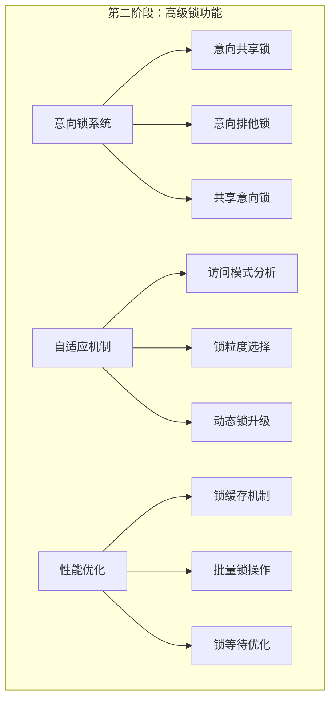
```mermaid
graph TB
    subgraph "第二阶段：高级锁功能"
        A[意向锁系统] --> A1[意向共享锁]
        A --> A2[意向排他锁]
        A --> A3[共享意向锁]
        
        B[自适应机制] --> B1[访问模式分析]
        B --> B2[锁粒度选择]
        B --> B3[动态锁升级]
        
        C[性能优化] --> C1[锁缓存机制]
        C --> C2[批量锁操作]
        C --> C3[锁等待优化]
    end
```

## 5. 多级保存点设计

### 5.1 保存点架构

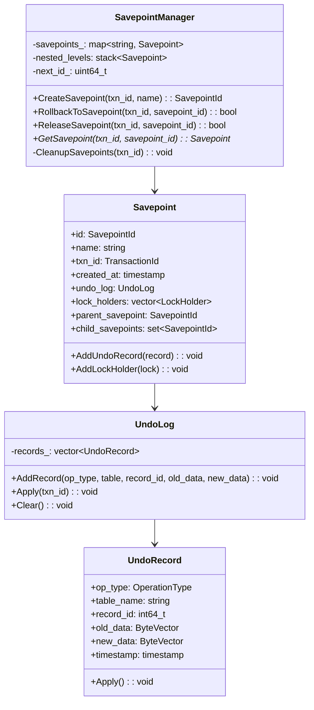
```mermaid
classDiagram
    class SavepointManager {
        -savepoints_: map~string, Savepoint~
        -nested_levels: stack~Savepoint~
        -next_id_: uint64_t
        +CreateSavepoint(txn_id, name): SavepointId
        +RollbackToSavepoint(txn_id, savepoint_id): bool
        +ReleaseSavepoint(txn_id, savepoint_id): bool
        +GetSavepoint(txn_id, savepoint_id): Savepoint*
        -CleanupSavepoints(txn_id): void
    }
    
    class Savepoint {
        +id: SavepointId
        +name: string
        +txn_id: TransactionId
        +created_at: timestamp
        +undo_log: UndoLog
        +lock_holders: vector~LockHolder~
        +parent_savepoint: SavepointId
        +child_savepoints: set~SavepointId~
        +AddUndoRecord(record): void
        +AddLockHolder(lock): void
    }
    
    class UndoLog {
        -records_: vector~UndoRecord~
        +AddRecord(op_type, table, record_id, old_data, new_data): void
        +Apply(txn_id): void
        +Clear(): void
    }
    
    class UndoRecord {
        +op_type: OperationType
        +table_name: string
        +record_id: int64_t
        +old_data: ByteVector
        +new_data: ByteVector
        +timestamp: timestamp
        +Apply(): void
    }
    
    SavepointManager --> Savepoint
    Savepoint --> UndoLog
    UndoLog --> UndoRecord
```

### 5.2 嵌套保存点处理

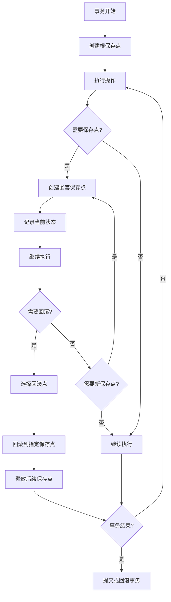
```mermaid
graph TD
    A[事务开始] --> B[创建根保存点]
    B --> C[执行操作]
    C --> D{需要保存点?}
    D -->|是| E[创建嵌套保存点]
    D -->|否| F[继续执行]
    E --> G[记录当前状态]
    G --> H[继续执行]
    H --> I{需要回滚?}
    I -->|是| J[选择回滚点]
    I -->|否| K{需要新保存点?}
    J --> L[回滚到指定保存点]
    L --> M[释放后续保存点]
    K -->|是| E
    K -->|否| F
    F --> N{事务结束?}
    M --> N
    N -->|是| O[提交或回滚事务]
    N -->|否| C
```

### 5.3 实施步骤

#### 5.3.1 第一阶段：基础保存点（3-4周）

```mermaid
graph TB
    subgraph "第一阶段：基础保存点"
        A[保存点管理器] --> A1[SavepointManager类]
        A --> A2[基础保存点操作]
        A --> A3[与事务集成]
        
        B[撤销日志] --> B1[UndoLog实现]
        B --> B2[记录管理]
        B --> B3[回滚机制]
        
        C[基础嵌套] --> C1[简单嵌套支持]
        C --> C2[回滚链管理]
        C --> C3[保存点释放]
    end
```

#### 5.3.2 第二阶段：高级保存点（3-4周）

```mermaid
graph TB
    subgraph "第二阶段：高级保存点"
        A[命名保存点] --> A1[名称解析]
        A --> A2[重复名称处理]
        A --> A3[名称空间管理]
        
        B[部分回滚] --> B1[选择性回滚]
        B --> B2[资源释放]
        B --> B3[状态一致性]
        
        C[性能优化] --> C1[延迟写入]
        C --> C2[批量回滚]
        C --> C3[内存优化]
    end
```

## 6. 集成重构策略

### 6.1 渐进式集成计划

```mermaid
graph TD
    subgraph "渐进式集成计划"
        A[阶段1] --> A1[MVCC基础框架]
        A --> A2[保持两阶段锁]
        A --> A3[可配置切换]
        
        B[阶段2] --> B1[完整MVCC实现]
        B --> B2[多隔离级别]
        B --> B3[细粒度锁]
        
        C[阶段3] --> C1[高级保存点]
        C --> C2[性能优化]
        C --> C3[稳定性增强]
    end
```

### 6.2 兼容性保证

```mermaid
graph TD
    subgraph "兼容性保证"
        A[API兼容] --> A1[保持现有接口]
        A --> A2[扩展而非替换]
        A --> A3[向后兼容]
        
        B[配置兼容] --> B1[默认行为不变]
        B --> B2[可选新功能]
        B --> B3[渐进式启用]
        
        C[数据兼容] --> C1[现有数据格式]
        C --> C2[版本元数据]
        C --> C3[平滑迁移]
    end
```

### 6.3 风险控制

```mermaid
graph TD
    subgraph "风险控制"
        A[技术风险] --> A1[分阶段验证]
        A --> A2[性能基准测试]
        A --> A3[稳定性测试]
        
        B[回滚策略] --> B1[保留原实现]
        B --> B2[配置回滚]
        B --> B3[快速回滚机制]
        
        C[监控机制] --> C1[性能指标]
        C --> C2[错误监控]
        C --> C3[自动告警]
    end
```

## 7. 实施时间线

```mermaid
gantt
    title 事务处理增强实施时间线
    dateFormat  YYYY-MM-DD
    section MVCC实现
    MVCC基础框架       :mvcc1, 2024-01-01, 6w
    完整MVCC实现        :mvcc2, after mvcc1, 8w
    MVCC集成优化        :mvcc3, after mvcc2, 4w
    
    section 隔离级别
    隔离级别框架        :iso1, 2024-02-01, 4w
    高级隔离级别        :iso2, after iso1, 6w
    隔离级别优化        :iso3, after iso2, 2w
    
    section 细粒度锁
    基础细粒度锁        :lock1, 2024-03-01, 5w
    高级锁功能         :lock2, after lock1, 4w
    锁性能优化          :lock3, after lock2, 3w
    
    section 多级保存点
    基础保存点          :sp1, 2024-04-01, 4w
    高级保存点          :sp2, after sp1, 4w
    保存点优化          :sp3, after sp2, 2w
    
    section 集成测试
    单元测试           :test1, after mvcc3, 4w
    集成测试           :test2, after test1, 4w
    压力测试           :test3, after test2, 4w
```

## 8. 性能预期

### 8.1 预期性能提升

```mermaid
graph LR
    subgraph "性能提升预期"
        A[并发读写性能] --> A1[提升10-50倍]
        B[事务吞吐量] --> B1[提升5-20倍]
        C[锁竞争减少] --> C1[降低80-95%]
        D[死锁概率] --> D1[降低90-99%]
    end
    
    subgraph "资源使用优化"
        E[内存使用] --> E1[优化20-40%]
        F[CPU使用] --> F1[优化30-50%]
        G[I/O效率] --> G1[提升50-100%]
    end
```

### 8.2 功能完整性提升

```mermaid
graph TD
    subgraph "功能完整性"
        A[隔离级别] --> A1[从1种增加到4种]
        B[锁粒度] --> B1[从表级到多级锁]
        C[保存点] --> C1[从简单到多级嵌套]
        D[并发控制] --> D1[从两阶段锁到MVCC]
    end
    
    subgraph "兼容性"
        E[API兼容] --> E1[100%向后兼容]
        F[配置兼容] --> F1[默认行为不变]
        G[数据兼容] --> G1[现有数据格式]
    end
```

## 9. 结论

本事务处理增强方案采用渐进式重构策略，通过MVCC、多隔离级别、细粒度锁定和多级保存点的实现，将显著提升SQLCC的事务处理能力和性能。整个方案分为三个阶段，每个阶段都有明确的目标和可验证的成果，确保风险可控。

通过这种设计，SQLCC将从一个仅支持基本事务的系统，升级为一个具备企业级事务处理能力的数据库系统，同时保持良好的向后兼容性和可维护性。