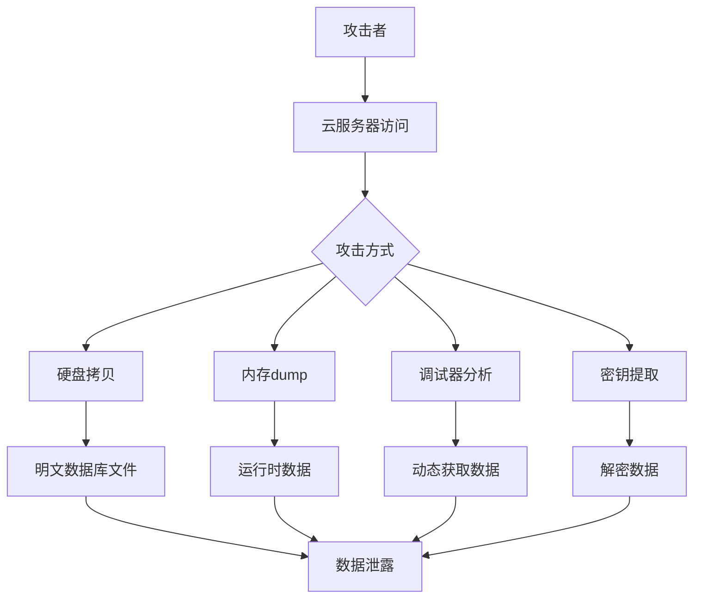
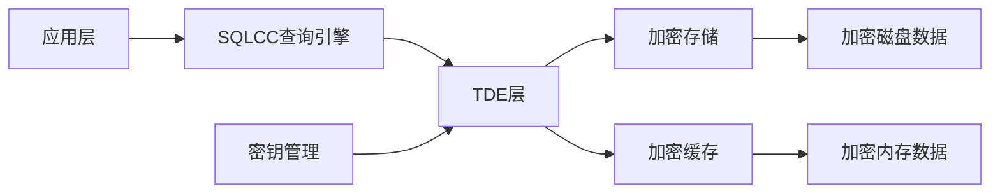
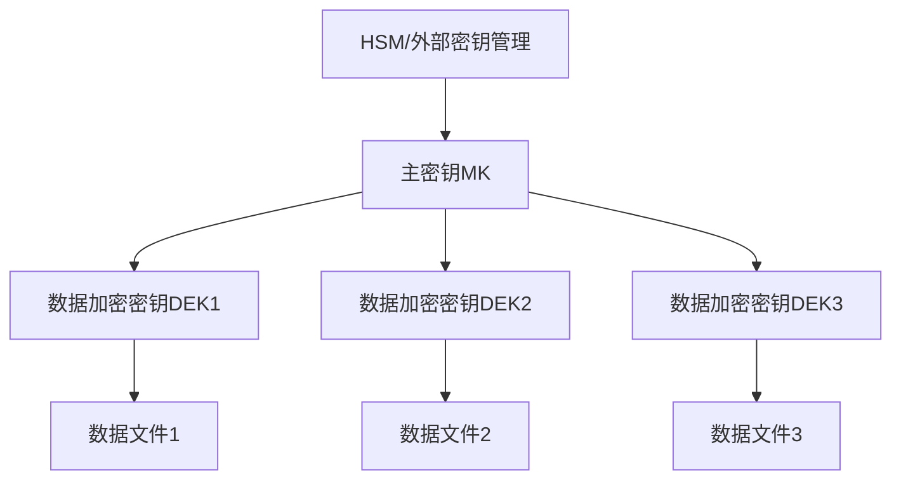
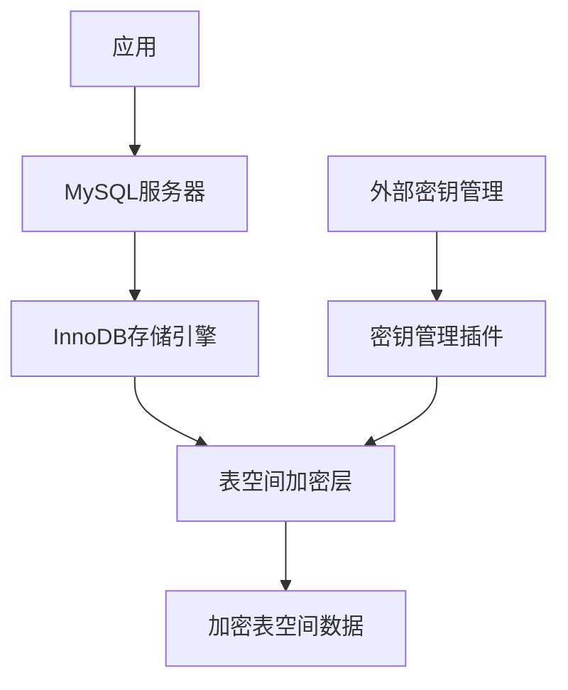

# SQLCC非信任环境安全运行方案

## 概述

本文档分析如何在非信任环境（如云服务器）中安全运行SQLCC数据库，防止通过硬盘拷贝和内存dump导致的数据泄露问题，并对比类似开源数据库软件的安全机制。

## 1. 威胁模型分析

### 1.1 主要威胁
1. **静态数据泄露**：通过硬盘拷贝获取数据库文件，直接读取数据
2. **内存转储**：通过内存dump获取数据库运行时的内存内容
3. **运行时分析**：通过调试器或特殊工具在数据库运行时获取数据
4. **密钥泄露**：数据库加密密钥存储不当或传输过程被截获
5. **侧信道攻击**：通过系统时序、功耗等信息推断数据内容

### 1.2 攻击路径


## 2. SQLCC当前安全能力分析

基于对SQLCC代码的分析，当前系统已有以下安全相关组件：

1. **网络加密**：实现了AES-256-CBC加密和HMAC-SHA256完整性验证
2. **密钥派生**：支持PBKDF2密钥派生功能
3. **传输安全**：网络通信可进行加密传输

但缺乏以下关键安全功能：
1. **静态数据加密**：磁盘上的数据未加密存储
2. **内存保护**：没有专门的内存防dump机制
3. **密钥管理**：缺乏安全的密钥存储和轮换机制

## 3. 非信任环境安全解决方案

### 3.1 透明数据加密（TDE）

透明数据加密可在存储层自动加密所有数据文件，对应用程序透明，无需修改应用代码。

#### 实现方案


#### 核心代码结构
```cpp
// TDE核心组件
class TransparentDataEncryption {
public:
    TransparentDataEncryption(std::shared_ptr<EncryptionKey> master_key);
    
    // 页面加密
    std::vector<uint8_t> EncryptPage(const Page& page);
    
    // 页面解密
    bool DecryptPage(const std::vector<uint8_t>& encrypted_data, Page& page);
    
    // 密钥轮换
    bool RotateMasterKey(std::shared_ptr<EncryptionKey> new_key);
    
private:
    std::shared_ptr<EncryptionKey> master_key_;
    std::map<page_id_t, std::vector<uint8_t>> page_iv_map_;
};
```

### 3.2 内存保护机制

#### mprotect与mlock结合
```cpp
class SecureMemoryManager {
public:
    // 分配受保护内存
    void* AllocateSecureMemory(size_t size);
    
    // 锁定内存防止交换
    bool LockMemory(void* ptr, size_t size);
    
    // 标记内存为不可读
    bool ProtectMemory(void* ptr, size_t size);
    
    // 安全清除内存内容
    void SecureClearMemory(void* ptr, size_t size);
    
private:
    std::vector<void*> locked_regions_;
};
```

#### 数据内存实时加密
对于敏感数据，可采用使用时解密、使用完毕后立即重新加密的方式：


### 3.3 安全密钥管理

#### 分层密钥架构


#### 密钥获取方案
1. **启动时输入**：系统启动时由管理员输入密码派生主密钥
2. **远程密钥服务**：从安全的密钥管理服务获取主密钥
3. **硬件安全模块(HSM)**：使用专用硬件存储和提供主密钥

## 4. 类似开源数据库的安全方案

### 4.1 SQLite安全扩展

#### SQLite Encryption Extension (SEE)
- **特点**：提供透明数据库加密，支持AES-256、RC4等多种加密算法
- **密钥管理**：支持密码密钥、密钥文件、硬件加密
- **实现方式**：在页级别进行加密，对数据库操作透明

#### SQLite安全增强实现
```c
// SEE伪代码示例
int sqlite3_key(sqlite3 *db, const void *pKey, int nKey);
int sqlite3_key_v2(sqlite3 *db, const char *zDbName, const void *pKey, int nKey);
int sqlite3_rekey(sqlite3 *db, const void *pKey, int nKey);
```

### 4.2 PostgreSQL安全机制

#### pgcrypto扩展
- **功能**：提供数据库内加密函数
- **特性**：支持多种加密算法、密钥管理
- **应用场景**：对特定敏感字段进行加密存储

#### PostgreSQL磁盘加密方案
- **全盘加密**：与操作系统级别的磁盘加密方案结合
- **表空间加密**：第三方扩展实现表空间级别加密
- **列加密**：使用pgcrypto对特定列加密

### 4.3 MySQL企业版安全

#### InnoDB表空间加密
- **透明加密**：对InnoDB表空间进行透明加密
- **密钥管理**：通过密钥插件（如Oracle Key Vault）管理密钥
- **主密钥轮换**：支持在线主密钥轮换

#### MySQL加密架构


## 5. SQLCC安全增强实施计划

### 5.1 第一阶段：基础TDE实现
1. **存储引擎改造**：
   - 在存储引擎层添加加密解密接口
   - 实现页级别的加密存储

2. **密钥管理**：
   - 实现简单的基于密码的主密钥派生
   - 添加密钥文件存储选项

### 5.2 第二阶段：内存保护
1. **敏感内存锁定**：
   - 对密钥和敏感数据区域应用mlock
   - 实现安全内存分配器

2. **内存加密**：
   - 对内存中的敏感数据实现实时加密解密

### 5.3 第三阶段：高级安全特性
1. **增强密钥管理**：
   - 支持多种密钥获取方式
   - 实现密钥轮换机制

2. **安全审计**：
   - 记录密钥操作和重要安全事件
   - 实现访问控制

## 6. 代码实现示例

### 6.1 存储引擎TDE集成
```cpp
// 修改StorageEngine类以支持TDE
class SecureStorageEngine : public StorageEngine {
public:
    SecureStorageEngine(ConfigManager &config_manager, 
                       std::shared_ptr<EncryptionKey> master_key);
    
    // 重写页面操作方法，添加加密解密逻辑
    Page *NewPage(int32_t *page_id = nullptr) override;
    Page *FetchPage(int32_t page_id) override;
    bool FlushPage(int32_t page_id) override;
    
private:
    // 加密页面数据
    std::vector<uint8_t> EncryptPage(const Page& page);
    
    // 解密页面数据
    bool DecryptPage(const std::vector<uint8_t>& encrypted_data, Page& page);
    
    std::shared_ptr<EncryptionKey> master_key_;
    std::unique_ptr<TransparentDataEncryption> tde_;
};
```

### 6.2 安全内存管理器实现
```cpp
class SecureMemoryManager {
public:
    void* AllocateSecureMemory(size_t size) {
        void* ptr = malloc(size);
        if (!ptr) return nullptr;
        
        // 锁定内存防止交换
        if (mlock(ptr, size) != 0) {
            free(ptr);
            return nullptr;
        }
        
        // 记录锁定的区域
        locked_regions_.push_back(ptr);
        
        return ptr;
    }
    
    void SecureClearMemory(void* ptr, size_t size) {
        if (!ptr) return;
        
        // 使用标准函数安全清除内存
        if (memset_s) {
            memset_s(ptr, size, 0, size);
        } else {
            volatile char* p = static_cast<char*>(ptr);
            for (size_t i = 0; i < size; ++i) {
                p[i] = 0;
            }
        }
    }
    
    ~SecureMemoryManager() {
        // 清除所有锁定的内存区域
        for (void* ptr : locked_regions_) {
            free(ptr);
        }
    }
    
private:
    std::vector<void*> locked_regions_;
};
```

## 7. 性能影响评估与优化

### 7.1 性能影响
1. **加密开销**：AES-NI可显著降低加密开销（约5-15%性能影响）
2. **内存锁定**：可能增加内存压力，需合理规划
3. **密钥管理**：密钥轮换时可能有短暂性能下降

### 7.2 优化策略
1. **硬件加速**：利用CPU的AES-NI指令集
2. **批量处理**：批量加密减少上下文切换
3. **缓存优化**：缓存加密后的页面减少重复操作

## 8. 部署建议

### 8.1 云环境部署
1. **密钥分离**：将密钥存储与数据存储分离
2. **安全启动**：确保启动过程安全可靠
3. **访问控制**：限制对数据库文件的直接访问

### 8.2 监控与审计
1. **密钥操作审计**：记录密钥创建、轮换、删除操作
2. **访问监控**：监控对数据库文件的异常访问
3. **异常检测**：检测内存dump行为和调试器附加

## 9. 结论

通过实施透明数据加密、内存保护和安全密钥管理，SQLCC可以在非信任环境中安全运行，有效防止通过硬盘拷贝和内存dump导致的数据泄露。实现时需平衡安全性与性能，根据实际场景选择适当的安全级别。

参考SQLite SEE、PostgreSQL pgcrypto和MySQL表空间加密的成熟经验，SQLCC可分阶段实施安全增强，逐步提升系统安全性。