# SQLCC可视化架构设计文档

## 1. 系统架构概览

### 1.1 整体系统架构图

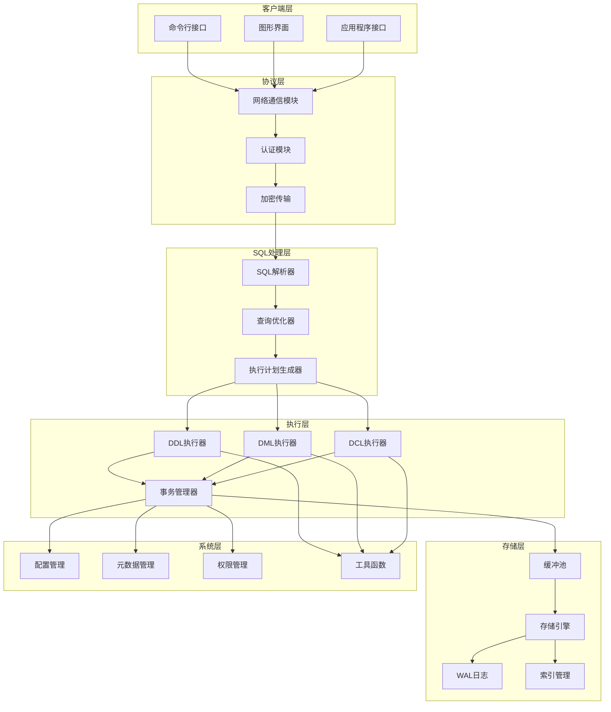

## 2. 核心模块类图

### 2.1 核心系统类图

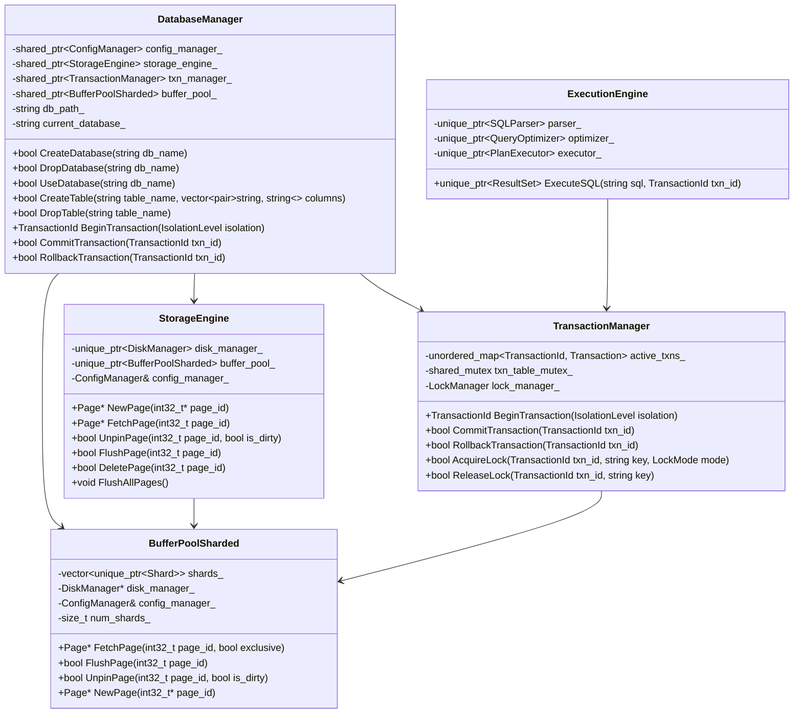

### 2.2 SQL执行器类图

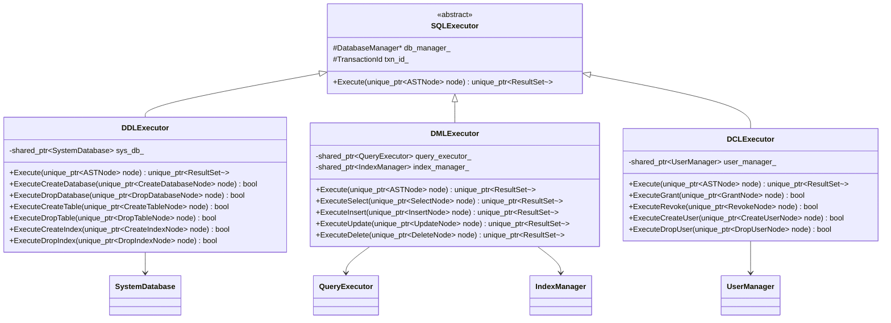

## 3. 组件协作图

### 3.1 SQL查询执行协作图

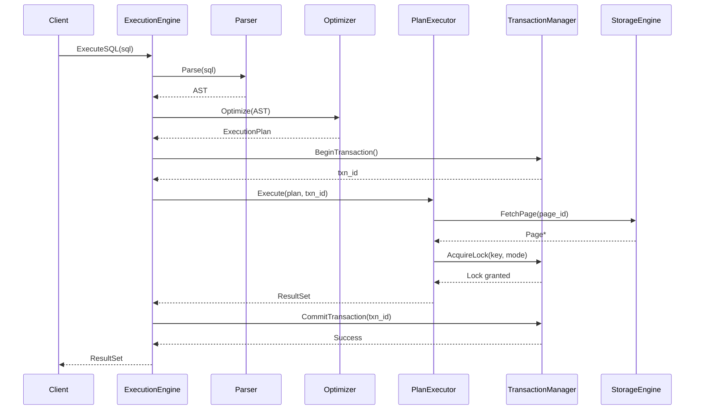

### 3.2 事务处理协作图

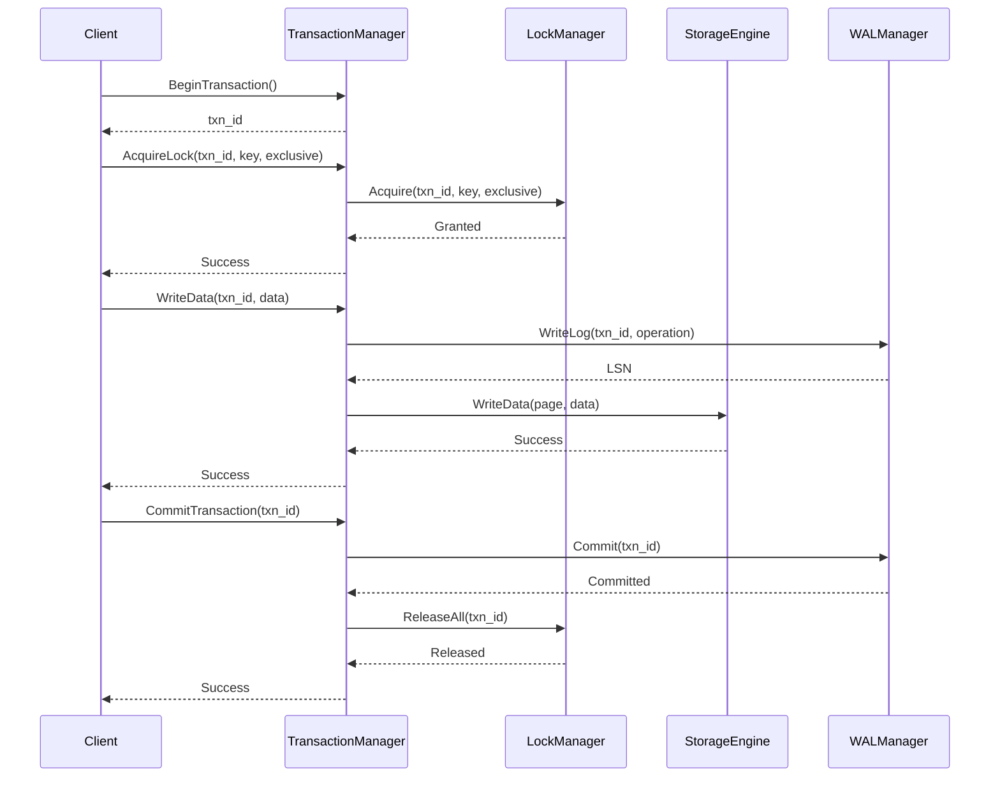

## 4. 状态图

### 4.1 事务状态图

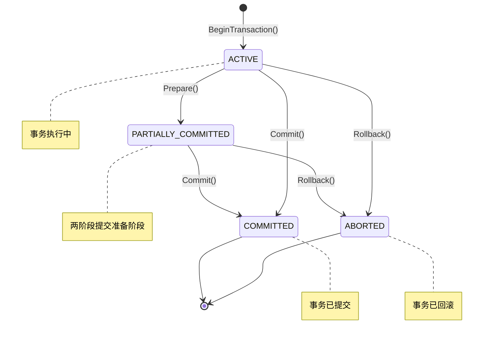

### 4.2 页面状态图

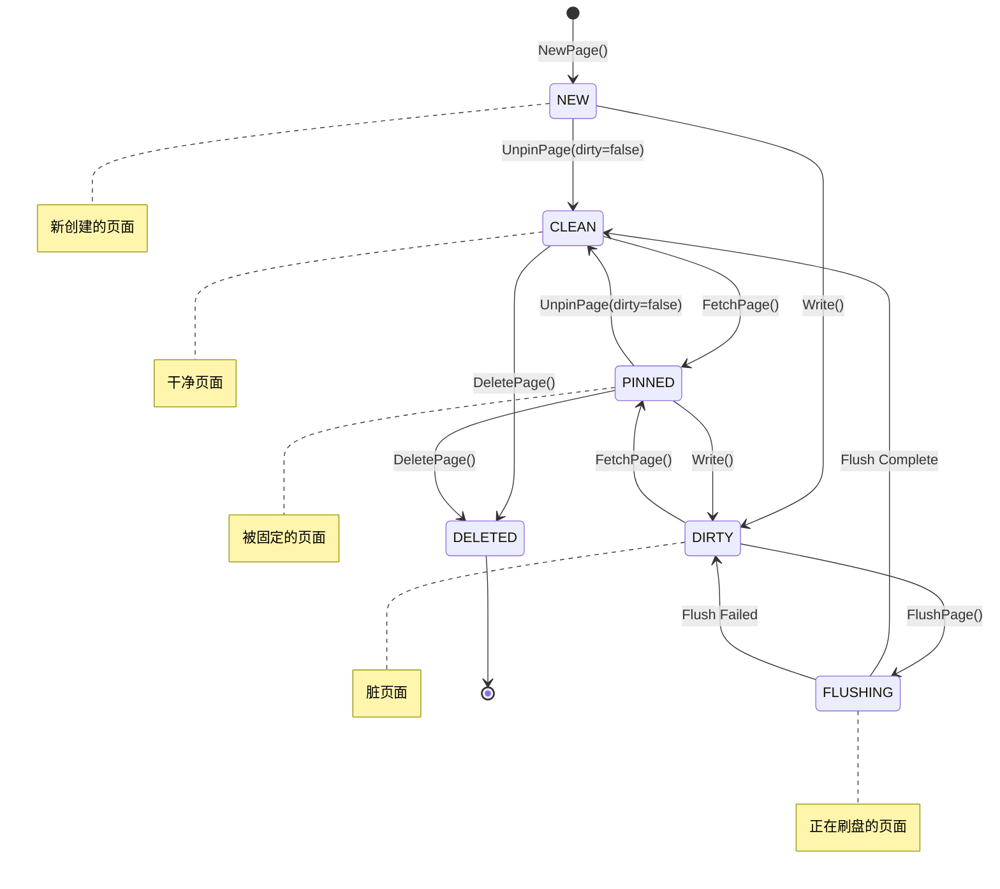

## 5. 活动图

### 5.1 SQL查询执行活动图

```mermaid
activityDiagram
    start
    :接收SQL查询;
    :解析SQL;
    :生成语法树;
    
    if (语法正确?) then (是)
        :语义分析;
        :查询优化;
        :生成执行计划;
        
        if (需要事务?) then (是)
            :开始事务;
        else (否)
            :使用现有事务;
        endif
        
        :执行计划;
        
        while (还有操作?) then (是)
            :获取数据锁;
            :执行操作;
            :释放锁;
        endwhile (否)
        
        :提交事务;
        :返回结果;
    else (否)
        :返回语法错误;
    endif
    
    end
```

### 5.2 缓冲池管理活动图

```mermaid
activityDiagram
    start
    :接收页面请求;
    
    if (页面在缓冲池?) then (是)
        :增加引用计数;
        :移动到LRU头部;
        :返回页面指针;
    else (否)
        if (缓冲池已满?) then (是)
            :选择替换页面;
            
            if (页面为脏页?) then (是)
                :写入磁盘;
            else (否)
                :直接替换;
            endif
            
            :从磁盘加载页面;
            :更新缓冲池;
        else (否)
            :从磁盘加载页面;
            :添加到缓冲池;
        endif
        
        :设置引用计数为1;
        :返回页面指针;
    endif
    
    :等待页面释放;
    :减少引用计数;
    
    if (引用计数为0?) then (是)
        if (页面为脏页?) then (是)
            :标记为脏页;
        endif
        
        :移动到LRU尾部;
    endif
    
    end
```

## 6. 部署图

### 6.1 单机部署图

```mermaid
deployment
    node "应用服务器" {
        artifact "SQLCC Server" {
            component "SQL处理层" {
                component "SQL解析器"
                component "查询优化器"
                component "执行计划生成器"
            }
            
            component "执行层" {
                component "DDL执行器"
                component "DML执行器"
                component "DCL执行器"
                component "事务管理器"
            }
            
            component "存储层" {
                component "缓冲池"
                component "存储引擎"
                component "索引管理器"
            }
            
            component "系统层" {
                component "配置管理器"
                component "元数据管理器"
                component "权限管理器"
            }
        }
        
        artifact "SQL文件" {
            [数据文件]
            [日志文件]
            [配置文件]
        }
    }
    
    node "客户端设备" {
        artifact "SQLCC CLI"
        artifact "SQLCC GUI"
    }
    
    "客户端设备" --> "应用服务器": 网络连接
```

### 6.2 分布式部署图

```mermaid
deployment
    node "负载均衡器" {
        component "负载均衡服务"
    }
    
    node "SQLCC节点1" {
        artifact "SQLCC Server1"
        artifact "本地存储1"
    }
    
    node "SQLCC节点2" {
        artifact "SQLCC Server2"
        artifact "本地存储2"
    }
    
    node "SQLCC节点3" {
        artifact "SQLCC Server3"
        artifact "本地存储3"
    }
    
    node "协调服务集群" {
        component "配置管理服务"
        component "元数据管理服务"
        component "分布式锁服务"
    }
    
    node "客户端设备" {
        artifact "SQLCC客户端"
    }
    
    "客户端设备" --> "负载均衡器"
    "负载均衡器" --> "SQLCC节点1"
    "负载均衡器" --> "SQLCC节点2"
    "负载均衡器" --> "SQLCC节点3"
    
    "SQLCC节点1" --> "协调服务集群"
    "SQLCC节点2" --> "协调服务集群"
    "SQLCC节点3" --> "协调服务集群"
    
    "SQLCC节点1" -.-> "SQLCC节点2" : 数据同步
    "SQLCC节点2" -.-> "SQLCC节点3" : 数据同步
    "SQLCC节点3" -.-> "SQLCC节点1" : 数据同步
```

## 7. 继承关系图

### 7.1 AST节点继承关系图

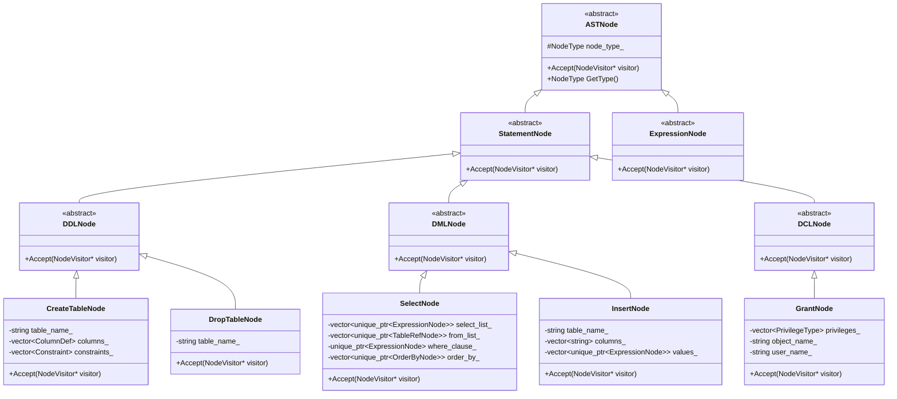

### 7.2 存储组件继承关系图

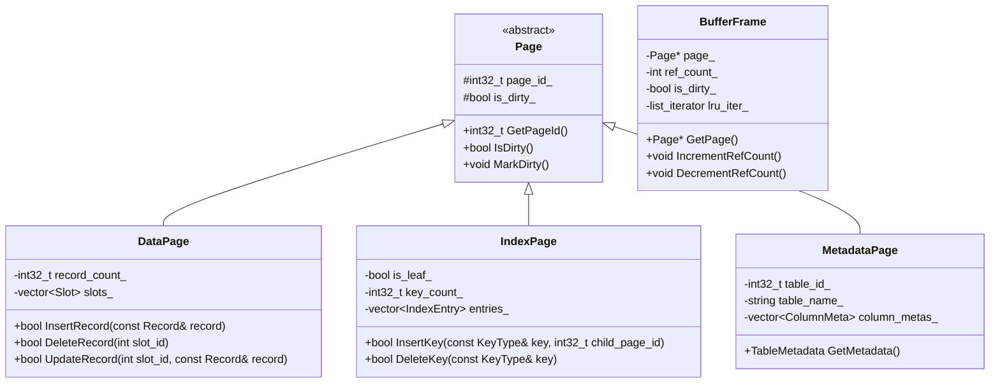

## 8. 数据流图

### 8.1 查询处理数据流图

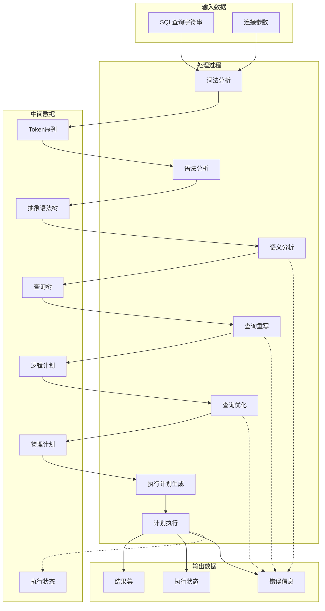

### 8.2 存储层数据流图

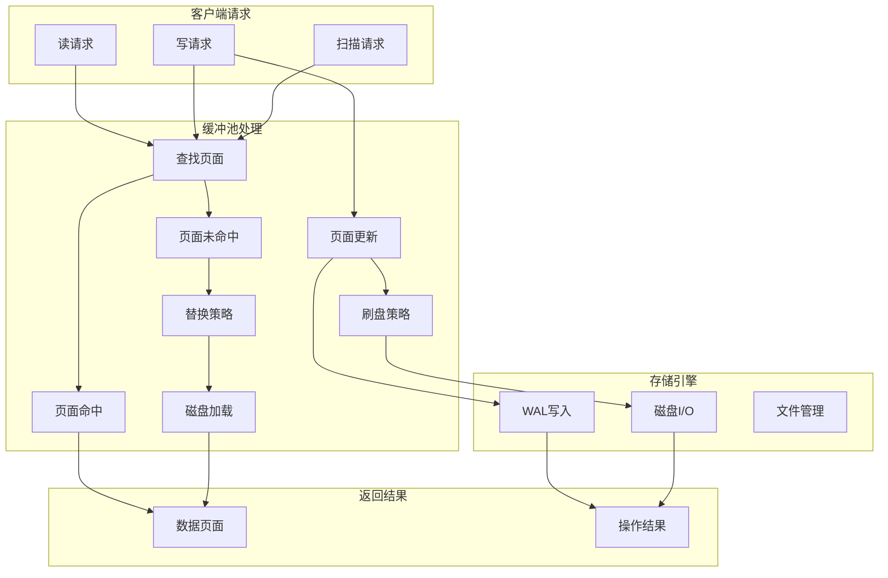

## 9. 系统交互图

### 9.1 完整SQL执行交互图

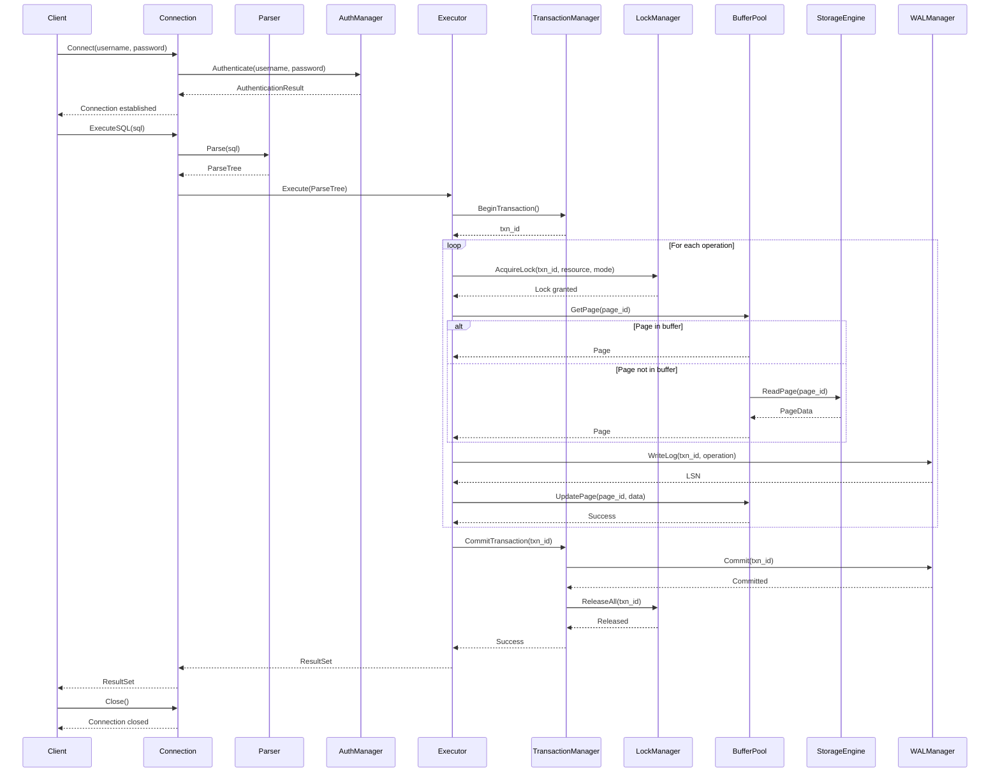

## 10. 结论

本文档通过多种UML和Mermaid图直观展示了SQLCC系统的架构设计，包括：

1. **整体架构图**：展示了系统各层次之间的关系
2. **类图**：详细描述了核心类及其关系
3. **协作图**：展示了组件间的交互流程
4. **状态图**：描述了关键对象的状态转换
5. **活动图**：展示了业务流程的执行步骤
6. **部署图**：描述了系统的部署方式
7. **继承关系图**：展示了类之间的继承层次
8. **数据流图**：展示了数据在系统中的流动
9. **交互图**：完整展示了系统各组件的交互流程

这些可视化图表有助于开发团队更好地理解系统架构，也为后续的系统优化和扩展提供了清晰的参考。通过图表方式展示，避免了复杂的源码细节，更加直观地呈现了系统的设计思路和实现方案。