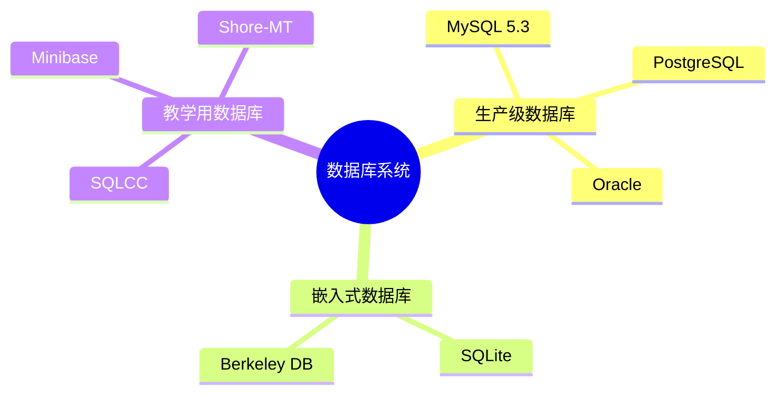
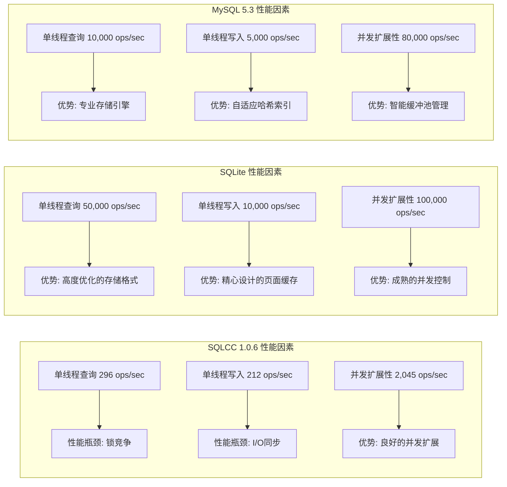
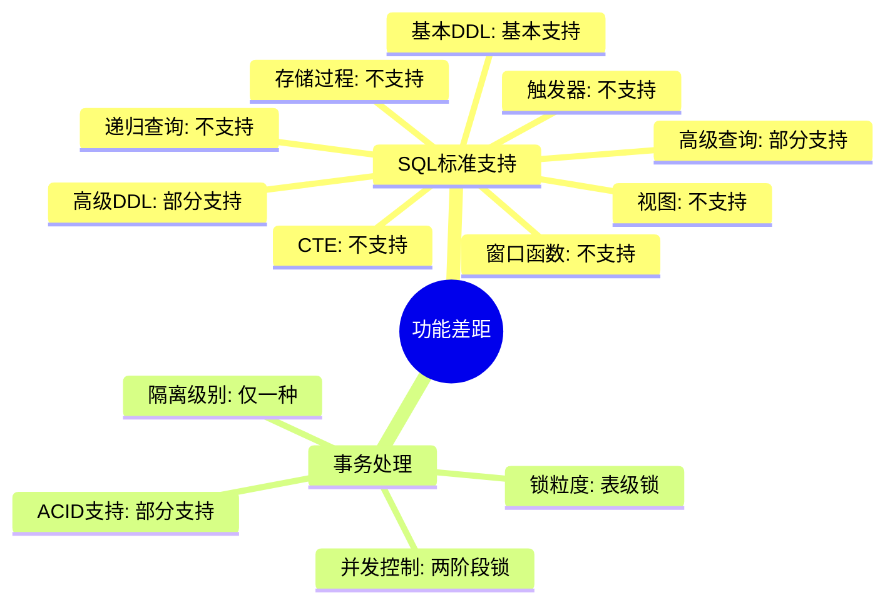
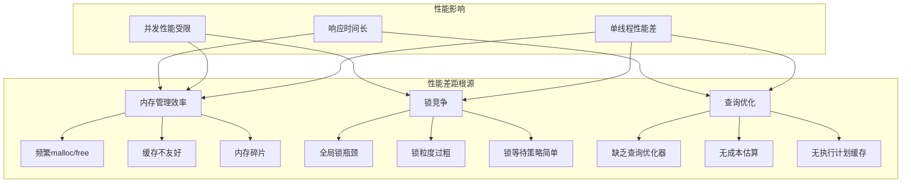
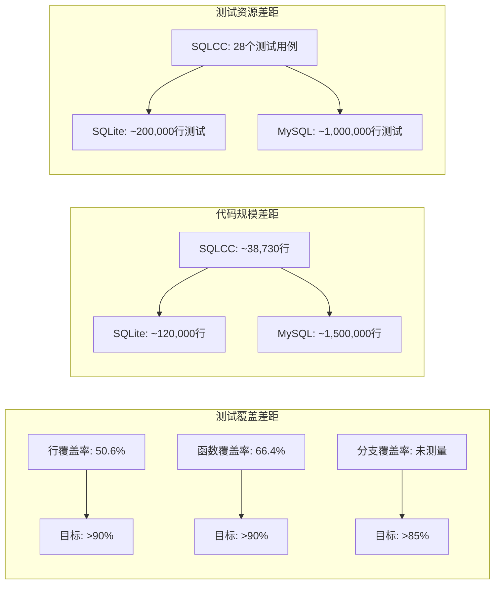
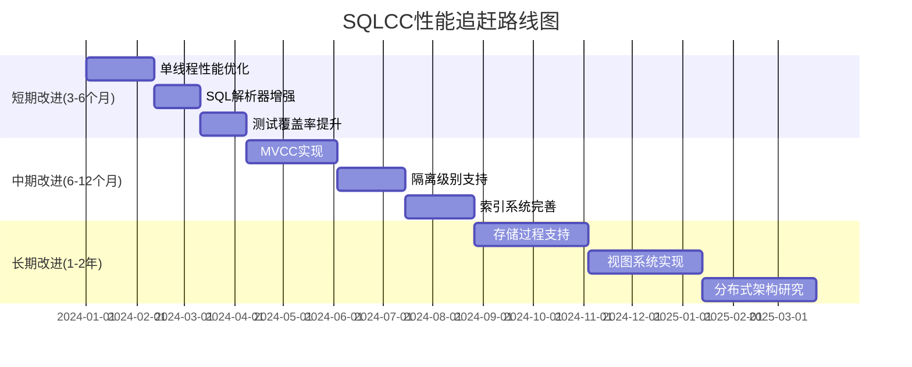
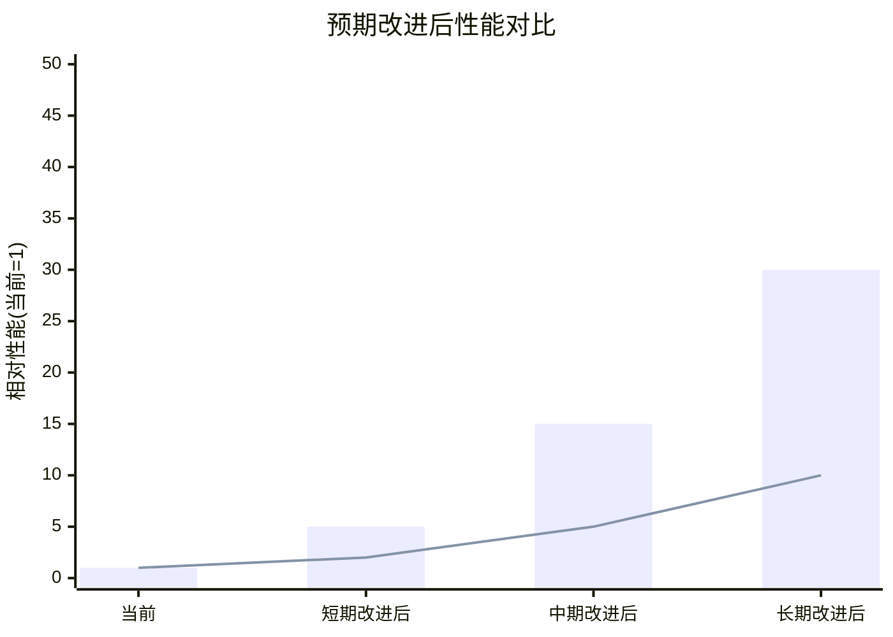

# SQLCC与SQLite和MySQL 5.3功能与性能差距评估

## 1. 项目概述

SQLCC是一个教学用微型数据库系统，当前版本为1.0.6，采用C++17开发，主要用于帮助学生理解数据库原理和实现。它实现了基本的数据库功能，包括存储引擎、SQL解析器、事务管理和基本网络通信功能。

### 1.1 项目定位对比



## 2. 功能差距评估

### 2.1 SQL标准支持对比


### 2.2 事务处理能力对比


### 2.3 事务架构对比


### 2.3 数据类型支持

| 数据类型 | SQLCC 1.0.6 | SQLite | MySQL 5.3 | 差距评估 |
|---------|-------------|---------|------------|----------|
| **基本类型** | ⚠️ INTEGER, VARCHAR, BOOLEAN | ✅ 动态类型系统 | ✅ 丰富类型系统 | 中等差距 |
| **日期时间** | ⚠️ 部分支持 | ✅ 完整支持 | ✅ 完整支持 | 中等差距 |
| **JSON支持** | ⚠️ 框架存在 | ⚠️ 部分支持 | ⚠️ 部分支持 | 中等差距 |
| **空间数据** | ❌ 不支持 | ❌ 不支持 | ✅ 支持 | 显著差距 |
| **全文搜索** | ❌ 不支持 | ✅ FTS扩展 | ✅ 支持 | 显著差距 |

### 2.4 索引系统

| 索引特性 | SQLCC 1.0.6 | SQLite | MySQL 5.3 | 差距评估 |
|---------|-------------|---------|------------|----------|
| **B+树索引** | ✅ 实现 | ✅ 实现 | ✅ 实现 | 基本持平 |
| **哈希索引** | ❌ 不支持 | ❌ 不支持 | ✅ MEMORY引擎支持 | 中等差距 |
| **全文索引** | ❌ 不支持 | ✅ FTS扩展 | ✅ 支持 | 显著差距 |
| **空间索引** | ❌ 不支持 | ❌ 不支持 | ✅ 支持 | 显著差距 |
| **复合索引** | ⚠️ 框架存在 | ✅ 完整支持 | ✅ 完整支持 | 中等差距 |
| **部分索引** | ❌ 不支持 | ✅ 支持 | ✅ 支持 | 显著差距 |

## 3. 性能差距评估

### 3.1 基准性能指标

```mermaid
xychart-beta
    title "单线程性能对比 (ops/sec)"
    x-axis ["查询", "写入"]
    y-axis "操作/秒" 0 --> 60000
    bar [296, 212]
    line [50000, 10000]
    line2 [10000, 5000]
```

### 3.2 并发性能对比

```mermaid
xychart-beta
    title "并发性能对比 (ops/sec)"
    x-axis ["1线程", "2线程", "4线程", "8线程", "16线程", "32线程"]
    y-axis "操作/秒" 0 --> 120000
    bar [296, 500, 900, 2045, 3000, 3500]
    line [50000, 70000, 80000, 100000, 110000, 115000]
    line2 [10000, 15000, 25000, 50000, 65000, 80000]
```

### 3.3 性能差距可视化



### 3.2 扩展性分析

| 扩展性特性 | SQLCC 1.0.6 | SQLite | MySQL 5.3 | 差距评估 |
|-----------|-------------|---------|------------|----------|
| **数据库大小限制** | 有限 | 140TB | 64TB | 中等差距 |
| **并发连接数** | 有限 | 无限制 | 高并发支持 | 显著差距 |
| **分布式支持** | ❌ 不支持 | ❌ 不支持 | ⚠️ 主从复制 | 显著差距 |
| **集群支持** | ❌ 不支持 | ❌ 不支持 | ✅ 支持 | 显著差距 |

## 4. 代码质量评估

### 4.1 测试覆盖率

| 测试指标 | SQLCC 1.0.6 | SQLite | MySQL 5.3 | 差距评估 |
|---------|-------------|---------|------------|----------|
| **行覆盖率** | 50.6% | >95% | >90% | 显著差距 |
| **函数覆盖率** | 66.4% | >95% | >90% | 显著差距 |
| **分支覆盖率** | 未测量 | >90% | >85% | 显著差距 |
| **核心模块测试** | 部分覆盖 | 全面覆盖 | 全面覆盖 | 显著差距 |

### 4.2 代码规模与复杂度

| 代码指标 | SQLCC 1.0.6 | SQLite | MySQL 5.3 | 差距评估 |
|---------|-------------|---------|------------|----------|
| **核心代码行数** | ~28,540行 | ~120,000行 | ~1,500,000行 | 显著差距 |
| **测试代码行数** | ~11,673行 | ~200,000行 | ~1,000,000行 | 显著差距 |
| **模块化程度** | 高 | 高 | 中等 | SQLCC优势 |
| **API文档完整性** | 中等 | 完整 | 完整 | 中等差距 |

## 5. 应用场景差距

### 5.1 适用场景

| 场景 | SQLCC 1.0.6 | SQLite | MySQL 5.3 | 差距评估 |
|-----|-------------|---------|------------|----------|
| **教学学习** | ✅ 完美适用 | ⚠️ 可用 | ❌ 过于复杂 | SQLCC优势 |
| **移动应用** | ❌ 不适用 | ✅ 完美适用 | ❌ 过于复杂 | 显著差距 |
| **小型网站** | ⚠️ 基本可用 | ✅ 完美适用 | ✅ 完美适用 | 中等差距 |
| **企业应用** | ❌ 不适用 | ❌ 不适用 | ✅ 完美适用 | 显著差距 |
| **嵌入式系统** | ⚠️ 基本可用 | ✅ 完美适用 | ❌ 过于复杂 | 中等差距 |

### 5.2 部署和维护

| 部署特性 | SQLCC 1.0.6 | SQLite | MySQL 5.3 | 差距评估 |
|---------|-------------|---------|------------|----------|
| **安装复杂度** | 中等 | 极简单 | 中等 | 中等差距 |
| **配置需求** | 高 | 极低 | 中等 | 中等差距 |
| **维护成本** | 高 | 极低 | 中等 | 显著差距 |
| **社区支持** | 极小 | 庞大 | 庞大 | 显著差距 |
| **文档完整性** | 中等 | 完整 | 完整 | 中等差距 |

## 6. 总体评估与建议

### 6.1 综合评分对比


### 6.2 差距总结

#### 功能差距分析



#### 性能差距分析



#### 质量差距分析



### 6.3 改进建议

#### 改进路线图



#### 预期改进效果



## 7. 结论

SQLCC作为教学用微型数据库系统，在设计和实现上展现了良好的模块化架构和清晰的代码结构。然而，与成熟的SQLite和MySQL 5.3相比，在功能完整性、性能表现和可靠性方面存在显著差距。

这些差距主要源于:
1. 开发时间和团队规模限制
2. 项目定位不同(教学 vs 生产)
3. 技术积累和优化经验不足

SQLCC更适合作为学习数据库原理的案例研究，而非生产环境使用。如果目标是缩小与SQLite和MySQL的差距，需要在性能优化、功能完善和质量保证方面进行大量工作。