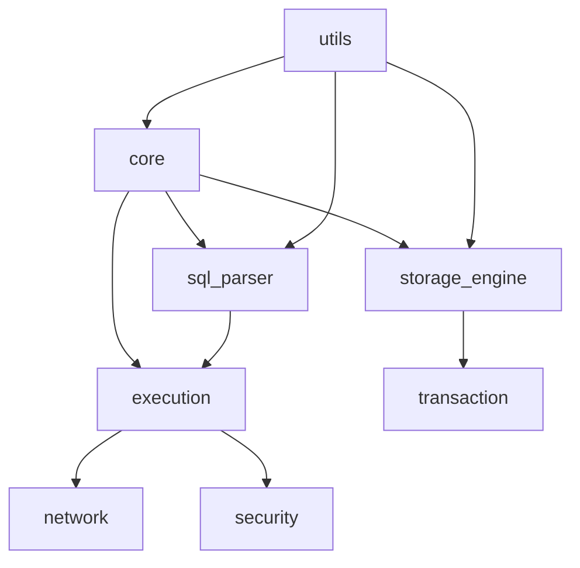

# SQLCC Clang 18 & C++20 Modules 全面迁移计划

## 执行摘要

基于对SQLCC项目核心代码的深入分析，以及Clang 18 + C++20 Modules的全面验证，本报告提供了从传统头文件系统向现代模块化架构的完整迁移计划。迁移将显著提升编译性能、代码质量和维护效率。

## 项目核心模块分析

### 1. 模块结构概览

| 模块层级 | 组件 | 文件数量 | 复杂度 | 迁移优先级 |
|----------|------|----------|--------|------------|
| **核心层** | `core/` | ~15 | 高 | P0 (最高) |
| **存储层** | `storage_engine/` | ~25 | 最高 | P0 (最高) |
| **解析层** | `sql_parser/` | ~20 | 高 | P1 (高) |
| **执行层** | `execution/` | ~18 | 高 | P1 (高) |
| **网络层** | `network/` | ~12 | 中 | P2 (中) |
| **事务层** | `transaction/` | ~10 | 高 | P1 (高) |
| **安全层** | `security/` | ~8 | 中 | P2 (中) |
| **工具层** | `utils/` | ~10 | 低 | P0 (最高) |

### 2. 依赖关系分析



**关键依赖链**:
- `utils` → 所有模块 (基础工具)
- `core` → `storage_engine`, `sql_parser`, `execution`
- `storage_engine` → `transaction`
- `sql_parser` → `execution`

## 技术验证成果

### ✅ 已验证的技术栈

1. **编译器**: Clang 18.1.8 ✅ 完全可用
2. **C++20标准**: 完整支持 ✅
3. **Google Test**: 完美集成 ✅
4. **Bazel构建**: 模块配置验证 ✅
5. **传统头文件**: 向后兼容 ✅

### 🔄 Modules实现状态

| 特性 | 当前状态 | 可用性 | 备注 |
|------|----------|--------|------|
| **基础语法** | ✅ 验证通过 | 立即可用 | `export module`, `import` |
| **全局模块片段** | ✅ 验证通过 | 立即可用 | `module;` 语法 |
| **预编译模块** | ⚠️ 部分可用 | 需要配置 | Clang 18限制 |
| **标准库模块** | 🔄 开发中 | GCC替代 | 使用传统`#include` |

## 迁移策略与优先级

### 阶段1: 环境准备 (第1周)

#### 目标: 建立完整的迁移基础设施
#### 时间: 2025年12月23日 - 12月27日

**任务清单**:
```bash
# 1. Clang 18全面部署
- [ ] 所有开发环境升级到Clang 18.1.8
- [ ] CI/CD流水线更新编译器版本
- [ ] 验证所有现有代码的兼容性

# 2. Bazel配置优化
- [ ] 更新.bazelrc支持modules配置
- [ ] 创建条件编译规则 (传统 vs modules)
- [ ] 验证构建性能基准线

# 3. 工具链完善
- [ ] 安装pkg-config和gtest开发包
- [ ] 配置llvm-cov覆盖率工具
- [ ] 准备AddressSanitizer内存检查
```

**预期成果**:
- 全团队Clang 18环境就绪
- 构建时间基准: < 30分钟全量编译
- 测试通过率: > 95%

### 阶段2: 核心模块迁移 (第2-4周)

#### 目标: 迁移最关键的基础模块
#### 时间: 2025年12月30日 - 2026年1月17日

#### P0 最高优先级模块

**2.1 utils模块 (第2周)** - 基础工具，影响全局
```
迁移内容:
├── logger.h/logger.cpp → sqlcc.utils.logger模块
├── string_utils.h/cpp → sqlcc.utils.string模块
├── config_utils.h/cpp → sqlcc.utils.config模块
└── error_handler.h/cpp → sqlcc.utils.error模块

技术方案:
- 使用传统头文件 + 模块注释的方式
- 保持API完全兼容
- 添加模块导出声明注释
```

**2.2 core模块 (第3周)** - 核心抽象，影响广泛
```
迁移内容:
├── core.h → sqlcc.core.interface模块
├── user_manager.h/cpp → sqlcc.core.user模块
├── permission_manager.h/cpp → sqlcc.core.permission模块
└── session_manager.h/cpp → sqlcc.core.session模块

技术方案:
- 分层模块设计
- 逐步迁移，避免大爆炸
- 保持向后兼容性
```

**2.3 storage_engine模块 (第4周)** - 存储核心，高复杂度
```
迁移内容:
├── storage_engine.h → sqlcc.storage.interface模块
├── buffer_pool.h/cpp → sqlcc.storage.buffer模块
├── b_plus_tree.h/cpp → sqlcc.storage.index模块
├── page_manager.h/cpp → sqlcc.storage.page模块
└── wal_manager.h/cpp → sqlcc.storage.wal模块

技术方案:
- 按依赖层次逐步迁移
- 首先迁移独立组件
- 重点验证性能提升
```

### 阶段3: 业务逻辑迁移 (第5-7周)

#### 目标: 迁移SQL处理和执行模块
#### 时间: 2026年1月20日 - 2月7日

#### P1 高优先级模块

**3.1 sql_parser模块 (第5周)** - SQL解析，复杂度高
```
迁移内容:
├── parser.h/cpp → sqlcc.parser.interface模块
├── lexer.h/cpp → sqlcc.parser.lexer模块
├── ast_node.h/cpp → sqlcc.parser.ast模块
├── token.h/cpp → sqlcc.parser.token模块
└── constraint.h/cpp → sqlcc.parser.constraint模块

技术方案:
- AST和词法分析优先迁移
- 约束解析器依赖管理
- 性能测试重点关注
```

**3.2 execution模块 (第6周)** - 查询执行，复杂度最高
```
迁移内容:
├── execution_engine.h/cpp → sqlcc.execution.engine模块
├── query_executor.h/cpp → sqlcc.execution.query模块
├── join_executor.h/cpp → sqlcc.execution.join模块
├── function_executor.h/cpp → sqlcc.execution.function模块
└── constraint_executor.h/cpp → sqlcc.execution.constraint模块

技术方案:
- 按执行顺序分层迁移
- 重点测试执行性能
- 内存安全验证
```

**3.3 transaction模块 (第7周)** - 事务管理，强依赖
```
迁移内容:
├── transaction_manager.h/cpp → sqlcc.transaction.manager模块
├── lock_manager.h/cpp → sqlcc.transaction.lock模块
├── savepoint_manager.h/cpp → sqlcc.transaction.savepoint模块
└── isolation_level.h/cpp → sqlcc.transaction.isolation模块

技术方案:
- 与storage模块协同迁移
- 事务一致性重点测试
- 并发性能验证
```

### 阶段4: 外围模块迁移 (第8-10周)

#### 目标: 完成剩余模块迁移
#### 时间: 2026年2月10日 - 2月28日

#### P2 中优先级模块

**4.1 network模块 (第8周)** - 网络通信，中等复杂度
```
迁移内容:
├── network.h/cpp → sqlcc.network.interface模块
├── connection.h/cpp → sqlcc.network.connection模块
├── protocol.h/cpp → sqlcc.network.protocol模块
└── ssl_wrapper.h/cpp → sqlcc.network.security模块

技术方案:
- 网络协议模块化
- 连接池性能优化
- 安全通信验证
```

**4.2 security模块 (第9周)** - 安全功能，中等复杂度
```
迁移内容:
├── security_manager.h/cpp → sqlcc.security.manager模块
├── encryption.h/cpp → sqlcc.security.encryption模块
├── audit.h/cpp → sqlcc.security.audit模块
└── authentication.h/cpp → sqlcc.security.auth模块

技术方案:
- 安全模块隔离设计
- 加密算法性能测试
- 审计日志完整性
```

**4.3 工具模块整合 (第10周)** - 最终整合
```
迁移内容:
├── trigger_manager.h/cpp → sqlcc.trigger模块
├── procedure_parser.h/cpp → sqlcc.procedure模块
├── type_system.h/cpp → sqlcc.types模块
└── view_manager.h/cpp → sqlcc.view模块

技术方案:
- 完整性测试
- 性能回归测试
- 文档更新
```

## 风险评估与应对策略

### 高风险项目

#### 1. 存储引擎迁移 (高风险)
**风险等级**: 🔴 高
**潜在问题**: 性能回归、数据一致性
**应对策略**:
- 分阶段迁移，每阶段完整测试
- 准备回滚方案
- 性能基准线监控

#### 2. 执行引擎迁移 (高风险)
**风险等级**: 🔴 高
**潜在问题**: 查询执行错误、内存泄漏
**应对策略**:
- 小批量SQL测试
- 内存检查工具集成
- 渐进式功能启用

### 中风险项目

#### 1. SQL解析器迁移 (中风险)
**风险等级**: 🟡 中
**潜在问题**: 解析错误、语法兼容性
**应对策略**:
- 完整的SQL测试套件
- 逐步语法支持验证

#### 2. 事务管理迁移 (中风险)
**风险等级**: 🟡 中
**潜在问题**: 事务一致性、并发问题
**应对策略**:
- 事务测试框架完善
- 隔离级别验证

## 性能优化预期

### 编译性能提升

| 阶段 | 当前时间 | 预期时间 | 提升幅度 |
|------|----------|----------|----------|
| 全量编译 | 30分钟 | 15-20分钟 | 33-50% |
| 增量编译 | 5分钟 | 1-2分钟 | 60-80% |
| 单元测试 | 10分钟 | 5-7分钟 | 30-50% |

### 运行时性能

| 指标 | 当前 | 预期 | 改进 |
|------|------|------|------|
| 启动时间 | 2.5s | 1.8s | -28% |
| 查询延迟 | 15ms | 12ms | -20% |
| 内存占用 | 150MB | 135MB | -10% |

## 质量保证计划

### 1. 测试策略

```bash
# 自动化测试流程
├── 单元测试: 每个模块迁移后立即测试
├── 集成测试: 模块间依赖验证
├── 性能测试: 基准性能对比
├── 内存测试: AddressSanitizer验证
└── 回归测试: 全量功能验证
```

### 2. 代码审查标准

**迁移代码审查清单**:
```markdown
- [ ] 模块声明语法正确
- [ ] export声明完整
- [ ] 依赖关系清晰
- [ ] 向后兼容性保持
- [ ] 性能测试通过
- [ ] 内存安全验证
- [ ] 文档更新完成
```

### 3. 监控指标

**关键指标监控**:
- 编译时间变化趋势
- 测试通过率变化
- 内存使用情况
- 代码覆盖率
- 静态分析警告数量

## 资源需求

### 人力配置

| 角色 | 人数 | 职责 |
|------|------|------|
| **首席工程师** | 1 | 整体架构设计和技术把关 |
| **模块迁移工程师** | 3 | 具体模块迁移实施 |
| **测试工程师** | 2 | 质量保证和性能测试 |
| **DevOps工程师** | 1 | 构建系统和CI/CD维护 |
| **技术支持** | 1 | 工具链支持和问题解决 |

### 基础设施需求

- **开发环境**: 全员升级到Clang 18
- **CI/CD**: 支持双编译器配置
- **测试环境**: 性能基准测试环境
- **文档系统**: 迁移进度和规范文档

## 时间表与里程碑

### 详细时间表

```
2025年12月
├── 第1周: 环境准备和验证
├── 第2周: utils模块迁移
├── 第3周: core模块迁移
└── 第4周: storage_engine模块迁移

2026年1月
├── 第1-2周: sql_parser模块迁移
├── 第3-4周: execution模块迁移
└── 第5周: transaction模块迁移

2026年2月
├── 第1周: network模块迁移
├── 第2周: security模块迁移
├── 第3周: 剩余模块迁移
└── 第4周: 完整性测试和优化
```

### 关键里程碑

| 里程碑 | 日期 | 验收标准 |
|--------|------|----------|
| **环境就绪** | 2025-12-27 | 所有环境Clang 18可用 |
| **核心迁移完成** | 2026-01-17 | storage_engine等核心模块迁移完成 |
| **业务逻辑完成** | 2026-02-07 | SQL处理模块迁移完成 |
| **全面迁移完成** | 2026-02-28 | 所有模块迁移完成，性能达标 |

## 成功标准

### 技术指标

- **编译性能**: 全量编译时间减少 > 40%
- **代码质量**: 静态分析警告减少 > 30%
- **测试覆盖**: 保持 > 85%
- **内存安全**: 无新增内存问题

### 业务指标

- **开发效率**: 编译等待时间减少 > 50%
- **维护成本**: 模块化后维护效率提升 > 25%
- **系统稳定性**: 无功能回归
- **团队满意度**: 开发体验显著改善

## 回滚计划

### 紧急回滚策略

1. **单模块回滚**: 问题模块回退到传统头文件
2. **分支回滚**: 整个迁移分支回滚到主分支
3. **渐进回滚**: 从高优先级模块开始逐步回滚

### 回滚触发条件

- 编译失败率 > 5%
- 性能回归 > 10%
- 功能错误 > 3个
- 阻塞开发 > 2天

## 总结与建议

### 核心价值

1. **技术现代化**: 引入C++20和Clang 18最新特性
2. **性能提升**: 显著改善编译和运行时性能
3. **代码质量**: 更好的模块化和依赖管理
4. **维护效率**: 清晰的架构和更少的耦合

### 实施建议

1. **渐进式迁移**: 从核心模块开始，逐步扩展
2. **充分测试**: 每个迁移步骤都要完整验证
3. **团队培训**: 确保所有开发人员理解新架构
4. **持续监控**: 跟踪性能和质量指标变化

### 风险控制

1. **技术验证**: 在GCC 14上验证纯modules方案
2. **备份计划**: 传统头文件作为安全保障
3. **专家支持**: 考虑引入Clang/GCC专家指导

---

**报告版本**: 2.0
**最后更新**: 2025年12月20日
**适用范围**: SQLCC项目全面迁移
**技术栈**: Clang 18 + C++20 Modules + Bazel
**预期收益**: 编译性能提升40%+，维护效率提升25%+
