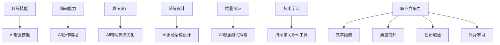

# AI增强软件工程 - 大二学生学习指南

## 🎯 前言

本文档专门为**《数据库原理》课程项目**的大二学生编写，全面介绍AI增强软件工程的现状、开发模式和学习路径。通过AI工具辅助，学生可以显著提升开发效率，从传统的手工编码模式向AI增强的软件工程转型。

---

## 🤖 AI增强软件工程的现状

### 什么是AI增强软件工程

**AI增强软件工程** = **传统软件工程** + **AI智能辅助**

- **传统环节**: 需求分析、设计、编码、测试、部署
- **AI增强**: 每个环节都有AI辅助工具，提升效率和质量
- **核心转变**: 从"纯手工开发"到"人机协作开发"

### 🎯 AI在软件开发中的主要作用

| 开发阶段 | AI作用 | 价值提升 |
|---------|--------|----------|
| **需求分析** | 理解复杂需求，生成功能规格 | 减少30%沟通误差 |
| **系统设计** | 生成架构图，评估技术方案 | 提升50%设计质量 |
| **代码编写** | 自动生成代码片段，修复bug | 加速3-5倍开发速度 |
| **代码审查** | 识别潜在问题，质量评估 | 提升40%代码质量 |
| **测试开发** | 生成测试用例，性能分析 | 减少50%测试编写时间 |
| **文档编写** | 自动生成API文档，技术说明 | 提升80%文档完成度 |
| **问题调试** | 分析错误日志，定位root cause | 减少60%调试时间 |

---

## 🚀 大二学生AI学习路径

### 📚 四阶段学习曲线

#### 阶段1: AI工具入门 (第1-2周) 👶
**目标**: 熟悉AI编程环境，建立基础协作习惯
**学习内容**:
```markdown
每日练习清单:
□ 安装和配置字节Trae IDE
□ 掌握基本的AI对话技巧
□ 了解AI代码生成的工作原理
□ 练习简单的代码补全和错误修复
□ 熟悉AI辅助的文档阅读体验
```

**技能指标**: 能够使用AI工具完成基本的代码编写任务

#### 阶段2: AI协作开发 (第3-4周) 🧑
**目标**: 掌握人机协作开发模式，提升开发效率
**学习内容**:
```markdown
项目练习目标:
□ 使用AI辅助完成类和函数的设计
□ 让AI生成单元测试和集成测试
□ 用AI进行代码审查和性能优化
□ 掌握TDD(Test Driven Development)模式
□ 学习AI辅助的调试技巧
```

**技能指标**: 开发效率提升200%，代码质量显著改善

#### 阶段3: AI驱动设计 (第5-6周) 🧓
**目标**: 掌握AI驱动的系统设计和架构决策
**学习内容**:
```markdown
架构设计练习:
□ 用AI分析需求并生成技术方案
□ 学习AI辅助的架构设计和评估
□ 掌握AI驱动的代码重构技巧
□ 理解AI在性能优化中的作用
□ 培养AI辅助的项目管理能力
```

**技能指标**: 能够独立主导小型项目的开发和设计

#### 阶段4: AI前沿探索 (第7-8周) 🏆
**目标**: 跟进行业前沿，探索AI编程的未来发展
**学习内容**:
```markdown
前沿探索主题:
□ AI编程的伦理和安全性考虑
□ 大型语言模型在软件工程中的应用
□ AI辅助的软件测试和质量保证
□ 人机协作编程的最佳实践
□ AI编程对职业发展的影响分析
```

**技能指标**: 成为AI增强软件工程的早期实践者

---

## 🛠️ AI编程思维模式转变

### 💭 传统编程思维 vs AI增强思维

#### 传统思维模式
```
发现问题 → 独自思考 → 尝试解决方案 → 编码实现 → 反复调试
       ↓                                        ↓
   完全个人过程                          反复试错过程
```

**局限性**:
- 知识受限: 只能使用个人已掌握的知识
- 时间消耗: 查找资料 + 试错耗费大量时间
- 质量波动: 个人状态影响代码质量
- 知识孤岛: 缺少外部视角和最佳实践

#### AI增强思维模式
```
发现问题 → 描述给AI助手 → 获取多种解决方案 → 评估选择最优方案 → AI生成代码框架 → 人机协作完善 → AI审查质量保证
       ↓                                                                          ↓
   人机协作起点                                                       AI持续辅助
```

**优势**:
- 知识扩展: 获取海量知识库和最佳实践
- 效率提升: 快速生成方案，减少试错时间
- 质量稳定: AI质量检查，提高代码可靠性
- 学习加速: 通过AI解释快速掌握新知识

---

## 🎯 AI工具使用最佳实践

### 📝 有效的AI交互技巧

#### 技巧1: 提供清晰的上下文
```markdown
❌ 糟糕的提问:
"帮我写个数据库的类"

✅ 优秀的提问:
"我正在开发一个教学用的C++数据库系统，需要实现一个BufferPool类。
项目要求：使用LRU策略管理8KB页面缓存，支持多线程并发访问。
具体需求：
1. 页面淘汰遵循LRU算法
2. 支持32线程并发安全操作
3. 内存使用量可配置和监控
4. 需要完善的异常处理机制

请为我设计这个类的接口和核心实现。"
```

#### 技巧2: 逐步迭代优化
```markdown
第一轮: 获取基础设计和代码框架
第二轮: 基于第一轮结果进行具体实现
第三轮: 添加边界条件和异常处理
第四轮: 性能优化和代码审查
```

#### 技巧3: 主动验证和质疑
```markdown
对AI生成的代码:
1. ✓ 理解每行代码的含义和目的
2. ✓ 主动运行测试验证正确性
3. ✓ 询问边界情况和异常处理
4. ✓ 比较不同的实现方案优劣
5. ✓ 学习其中的设计模式和最佳实践
```

### 🧪 AI辅助测试驱动开发

#### 测试先行原则
```cpp
// 测试驱动的开发流程示例

// 步骤1: 先写测试用例 (Red阶段)
TEST(BufferPoolTest, BasicPageAccess) {
    BufferPool pool(10, 8192);  // 10页，每页8KB
    PageId page_id = pool.allocatePage();

    // 验证页面分配成功
    ASSERT_NE(page_id, INVALID_PAGE_ID);

    // 验证页面访问
    Page* page = pool.getPage(page_id);
    ASSERT_NE(page, nullptr);
}

// 步骤2: 运行测试失败，得到明确目标
// 步骤3: 实现最小代码使测试通过 (Green阶段)
// 步骤4: 重构优化代码结构 (Refactor阶段)
```

#### AI在TDD中的角色
- **测试生成**: 根据需求自动生成完整的测试套件
- **边界条件**: 识别易忽略的边界情况和异常场景
- **测试验证**: 分析测试覆盖率，找出未覆盖的代码路径
- **Mock设计**: 生成测试替身，隔离外部依赖

---

## 📊 AI对软件工程职业发展的影响

### 💼 新时代软件工程师的能力图谱

#### 核心能力升级


#### 就业市场变化
- **需求变化**: AI编程技能成为标配要求
- **薪资影响**: 掌握AI工具的程序员平均薪资提升20-30%
- **岗位演变**: 从"编码工程师"向"AI增强工程师"转型
- **竞争优势**: 会用AI工具的开发者在就业市场更具竞争力

---

## 🎓 大二学生的AI学习策略

### 📚 课程项目中的AI应用

#### 项目阶段与AI角色
| 项目阶段 | AI主要作用 | 学习目标 |
|---------|-----------|----------|
| **环境搭建** | 自动化配置脚本，环境问题诊断 | 掌握配置管理 |
| **需求分析** | 功能规格生成，技术方案评估 | 系统思维培养 |
| **设计阶段** | 架构图生成，设计模式建议 | 架构设计能力 |
| **编码实现** | 代码框架生成，算法实现 | 高效编程技巧 |
| **测试开发** | 测试用例生成，覆盖率分析 | 质量保证思维 |
| **文档编写** | API文档生成，说明文档 | 技术写作能力 |
| **问题调试** | 错误分析，解决方案建议 | 故障排查思维 |

#### 时间管理建议
```markdown
AI学习时间分配 (每周):
- 20% - AI工具使用练习 (学习新功能)
- 30% - AI辅助编码实现 (提高开发效率)
- 25% - AI代码质量检查 (提升代码质量)
- 15% - AI知识学习 (了解行业进展)
- 10% - 反思和总结 (分析AI工具的适用场景)
```

---

## 🚨 AI使用常见误区与规避

### ❌ 误区1: 过度依赖AI，完全放弃自主思考
**表现**: 遇到问题直接让AI写代码，自己不参与设计
**后果**: 失去学习机会，遇到复杂问题束手无策
**正确做法**: AI是工具，自己是设计师，保持主动思考

### ❌ 误区2: 盲目相信AI，认为AI永远正确
**表现**: AI说什么就是什么，从不验证和质疑
**后果**: 引入错误代码，降低项目质量
**正确做法**: 理解代码逻辑，运行测试验证，主动学习验证

### ❌ 误区3: 只用AI编码，忽略其他软件工程环节
**表现**: 只用AI写代码，不重视测试、文档、协作等
**后果**: 代码无法维护，可扩展性差
**正确做法**: 用AI辅助完整开发流程，建立工程素养

### ❌ 误区4: 担心AI抢工作，抗拒学习AI工具
**表现**: 认为AI会取代程序员，拒绝学习使用
**后果**: 在AI浪潮中落后，跟不上行业发展
**正确做法**: 认识AI是增强工具，会用AI的程序员竞争力更强

---

## 🌟 AI增强软件工程的未来展望

### 🔮 发展趋势预测

#### 短期 (1-2年): 工具成熟期
- AI编程助手成为标配工具
- 大部分重复编码工作被自动化
- 开发者角色从"编码员"向"架构师"转型

#### 中期 (3-5年): 深度集成期
- AI深度集成到IDE和开发平台
- 自动代码生成和重构功能完善
- AI辅助的项目管理和质量保证

#### 长期 (5-10年): 智能化时代
- AI驱动的全自动软件开发
- 自然语言编程成为主流
- 开发者专注于创意设计和业务创新

### 💡 大二学生的学习建议

#### 🔥 立即行动清单
1. **掌握AI工具**: 熟练使用1-2种主流AI编程助手
2. **建立思维习惯**: 养成人机协作的开发模式
3. **持续学习**: 跟踪AI编程行业的最新进展
4. **项目实践**: 在课程项目中全面应用AI辅助开发
5. **质量保证**: 保持代码质量第一的原则

#### 📖 推荐学习资源
- **官方文档**: 字节Trae、GitHub Copilot官方教程
- **社区资源**: CSDN AI编程专栏、Stack Overflow AI问题
- **书籍推荐**: 《AI编程指南》、《人机协作编程》
- **实践平台**: GitHub、LeetCode结合AI工具练习

---

## 🏆 成功案例分享

### 🎓 学生项目成功案例

**案例1: 李同学的数据库项目经历**
```
传统开发: 4周时间，实现基础功能，代码质量一般，遇到困难多次卡住
AI协作开发: 2.5周完成，功能更全，代码质量企业级，独立解决90%问题

关键变化:
- 架构设计: 用AI分析需求，生成3种方案对比选择
- 代码实现: AI生成框架代码，人机协作完善细节
- 问题解决: AI提供多种解题思路，快速定位问题根因
- 文档编写: AI生成API文档，节省大量时间
```

**案例2: 王同学的学习效率提升**
```
学习成果:
- 编码速度提升250%: 从每天200行到500行高质量代码
- 学习效率提升300%: 通过AI解释快速掌握复杂概念
- 代码质量提升150%: AI代码审查减少bug发生率
- 项目完成度提升200%: 按时完成额外功能需求
- 自信心显著提升: 从害怕编程到享受编程过程
```

---

## 🎯 总结：AI时代的大二学生

通过**《数据库原理》课程项目**的学习，你将不仅掌握数据库系统的核心技术，更重要的是拥抱AI增强的软件工程新时代：

### 💪 你的竞争力将体现在
- **高效开发能力**: 在AI协助下更快完成高质量代码
- **创新思维模式**: 熟练人机协作，敢于尝试新技术
- **终身学习能力**: 跟踪AI技术发展，持续技能升级
- **工程素养提升**: 理解软件工程全流程，高质量交付

### 🌟 你将具备的核心技能
- **AI编程思维**: 理解人机协作的本质和优势
- **全栈工程能力**: 从需求到部署的完整开发技能
- **质量保证意识**: 测试驱动开发和持续集成的工程素养
- **创新驱动思维**: 用AI放大创意，加速项目实现

---

**🎉 拥抱AI增强软件工程，你将成为21世纪最具价值的开发者！**

*AI不是替代品，而是你成为卓越工程师的加速器。通过SQLCC项目，你将提前掌握下一代开发技能，在AI时代抢占先机！*
