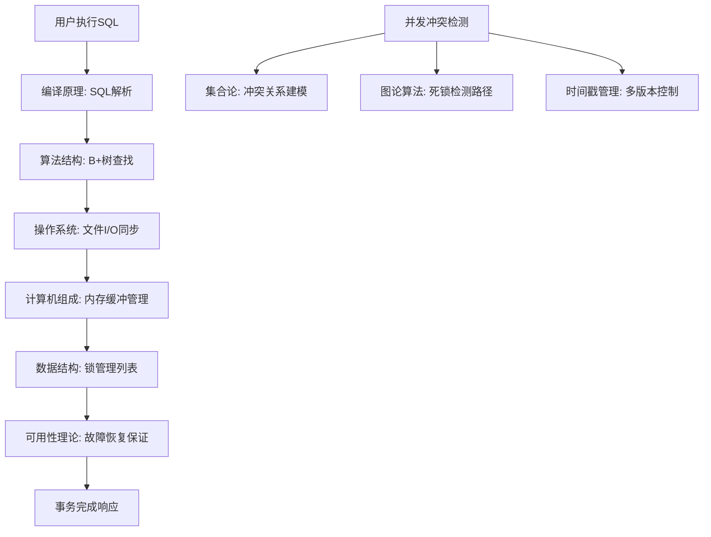
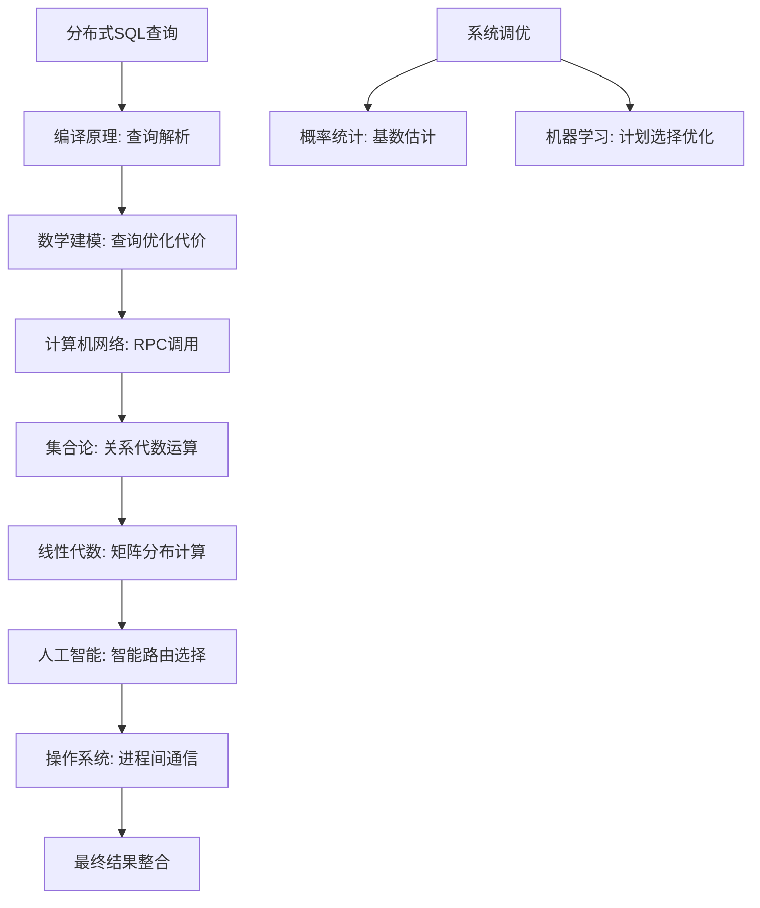

# 数据库知识生态系统指南

## 🎯 前言

本文档为**《数据库原理》课程项目**创建的**数据库知识生态系统指南**，通过数据库这个综合软件系统，展示计算机科学各个领域知识的交织与协同。从单机存储到分布式计算，从数据结构到人工智能，数据库系统就像一座桥梁，帮助你理解计算机科学的完整知识图谱。

**学习目标**:
- 理解数据库系统如何整合计算机科学的各个领域知识
- 掌握各领域知识在数据库中的具体应用场景
- 建立全面的计算机科学认知体系
- 培养跨学科的系统思维能力

---

## 🏗️ 数据库核心模块知识图谱

### 存储引擎 (Storage Engine) - 硬件与软件的交汇点

#### 🖥️ **与计算机组成原理的交织**
```
硬件层面的数据存储与访问：
├── 💾 内存层次结构 (DRAM vs SSD性能差异)
│   ├── SRAM缓存 → 数据库缓冲池
│   ├── DRAM主存 → LRU淘汰算法
│   └── SSD磁盘 → WAL日志刷盘优化
│
├── 🚀 I/O总线优化 (SATA vs NVMe)
│   ├── 顺序I/O → WAL日志写入性能
│   ├── 随机I/O → B+树查找代价
│   └── 并发I/O → 多线程缓冲池访问
│
└── ⚡ CPU缓存体系 (L1/L2/L3三级缓存)
    ├── 缓存行大小 → Page结构设计
    ├── 缓存一致性 → 多线程数据同步
    └── 分支预测 → 索引查找优化
```

**数据库实现中的硬件意识**:
```cpp
// Page大小选择 (8KB) - 为什么？
const size_t PAGE_SIZE = 8192; // 2^13字节

// 因为:
// 1. 符合现代CPU缓存行大小 (64字节的整数倍)
// 2. 平衡内存效率和I/O效率
// 3. 适应SSD随机读写性能特征
// 4. 减少页内碎片，提高空间利用率
```

#### 🐧 **与操作系统的紧密协作**
```
操作系统内核服务调用：
├── 📁 文件系统接口 (open/read/write/fsync)
│   ├── 磁盘文件 → 数据页持久化存储
│   ├── 文件描述符 → 数据库文件句柄管理
│   └── 目录结构 → 数据库多文件组织
│
├── 🧵 进程与线程管理
│   ├── 线程池 → 数据库连接池管理
│   ├── 并发锁 → 行级/表级锁定机制
│   └── 内存映射 → 数据库缓冲池实现
│
└── 🔄 I/O多路复用 (epoll/select)
    ├── 异步I/O → 高并发查询处理
    ├── 零拷贝技术 → 网络数据传输优化
    └── 内存保护 → 数据库进程间通信安全
```

**操作系统原语的应用**:
```cpp
// 使用mmap进行内存映射文件I/O
void* mapped_file = mmap(NULL, file_size, PROT_READ | PROT_WRITE,
                        MAP_SHARED, fd, 0);

// 数据库的操作系统服务依赖:
// 1. 文件系统保证数据持久性 (fsync系统调用)
// 2. 虚拟内存管理页面换入/换出 (LRU在OS中的应用)
// 3. 信号量实现进程间同步 (死锁检测)
// 4. 定时器机制支持事务超时控制
```

### 索引系统 (Indexing System) - 数据结构与算法的战场

#### 📊 **与算法与数据结构的深度融合**
```
基础数据结构的应用：
├── 🌳 二叉搜索树 → B+树的基础结构
│   ├── 平衡性质 → 自平衡B+树
│   ├── 遍历算法 → 范围查询实现
│   └── 旋转操作 → 节点分裂/合并
│
├── 🔗 链表与跳表
│   ├── 双向链表 → 页面节点导航
│   ├── 跳表 → LSM树中层级索引
│   └── LRU链表 → 缓存淘汰策略
│
└── 📈 哈希表 (Hash Map)
    ├── 冲突解决 → 数据库哈希索引扩展
    ├── 动态扩容 → 自适应哈希索引
    └── 内存布局 → 哈希分区存储
```

**B+树复杂度分析**:
```cpp
// B+树查找复杂度：从算法到实测

// 理论复杂度:
// Order m的B+树，高度h，键数n
// log_m(n) ≤ h ≤ log_(m/2)(n/2) + 1
// 当 m = 100时，1亿条记录只需3层查找！

struct BPlusTreeNode {
    std::vector<Key> keys;           // 关键字向量 (算法中的数组)
    std::vector<PageId> children;    // 子节点指针 (树状结构)
    bool is_leaf;                    // 是否叶子节点 (数据表示)
};
```

#### 🔍 **与集合论的理论基础**
```
关系代数与集合论：
├── 🔄 关系理论基础
│   ├── 集合运算 → 数据库SELECT操作
│   ├── 笛卡尔积 → JOIN操作的数学基础
│   └── 关系闭包 → 递归查询理论支撑
│
├── 📏 谓词逻辑
│   ├── 一阶逻辑 → WHERE条件过滤
│   ├── 存在量词 → EXISTS子查询
│   └── 约束逻辑 → CHECK约束定义
│
└── 🧮 泛代数理论
    ├── 函数式编程 → SQL查询的数学表达
    ├── 类型理论 → 数据类型系统设计
    └── 范畴论 → 查询优化器的语义基础
```

### 查询处理器 (Query Processor) - 编译原理的实践场

#### 📖 **与编译原理的对应关系**
```
编译器理论在数据库中的应用：
├── 🔤 词法分析 (Lexer)
│   ├── 正则表达式 → SQL关键字识别
│   ├── 状态机 → 字符串解析状态
│   └── 标记化 → SQL语句分词
│
├── 🌲 语法分析 (Parser)
│   ├── LL/LR语法 → ANTLR语法定义
│   ├── 递归下降 → FROM子句解析
│   └── 抽象语法树 → SQL语义表示
│
└── ⚡ 查询优化 (Optimizer)
    ├── 代价模型 → 执行计划估算
    ├── 规则变换 → 查询等价重写
    └── 启发式算法 → 连接顺序选择
```

**SQL编译过程示例**:
```cpp
// SQL编译流水线
std::string sql = "SELECT t1.name FROM table1 t1 JOIN table2 t2 ON t1.id = t2.fk";

// 1. 词法分析 - Tokenizer (编译原理的Scanner)
std::vector<Token> tokens = lexer.tokenize(sql);
// [SELECT, IDENTIFIER(name), FROM, IDENTIFIER(table1), ...]

// 2. 语法分析 - Parser (编译原理的Parser)  
ASTNode* ast = parser.parse(tokens);
// 生成抽象语法树结构

// 3. 语义分析 - Semantic Analyzer
// 类型检查、名字解析、引用完整性

// 4. 查询优化 - Optimizer (编译原理的代码优化)
// 选择最佳执行计划：索引选择、连接算法、排序策略

// 5. 代码生成 - Code Generator
// 生成物理执行计划：扫描算子、连接算子、投影算子
PhysicalPlan* plan = optimizer.generate_physical_plan(logical_plan);
```

#### 🧠 **与人工智能的交织**
```
AI技术在现代数据库中的应用：
├── 🤖 查询优化
│   ├── 机器学习 → 基数估计 (Cardinality Estimation)
│   ├── 深度学习 → 索引选择推荐
│   │   └── AutoML → 自动特征工程和模型训练
│   │       ├── 强化学习优化查询执行计划
│   │       └── 神经网络端到端查询预测
│   └── 统计学习 → 直方图维护成本
│       └── 动态统计自适应收集
│           ├── 在线统计信息更新
│           └── 工作负载感知统计策略
│
├── 🎯 性能预测与监控
│   ├── 异常检测 → 系统性能异常识别
│   ├── 预测分析 → 查询延迟预测
│   └── 智能诊断 → 慢查询根因分析
│       └── 自动化调优建议生成
│
└── 🔍 数据智能化
    ├── 自然语言查询 → NL2SQL转换
    ├── 相似查询推荐 → 基于向量相似性
    └── 自动索引 → 使用强化学习进行动态索引推荐
        ├── 动态决策索引创建时机
        └── 基于工作负载的自适应索引优化
```

**机器学习在数据库中的具体应用**:
```cpp
// AI驱动的索引选择 (Index Selection)
class MLIndexAdvisor {
    MLModel* selectivity_model;  // 选择性预测模型

public:
    // 使用训练好的ML模型预测查询的选择性
    double predict_selectivity(const Query& q, const Index& idx) {
        // 特征提取: 查询模式、数据分布、索引统计
        std::vector<double> features = extract_features(q, idx);

        // ML预测
        return selectivity_model->predict(features);
    }

    // 推荐最佳索引 (使用强化学习优化)
    IndexSet recommend_indexes(const Workload& queries) {
        return rl_optimizer.optimize(queries);
    }
};
```

### 事务管理器 (Transaction Manager) - 并发控制的挑战

#### 🧵 **与操作系统进程同步的结合**
```
并发控制理论与实践：
├── 🔒 锁协议设计
│   ├── 两阶段锁定 (2PL) → 事务原子性保证
│   ├── 多粒度锁定 → 行级/表级灵活控制
│   └── 死锁检测 → 资源分配图(wait-for关系)
│
├── 🔄 冲突可串行化 (Conflict Serializability)
│   ├── 原子操作 → CAS指令优化
│   ├── 内存屏障 → 并发测试验证
│   └── 锁竞争优化 → NUMA感知资源分配
│
└── 🚫 隔离级别理论
    ├── 可重复读 → MVCC实现基础
    ├── 读已提交 → 锁的最小化粒度
    └── 串行化 → 并发控制最强保证
```

**并发控制的数据结构设计**:
```cpp
// 多版本并发控制 (MVCC) 的版本链
struct MVCCRecord {
    uint64_t txn_id;          // 事务ID
    uint64_t begin_ts;        // 开始时间戳
    uint64_t end_ts;          // 结束时间戳
    void* data;               // 实际数据
    MVCCRecord* next;         // 版本链指针 (链表结构)
};

// 使用单调时间戳分配器
class TimestampAllocator {
    std::atomic<uint64_t> next_ts;

public:
    uint64_t allocate() {
        return next_ts.fetch_add(1);
    }
};
```

#### 🔗 **与计算机网络的交互**
```
分布式事务与网络协议：
├── 🌐 TCP/IP协议栈
│   ├── 连接管理 → 数据库连接池复用
│   ├── 超时重传 → 长时间事务超时控制
│   └── 数据分片 → 网络负载均衡设计
│
├── 🚀 RPC框架设计
│   ├── 协议序列化 → 数据传输编码优化
│   ├── 异步调用 → 非阻塞查询执行
│   └── 故障传播 → 网络分区容错机制
│
└── 📡 分布式共识
    ├── Paxos算法 → 分布式锁定服务
    ├── Raft协议 → 多副本数据同步
    └── Byzantine容错 → 区块链数据库保障
```

### 数据存储架构 (Data Storage Architecture) - 多维度知识融合

#### 📐 **与线性代数的数学美学**
```
向量空间与矩阵运算在数据库中的应用：
├── 📊 多维索引 (R-tree/Space-filling curves)
│   ├── 向量距离计算 → KNN搜索几何基础
│   ├── 矩阵变换 → 坐标系变换和标准化
│   └── 线性代数性质 → 优化问题求解
│
├── 📈 查询性能基准
│   ├── 性能指标矩阵 → 多维度评估体系
│   ├── 相关性分析 → 查询特征与性能模型
│   └── 主成分分析 → 性能瓶颈特征提取
│
└── 🎯 机器学习集成
    ├── 嵌入向量检索 → 向量数据库基础
    ├── 矩阵分解 → 推荐系统数据分析
    └── 图数据处理 → 关系网络空间几何
```

**线性代数学在向量索引中的应用**:
```cpp
// 高维向量相似性搜索
class VectorIndex {
    Matrix<float> dataset;  // 数据矩阵 (n×d)

public:
    // 使用矩阵运算进行向量近邻搜索
    std::vector<int> find_neighbors(const Vector& query, int k) {
        // 1. 计算余弦相似度 (点的积运算)
        Vector similarities = dataset * query.normalized();

        // 2. 归一化处理 (向量范数计算)
        similarities = similarities / dataset.col_norms();

        // 3. 排序获取Top-K (矩阵排序操作)
        return top_k_indices(similarities, k);
    }

    // 使用奇异值分解进行降维存储
    void dimensionality_reduction(int target_dim) {
        SVD svd(dataset);  // SVD矩阵分解
        dataset = svd.U * svd.S * svd.Vt;  // 降维投影
    }
};
```

#### 🧮 **与集合论的形式化系统**
```
数据库的数学理论基础：
├── 🏛️ 关系模型 (Relational Model)
│   ├── 关系代数 → SQL查询语言基础
│   ├── 关系演算 → 查询优化理论依据
│   └── 范式理论 → 数据规范化设计
│
├── 🔄 函数式语言
│   ├── Lambda演算 → LINQ查询表达
│   ├── 映射函数 → SELECT操作数学表示
│   └── 规约操作 → GROUP BY聚集运算
│
└── 📏 类型系统
    ├── 域理论 → 数据类型层次结构
    ├── 类型检查 → SQL语义验证
    └── 多态性 → 数据类型转换系统
```

---

## 🧪 知识交织的实践案例

### 🔄 单机事务的知识融会

**完整事务处理涉及的知识体系**:


**知识协作的具体实现**:
```cpp
// 单个事务提交涉及的计算机科学知识协作
bool TransactionManager::commit(Transaction* txn) {
    // 🔍 编译原理: 语法验证 (提交SQL的正确性)
    if (!validate_syntax(txn->sql_statements)) return false;

    // 📊 算法结构: 锁定资源 (B+树查找算法)
    acquire_locks(txn); // 图论: 资源分配图构建

    // 🖥️ 计算机组成: Write-Ahead Logging (内存一致性)
    write_wal_log(txn); // WAL协议: 顺序写入保证

    // 🐧 操作系统: fsync系统调用 (文件系统持久化)
    disk_manager->flush_log(); // 系统调用: 内核同步

    // ⚡ 并发控制: 两阶段提交 (集合论: 原子性定义)
    if (!two_phase_commit(txn)) {
        rollback(txn); // 状态回滚: 临时存储恢复
        return false;
    }

    // 🔄 集合论: 事务一致性保证 (状态转移闭包)
    update_system_state(txn);

    return true;
}
```

### 🌐 分布式查询的知识合奏

**跨节点查询涉及的科学协作**:


---

## 📚 数据库系统的知识前提

### 🎓 大二学生知识储备建议

#### **必备基础知识层次**
```
🔰 第1层: 编程基础 (C/C++/Python)
│   ├── 数据类型与变量操作
│   ├── 基本控制流程 (if/while/for)
│   └── 函数式编程思想
│
🔧 第2层: 计算机组成原理 (必修)
│   ├── 内存层次结构 (CACHE/SRAM/DRAM)
│   ├── I/O总线与存储设备特性
│   └── CPU缓存机制与性能优化
│
🖥️ 第3层: 操作系统 (必修)
│   ├── 进程线程管理与同步原语
│   ├── 文件系统机制与I/O优化
│   ├── 内存管理策略 (虚拟内存、分页)
│   └── 系统调用接口与内核服务
│
📊 第4层: 算法与数据结构 (必修)
│   ├── 基本数据结构 (数组、链表、树、图)
│   ├── 算法复杂度分析 (O标记法)
│   ├── 查找与排序算法优化
│   └── 动态规划与贪心算法思想
│
🧮 第5层: 数学基础 (线性代数/离散数学)
│   ├── 集合论与关系代数基础
│   ├── 图论算法与应用场景
│   ├── 概率统计在系统设计中的应用
│   └── 空间几何在多维索引中的应用
│
📖 第6层: 编译原理 (选修但推荐)
│   ├── 词法分析与语法分析理论
│   ├── 中间代码生成与优化技术
│   ├── 自动机理论与状态机设计
│   └── 代码生成与目标机相关优化
│
🌐 第7层: 计算机网络 (选修但推荐)
│   ├── TCP/IP协议栈实现机制
│   ├── 分布式系统通信模式
│   ├── 网络负载均衡与分片策略
│   └── 网络分区容错机制设计
│
🤖 第8层: 人工智能基础 (选修)
│   ├── 机器学习算法在系统优化中的应用
│   ├── 深度学习在查询理解中的可能性
│   ├── 强化学习在自适应系统中的应用
│   └── 统计学习在性能优化中的使用
```

### 📖 学习路径建议

#### **知识栈构建策略**
```
第一阶段 (大一暑期): 打好编程基础
├── 数据结构算法训练 (LeetCode/Online Judge)
└── 计算机组成原理深入理解 (Cache机制/I/O优化)

第二阶段 (大二上学期): 系统知识体系
├── 操作系统核心概念掌握 (进程/线程并发)
├── 编译原理基础学习 (语法分析/AST)
└── 数据库原理正式学习 (SQL/事务/ACID)

第三阶段 (大二下学期): 综合项目实践
├── 数据库系统完整开发 (从零构建SQLCC)
├── 分布式协作项目管理 (Git/Gitee工作流)
└── AI增强开发技巧训练 (人机协作效率提升)

第四阶段 (大二暑期): 前沿技术探索
├── 分布式系统抽象理解 (CAP定理/一致性模型)
├── 机器学习系统集成实践 (智能优化功能)
└── 云原生技术初步接触 (容器化/服务网格)
```

---

## 🚀 通过数据库开发的综合能力培养

### 🎯 系统思维的养成

**从单点技术到系统思维的转变**:
- **传统学习**: 各学科知识孤立掌握
- **数据库思维**: 各领域知识的有机融合
- **系统视角**: 理解技术选择的权衡空间
- **全局优化**: 从局部最优到整体最优

### 🔍 技术决策的复杂性认知

**数据库设计中的权衡分析**:
```cpp
// 数据结构选择的影响分析

// 方案A: B+树索引
// 优势: 范围查询O(log n)，插入删除平衡
// 劣势: 实现复杂度较高，空间开销较大
// 适用: 大压数据的相互查询场景

// 方案B: 哈希索引
// 优势: 点查询O(1)，实现简单，空间效率高
// 劣势: 不支持范围查询，动态扩容代价大
// 适用: 大量等值查询，内存空间充足

// 方案C: 跳表索引 (Skip List)
// 优势: 空间效率高，支持范围查询与并发操作
// 劣势: 最坏情况下性能退化到O(n)
// 适用: 内存数据库，写入远高于读取

// 架构决策: 系统特性分析
class IndexAdvisor {
public:
    IndexType recommend_index(const Workload& workload) {
        if (workload.point_queries > 80%) return HASH_INDEX;
        if (workload.range_queries > 60%) return B_PLUS_TREE;
        if (workload.is_memory_db && workload.writes > reads)
            return SKIP_LIST;
        return CROW_TREE; // 融合方案选项
    }
};
```

### 🌟 职业能力的早期培养

**数据库开发培养的核心能力**:

1. **系统架构能力** - 从需求到设计的完整链路
2. **性能优化思维** - 算法复杂度与实际硬件的权衡
3. **并发编程素养** - 多线程竞争与同步机制设计
4. **数学建模思维** - 问题抽象化和精确描述能力
5. **工程实践规范** - 版本管理与质量保证流程
6. **跨领域协作** - 不同技术栈的融合与集成
7. **AI增强能力** - 人机协作的新型开发范式

---

## 📚 扩展阅读与资源推荐

### 🎓 基础理论资源
- [**数据库系统概念**](https://www.db-book.com/) - 数据库理论圣经
- [**计算机组成原理** (深入理解计算机系统)](https://www.amazon.com/) - 系统级编程思维培养
- [**算法导论**](https://mitpress.mit.edu/) - 算法思维的全面训练

### 🔬 实践指南资源
- [**现代操作系统**原理与实现](https://www.amazon.com/) - 操作系统内幕探索
- [**编译原理**](https://www.amazon.com/) - 编译器设计的指导手册
- [**分布式系统原理**与范式](https://book.mixu.net/) - 分布式思维的入门指南

### 🚀 前沿研究资源
- [**数据库研究顶会**](https://dblp.org/): SIGMOD、VLDB会议论文
- [**机器学习+系统**](https://mlsys.org/): AI驱动的系统优化研究
- [**开源数据库内核**](https://postgresql.org/): 商用数据库源码剖析

---

**🎯 通过数据库这个"知识熔炉"，你将体会到计算机科学的各个领域是如何有机融合在一起，共同构建起复杂的软件系统的。从这个角度，数据库不仅是数据管理的工具，更是理解整个计算机科学的一座桥梁！**

*愿你在SQLCC的开发旅程中，不仅学会技术实现，更能领悟计算机科学的核心思想与内在美学。*
