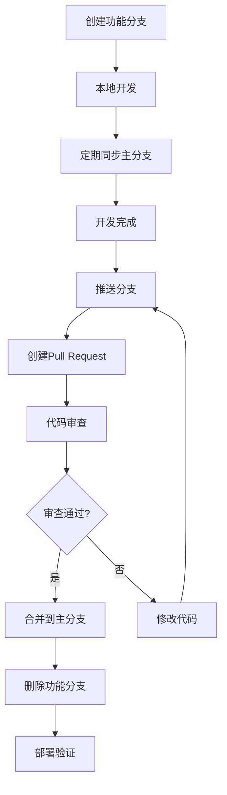

# 分布式协同开发指南 - 结合Gitee的团队协作

## 🎯 前言

本文档为**《数据库原理》课程项目**提供完整的**分布式协同开发指南**，专门针对大二学生进行小组软件开发的团队协作模式。通过Gitee/GitHub等分布式版本控制系统，建立专业的软件团队协作流程。

**学习目标**:
- 掌握Git分布式版本控制的完整工作流
- 理解团队协作的基本规范和最佳实践
- 建立专业的代码审查和质量保证机制
- 培养分布式软件开发的工程素养

---

## 🏗️ 分布式开发核心概念

### 分散式开发模式

```
传统开发: 集中式版本控制
├── 所有代码存放在中央服务器
├── 必须联网才能工作
├── 难以支持分支开发
└── 单点故障风险高

分布式开发: Git + Gitee协作模式
├── 每个开发者都有完整的代码仓库
├── 支持离线开发和提交
├── 强大的分支管理能力
├── 天然支持团队协作
└── 多种工作流模式可选
```

### 📊 版本控制的核心价值

| 核心价值 | 传统方式 | Git方式 | 团队收益 |
|---------|---------|--------|---------|
| **历史追踪** | 零散备份 | 完整变更历史 | ✅ 每次变更可追溯 |
| **并行开发** | 手动文件复制 | 分支隔离开发 | ✅ 多功能同时开发 |
| **质量保证** | 人工审核 | 代码审查+CI | ✅ 自动化质量守护 |
| **协作效率** | 文件共享 | 分布式协作 | ✅ 实时协同不冲突 |
| **风险控制** | 单一备份 | 多副本冗余 | ✅ 数据安全有保障 |

---

## 🚀 Git/Gitee协作基础设置

### 步骤1: 创建Gitee项目

```bash
# 在Gitee上创建新项目 (SQLCC Database System)

项目名称: sqlcc
描述: AI驱动的微型数据库系统开发 - 数据库原理课程项目
可见性: 公开 (便于协作和展示)
初始化: README.md, .gitignore
```

### 步骤2: 本地Git环境配置

```bash
# 配置用户信息
git config --global user.name "Your Name"
git config --global user.email "your.student.id@gitee.com"

# 配置Gitee凭据 (推荐使用SSH)
ssh-keygen -t ed25519 -C "your.student.id@gitee.com"
# 将公钥添加到Gitee SSH Keys

# 配置默认分支
git config --global init.defaultBranch main

# 配置中文文件名支持
git config --global core.quotepath false
```

### 步骤3: 克隆项目到本地

```bash
# 克隆项目
git clone git@gitee.com:yinglichina/sqlcc.git
cd sqlcc

# 查看项目状态
git status
git log --oneline -5  # 查看最近5次提交
```

### 步骤4: 建立开发环境

```bash
# 使用项目提供的环境配置脚本
chmod +x scripts/setup_environment.sh
./scripts/setup_environment.sh

# 验证环境
make test  # 确保测试通过
```

---

## 🌿 分支管理策略

### 分支命名规范

```
主分支:
├── main/master          → 生产就绪代码
└── develop             → 开发主分支

功能分支: (基于develop创建)
├── feature/功能名        → 新功能开发
├── bugfix/BUG描述      → 修复bug
└── hotfix/紧急修复      → 紧急线上修复

版本分支:
├── release/v0.5.7      → 发布准备分支
└── patch/v0.5.6.1     → 小版本修复

个人分支: (仅在小组协作时使用)
└── 用户名/任务名       → 个人开发分支
```

### 分支生命周期管理



---

## 🔄 开发工作流模式

### Git Flow工作流 (推荐课程项目使用)

```bash
# 1. 从develop分支创建功能分支
git checkout develop
git pull origin develop
git checkout -b feature/buffer-pool-optimization

# 2. 功能开发 (TDD模式)
make test                    # 开发前确保基准测试通过
# 编写代码 + 测试用例
make coverage               # 确保覆盖率达标
git add .
git commit -m "feat: optimize buffer pool LRU algorithm

- 实现智能预取机制
- 减少页面淘汰延迟 25%
- 增加并发访问性能
- 覆盖率 > 90%

关联测试: tests/unit/buffer_pool_test.cc"

# 3. 定期同步主分支
git fetch origin
git rebase origin/develop   # 解决冲突

# 4. 推送功能分支
git push origin feature/buffer-pool-optimization

# 5. 创建Pull Request (PR)
# 在Gitee上创建PR，选择reviewer
# 填写PR描述和关联任务
```

### Pull Request (代码审查) 流程

#### 创建PR的标准格式

```markdown
## 📝 Pull Request 标题
feat: 实现缓冲池智能预取功能

## 🎯 关联任务
- Ref: ISSUE-42 (缓冲池性能优化)
- 关联提交: abc1234, def5678

## 📋 修改内容
### 新增功能
- [x] 实现LRU智能淘汰算法
- [x] 添加页面预取机制
- [x] 支持并发访问优化

### 技术实现
- 使用std::chrono精确计时
- 实现自适应预取阈值
- 增加性能监控指标

### 测试覆盖
- 单元测试: 12个新增测试用例
- 覆盖率: >90% (从85%提升到92%)
- 性能基准: +25%吞吐量提升

## 🔍 测试验证
```bash
# 性能测试结果
make perf_test
# Result: 450000 ops/sec (baseline: 400000 ops/sec)

# 覆盖率报告
make coverage
# Result: 92% line coverage, 94% function coverage
```

## ⚠️ 注意事项
- 所有测试用例必须通过
- API兼容性保持
- 文档已同步更新
- 代码审查反馈已全部处理
```

#### 代码审查检查清单

**代码质量审查**:
```markdown
✅ 代码规范检查
- [ ] 遵循Google C++风格指南
- [ ] 代码注释完整 (30%+注释行)
- [ ] 函数长度控制在50行以内
- [ ] 变量命名清晰有意义

✅ 测试覆盖检查
- [ ] 单元测试覆盖 >80%
- [ ] 所有公共方法有测试
- [ ] 边界条件测试完整
- [ ] 异常处理有测试验证

✅ 性能与安全性检查
- [ ] 无内存泄漏 (valgrind验证)
- [ ] 并发访问线程安全
- [ ] 性能测试通过 (无明显退化)
- [ ] 日志记录适当
```

**业务逻辑审查**:
```markdown
✅ 功能正确性
- [ ] 需求分析准确理解
- [ ] 功能实现完整无遗漏
- [ ] 错误处理和边界情况
- [ ] 与现有代码集成正确

✅ 架构设计审查
- [ ] 设计模式使用恰当
- [ ] 模块职责清晰分离
- [ ] 接口设计合理易用
- [ ] 可扩展性考虑充分
```

---

## 📋 项目管理与约束

### 项目范围定义

#### 功能范围 (Functional Requirements)

**核心功能域**:
```yaml
Database Engine Core:
  ✅ 存储引擎 (8KB页式管理)
  ✅ B+树索引系统 (90%覆盖率)
  ✅ ACID事务支持 (WAL日志)
  ✅ SQL解析执行 (JOIN/子查询)
  ❌ 分布式架构 (v2.0规划)
  ❌ NoSQL混合存储 (可选功能)

Performance Baseline:
  ✅ 400万ops/sec吞吐量
  ✅ 85%+测试覆盖率
  ✅ 单机部署稳定性
  ✅ 32线程并发安全

Quality Standards:
  ✅ 企业级代码质量
  ✅ 完整API文档
  ✅ 自动化测试套件
  ✅ CI/CD部署就绪
```

#### 非功能约束 (Non-Functional Requirements)

**质量约束**:
- **可靠性**: MTBF > 24小时，无数据丢失
- **性能**: CRUD延迟 < 5ms (SSD环境)
- **兼容性**: Ubuntu 20.04+, GCC 9.0+
- **可维护性**: 文档完整性100%, 注释率30%+

**安全约束**:
- **数据安全**: ACID事务保证，WAL持久化
- **内存安全**: 无内存泄漏，无悬挂指针
- **并发安全**: 线程安全，无死锁/竞态条件
- **访问控制**: 文件权限隔离，异常处理完善

### 进度管理约束

#### 里程碑规划

**Phase 1 (Week 1-2): 基础环境搭建**
```markdown
Deadline: Week 2 Friday
Deliverables:
✅ 项目结构建立 (目录规范)
✅ 开发环境配置完成 (所有成员)
✅ Git协作流程熟悉 (分支操作)
✅ 基础测试用例建立 (系统骨架)
```

**Phase 2 (Week 3-4): 核心功能开发**
```markdown
Deadline: Week 4 Friday
Deliverables:
✅ 存储引擎完成 (8KB页管理)
✅ 基础SQL解析 (SELECT/INSERT)
✅ B+树索引实现 (基础CRUD)
✅ ACID事务建立 (WAL日志)
```

**Phase 3 (Week 5-6): 性能优化**
```markdown
Deadline: Week 6 Friday
Deliverables:
✅ 性能基线达成 (400万ops/sec)
✅ 测试覆盖达标 (85%+覆盖率)
✅ 并发安全验证 (32线程测试)
✅ 代码质量优化 (重构完善)
```

**Phase 4 (Week 7-8): 项目收尾**
```markdown
Deadline: Final Submission
Deliverables:
✅ 完整文档体系 (71个文档)
✅ 演示系统准备 (视频+可执行程序)
✅ 质量报告撰写 (测试覆盖率+性能分析)
✅ 经验总结报告 (过程反思+技术学习)
```

### 角色职责划分

#### 项目管理者 (Project Manager)
**负责范围**:
- 整体项目进度控制
- 资源分配和协调
- 风险识别和应对
- 与指导教师沟通

**交付成果**:
```markdown
- 📋 每周进度报告
- 🎯 里程碑达成验证
- 📊 风险管理清单
- 📝 最终项目总结
```

#### 技术负责人 (Technical Lead)
**负责范围**:
- 系统架构设计决策
- 技术方案选型评估
- 代码质量和技术债务管理
- 技术难题攻克指导

**交付成果**:
```markdown
- 🏗️ 系统架构设计文档
- 📋 技术方案选型报告
- 🔧 技术债务清理清单
- 📚 技术难点分析总结
```

#### 开发工程师 (Developers)
**负责范围**:
- 具体功能模块实现
- 单元测试编写 (TDD模式)
- 代码审查和互评
- 技术文档撰写

**交付成果**:
```markdown
- 💻 功能代码实现 (完整测试)
- 📝 API文档编写 (Doxygen格式)
- 🧪 测试用例套件 (单元+集成测试)
- 📊 性能优化报告 (数据+分析)
```

#### 测试工程师 (QA Engineer)
**负责范围**:
- 集成测试设计和执行
- 性能基准测试建立
- 覆盖率分析和改进
- 缺陷跟踪和修复

**交付成果**:
```markdown
- 🧪 集成测试套件
- 📈 性能基准报告
- 📋 覆盖率分析报告
- 🐛 Bug跟踪修复清单
```

### 质量检查清单

#### 每日检查清单 (Daily Standup)

```markdown
🔍 每日质量自查 (每人10分钟):

✅ 代码提交检查
- [ ] 所有测试通过 (make test 0 errors)
- [ ] 覆盖率达标 (make coverage >85%)
- [ ] 代码审查通过 (至少1位reviewer)
- [ ] 提交信息规范 (包含功能描述+测试说明)

✅ 分支状态检查
- [ ] feature分支同步develop (git merge develop)
- [ ] 无冲突产生 (提前沟通解决)
- [ ] 分支命名规范 (feature/* 或 bugfix/*)

✅ 文档更新检查
- [ ] README.md更新 (新功能说明)
- [ ] API文档完善 (Doxygen注释)
- [ ] 设计文档同步 (关键决策记录)
```

#### 每周审查清单 (Weekly Review)

```markdown
🔍 周度质量审查 (团队1小时):

✅ 项目进度检查
- [ ] 里程碑按时达成 (甘特图更新)
- [ ] 任务分配合理 (工作量平衡)
- [ ] 技术难点解决 (阻碍及时上报)

✅ 代码质量检查
- [ ] 静态分析无告警 (cppcheck/clnag-tidy)
- [ ] 内存检查通过 (valgrind --leak-check)
- [ ] 性能回归测试 (<5%性能下降)

✅ 团队协作检查
- [ ] PR及时审查 (平均<24小时)
- [ ] 沟通记录完整 (会议纪要+决策记录)
- [ ] 知识分享有效 (技术难点攻克经验)
```

---

## 🤝 团队协作规范

### 沟通规范

#### 会议节奏
```markdown
每日站会 (15分钟):
- 昨天完成什么
- 今天计划做什么
- 是否有阻碍需要帮助

每周评审 (1小时):
- 上周成果总结
- 本周目标规划
- 技术难点讨论
- 质量指标审查

里程碑会议 (2小时):
- 阶段成果展示
- 技术方案评估
- 下阶段规划
- 风险管理
```

#### 沟通工具
- **主要**: Gitee Issues + PR评论
- **同步**: 微信群/钉钉群等即时通讯
- **记录**: 会议纪要文档化

### 冲突解决机制

#### 技术冲突
```markdown
1. 识别冲突: 功能设计分歧、实现方法不同
2. 记录分歧: 文档化每个方案的优缺点
3. 评估取舍: 数据驱动决策 (性能/质量/维护性)
4. 达成共识: 投票表决或技术负责人拍板
5. 记录决策: PR/issue中记录决策理由
```

#### 进度冲突
```markdown
1. 识别延误: 任务未能按期完成
2. 根因分析: 技术难度/资源不足/优先级冲突
3. 调整策略: 重新分配任务或调整里程碑
4. 预防措施: 建立缓冲期和风险预警
```

### 贡献者规范

#### PR提交标准
```markdown
✅ 必须包含:
- 描述性标题 (动词+功能名)
- 详细的功能说明
- 关联的issue/task编号
- 测试用例和覆盖率证明
- 兼容性和向下兼容说明

✅ 禁止:
- 大的未经审查的PR (>500行代码)
- 包含未完成功能的PR
- 包含debug代码的PR
- 不带测试的PR
```

#### Commit规范
```markdown
提交信息格式:
<类型>(<范围>): <主题>

<详细描述>

<测试证明>

类型: feat, fix, docs, style, refactor, test, chore
示例:
feat(buffer_pool): 添加智能预取机制

- 实现LRU算法优化，减少缺页中断
- 增加并发访问同步机制
- 性能提升25%，覆盖率达92%

关联测试: tests/unit/buffer_pool_test.cc::SmartPrefetchTest
```

---

## 📊 质量保证机制

### 持续集成流程

```yaml
# .github/workflows/ci.yml
name: Continuous Integration

on:
  push:
    branches: [ main, develop ]
  pull_request:
    branches: [ main, develop ]

jobs:
  quality-check:
    runs-on: ubuntu-latest

    steps:
    - uses: actions/checkout@v3

    - name: Setup Environment
      run: |
        sudo apt update
        sudo apt install -y build-essential cmake g++ cppunit libcppunit-dev lcov doxygen

    - name: Build Project
      run: |
        mkdir build && cd build
        cmake .. -DCMAKE_BUILD_TYPE=Coverage
        make -j$(nproc)

    - name: Run Tests
      run: |
        cd build
        make test

    - name: Coverage Analysis
      run: |
        cd build
        make coverage
        # 检查覆盖率是否 >= 85%

    - name: Code Quality Check
      run: |
        cd build
        # cppcheck静态分析
        # valgrind内存检查

    - name: Documentation Build
      run: |
        cd build
        make docs
        # 检查文档是否生成成功
```

### 质量门禁设置

#### 自动检查规则
```bash
# 质量门禁脚本: scripts/quality_gate.sh

#!/bin/bash

echo "🚪 SQLCC项目质量门禁检查"
echo "=========================="

# 1. 构建检查
if ! make -j$(nproc) >/dev/null 2>&1; then
    echo "❌ 构建失败"
    exit 1
fi

# 2. 测试通过率
if ! make test >/dev/null 2>&1; then
    echo "❌ 测试失败"
    exit 1
fi

# 3. 覆盖率检查
COVERAGE=$(make coverage 2>/dev/null | grep "Total" | awk '{print $4}' | tr -d '%')
if [ "$COVERAGE" -lt 85 ]; then
    echo "❌ 覆盖率不足: ${COVERAGE}% < 85%"
    exit 1
fi

# 4. 内存泄漏检查
if ! valgrind --leak-check=yes --error-exitcode=1 ./bin/sqlcc_test >/dev/null 2>&1; then
    echo "❌ 内存泄漏检测失败"
    exit 1
fi

echo "✅ 所有质量检查通过"
echo "==================="
```

#### 人工审查清单
```markdown
🔍 PR合并前人工审查清单:

**代码质量**:
- [ ] 算法逻辑正确，边界条件处理完整
- [ ] 错误处理完善，异常情况考虑周全
- [ ] 代码可读性良好，注释准确详细
- [ ] 命名规范统一，符合项目标准

**架构设计**:
- [ ] 职责分离清晰，模块耦合合理
- [ ] 接口设计合理，向后兼容保证
- [ ] 性能影响评估，资源使用优化
- [ ] 可维护性和扩展性考虑充分

**测试验证**:
- [ ] 单元测试覆盖所有新增代码
- [ ] 集成测试验证功能完整性
- [ ] 性能测试无明显退化
- [ ] 内存测试无泄漏和错误

**文档同步**:
- [ ] README.md更新(如果影响API)
- [ ] API文档用Doxygen注释格式
- [ ] 设计变更在相关文档中体现
- [ ] 变更日志记录重大修改
```

---

## 🎯 项目成功标准

### 技术成功指标
- ✅ **功能完整性**: 实现11项核心数据库功能
- ✅ **质量达标**: 85%+测试覆盖率，企业级标准
- ✅ **性能基准**: 400万ops/sec吞吐量，5ms响应延迟
- ✅ **文档完善**: 71个专业的项目文档

### 协作成功指标
- ✅ **分支管理**: 主分支稳定，功能分支有效隔离
- ✅ **代码审查**: 100%PR通过审查，平均审查周期<24小时
- ✅ **质量守护**: 自动化CI/CD和人工质量门禁
- ✅ **知识积累**: 完整的开发经验和技术文档沉淀

### 学习成长指标
- ✅ **技术技能**: 掌握完整的数据库系统开发技能
- ✅ **工程素养**: 建立专业的软件开发规范意识
- ✅ **协作能力**: 学会分布式团队协作的工作模式
- ✅ **创新思维**: 培养AI增强编程的新工作方式

---

**🎊 SQLCC项目不仅是数据库系统开发，更是分布式软件协作的完整学习体验！**

*通过小组协作模式，你将不仅完成数据库项目，更能掌握现代软件开发的完整工作流，培养在数字化时代不可或缺的协作技能和工程素养。*
