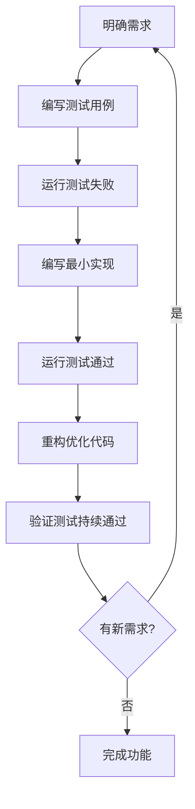
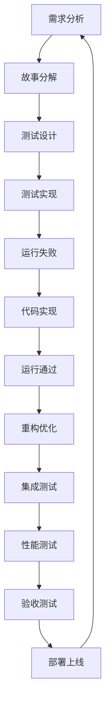

# 测试驱动开发指南

## 🎯 前言

本文档介绍如何在**SQLCC数据库项目**中应用测试驱动开发 (TDD) 方法论。通过TDD模式，大二学生可以建立系统的软件开发思维，实现从需求到实现的完整开发流程。

**学习目标**:
- 掌握TDD的核心思想和实践方法
- 理解单元测试、集成测试、性能测试的设计原则
- 建立测试先行、逐步演进的开发模式
- 培养高质量软件的设计思维

---

## 🧪 TDD核心理念

### 测试驱动开发的本质

TDD不是简单的"先写测试再写代码"，而是一种**以测试为驱动的设计思维**：



### 🔄 Red-Green-Refactor循环

TDD的核心是**红-绿-重构**的持续循环：

| 阶段 | 状态 | 目标 | 验证标准 |
|------|------|------|----------|
| 🔴 **Red** | 测试失败 | 验证需求理解正确 | 测试用例完整，失败原因明确 |
| 🟢 **Green** | 测试通过 | 实现功能满足需求 | 所有测试通过，新功能正常 |
| 🔄 **Refactor** | 代码优化 | 提升代码质量和可维护性 | 测试持续通过，代码更清晰 |

---

## 🎬 TDD在SQLCC项目中的应用

### 场景1: 实现B+树插入操作

**需求分析**:
- 实现B+树的节点插入逻辑
- 阶数(order)为100的B+树
- 支持自动节点分裂

**TDD开发步骤**:

#### 步骤1: 编写测试用例 (Red阶段)

```cpp
// tests/unit/b_plus_tree_test.cc
TEST(BPlusTreeTest, InsertSingleKey) {
    // 准备: 创建一个空的B+树
    std::unique_ptr<DiskManager> disk_mgr = std::make_unique<DiskManager>("test.db");
    BPlusTree tree(disk_mgr.get(), 100);

    // 执行: 插入单个键值对
    Key key = 42;
    Value value = "test_value";
    bool result = tree.insert(key, value);

    // 断言: 插入成功
    ASSERT_TRUE(result);

    // 验证: 能够成功查找插入的值
    Value retrieved;
    ASSERT_TRUE(tree.search(key, retrieved));
    ASSERT_EQ(retrieved, value);
}
```

**测试运行结果**: ❌ **失败** (因为BPlusTree::insert还未实现)

#### 步骤2: 实现最小代码 (Green阶段)

```cpp
// src/b_plus_tree.cc
bool BPlusTree::insert(Key key, Value value) {
    // 最小实现: 创建根节点并插入
    if (!root_page_id_.isValid()) {
        // 创建新的根叶子节点
        Page* root_page = disk_manager_->allocatePage();
        LeafNode* root_node = reinterpret_cast<LeafNode*>(root_page->data);

        // 初始化叶子节点
        root_node->init();
        root_page_id_ = root_page->page_id;

        // 直接插入到叶子节点
        return root_node->insert(key, value);
    }

    // 扩展: 处理根节点已存在的情况
    return insertToNode(root_page_id_, key, value);
}
```

**测试运行结果**: ✅ **通过**

#### 步骤3: 重构优化代码 (Refactor阶段)

```cpp
// 重构后的代码
bool BPlusTree::insert(Key key, Value value) {
    // 递归插入逻辑，支持节点分裂
    if (!root_page_id_.isValid()) {
        createRootLeafNode();
    }

    std::stack<PageId> path;
    bool split_occurred = insertRecursive(root_page_id_, key, value, path);

    if (split_occurred) {
        // 处理根节点分裂
        handleRootSplit(path);
    }

    return true;
}

private:
    void createRootLeafNode() { /* 实现根叶子节点创建 */ }
    bool insertRecursive(PageId node_id, Key key, Value value, std::stack<PageId>& path) { /* 递归插入 */ }
    void handleRootSplit(std::stack<PageId>& path) { /* 根节点分裂处理 */ }
```

**测试持续**: ✅ **通过**，代码结构更清晰

### 场景2: 并发事务测试

**需求**: 验证32线程并发转账无死锁

**TDD实现途径**:

```cpp
TEST(TransactionManagerTest, ConcurrentTransferNoDeadlock) {
    // 测试设计: 模拟银行转账场景
    TransactionManager txn_mgr;

    // 创建测试账户
    std::vector<Account> accounts(100);
    for (int i = 0; i < 100; ++i) {
        accounts[i].balance = INITIAL_BALANCE;
        accounts[i].id = i;
    }

    // 并发执行转账操作
    std::vector<std::thread> threads;
    for (int i = 0; i < 32; ++i) {
        threads.emplace_back([&, i]() {
            for (int j = 0; j < 100; ++j) {
                transferMoney(txn_mgr, accounts[(i+j) % 100], accounts[(i+j+1) % 100], TRANSFER_AMOUNT);
            }
        });
    }

    // 等待所有线程完成
    for (auto& thread : threads) {
        thread.join();
    }

    // 验证: 总钱数守恒 (无死锁、无数据丢失)
    long long total_balance = 0;
    for (const auto& account : accounts) {
        total_balance += account.balance;
    }
    ASSERT_EQ(total_balance, INITIAL_BALANCE * 100);
}
```

---

## 🏗️ 测试体系架构设计

### 4层测试体系

```
┌─────────────────────────────────────┐
│  🏃 端到端测试 (E2E Testing)         │
│  验证完整业务流程                   │
├─────────────────────────────────────┤
│  🔧 集成测试 (Integration Testing)  │
│  验证模块间交互                     │
├─────────────────────────────────────┤
│  🧩 单元测试 (Unit Testing)         │
│  验证单个组件功能                   │
├─────────────────────────────────────┤
│  🏗️ 构建验证 (Build Verification)   │
│  验证代码编译正确性                 │
└─────────────────────────────────────┘
```

### 测试策略选择

| 测试类型 | 适用场景 | 测试重点 | 执行频率 |
|----------|----------|----------|----------|
| **单元测试** | 核心算法实现 | 函数逻辑正确性 | 每次代码修改 |
| **集成测试** | 模块接口对接 | 数据流转正确性 | 功能合并时 |
| **性能测试** | 系统性能瓶颈 | 响应时间和吞吐量 | 版本发布前 |
| **并发测试** | 线程安全验证 | 死锁和竞态条件 | 并发功能修改时 |

---

## 📝 测试用例设计原则

### FIRST原则

优秀的测试用例应该遵循**FIRST原则**：

#### 🎯 **F - Fast** (快速)
- **目标**: 测试执行速度足够快，支持频繁运行
- **标准**: 单个测试<100ms，全套测试<30秒
- **实现**: 避免I/O操作，Mock外部依赖

```cpp
// ✅ 好的实践: 使用内存缓冲，避免磁盘I/O
TEST(BufferPoolTest, FastLRUReplacement) {
    // 使用内存缓冲区模拟磁盘，避免实际I/O
    MockDiskManager disk_mgr;
    BufferPool pool(100, 8192);

    // 测试LRU逻辑，执行迅速
    pool.getPage(1); pool.getPage(2); pool.getPage(1); // 触发LRU
    // 验证结果
}
```

#### 🏗️ **I - Isolated** (隔离)
- **目标**: 测试之间相互独立，不存在副作用
- **标准**: 可任意顺序执行，清理测试数据
- **实现**: 每个测试有独立的数据环境

```cpp
// ✅ 好的实践: 每个测试使用独立的数据库文件
class BPlusTreeTest : public ::testing::Test {
protected:
    void SetUp() override {
        // 为每个测试创建独立的数据库文件
        std::string filename = "test_" + std::to_string(test_id_) + ".db";
        disk_mgr_ = std::make_unique<DiskManager>(filename);
        tree_ = std::make_unique<BPlusTree>(disk_mgr_.get(), 10);
        test_id_++;
    }

    void TearDown() override {
        // 清理测试文件
        std::filesystem::remove(disk_mgr_->filename());
    }

private:
    static int test_id_;
    std::unique_ptr<DiskManager> disk_mgr_;
    std::unique_ptr<BPlusTree> tree_;
};
```

#### 🔄 **R - Repeatable** (可重复)
- **目标**: 测试结果稳定一致，不受外部因素影响
- **标准**: 多次运行结果相同，不依赖系统状态
- **实现**: 避免时间依赖、网络调用、随机数

```cpp
// ✅ 好的实践: 使用固定种子，避免随机性
TEST(BPlusTreeTest, DeterministicInsertion) {
    // 使用确定性插入顺序
    std::vector<int> keys = {1, 2, 3, 4, 5}; // 固定顺序
    BPlusTree tree(disk_mgr.get(), 10);

    for (int key : keys) {
        tree.insert(key, std::to_string(key));
    }

    // 验证树结构确定性
    ASSERT_TRUE(tree.validateStructure());
}
```

#### 🏃 **S - Self-Validating** (自验证)
- **目标**: 测试自己能判断是否通过，无需人工检查
- **标准**: 通过/失败状态明确，错误信息清晰
- **实现**: 使用合适的断言，提供详细错误信息

```cpp
// ✅ 好的实践: 详细的断言信息
TEST(BPlusTreeTest, SearchAfterInsert) {
    BPlusTree tree(disk_mgr.get(), 10);
    const int key = 42;
    const std::string value = "test_value";

    tree.insert(key, value);

    std::string retrieved;
    bool found = tree.search(key, retrieved);

    ASSERT_TRUE(found) << "Key " << key << " should be found after insertion";
    ASSERT_EQ(retrieved, value) << "Retrieved value should match inserted value";
}
```

#### ⏰ **T - Timely** (及时)
- **目标**: 测试与代码同步编写，早发现问题
- **标准**: 测试先行或紧随代码编写
- **实现**: TDD模式，先写测试再写代码

---

## 🧪 不同类型测试的设计模式

### 单元测试设计模式

#### 状态验证模式 (State Verification)
```cpp
TEST(BPlusTreeTest, InsertIncreasesSize) {
    BPlusTree tree(disk_mgr.get(), 10);
    ASSERT_EQ(tree.size(), 0);  // 初始状态

    tree.insert(1, "a");
    ASSERT_EQ(tree.size(), 1);  // 状态变化
}
```

#### 行为验证模式 (Behavior Verification)
```cpp
TEST(BufferPoolTest, GetPageTriggersDiskRead) {
    MockDiskManager mock_disk;
    EXPECT_CALL(mock_disk, readPage(_, _)).Times(1);  // 期望行为

    BufferPool pool(10, mock_disk);
    pool.getPage(1);  // 触发行为
}
```

#### 异常测试模式 (Exception Testing)
```cpp
TEST(BPlusTreeTest, InsertDuplicateKeyThrows) {
    BPlusTree tree(disk_mgr.get(), 10);
    tree.insert(1, "first");

    // 期望抛出异常
    ASSERT_THROW(tree.insert(1, "duplicate"), DuplicateKeyException);
}
```

### 集成测试设计模式

#### 自下而上集成 (Bottom-Up)
```cpp
TEST(StorageEngineIntegrationTest, FullCRUDCycle) {
    StorageEngine engine(disk_mgr.get());

    // 测试完整的CRUD循环
    Record record = {"john", "doe", 30};
    RecordId rid = engine.insert(record);           // 创建
    Record retrieved = engine.get(rid);            // 读取
    ASSERT_EQ(record.name, retrieved.name);

    record.age = 31;
    engine.update(rid, record);                    // 更新
    retrieved = engine.get(rid);
    ASSERT_EQ(record.age, retrieved.age);

    engine.remove(rid);                            // 删除
    ASSERT_THROW(engine.get(rid), RecordNotFoundException);
}
```

#### 端到端测试模式 (E2E)
```cpp
TEST(SQLExecutionTest, CompleteUserJourney) {
    Database db("test.db");

    // 用户完整操作流程
    db.execute("CREATE TABLE users (id INT, name VARCHAR(50))");
    db.execute("INSERT INTO users VALUES (1, 'Alice')");
    db.execute("INSERT INTO users VALUES (2, 'Bob')");

    auto results = db.execute("SELECT * FROM users WHERE id = 1");
    ASSERT_EQ(results.size(), 1);
    ASSERT_EQ(results[0]["name"], "Alice");
}
```

### 性能测试设计模式

#### 基准测试模式 (Benchmark)
```cpp
TEST(BufferPoolBenchmark, ReadThroughput) {
    BufferPool pool(1000, disk_mgr.get());

    // 预热
    for (int i = 0; i < 100; ++i) {
        pool.getPage(i);
    }

    // 性能测试
    auto start = std::chrono::high_resolution_clock::now();

    for (int i = 100; i < 10000; ++i) {
        pool.getPage(i);
    }

    auto end = std::chrono::high_resolution_clock::now();
    auto duration = std::chrono::duration_cast<std::chrono::milliseconds>(end - start);

    // 性能断言 (期望OPS > 50000)
    double ops_per_second = 9900.0 / (duration.count() / 1000.0);
    EXPECT_GT(ops_per_second, 50000.0);
}
```

#### 负载测试模式 (Load Testing)
```cpp
TEST(TransactionManagerLoadTest, HighConcurrencySustained) {
    TransactionManager txn_mgr;
    std::atomic<int> success_count{0};

    // 持续30秒的高并发测试
    auto test_func = [&]() {
        for (int i = 0; i < 1000; ++i) {
            try {
                // 执行事务操作
                txn_mgr.beginTransaction();
                // ... 事务操作
                txn_mgr.commit();
                success_count++;
            } catch (...) {
                // 记录失败
            }
        }
    };

    // 启动多个线程
    std::vector<std::thread> threads;
    for (int i = 0; i < 32; ++i) {
        threads.emplace_back(test_func);
    }

    // 等待完成
    for (auto& t : threads) {
        t.join();
    }

    // 验证高并发下的成功率 (>95%)
    EXPECT_GT(success_count.load(), 32 * 1000 * 0.95);
}
```

---

## 📊 测试演进策略

### 横向扩展测试覆盖

**测试覆盖率提升路径**：

```
1. 函数覆盖 (Function Coverage) → 基础目标: 90%
2. 语句覆盖 (Statement Coverage) → 主要目标: 85%
3. 分支覆盖 (Branch Coverage) → 质量目标: 80%
4. 条件覆盖 (Condition Coverage) → 高质量目标: 75%
5. MC/DC覆盖 (Modified Condition/Decision) → 关键系统: 100%
```

### 纵向深化测试质量

**测试成熟度模型**：

#### 🍼 初级阶段 (Junior)
- **特点**: 只测试Happy Path，主要功能测试
- **问题**: 边界条件缺失，异常处理不足
- **改进**: 添加负面测试案例，参数组合覆盖

#### 🧑 中级阶段 (Intermediate)
- **特点**: 边界条件完整，异常处理全面
- **问题**: 测试耦合度高，维护成本大
- **改进**: 引入测试fixture，重构测试结构

#### 🧓 高级阶段 (Senior)
- **特点**: 测试设计模式化，可维护性好
- **问题**: 测试执行效率低，CI/CD阻塞
- **改进**: 平行化测试执行，智能测试选择

#### 🏆 专家阶段 (Expert)
- **特点**: 测试驱动架构设计，质量内建
- **能力**: 性能回归检测，故障注入测试
- **价值**: 显著提升开发效率和软件质量

### 🔄 测试驱动的开发流程

**完整的TDD开发周期**：



**关键实践**:

1. **小步快跑**: 每次只实现一个小功能
2. **快速反馈**: 立即运行测试验证结果
3. **持续集成**: 每天多次集成和测试
4. **质量先行**: 用测试定义需求的验收标准

---

## 🎯 测试文化建设

### 团队测试文化

#### 📊 测试指标追踪
```bash
# 每日测试质量报表
echo "=== 日度测试质量报告 ==="
echo "覆盖率: $(get_coverage_percentage)%"
echo "通过率: $(get_pass_rate)%"
echo "执行时间: $(get_execution_time)秒"
echo "新用例数: $(get_new_test_count)"
```

#### 🎖️ 测试成就系统
- **覆盖率达标**: 连续每周≥85%覆盖率获得成就
- **快速响应**: 发现bug后2小时内修复算合格
- **质量卫士**: 阻止生产bug发布算重大成就

#### 📈 持续改进机制
- **回顾会议**: 每周分析测试发现的问题
- **最佳实践**: 分享优秀的测试用例设计
- **技术分享**: 不定期分享测试技巧和工具

### 个人能力提升

#### 测试思维培养
```markdown
# 测试思维练习题

场景: 设计文件上传功能的测试用例

练习步骤:
1. 识别Happy Path (正常成功上传)
2. 找出边界条件 (文件大小限制、空文件、特殊字符文件名)
3. 考虑异常场景 (磁盘空间不足、网络中断、权限问题)
4. 设计并发测试 (同时上传多个文件)
5. 考虑性能测试 (大文件上传速度、内存消耗)
6. 安全性测试 (文件类型验证、路径遍历攻击)
```

#### 测试技能提升路径
```
初学者 → 中级 → 高级 → 专家
  ↓        ↓      ↓      ↓
单元测试 → 集成测试 → 系统测试 → 性能测试
Mock框架 → 测试架构 → CI/CD集成 → 测试驱动开发
断言技巧 → 测试模式 → 测试策略 → 测试文化建设
```

---

## 🚀 现代测试实践

### 测试智能化

**AI辅助测试**:
- **自动化测试生成**: 用AI生成单元测试用例
- **测试数据生成**: 智能生成边界条件测试数据
- **缺陷预测**: 基于代码分析预测潜在bug点

### 测试工程化

**测试基础设施**:
- **测试容器化**: Docker环境标准化测试执行
- **分布式测试**: 多机并行执行大规模测试
- **测试结果分析**: 自动化分析测试失败原因

### 测试DevOps

**测试与部署集成**:
```yaml
# GitHub Actions配置示例
test:
  runs-on: ubuntu-latest
  steps:
    - uses: actions/checkout@v3
    - name: Setup test environment
      run: ./setup_test_env.sh
    - name: Run unit tests
      run: make test
    - name: Run integration tests
      run: make integration-test
    - name: Coverage report
      run: make coverage
    - name: Quality gate
      run: ./quality_gate.sh
```

---

**🎯 TDD不仅是开发方法，更是思维方式的转变。通过测试驱动，我们能够构建更加可靠、可维护的数据库系统！**

*TDD让复杂变得简单，让不可能变得可能，让质量成为本能。*
