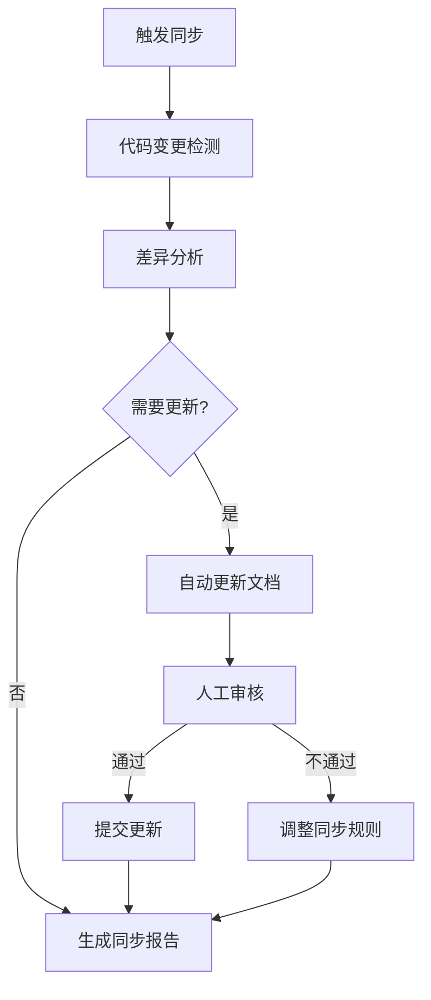
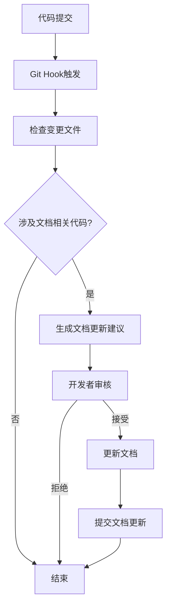

# SOLO自动化改进与文档同步计划

## 1. SOLO可实现的自动化改进

SOLO作为AI助手，可以帮助SQLCC项目实现以下自动化改进：

### 1.1 文档同步自动化
- **定期检查**：自动检查代码与文档的一致性
- **差异分析**：识别代码变更与文档的差异
- **自动更新**：根据代码变更自动更新相关文档
- **报告生成**：生成文档同步报告，记录变更内容

### 1.2 测试自动化
- **自动运行测试**：定期运行单元测试、集成测试和性能测试
- **覆盖率监控**：自动生成覆盖率报告，跟踪覆盖率变化
- **测试报告生成**：生成详细的测试报告，包括失败原因分析
- **回归测试**：在代码变更后自动运行回归测试

### 1.3 代码质量自动化
- **静态分析**：自动运行静态分析工具，检查代码质量问题
- **Lint检查**：自动运行代码风格检查
- **代码复杂度分析**：分析代码复杂度，识别难以维护的代码
- **质量报告生成**：生成代码质量报告，提出改进建议

### 1.4 构建部署自动化
- **自动构建**：定期或在代码变更后自动构建项目
- **部署测试**：自动部署到测试环境，进行验证
- **版本管理**：自动生成版本号，创建发布说明
- **部署报告**：生成部署报告，记录部署过程和结果

### 1.5 依赖管理自动化
- **依赖检查**：定期检查依赖更新
- **安全扫描**：扫描依赖中的安全漏洞
- **更新建议**：生成依赖更新建议报告

### 1.6 文档生成自动化
- **API文档生成**：从代码注释自动生成API文档
- **设计文档生成**：根据代码结构自动生成设计文档框架
- **测试文档生成**：根据测试用例自动生成测试文档

## 2. 文档同步自动化计划

### 2.1 目标
- 确保文档与代码的一致性
- 减少人工文档维护成本
- 提高文档的及时性和准确性
- 建立可持续的文档同步机制

### 2.2 范围
- **设计文档**：与代码实现相关的设计文档
- **API文档**：从代码注释生成的API文档
- **测试文档**：与测试用例相关的文档
- **用户文档**：与功能使用相关的文档

### 2.3 自动化工具与技术
- **脚本语言**：Bash/Python脚本
- **版本控制**：Git hooks
- **文档生成工具**：Doxygen
- **差异分析工具**：diff、grep等
- **CI/CD平台**：GitHub Actions、GitLab CI等

### 2.4 流程设计

#### 2.4.1 定期同步流程



#### 2.4.2 代码提交触发流程



### 2.5 执行计划

#### 2.5.1 短期计划（1-2周）

| 任务 | 描述 | 负责人 | 完成时间 |
|------|------|--------|----------|
| 工具选型 | 选择合适的自动化工具和技术 | 开发团队 | 第1周 |
| 脚本开发 | 开发文档同步检查脚本 | SOLO | 第1周 |
| 规则定义 | 定义文档与代码的同步规则 | 开发团队 | 第1周 |
| 测试运行 | 在测试环境中运行同步脚本 | SOLO | 第2周 |
| 报告模板 | 设计文档同步报告模板 | SOLO | 第2周 |

#### 2.5.2 中期计划（3-4周）

| 任务 | 描述 | 负责人 | 完成时间 |
|------|------|--------|----------|
| 集成CI/CD | 将同步脚本集成到CI/CD流程 | 开发团队 | 第3周 |
| 自动更新 | 实现文档的自动更新功能 | SOLO | 第3周 |
| 人工审核流程 | 建立文档更新的人工审核流程 | 开发团队 | 第4周 |
| 培训 | 培训团队使用同步工具 | SOLO | 第4周 |

#### 2.5.3 长期计划（5-8周）

| 任务 | 描述 | 负责人 | 完成时间 |
|------|------|--------|----------|
| 智能分析 | 实现基于AI的智能差异分析 | SOLO | 第5周 |
| 自动生成 | 实现从代码自动生成设计文档 | SOLO | 第6周 |
| 持续优化 | 优化同步规则和流程 | 开发团队 | 第7周 |
| 全面推广 | 在整个项目中推广文档同步自动化 | 开发团队 | 第8周 |

### 2.6 质量保证措施

1. **双重验证**：自动同步后进行人工审核
2. **版本控制**：所有文档更新都通过版本控制管理
3. **差异报告**：生成详细的差异报告，便于审核
4. **定期审计**：定期审计文档同步的准确性
5. **反馈机制**：建立反馈机制，持续优化同步规则

### 2.7 工具实现示例

#### 2.7.1 文档同步检查脚本

```bash
#!/bin/bash

# 文档同步检查脚本
# 定期检查代码与文档的一致性

# 配置
DOCS_DIR="/home/liying/sqlcc/docs"
SRC_DIR="/home/liying/sqlcc/src"
REPORT_DIR="/home/liying/sqlcc/docs/reports"
DATE=$(date +"%Y-%m-%d_%H-%M-%S")
REPORT_FILE="$REPORT_DIR/文档同步报告_$DATE.md"

# 创建报告目录
mkdir -p $REPORT_DIR

# 生成报告头
cat > $REPORT_FILE << EOF
# 文档同步报告

**生成时间**：$(date)
**检查范围**：$SRC_DIR → $DOCS_DIR

## 1. 代码变更检测

EOF

# 检查代码变更
CHANGED_FILES=$(git diff --name-only HEAD~10 -- $SRC_DIR)

if [ -z "$CHANGED_FILES" ]; then
    echo "## 2. 差异分析\n\n- 无代码变更" >> $REPORT_FILE
    echo "## 3. 同步建议\n\n- 无需更新文档" >> $REPORT_FILE
    echo "## 4. 结论\n\n文档与代码保持一致" >> $REPORT_FILE
    exit 0
fi

# 记录变更文件
echo "## 2. 差异分析\n" >> $REPORT_FILE
echo "### 2.1 代码变更文件\n" >> $REPORT_FILE
for file in $CHANGED_FILES; do
    echo "- $file" >> $REPORT_FILE
done

# 检查相关文档
echo "\n### 2.2 相关文档检查\n" >> $REPORT_FILE

# 示例：检查B+树相关文档
if echo "$CHANGED_FILES" | grep -q "b_plus_tree"; then
    echo "- **B+树实现**：需要检查 `docs/design/storage_engine/storage_engine_design.md` 中的B+树部分" >> $REPORT_FILE
    echo "- **设计文档总览**：需要检查 `docs/设计文档总览.md` 中的存储引擎部分" >> $REPORT_FILE
fi

# 示例：检查性能测试相关文档
if echo "$CHANGED_FILES" | grep -q "performance"; then
    echo "- **性能测试框架**：需要检查 `docs/performance/performance_test_framework_design.md`" >> $REPORT_FILE
fi

# 生成同步建议
echo "\n## 3. 同步建议\n" >> $REPORT_FILE
echo "### 3.1 自动更新建议\n" >> $REPORT_FILE
echo "- 建议根据代码变更自动更新相关文档" >> $REPORT_FILE
echo "- 建议运行 `doxygen` 更新API文档" >> $REPORT_FILE

echo "\n### 3.2 人工审核建议\n" >> $REPORT_FILE
echo "- 请审核自动生成的文档更新" >> $REPORT_FILE
echo "- 请检查跨子系统交互的文档说明" >> $REPORT_FILE

echo "\n## 4. 结论\n" >> $REPORT_FILE
echo "- 检测到 `$(echo "$CHANGED_FILES" | wc -l)` 个代码文件变更" >> $REPORT_FILE
echo "- 需要更新相关文档以保持一致性" >> $REPORT_FILE

# 输出完成信息
echo "文档同步报告已生成：$REPORT_FILE"
```

### 2.8 集成CI/CD示例

```yaml
# .github/workflows/docs-sync.yml
name: 文档同步检查

on:
  schedule:
    - cron: '0 0 * * *'  # 每天凌晨运行
  push:
    branches: [ main, develop ]
    paths: [ 'src/**', 'docs/**' ]

jobs:
  docs-sync:
    runs-on: ubuntu-latest
    steps:
      - uses: actions/checkout@v3
      - name: 设置Python环境
        uses: actions/setup-python@v4
        with:
          python-version: '3.9'
      - name: 安装依赖
        run: pip install pyyaml
      - name: 运行文档同步检查
        run: bash scripts/docs_sync_check.sh
      - name: 上传报告
        uses: actions/upload-artifact@v3
        with:
          name: docs-sync-report
          path: docs/reports/
      - name: 发送通知
        if: always()
        run: echo "文档同步检查完成，请查看报告"
```

## 3. 预期效果

通过实施文档同步自动化计划，预计可以实现：

1. **提高文档质量**：确保文档与代码的一致性
2. **减少维护成本**：自动化减少人工维护文档的时间
3. **提高开发效率**：开发者可以专注于代码开发，文档自动更新
4. **增强可维护性**：准确的文档有助于新开发者快速理解项目
5. **持续改进**：通过定期同步，持续优化文档质量

## 4. 后续改进

1. **AI智能分析**：利用AI技术更智能地分析代码与文档的关系
2. **自动生成完整文档**：从代码自动生成更完整的设计文档
3. **多语言支持**：支持多语言文档的同步
4. **可视化差异**：提供可视化的差异对比，便于审核
5. **智能推荐**：根据代码变更智能推荐文档更新内容

通过持续优化文档同步自动化流程，可以不断提高SQLCC项目的文档质量和开发效率，为项目的长期发展提供有力支持。