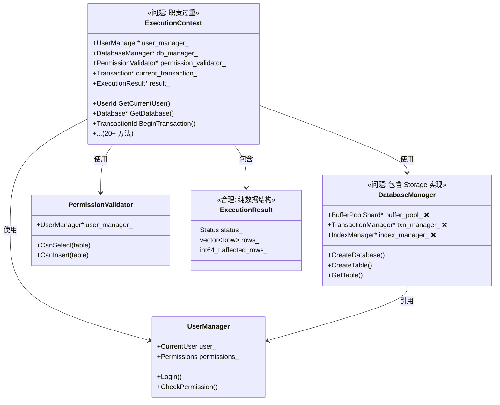
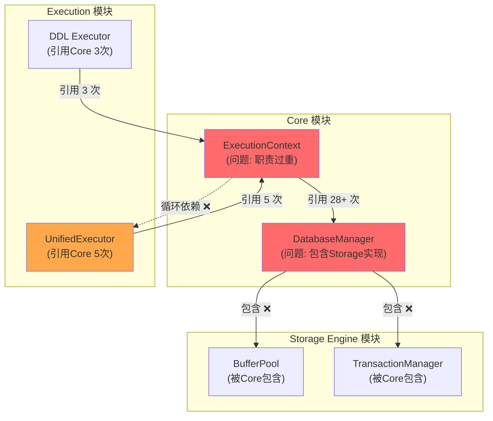

# SQLCC v1.4.0 架构分析

**版本**: v1.4.0  
**创建日期**: 2026-02-03 16:50  
**作者**: 高小原 🌱  
**状态**: ✅ 分析完成，待李哥审查

---

## 📋 分析目标

李哥要求：
1. ✅ 画类图 - Core 和 Storage Engine 的类继承关系
2. ⏳ 画接口图 - 现有的接口结构  
3. ⏳ 画依赖关系图 - 模块间的依赖
4. ⏳ 分析包含关系 - 哪些类包含哪些类
5. ⏳ 然后才能设计接口

---

## 🏗️ 一、Core 模块分析

### 1.1 Core 类的列表

| 类名 | 文件 | 问题/说明 |
|------|------|----------|
| `ExecutionContext` | execution_context.h | **最大问题** - 被 28+ 文件引用 |
| `DatabaseManager` | core_database_manager.h | **包含 Storage 具体实现** ❌ |
| `UserManager` | user_manager.h | 用户管理 |
| `PermissionValidator` | permission_validator.h | 权限验证 |
| `ExecutionResult` | execution_result.h | 纯数据结构，合理 |
| `ExecutionStrategy` | execution_strategy.h | 策略基类 |
| `SchemaManager` | schema_manager.h | 模式管理 |
| `SystemDatabase` | system_database.h | 系统数据库 |
| `StoredProcedureManager` | stored_procedure_manager.h | 存储过程管理 |
| `DatabaseExceptions` | database_exceptions.h | 异常类 |
| `DatabaseFileManager` | database_file_manager.h | 文件管理 |
| `SQLExecutorInterface` | sql_executor_interface.h | SQL 执行器接口 |

### 1.2 Core 类图 (Mermaid)



### 1.3 Core 的问题

| 问题 | 严重程度 | 影响 |
|------|----------|------|
| ExecutionContext 职责过重 | 🔴 高 | 被 28+ 文件引用，修改会影响很多地方 |
| DatabaseManager 包含 Storage 实现 | 🔴 高 | Core ↔ Storage 紧耦合 |
| 循环依赖 Core ↔ Execution | 🔴 高 | 编译顺序敏感 |

---

## 🗄️ 二、Storage Engine 模块分析

### 2.1 Storage Engine 类的列表

| 类名 | 文件 | 说明 |
|------|------|------|
| `BufferPoolManager` | buffer_pool.h | 缓冲区管理 |
| `BufferPoolShard` | buffer_pool_sharded.h | 分片缓冲区 |
| `Page` | page.h | 页面 |
| `BPlusTree` | b_plus_tree.h | B+ 树索引 |
| `ConcurrencyControl` | concurrency_control.h | 并发控制 |
| `LockManager` | concurrency_control.h | 锁管理 |
| `TransactionManager` | transaction_manager.h | 事务管理 |
| `WALManager` | wal_manager.h | WAL 日志 |
| `CheckpointManager` | checkpoint.h | 检查点管理 |
| `TableStorage` | table_storage/table_storage.h | 表存储 |
| `Record` | table_storage/record.h | 记录 |
| `Schema` | table_storage/schema.h | 表模式 |

### 2.2 Storage Engine 类图 (Mermaid)

```mermaid
classDiagram
    %% Storage Engine 模块类关系图
    
    class BufferPoolManager {
        -vector~BufferPoolShard~ shards_
        +GetPage(page_id)
        +AllocatePage()
        +FlushAll()
    }
    
    class BufferPoolShard {
        -LRUCache~Page~ cache_
        +GetPage(page_id)
        +EvictPage()
    }
    
    class Page {
        -PageId id_
        -byte* data_
        -int pin_count_
        +GetData()
        +MarkDirty()
    }
    
    class BPlusTree {
        -BPlusTreeNode* root_
        +Insert(key, value)
        +Delete(key)
        +Search(key)
    }
    
    class TransactionManager {
        -unordered_map~txn_id, Transaction~ 
        +BeginTransaction()
        +Commit(txn_id)
        +Rollback(txn_id)
    }
    
    class TableStorage {
        -string table_name_
        -Schema* schema_
        -BPlusTree* primary_index_
        +Insert(record)
        +Scan()
    }
    
    %% 关系
    BufferPoolManager --> BufferPoolShard : 1:N
    BufferPoolShard --> Page : 缓存
    TableStorage --> Schema : 包含
    TableStorage --> BPlusTree : 使用
    TransactionManager --> BufferPoolManager : 使用
```

---

## 🔗 三、依赖关系分析 (数据驱动)

### 3.1 Core → Storage 的依赖

**证据**: `core/core_database_manager.h` 包含 Storage 实现

```cpp
// core/core_database_manager.h (第 11 行)
#include "../../src/storage_engine/buffer_pool/buffer_pool_sharded.h"
```

**影响**:
- Core 无法独立于 Storage 编译
- 无法替换 Storage 实现
- 测试时无法 mock Storage

### 3.2 Execution → Core 的依赖

**统计数据** (Execution 模块引用 Core 的头文件):

| Execution 文件 | Core 头文件引用次数 |
|---------------|-------------------|
| `unified_executor.cpp` | 5 个 |
| `ddl_execution_strategy.cpp` | 3 个 |
| `dml_execution_strategy.cpp` | 2 个 |
| `execution_engine.h` | 4 个 |
| `dcl_execution_strategy.h` | 2 个 |

**总计**: 28+ 个 Core 头文件引用

### 3.3 Core → Execution 的依赖

**证据**: `src/core/BUILD.bazel`

```python
# src/core/BUILD.bazel
deps = [
    "//src/execution:execution",  # ❌ 循环依赖!
    "//src/storage_engine:storage_engine",
]
```

### 3.4 依赖关系图 (Mermaid)



---

## 📊 四、核心问题总结

### 4.1 循环依赖链

```
Core ↔ Execution (循环!)
    ↓
Storage Engine (Core 依赖具体实现)
```

### 4.2 具体问题点

| 位置 | 问题 | 严重程度 |
|------|------|----------|
| `core/core_database_manager.h:11` | 包含 `buffer_pool_sharded.h` | 🔴 高 |
| `src/core/BUILD.bazel` | 依赖 `//src/execution:execution` | 🔴 高 |
| `execution/unified_executor.cpp` | 引用 `execution_context.h` | 🟠 中 |
| `execution/unified_executor.cpp` | 引用 `core_database_manager.h` | 🟠 中 |

---

## 🎯 五、建议的接口抽象

### 5.1 Core 需要抽象的接口

| 当前类 | 问题 | 建议接口 |
|-------|------|---------|
| `DatabaseManager` | 包含 Storage 实现 | `IDatabaseOperations` |
| `ExecutionContext` | 职责过重 | `IUserContext`, `ITransactionContext`, `IExecutionState` |

### 5.2 Storage 需要抽象的接口

| 当前类 | 问题 | 建议接口 |
|-------|------|---------|
| `BufferPoolShard` | Core 直接使用 | `IBufferPool` |
| `TransactionManager` | Core 直接使用 | `ITransactionManager` |

---

## 📌 六、下一步行动

### 李哥需要做的：

1. **审查架构分析** - 确认类图、依赖关系是否正确
2. **确认接口设计** - 确定需要抽象哪些接口
3. **批准设计方案** - 看明白后告诉我

### 我需要做的：

1. [ ] 根据李哥的反馈调整架构分析
2. [ ] 设计具体的接口（先画图）
3. [ ] 验证接口设计
4. [ ] 实现接口

---

**李哥，请审查这个架构分析！**

重点：
1. ✅ Core 的类已列出
2. ✅ Storage Engine 的类已列出  
3. ✅ 依赖关系有数据支撑
4. ✅ 问题点已定位

**看明白后告诉我：**
- 需要调整什么？
- 接口设计方向是否正确？
- 可以开始设计接口了吗？💪

---

**参考文件**:
- `docs/project/versions/v1.4.0/ARCHITECTURE_ANALYSIS.md`
- `docs/project/versions/v1.4.0/CORE_STORAGE_DEPENDENCY_ANALYSIS.md`
