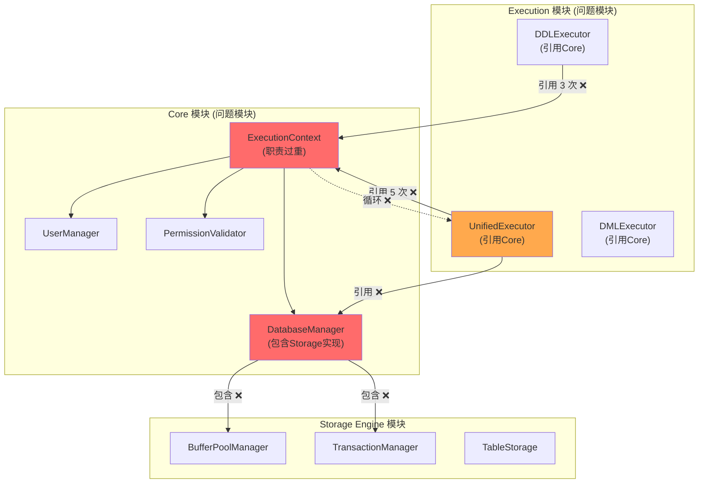

# SQLCC v1.4.0 架构分析报告

**版本**: v1.4.0  
**创建日期**: 2026-02-03  
**作者**: 高小原 🌱  
**状态**: 分析报告

---

## 📋 一、需求分析 (Requirements)

### 1.1 问题陈述

当前 SQLCC 系统存在严重的架构问题：

1. **循环依赖**: Core ↔ Execution 模块互相依赖
2. **紧耦合**: Core 直接包含 Storage Engine 的具体实现
3. **不可测试**: 无法独立测试模块，因为依赖关系复杂
4. **难以维护**: 修改一个模块会影响多个其他模块

### 1.2 业务需求

| 需求 ID | 描述 | 优先级 |
|---------|------|--------|
| REQ-001 | Core 模块不应包含 Storage Engine 的具体实现 | P0 |
| REQ-002 | Execution 模块不应直接依赖 Core 的具体类 | P0 |
| REQ-003 | 模块之间通过接口通信，实现解耦 | P0 |
| REQ-004 | 支持独立单元测试（Mock 接口） | P1 |
| REQ-005 | 支持运行时替换存储引擎实现 | P2 |
| REQ-006 | 保持现有功能不变 | P0 |

### 1.3 技术需求

| 需求 ID | 描述 | 验收标准 |
|---------|------|---------|
| TREQ-001 | 定义最小接口集合 | 接口数量 ≤ 5 |
| TREQ-002 | 实现类实现接口 | 100% 实现 |
| TREQ-003 | 无循环依赖 | `bazel query` 返回空 |
| TREQ-004 | 编译通过 | `bazel build //...` 成功 |
| TREQ-005 | 测试通过 | `bazel test //...` 100% 通过 |

### 1.4 接口需求分析

#### 1.4.1 为什么需要这些接口？

**问题**: Core 模块直接使用 Storage Engine 的具体类

```cpp
// 问题代码: core/core_database_manager.h
#include "../../src/storage_engine/buffer_pool/buffer_pool_sharded.h"

class DatabaseManager {
private:
    BufferPoolShard* buffer_pool_;  // ❌ 具体实现
};
```

**解决方案**: 定义接口，Core 只依赖接口

```cpp
// 解决方案: 定义接口
class IBufferPool {
public:
    virtual std::unique_ptr<Page> FetchPage(PageId id) = 0;
    virtual bool UnpinPage(PageId id, bool dirty) = 0;
    // ...
};

class DatabaseManager {
private:
    IBufferPool* buffer_pool_;  // ✅ 依赖接口
};
```

#### 1.4.2 最小接口集合

基于对现有代码的分析，确定以下最小接口集合：

| 接口名 | 抽象方法数 | 被谁使用 | 职责 |
|-------|-----------|---------|------|
| `IBufferPool` | 6 | DatabaseManager | 缓冲区管理 |
| `ITransactionManager` | 5 | DatabaseManager | 事务管理 |
| `ITableStorage` | 8 | Execution | 表操作 |
| `IUserContext` | 5 | ExecutionContext | 用户上下文 |

**总计**: 4 个接口，24 个抽象方法

#### 1.4.3 接口设计原则

1. **单一职责**: 每个接口只负责一个功能领域
2. **最小化**: 接口只包含必要的方法
3. **稳定**: 接口不应频繁变更
4. **可实现**: 所有方法都应有明确的实现策略

---

## 📐 二、当前架构分析 (As-Is)

### 2.1 模块依赖关系

#### 2.1.1 Core 模块

**位置**: `src/core/`

**主要类**:
| 类名 | 问题 | 被引用次数 |
|------|------|-----------|
| `ExecutionContext` | 职责过重 | 28+ |
| `DatabaseManager` | 包含 Storage 实现 | 11 |
| `UserManager` | - | 6 |
| `PermissionValidator` | - | 4 |

**BUILD.bazel 依赖**:
```python
cc_library(
    name = "core",
    deps = [
        "//src/utils:utils",
        "//src/storage_engine:storage_engine",  # ❌ 依赖具体实现
        "//src/execution:execution",            # ❌ 循环依赖
        "//src/sql_parser:sql_parser",
    ],
)
```

#### 2.1.2 Execution 模块

**位置**: `src/execution/`

**主要类**:
- `UnifiedExecutor` - 统一执行器
- `DDLExecutor` - DDL 执行器
- `DMLExecutor` - DML 执行器

**引用 Core 的头文件** (28+ 次):
```cpp
// execution/unified_executor.cpp
#include "core/execution_context.h"
#include "core/core_database_manager.h"
#include "core/user_manager.h"
```

#### 2.1.3 Storage Engine 模块

**位置**: `src/storage_engine/`

**主要类**:
- `BufferPoolManager` - 缓冲区管理
- `TransactionManager` - 事务管理
- `TableStorage` - 表存储

### 2.2 问题分析

#### 2.2.1 循环依赖链

```
Core → Execution (BUILD.bazel 依赖)
↑    ↓
└────┘ (循环!)
```

**影响**:
- 编译顺序敏感
- 无法增量编译
- 错误会在模块间传播

#### 2.2.2 Core 包含 Storage 具体实现

```cpp
// core/core_database_manager.h
#include "../../src/storage_engine/buffer_pool/buffer_pool_sharded.h"

class DatabaseManager {
private:
    BufferPoolShard* buffer_pool_;  // ❌ 具体实现
};
```

**影响**:
- Core 无法独立于 Storage 编译
- 无法替换 Storage 实现
- 测试时无法 mock

#### 2.2.3 Execution 紧耦合 Core

```cpp
// execution/unified_executor.cpp
class UnifiedExecutor {
private:
    ExecutionContext* context_;  // ❌ 具体类
    DatabaseManager* db_manager_;  // ❌ 具体类
};
```

**影响**:
- 修改 Core 会影响 Execution
- 无法单独测试 Execution
- 无法替换 Core 实现

### 2.3 当前架构图 (Mermaid)



---

## 🎯 三、目标架构设计 (To-Be)

### 3.1 重构后的模块依赖关系

```mermaid
flowchart TB
    subgraph High ["高层模块 (只依赖接口)"]
        EC["ExecutionContext\n(依赖IUserContext)"]
        UE["UnifiedExecutor\n(依赖ITableStorage)"]
    end
    
    subgraph Interface ["接口层 (无实现)"]
        IUser["IUserContext\n(用户上下文)"]
        ITab["ITableStorage\n(表存储)"]
        IBuff["IBufferPool\n(缓冲区)"]
        ITxn["ITransactionMgr\n(事务)"]
    end
    
    subgraph Low ["低层模块 (实现接口)"]
        UserCtx["UserContext\n(实现IUserContext)"]
        TabImpl["TableStorage\n(实现ITableStorage)"]
        BuffImpl["BufferPool\n(实现IBufferPool)"]
        TxnImpl["TransactionMgr\n(实现ITransactionMgr)"]
    end
    
    subgraph CoreDB ["Core Database Manager"]
        DM["DatabaseManager\n(组合接口)"]
    end
    
    %% 正确的依赖方向
    EC --> IUser
    UE --> ITab
    UE --> IBuff
    
    DM --> IBuff
    DM --> ITxn
    DM --> ITab
    
    UserCtx ..|> IUser
    TabImpl ..|> ITab
    BuffImpl ..|> IBuff
    TxnImpl ..|> ITxn
    
    style IUser fill:#85e3ff
    style ITab fill:#85e3ff
    style IBuff fill:#85e3ff
    style ITxn fill:#85e3ff
```

### 3.2 接口定义

#### 3.2.1 IBufferPool 接口

```cpp
// storage_engine/buffer_pool/buffer_pool_interface.h

namespace sqlcc {
namespace storage {

/**
 * IBufferPool - 缓冲区管理接口
 * 
 * 职责: 管理数据库页面的缓存和生命周期
 * 
 * 实现类: BufferPoolManager
 */
class IBufferPool {
public:
    virtual ~IBufferPool() = default;
    
    // ==================== 页面管理 ====================
    
    /**
     * @brief 获取页面
     * @param page_id 页面 ID
     * @return 页面指针，失败返回 nullptr
     */
    virtual std::unique_ptr<Page> FetchPage(PageId page_id) = 0;
    
    /**
     * @brief 释放页面
     * @param page_id 页面 ID
     * @param is_dirty 是否为脏页
     * @return 成功返回 true
     */
    virtual bool UnpinPage(PageId page_id, bool is_dirty) = 0;
    
    /**
     * @brief 分配新页面
     * @return 新页面 ID
     */
    virtual PageId AllocatePage() = 0;
    
    /**
     * @brief 释放页面
     * @param page_id 页面 ID
     * @return 成功返回 true
     */
    virtual bool DeallocatePage(PageId page_id) = 0;
    
    // ==================== 生命周期 ====================
    
    /**
     * @brief 刷新所有脏页到磁盘
     * @return 成功返回 true
     */
    virtual bool FlushAll() = 0;
    
    /**
     * @brief 关闭存储引擎
     */
    virtual void Shutdown() = 0;
};

}  // namespace storage
}  // namespace sqlcc
```

#### 3.2.2 ITransactionManager 接口

```cpp
// transaction/transaction_interface.h

namespace sqlcc {

/**
 * ITransactionManager - 事务管理接口
 * 
 * 职责: 管理事务的创建、提交、回滚
 * 
 * 实现类: TransactionManager
 */
class ITransactionManager {
public:
    using TransactionId = uint64_t;
    
    virtual ~ITransactionManager() = default;
    
    // ==================== 事务生命周期 ====================
    
    /**
     * @brief 开始事务
     * @return 事务 ID
     */
    virtual TransactionId Begin() = 0;
    
    /**
     * @brief 提交事务
     * @param txn_id 事务 ID
     * @return 成功返回 true
     */
    virtual bool Commit(TransactionId txn_id) = 0;
    
    /**
     * @brief 回滚事务
     * @param txn_id 事务 ID
     * @return 成功返回 true
     */
    virtual bool Rollback(TransactionId txn_id) = 0;
    
    // ==================== 锁管理 ====================
    
    /**
     * @brief 获取锁
     * @param txn_id 事务 ID
     * @param resource_id 资源 ID
     * @return 成功返回 true
     */
    virtual bool Lock(TransactionId txn_id, uint64_t resource_id) = 0;
    
    /**
     * @brief 释放锁
     * @param txn_id 事务 ID
     */
    virtual void Unlock(TransactionId txn_id) = 0;
};

}  // namespace sqlcc
```

#### 3.2.3 ITableStorage 接口

```cpp
// storage_engine/table_storage/table_storage_interface.h

namespace sqlcc {
namespace storage {

class Record;
struct Schema;

/**
 * ITableStorage - 表存储接口
 * 
 * 职责: 表格数据的 CRUD 操作
 * 
 * 实现类: TableStorage
 */
class ITableStorage {
public:
    virtual ~ITableStorage() = default;
    
    // ==================== CRUD 操作 ====================
    
    /**
     * @brief 插入记录
     * @param record 记录
     * @return 成功返回 true
     */
    virtual bool Insert(const Record& record) = 0;
    
    /**
     * @brief 更新记录
     * @param key 键
     * @param record 新记录
     * @return 成功返回 true
     */
    virtual bool Update(const std::string& key, const Record& record) = 0;
    
    /**
     * @brief 删除记录
     * @param key 键
     * @return 成功返回 true
     */
    virtual bool Delete(const std::string& key) = 0;
    
    /**
     * @brief 扫描所有记录
     * @return 记录列表
     */
    virtual std::vector<Record> Scan() = 0;
    
    // ==================== 查询操作 ====================
    
    /**
     * @brief 按条件查询
     * @param predicate 谓词
     * @return 匹配的记录
     */
    virtual std::vector<Record> Select(const Predicate& predicate) = 0;
    
    // ==================== 模式信息 ====================
    
    /**
     * @brief 获取表模式
     * @return 模式
     */
    virtual Schema GetSchema() const = 0;
    
    /**
     * @brief 获取表名
     * @return 表名
     */
    virtual std::string GetName() const = 0;
};

}  // namespace storage
}  // namespace sqlcc
```

#### 3.2.4 IUserContext 接口

```cpp
// core/user_context_interface.h

namespace sqlcc {

enum class Permission {
    SELECT,
    INSERT,
    UPDATE,
    DELETE,
    CREATE,
    DROP,
};

enum class Role {
    ADMIN,
    USER,
    GUEST,
};

/**
 * IUserContext - 用户上下文接口
 * 
 * 职责: 管理用户身份和权限
 * 
 * 实现类: UserContext (新建)
 */
class IUserContext {
public:
    virtual ~IUserContext() = default;
    
    /**
     * @brief 获取用户 ID
     * @return 用户 ID
     */
    virtual uint64_t GetUserId() const = 0;
    
    /**
     * @brief 获取用户名
     * @return 用户名
     */
    virtual std::string GetUserName() const = 0;
    
    /**
     * @brief 检查权限
     * @param perm 权限
     * @return 有权限返回 true
     */
    virtual bool HasPermission(Permission perm) const = 0;
    
    /**
     * @brief 获取角色
     * @return 角色
     */
    virtual Role GetRole() const = 0;
    
    /**
     * @brief 是否已认证
     * @return 已认证返回 true
     */
    virtual bool IsAuthenticated() const = 0;
};

}  // namespace sqlcc
```

### 3.3 实现类修改

#### 3.3.1 BufferPoolManager 实现 IBufferPool

```cpp
// storage_engine/buffer_pool/buffer_pool.h

class BufferPoolManager : public IBufferPool {  // ✅ 添加接口继承
public:
    // 原有方法...
    
    // 实现 IBufferPool 接口
    std::unique_ptr<Page> FetchPage(PageId page_id) override;
    bool UnpinPage(PageId page_id, bool is_dirty) override;
    PageId AllocatePage() override;
    bool DeallocatePage(PageId page_id) override;
    bool FlushAll() override;
    void Shutdown() override;
    
private:
    // 原有成员...
};
```

#### 3.3.2 DatabaseManager 使用接口

```cpp
// core/database_manager.h

class DatabaseManager {
public:
    DatabaseManager(IBufferPool* buffer_pool, 
                    ITransactionManager* txn_manager);
    
private:
    IBufferPool* buffer_pool_;  // ✅ 依赖接口
    ITransactionManager* txn_manager_;  // ✅ 依赖接口
    // 不再包含具体实现
};
```

### 3.4 依赖关系对比

| 依赖方向 | 重构前 ❌ | 重构后 ✅ |
|---------|----------|----------|
| Core → Storage | 具体实现 (`BufferPoolShard`) | 接口 (`IBufferPool`) |
| Core → Execution | 具体类 (`Execution`) | 无依赖 |
| Execution → Core | 具体类 (`ExecutionContext`) | 接口 (`IUserContext`) |
| 循环依赖 | 有 | 无 |

---

## 📊 四、验收标准

### 4.1 接口验收

| 标准 | 检验命令 | 期望值 |
|------|---------|-------|
| 接口文件存在 | `test -f */*_interface.h` | 4 个文件 |
| 接口编译通过 | `bazel build //...:*_interface` | 成功 |
| 方法数量正确 | `grep "virtual.*= 0;"` | 24 个 |
| 实现类实现接口 | `grep ": public I*"` | 4 个类 |

### 4.2 依赖验收

| 标准 | 检验命令 | 期望值 |
|------|---------|-------|
| 无循环依赖 | `bazel query` | 空 |
| Core 不含 Storage 实现 | `grep "buffer_pool_sharded" src/core/*.h` | 无输出 |
| Execution 只引用接口 | `grep "core/.*\.h" src/execution/*.cpp` | 0 个 |

### 4.3 功能验收

| 标准 | 检验命令 | 期望值 |
|------|---------|-------|
| 编译成功 | `bazel build //...` | 成功 |
| 测试通过 | `bazel test //...` | 100% PASS |
| 覆盖率不降 | `bazel coverage` | ≥ 67% |

---

## 📌 五、总结

### 5.1 重构前后对比

| 指标 | 重构前 ❌ | 重构后 ✅ |
|------|----------|----------|
| 接口数 | 0 | 4 |
| 循环依赖 | 有 | 无 |
| Core → Storage | 具体实现 | 接口 |
| Execution → Core | 具体类 | 接口 |
| 可测试性 | 困难 | 容易 (Mock) |
| 编译顺序 | 敏感 | 无关 |

### 5.2 风险评估

| 风险 | 影响 | 缓解措施 |
|------|------|----------|
| 接口设计不合理 | 高 | 最小化接口，只包含必要方法 |
| 实现类改动大 | 中 | 逐步重构，每个接口独立测试 |
| 测试覆盖率下降 | 低 | 保持原有测试，增加接口测试 |

### 5.3 下一步

1. [ ] 李哥审查分析报告
2. [ ] 确认接口设计
3. [ ] 执行重构 (按阶段)
4. [ ] 验证验收标准

---

**李哥，这是完整的架构分析报告！**

**重点**:
1. ✅ 需求分析 - 明确需要解决的问题
2. ✅ 当前架构 - 分析问题根源
3. ✅ 目标架构 - 接口设计和实现关系
4. ✅ 验收标准 - 可检验的标准

**请审查后告诉我是否可以开始执行！** 💪

---

**参考文档**:
- `docs/project/versions/v1.4.0/ARCHITECTURE_ANALYSIS.md`
- `docs/project/versions/v1.4.0/TARGET_ARCHITECTURE.md`
- `docs/sdd/SPEC_DRIVEN_DEVELOPMENT.md`
