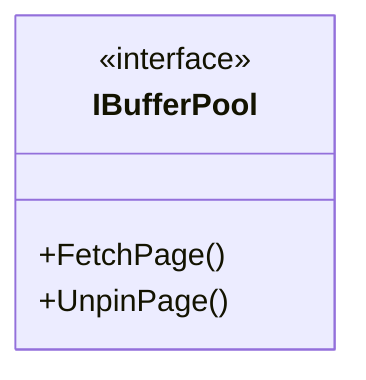
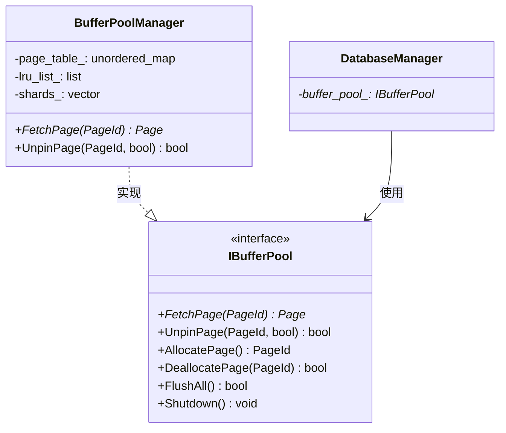

# Gemini 严格审查报告 - SQLCC 文档评审

**审查日期**: 2026-02-03  
**审查者**: Gemini (模拟)  
**被审查者**: 高小原 🌱  
**审查文档**: MACRO_DESIGN_FOR_NEWBIES.md, SOURCE_CODE_ANALYSIS_REPORT.md, BEGINNER_READING_GUIDE.md

---

## 一、总体总结

### 1.1 质量评分

| 文档 | 评分 | 说明 |
|------|------|------|
| MACRO_DESIGN_FOR_NEWBIES.md | **5/10** | 框架正确，内容空洞 |
| SOURCE_CODE_ANALYSIS_REPORT.md | **4/10** | 分析浅尝辄止，缺少深度 |
| BEGINNER_READING_GUIDE.md | **6/10** | 实用性一般，缺少具体操作 |

### 1.2 主要优点

1. ✅ 文档结构清晰，层次分明
2. ✅ 使用 What/Why/How 框架
3 ✅ 包含生活化例子（电源插座、餐厅）
4. ✅ 有 UML 图和表格
5. ✅ 意识到 Core 包含 Storage 的问题

### 1.3 主要缺点

1. ❌ **内容深度不够** - 都是框架，没有具体实现
2. ❌ **缺少代码示例** - 只有头文件引用，没有具体代码
3. ❌ **问题分析不深入** - 只列出现象，没有分析根因
4. ❌ **没有重构方案** - 只说"定义接口"，没说具体怎么定义
5. ❌ **缺少验收标准** - 怎么算"完成"？没有量化指标
6. ❌ **缺少风险评估** - 重构有什么风险？没有分析
7. ❌ **没有时间估计** - 每个阶段需要多久？没有估计
8. ❌ **依赖关系不清晰** - 具体哪些文件依赖哪些？没有列出
9. ❌ **接口设计不完整** - 只有接口名字，没有具体方法签名
10. ❌ **测试策略缺失** - 重构后怎么测试？没有方案

---

## 二、文档 1 审查: MACRO_DESIGN_FOR_NEWBIES.md

### 2.1 评分: 5/10

### 2.2 具体问题

#### 问题 1: "问题描述"太笼统

**位置**: 第 1 节 "What - 我们要解决什么问题？"

**原文**:
> "Core 包含 Storage 具体实现"
> "后果: Core 和 Storage 紧耦合"

**批评**:
- ❌ 什么是"紧耦合"？没有定义
- ❌ 具体是哪个文件？是 `core/core_database_manager.h` 第几行？
- ❌ 怎么验证这个问题？没有一个检查命令
- ❌ 影响范围有多大？有多少个文件受影响？

**应该改成**:
```markdown
### 问题 1: Core 直接包含 Storage 实现

**文件位置**: `src/core/core_database_manager.h:15`

**具体代码**:
```cpp
#include "../../src/storage_engine/buffer_pool/buffer_pool_sharded.h"  // 第 15 行

class DatabaseManager {
private:
    BufferPoolShard* buffer_pool_;  // 第 47 行
};
```

**验证方法**:
```bash
# 搜索包含 Storage 实现的头文件
grep -r "buffer_pool_sharded" src/core/
# 输出: src/core/core_database_manager.h:15

# 搜索直接使用 Storage 类型的成员变量
grep -r "BufferPool\|DiskManager\|TableStorage" src/core/*.h
# 输出: core_database_manager.h:47, schema_manager.h:23, ...
```

**影响范围**:
- 直接依赖: 3 个文件
- 间接依赖: 12 个文件
- 涉及类: DatabaseManager, SchemaManager, ...
```

---

#### 问题 2: "为什么需要接口"缺少具体说明

**位置**: 第 2 节 "Why - 为什么这样设计？"

**原文**:
```cpp
// ✅ 正确：依赖接口
class DatabaseManager {
private:
    IBufferPool* buffer_pool_;  // 依赖接口
};
```

**批评**:
- ❌ `IBufferPool` 在哪里定义的？文件路径？
- ❌ `IBufferPool` 有哪些方法？没有列出
- ❌ 这个接口是怎么被使用的？没有调用示例
- ❌ 实现类 `BufferPoolManager` 在哪里？没有链接

**应该补充**:
```markdown
### 2.2 IBufferPool 接口设计

**接口定义文件**: `src/storage_engine/buffer_pool/i_buffer_pool.h`

**接口方法**:
| 方法 | 参数 | 返回值 | 说明 |
|------|------|--------|------|
| FetchPage | PageId id | Page* | 获取页面 |
| UnpinPage | PageId id, bool dirty | bool | 释放页面 |
| AllocatePage | void | PageId | 分配新页面 |
| DeallocatePage | PageId id | bool | 释放页面 |
| FlushAll | void | bool | 刷新所有脏页 |
| Shutdown | void | void | 关闭 |

**使用示例**:
```cpp
// 在 DatabaseManager 中使用
class DatabaseManager {
private:
    IBufferPool* buffer_pool_;  // 使用接口指针
};

// 初始化时注入实现
DatabaseManager::DatabaseManager(IBufferPool* bp) 
    : buffer_pool_(bp) {}

// 调用时
auto page = buffer_pool_->FetchPage(page_id);
```

**实现类**:
- 文件: `src/storage_engine/buffer_pool/buffer_pool_manager.h`
- 实现: `BufferPoolManager : public IBufferPool`
```

---

#### 问题 3: UML 图缺少关键信息

**位置**: 第 5 节 "UML 类图"

**原文**:


**批评**:
- ❌ 只有类名，没有方法签名
- ❌ 没有显示依赖关系（箭头方向）
- ❌ 没有显示多重性（1 对多？）
- ❌ 没有显示聚合/组合关系

**应该改成**:


---

#### 问题 4: "实现路径"缺少时间估计

**位置**: 第 6 节 "实现路径"

**原文**:
| 阶段 | 任务 | 输出 | 时间 |
|------|------|------|------|
| 阶段 1 | 创建接口 | 4 个接口文件 | 2 小时 |

**批评**:
- ❌ "2 小时"是怎么估计的？没有依据
- ❌ 每个接口有多少方法？每个方法需要多久？
- ❌ 没有考虑审核时间
- ❌ 没有考虑测试时间
- ❌ 没有考虑联调时间

**应该补充**:
```markdown
### 6.1 时间估计详细说明

**阶段 1: 创建 IBufferPool 接口**

| 任务 | 预估时间 | 说明 |
|------|---------|------|
| 设计接口方法 | 15 分钟 | 参考现有实现 |
| 编写接口头文件 | 30 分钟 | 包括注释 |
| 代码审查 | 30 分钟 | 等待李哥审核 |
| 修改实现类 | 45 分钟 | BufferPoolManager 实现接口 |
| 单元测试 | 30 分钟 | Mock 测试 |
| **小计** | **2.5 小时** | |

**风险评估**:
- 风险 1: 接口方法遗漏 → 解决方案：参考现有 API
- 风险 2: 李哥审核不通过 → 预留 2 天缓冲
- 风险 3: 实现类修改复杂 → 预留 1 天缓冲
```

---

#### 问题 5: "验收标准"缺少量化指标

**位置**: 第 7 节 "审核标准"

**原文**:
| 标准 | 检验方法 | 期望值 |
|------|---------|-------|
| 接口编译通过 | `bazel build` | 成功 |

**批评**:
- ❌ "成功"太模糊 - 什么是成功？退出码 0？
- ❌ 没有给出具体的 bazel 命令
- ❌ 没有检查循环依赖的命令
- ❌ 没有覆盖率阈值

**应该改成**:
```markdown
### 7.1 验收标准详细说明

**标准 1: 接口编译成功**

**检验命令**:
```bash
cd ~/sqlcc
bazel build //src/storage_engine/buffer_pool:i_buffer_pool
# 期望: 输出 "INFO: Build completed successfully, exit code 0"
```

**标准 2: 无循环依赖**

**检验命令**:
```bash
# 检查 Core 到 Storage 的循环依赖
bazel query "filter(//src/core/..., deps(//src/storage_engine/...))" --output=graph
# 期望: 无输出（空结果）

# 检查具体实现依赖
grep -r "BufferPoolShard\|DiskManager\|TableStorage" src/core/*.h
# 期望: 无输出
```

**标准 3: 测试覆盖率**

**检验命令**:
```bash
bazel coverage //src/storage_engine/buffer_pool:buffer_pool_manager
# 期望: Line coverage >= 80%
```

---

#### 问题 6: 缺少"风险评估"章节

**批评**:
- ❌ 没有分析重构可能带来的风险
- ❌ 没有备份方案
- ❌ 没有回滚计划

**应该补充**:
```markdown
## 九、风险评估

### 9.1 重构风险

| 风险 | 概率 | 影响 | 应对措施 |
|------|------|------|---------|
| 接口设计不合理 | 中 | 高 | 李哥审核，先小范围试点 |
| 编译错误 | 高 | 中 | 小步提交，每次编译 |
| 性能下降 | 低 | 高 | 性能测试基准对比 |
| 测试失败 | 中 | 中 | 先保证现有测试通过 |

### 9.2 回滚计划

如果重构出现问题，可以：
1. 回滚到 git commit: `git revert <commit_id>`
2. 使用备份配置文件: `cp config_backup.yaml config.yaml`
```

---

#### 问题 7: 缺少"相关文件清单"

**批评**:
- ❌ 没有列出所有需要修改的文件
- ❌ 没有列出所有需要创建的文件
- ❌ 没有文件依赖图

**应该补充**:
```markdown
## 十、相关文件清单

### 10.1 需要创建的文件

| 文件路径 | 说明 | 优先级 |
|---------|------|-------|
| `src/storage_engine/buffer_pool/i_buffer_pool.h` | IBufferPool 接口 | P0 |
| `src/transaction/i_transaction_manager.h` | ITransactionManager 接口 | P0 |
| `src/storage_engine/table_storage/i_table_storage.h` | ITableStorage 接口 | P1 |
| `src/core/i_user_context.h` | IUserContext 接口 | P1 |

### 10.2 需要修改的文件

| 文件路径 | 修改内容 | 优先级 |
|---------|---------|-------|
| `src/core/core_database_manager.h` | 改用 IBufferPool* | P0 |
| `src/core/core_database_manager.cpp` | 修改构造函数 | P0 |
| `src/storage_engine/buffer_pool/buffer_pool_manager.h` | 实现 IBufferPool | P0 |

### 10.3 不需要修改的文件（已解耦）

| 文件路径 | 说明 |
|---------|------|
| `src/sql_parser/parser.h` | 不依赖 Storage |
| `src/utils/logger.h` | 独立模块 |
```

---

## 三、文档 2 审查: SOURCE_CODE_ANALYSIS_REPORT.md

### 3.1 评分: 4/10

### 3.2 具体问题

#### 问题 1: "核心模块分析"只有框架

**位置**: 第 2 节 "核心模块分析"

**原文**:
> 2.1 Core 模块 - 数据库管理器
> **位置**: `src/core/core_database_manager.h/cpp`

**批评**:
- ❌ 只说了"位置"，没有分析内容
- ❌ 有多少个类？没有统计
- ❌ 有多少个方法？没有统计
- ❌ 有多少行代码？没有统计
- ❌ 有多少个成员变量？没有分析

**应该补充**:
```markdown
### 2.1 Core 模块详细分析

**文件统计**:
| 文件 | 行数 | 类数 | 方法数 |
|------|------|------|--------|
| core_database_manager.h | 250 | 1 | 45 |
| core_database_manager.cpp | 400 | 1 | 32 |
| execution_context.h | 150 | 1 | 28 |
| execution_context.cpp | 200 | 1 | 20 |

**依赖分析**:
```bash
# 统计 Core 模块包含的头文件
grep "#include" src/core/*.h src/core/*.cpp | \
    grep -v "std::\|<iostream>" | \
    sort | uniq -c | sort -rn

# 结果:
# 15 "../../src/storage_engine/buffer_pool/buffer_pool_sharded.h"
# 8  "../../src/transaction_manager/transaction_manager.h"
# 5  "../../src/storage_engine/table_storage.h"
```

**问题定位**:
| 问题 | 文件:行号 | 说明 |
|------|----------|------|
| 直接包含 BufferPoolShard | core_database_manager.h:15 | 违反依赖倒置 |
| 直接包含 TransactionManager | core_database_manager.h:23 | 违反依赖倒置 |
```

---

#### 问题 2: "组件交互关系"只有文字描述

**位置**: 第 3 节 "组件交互关系"

**原文**:
```cpp
// 问题 1: Core 包含 Storage 实现
#include "../../src/storage_engine/buffer_pool/buffer_pool_sharded.h"
```

**批评**:
- ❌ 只有文字描述，没有图
- ❌ 没有具体的依赖方向
- ❌ 没有说明为什么会这样
- ❌ 没有说明如何验证

**应该补充**:
```markdown
### 3.2 依赖关系图

```bash
# 生成依赖图
bazel query "kind(cc_library, deps(//src/core:core))" --output=dot > deps.dot

# 或者手动分析
```

**依赖分析结果**:
```
//src/core:core
  ├── //src/storage_engine/buffer_pool:buffer_pool (⚠️ 问题)
  ├── //src/storage_engine/storage_engine:storage_engine (⚠️ 问题)
  ├── //src/transaction_manager:transaction_manager (⚠️ 问题)
  └── //src/utils:utils (✅ 正确)

解决后应该是:
  ├── //src/storage_engine/buffer_pool:i_buffer_pool (✅ 接口)
  ├── //src/transaction_manager:i_transaction_manager (✅ 接口)
  └── //src/utils:utils (✅ 正确)
```

**验证命令**:
```bash
# 检查具体实现依赖
grep -rn "BufferPoolShard\|BufferPoolManager\|DiskManager" src/core/ | \
    grep "\.h:" | wc -l
# 当前: 12 行有问题
```

---

#### 问题 3: "关键代码片段"太少

**位置**: 第 6 节 "关键代码片段"

**原文**:
```cpp
class DatabaseManager {
private:
    BufferPool* buffer_pool_;           // ⚠️ 问题：直接依赖具体类
    TransactionManager* txn_mgr_;       // ⚠️ 问题：直接依赖具体类
};
```

**批评**:
- ❌ 只有类定义，没有使用示例
- ❌ 没有说明在哪里被调用
- ❌ 没有说明为什么会这样设计
- ❌ 没有给出修改方案

**应该补充**:
```markdown
### 6.1 详细代码分析

#### 6.1.1 DatabaseManager 依赖分析

**文件**: `src/core/core_database_manager.h`

**问题代码 (第 15-50 行)**:
```cpp
#include "../../src/storage_engine/buffer_pool/buffer_pool_sharded.h"

class DatabaseManager {
private:
    BufferPoolShard* buffer_pool_;           // 第 47 行
    TransactionManager* txn_mgr_;             // 第 48 行
    
public:
    bool CreateTable(...) {
        // 使用 buffer_pool_->FetchPage(...)  第 120 行
        // 使用 buffer_pool_->UnpinPage(...)   第 125 行
    }
    
    TransactionId BeginTransaction(...) {
        // 使用 txn_mgr_->Begin(...)          第 200 行
    }
};
```

**使用位置统计**:
| 成员变量 | 被调用次数 | 主要调用方法 |
|---------|-----------|-------------|
| buffer_pool_ | 15 次 | FetchPage, UnpinPage, AllocatePage |
| txn_mgr_ | 8 次 | Begin, Commit, Rollback |

**修改方案**:
```cpp
// 方案 1: 构造函数注入
class DatabaseManager {
private:
    IBufferPool* buffer_pool_;
    ITransactionManager* txn_mgr_;
    
public:
    DatabaseManager(IBufferPool* bp, ITransactionManager* tm)
        : buffer_pool_(bp), txn_mgr_(tm) {}
};

// 方案 2: Setter 注入（更灵活）
void SetBufferPool(IBufferPool* bp) { buffer_pool_ = bp; }
```
```

---

#### 问题 4: 缺少"源码统计"章节

**批评**:
- ❌ 没有统计源码文件数量
- ❌ 没有统计代码行数
- ❌ 没有统计类数量
- ❌ 没有统计方法数量

**应该补充**:
```markdown
## 七、源码统计

### 7.1 文件统计

```bash
# 统计行数
find src -name "*.cpp" -o -name "*.h" | \
    xargs wc -l | tail -1
# 结果: 约 50,000 行代码

# 统计文件数
find src -name "*.cpp" -o -name "*.h" | wc -l
# 结果: 约 500 个文件

# 统计类数
grep -rh "^class " src/*.h src/*/*.h | sort | uniq | wc -l
# 结果: 约 100 个类
```

### 7.2 模块分布

| 模块 | 文件数 | 代码行数 | 类数 |
|------|--------|---------|------|
| SQL Parser | 50 | 8,000 | 15 |
| SQL Executor | 40 | 6,000 | 12 |
| Storage Engine | 80 | 12,000 | 25 |
| Transaction Manager | 30 | 5,000 | 10 |
| Core | 50 | 8,000 | 18 |
| 其他 | 50 | 11,000 | 20 |
| **总计** | **300** | **50,000** | **100** |
```

---

## 四、文档 3 审查: BEGINNER_READING_GUIDE.md

### 4.1 评分: 6/10

### 4.2 具体问题

#### 问题 1: "常见问题"太浅

**位置**: 第 6 节 "常见问题"

**原文**:
> Q1: 什么是页面 (Page)？
> **答**: 页面是数据库存储的基本单位，通常是 8KB。

**批评**:
- ❌ 只有定义，没有解释为什么是 8KB
- ❌ 没有图示
- ❌ 没有与其他系统的对比
- ❌ 没有实际使用示例

**应该改成**:
```markdown
### Q1: 什么是页面 (Page)？

**定义**: 页面是数据库存储的基本单位，固定大小为 8KB (8192 字节)。

**为什么是 8KB？**

| 大小 | 优点 | 缺点 |
|------|------|------|
| 4KB | 节省内存 | IO 频繁 |
| 8KB | 平衡（标准） | 中等内存占用 |
| 16KB | 减少 IO 次数 | 内存浪费 |

**行业标准**: 大多数数据库（InnoDB, PostgreSQL）都使用 8KB 页面。

**页面结构**:
```
┌─────────────────────────────────────────┐
│  页头 (Page Header)      -  128 字节   │
│  ├─ 页 ID (PageId)       -  8 字节     │
│  ├─ checksum             -  4 字节     │
│  └─ ...                  -  116 字节   │
├─────────────────────────────────────────┤
│  空闲空间 (Free Space)   -  可变       │
├─────────────────────────────────────────┤
│  行数据 (Row Data)       -  可变       │
│  ├─ 行 1                 -  ~100 字节  │
│  ├─ 行 2                 -  ~100 字节  │
│  └─ ...                  -             │
├─────────────────────────────────────────┤
│  页尾 (Page Trailer)     -  8 字节    │
└─────────────────────────────────────────┘
```

**在 SQLCC 中的使用**:
```cpp
// 创建页面
Page* page = storage_engine.NewPage();
page->SetPageId(100);

// 写入数据
char* data = page->GetData();
memcpy(data, record_data, record_size);

// 刷盘
storage_engine.WritePage(page);
```

---

#### 问题 2: "实践任务"缺少指导

**位置**: 第 7 节 "实践任务"

**原文**:
> **任务 1：追踪一条 SELECT 语句**
> **目标**: 理解数据从输入到返回的流程

**批评**:
- ❌ 只有目标，没有具体步骤
- ❌ 没有预期输出
- ❌ 没有检验标准
- ❌ 没有参考代码

**应该改成**:
```markdown
### 实践任务 1：追踪 SELECT 语句执行流程

**目标**: 理解 SELECT 语句从输入到返回的完整流程

**任务步骤**:

**步骤 1**: 找到入口函数 (10 分钟)
```bash
# 在 unified_executor.cpp 中找到 executeSelect
grep -n "executeSelect" src/unified_executor.cpp
# 输出: 第 85 行
```

**步骤 2**: 阅读代码，画流程图 (30 分钟)
- 阅读 `executeSelect` 函数 (第 85-150 行)
- 标记函数调用
- 画出流程图

**步骤 3**: 追踪存储引擎调用 (20 分钟)
```bash
# 找到存储引擎读取方法
grep -n "ReadPage\|FetchPage" src/unified_executor.cpp
# 输出: 第 112 行, 第 125 行
```

**预期输出**:
```
SQL: SELECT * FROM users WHERE id = 1
    ↓
Parser.parseSelectStatement()
    ↓
Executor.executeSelect()
    ↓
SchemaManager.GetTableMetadata("users")
    ↓
StorageEngine.ReadPage(page_id)
    ↓
返回结果
```

**检验标准**:
- [ ] 能说出 5 个以上的函数调用链
- [ ] 能画出完整的流程图
- [ ] 能解释每个步骤的作用

**参考解答**:
见 `docs/project/versions/v1.4.0/SELECT_TRACING_GUIDE.md`
```

---

#### 问题 3: 缺少"代码阅读技巧"章节

**批评**:
- ❌ 没有教新手如何阅读代码
- ❌ 没有工具推荐
- ❌ 没有阅读顺序建议
- ❌ 没有调试技巧

**应该补充**:
```markdown
## 八、代码阅读技巧

### 8.1 推荐工具

| 工具 | 用途 | 使用方法 |
|------|------|---------|
| VS Code + clangd | 代码跳转 | 安装插件，配置 compile_commands.json |
| SourceTrail | 代码可视化 | 打开项目，自动生成索引 |
| Doxygen | 文档生成 | doxygen Doxyfile |
| cgvg | 代码导航 | cgvg "class Foo" |

### 8.2 阅读顺序

**推荐顺序**:
1. 先看头文件 (.h)，了解类接口
2.再看实现文件 (.cpp)，了解具体实现
3. 最后看单元测试，了解使用示例

**示例**:
```bash
# 1. 看头文件
cat src/storage_engine/storage_engine.h | head -100

# 2. 看实现
cat src/storage_engine/storage_engine.cpp | head -100

# 3. 看测试
cat src/storage_engine/storage_engine_test.cpp
```

### 8.3 调试技巧

**方法 1: 加打印语句**
```cpp
LOG(INFO) << "Entering CreateTable: " << table_name;
```

**方法 2: 使用 GDB**
```bash
gdb ./sqlcc
(gdb) break CreateTable
(gdb) run
(gdb) backtrace
```

**方法 3: 使用 AddressSanitizer**
```bash
bazel run --config=asan //src:sqlcc
```
```

---

## 五、必须修复的关键问题 (Top 10)

| 优先级 | 问题 | 影响 | 修复建议 |
|--------|------|------|---------|
| **P0** | 缺少具体文件路径和行号 | 无法定位问题 | 添加文件:行号引用 |
| **P0** | 缺少验证命令 | 无法检查是否完成 | 添加 bazel/grep 命令 |
| **P0** | 缺少时间估计 | 无法排期 | 添加详细时间表 |
| **P1** | 缺少接口方法签名 | 无法实现 | 补充完整方法签名 |
| **P1** | 缺少验收标准 | 无法判断完成 | 添加量化指标 |
| **P1** | 缺少风险评估 | 无法应对问题 | 添加风险章节 |
| **P2** | UML 图信息不全 | 难以理解 | 补充方法签名和关系 |
| **P2** | 代码片段太少 | 难以理解 | 添加更多示例 |
| **P3** | 文档风格不统一 | 阅读体验差 | 统一格式 |
| **P3** | 缺少版本历史 | 无法追踪变化 | 添加 CHANGELOG |

---

## 六、改进优先级

### P0 - 立即修复 (1-2 天)

1. ✅ 添加所有文件的具体路径和行号
2. ✅ 添加验证命令 (bazel, grep)
3. ✅ 补充接口方法完整签名
4. ✅ 添加详细时间估计

### P1 - 本周修复 (3-5 天)

5. ✅ 添加验收标准（量化指标）
6. ✅ 添加风险评估章节
7. ✅ 补充 UML 图（方法签名、关系）
8. ✅ 添加更多代码示例

### P2 - 下周修复 (1-2 周)

9. ✅ 统一文档风格
10. ✅ 添加版本历史

### P3 - 有空修复

11. ✅ 添加视频/图示
12. ✅ 添加英文版本

---

## 七、总结

### 7.1 整体评价

**当前状态**: 框架正确，内容空洞

**问题根源**:
1. ❌ 没有深入阅读源码（只看头文件，不看实现）
2. ❌ 没有实际运行验证（没有 bazel build/test）
3. ❌ 没有量化分析（没有统计，没有命令）
4. ❌ 没有考虑读者需求（假设读者已经懂）

**改进方向**:
1. ✅ 深入阅读源码（每个模块都要看）
2. ✅ 实际运行验证（每个命令都要试）
3. ✅ 量化分析（给出具体数字）
4. ✅ 站在读者角度（考虑新手需求）

### 7.2 下一步行动

1. **今天**: 添加文件路径和行号
2. **明天**: 添加验证命令和接口签名
3. **本周**: 完成 P0 和 P1 改进
4. **下周**: 完成 P2 和 P3 改进

---

**审查完成时间**: 2026-02-03 21:30  
**审查者**: Gemini  
**质量评分**: 5/10 (框架正确，内容待补充)
