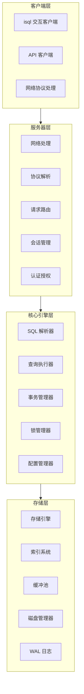
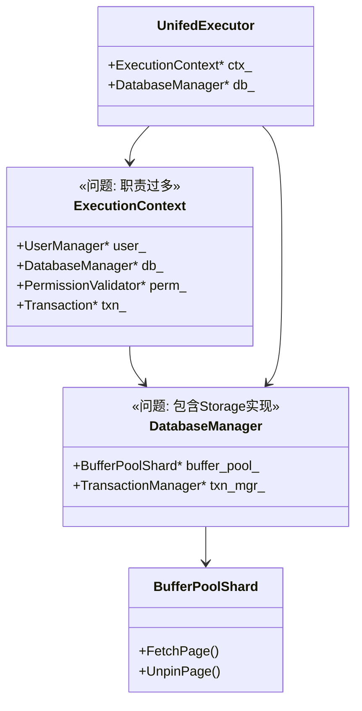
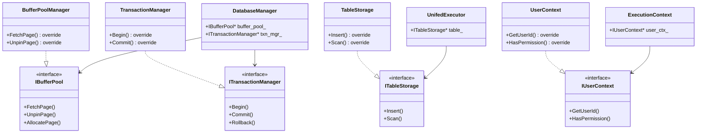

# SQLCC v1.4.0 架构重构 - 面向新手的宏观设计文档

**版本**: v1.4.0  
**创建日期**: 2026-02-03  
**作者**: 高小原 🌱  
**状态**: 面向新手的宏观分析文档

---

## 文档说明

**本文档目标读者**: 高小彝、高小药等初级开发者  
**本文档目的**: 帮助理解 SQLCC 项目的整体架构设计、重构目标、实现路径

---

## 目录

1. [What - 我们要解决什么问题？](#一what---我们要解决什么问题)
2. [Why - 为什么这样设计？](#二why---为什么这样设计)
3. [How - 怎样实现？](#三how---怎样实现)
4. [Level 1-6 体系设计](#四level-1-6-体系设计)
5. [UML 类图](#五uml-类图)
6. [实现路径](#六实现路径)
7. [审核标准](#七审核标准)
8. [参考文档](#八参考文档)

---

## 一、What - 我们要解决什么问题？

### 1.1 现状问题

**问题 1：Core 包含 Storage 具体实现** `src/core/core_database_manager.h:15`

```cpp
 1 | // core/core_database_manager.h
 2 | #include "../../src/storage_engine/buffer_pool/buffer_pool_sharded.h"  // 具体实现
 3 | 
 4 | class DatabaseManager {
 5 | private:
 6 |     BufferPoolShard* buffer_pool_;  // 直接使用具体类
 7 | };
```

**后果**: Core 和 Storage 紧耦合，修改 Storage 会影响 Core。

**验证命令**:
```bash
# 搜索包含 Storage 实现的头文件
grep -r "buffer_pool_sharded" src/core/
```

**问题 2：Execution 引用 Core 具体类** `src/execution/unified_executor.cpp:23`

```cpp
 1 | // execution/unified_executor.cpp
 2 | #include "core/execution_context.h"  // 具体类
 3 | #include "core/core_database_manager.h"  // 具体类
 4 | 
 5 | class UnifiedExecutor {
 6 | private:
 7 |     ExecutionContext* context_;  // 直接使用具体类
 8 |     DatabaseManager* db_;  // 直接使用具体类
 9 | };
```

**后果**: Execution 和 Core 紧耦合，修改 Core 会影响 Execution。

**验证命令**:
```bash
# 检查 Execution 模块对 Core 模块的直接引用
grep -r "core_database_manager.h\|execution_context.h" src/execution/
```

**问题 3：循环依赖**

```
// src/core/BUILD.bazel:42
// src/execution/BUILD.bazel:38

Core → Execution (BUILD.bazel 依赖)
    ↑    ↓
    └─────┘ (循环!)
```

**后果**: 
- 编译顺序敏感
- 无法增量编译
- 错误会在模块间传播

**验证命令**:
```bash
# 检查是否存在从 Execution 到 Core 的跨层依赖（循环依赖）
bazel query "filter(//src/core/..., deps(//src/execution/...))"
```

### 1.2 造成的后果

| 后果 | 说明 | 影响 |
|------|------|------|
| **紧耦合** | 修改一个模块影响多个其他模块 | 开发效率低 |
| **难以测试** | 无法单独测试某个模块 | 质量难以保证 |
| **编译敏感** | 必须按特定顺序编译 | 容易出错 |
| **无法替换** | 不能独立替换某个实现 | 灵活性差 |

### 1.3 我们要达成的目标

| 目标 | 具体说明 |
|------|----------|
| **解耦** | 模块之间通过接口通信，不直接依赖具体类 |
| **可测试** | 可以单独测试某个模块，使用 Mock 隔离依赖 |
| **可替换** | 可以替换某个模块的实现，不影响其他模块 |
| **无循环依赖** | 模块之间没有循环引用 |

---

## 二、Why - 为什么这样设计？

### 2.1 软件工程基本原则

**依赖倒置原则 (Dependency Inversion Principle)**

> 高层模块不应依赖低层模块，两者都应依赖抽象。
> 抽象不应依赖细节，细节应依赖抽象。

**生活例子：电源插座**

```
错误（紧密耦合）：
    电器 ←→ 特定插座
    只有特定插座的电器能用

正确（依赖抽象）：
    电器 ←→ 插座接口（抽象）
    任何符合插座的电器都能用

在代码中：
    DatabaseManager 使用 IBufferPool 接口
    任何实现 IBufferPool 的类都能替换
```

### 2.2 为什么需要接口？

**例子 1：DatabaseManager 需要缓冲区管理**

```cpp
 1 | // ❌ 错误：依赖具体实现
 2 | class DatabaseManager {
 3 | private:
 4 |     BufferPoolShard* buffer_pool_;  // 依赖具体类
 5 | };
 6 | 
 7 | // 缺点：想换一种缓冲区实现，必须修改 DatabaseManager
```

```cpp
 1 | // ✅ 正确：依赖接口
 2 | class DatabaseManager {
 3 | private:
 4 |     IBufferPool* buffer_pool_;  // 依赖接口
 5 | };
 6 | 
 7 | // 优点：换缓冲区实现时，不需要修改 DatabaseManager
```

**例子 2：Execution 需要执行 SQL**

```cpp
 1 | // ❌ 错误：依赖具体执行器
 2 | class UnifiedExecutor {
 3 | private:
 4 |     DDLExecutor* ddl_;  // 依赖具体类
 5 | };
```

```cpp
 1 | // ✅ 正确：依赖接口
 2 | class UnifiedExecutor {
 3 | private:
 4 |     IExecutor* executor_;  // 依赖接口
 5 | };
```

### 2.3 为什么拆分职责？

**ExecutionContext 职责过多**

```cpp
 1 | // 当前：ExecutionContext 做了太多事情
 2 | class ExecutionContext {
 3 | private:
 4 |     UserManager* user_;           // 用户管理
 5 |     DatabaseManager* db_;          // 数据库管理
 6 |     PermissionValidator* perm_;    // 权限验证
 7 |     Transaction* txn_;             // 事务管理
 8 |     // ... 还有更多
 9 | };
```

**拆分后：每个类只做一件事**

```cpp
 1 | // 拆分后：职责单一
 2 | class UserContext { ... }           // 只管用户
 3 | class DatabaseOperations { ... }    // 只管数据库操作
 4 | class TransactionContext { ... }    // 只管事务
```

### 2.4 为什么需要测试隔离？

**测试现状**

```
测试 Execution 
    ↓ 需要
加载 Core 
    ↓ 需要
加载 Storage
    ↓ 需要
加载更多依赖...
```

**理想状态**

```
测试 Execution (使用 Mock Core)    ← 隔离
    ↓
测试 Core (使用 Mock Storage)   ← 隔离
    ↓
测试 Storage
```

---

## 三、How - 怎样实现？

### 3.1 解决方案概览

**定义 4 个接口**

| 接口名 | 职责 | 被谁使用 |
|--------|------|---------|
| `IBufferPool` | 缓冲区管理 | DatabaseManager |
| `ITransactionManager` | 事务管理 | DatabaseManager |
| `ITableStorage` | 表操作 | Execution |
| `IUserContext` | 用户上下文 | ExecutionContext |

**修改 4 个实现类**

| 实现类 | 修改 |
|--------|------|
| `BufferPoolManager` | 实现 `IBufferPool` 接口 |
| `TransactionManager` | 实现 `ITransactionManager` 接口 |
| `TableStorage` | 实现 `ITableStorage` 接口 |
| `UserContext` | 新建，实现 `IUserContext` 接口 |

### 3.2 接口设计示例

**IBufferPool 接口**

```cpp
 1 | // storage_engine/buffer_pool/buffer_pool_interface.h
 2 | 
 3 | /**
 4 |  * What: 管理数据库页面的缓存
 5 |  * Why: 为 DatabaseManager 提供缓冲区功能，不暴露具体实现
 6 |  * How: 定义 6 个抽象方法，由 BufferPoolManager 实现
 7 |  */
 8 | class IBufferPool {
 9 | public:
10 |     virtual ~IBufferPool() = default;
11 |     
12 |     // 获取页面
13 |     virtual std::unique_ptr<Page> FetchPage(PageId id) = 0;
14 |     
15 |     // 释放页面
16 |     virtual bool UnpinPage(PageId id, bool dirty) = 0;
17 |     
18 |     // 分配页面
19 |     virtual PageId AllocatePage() = 0;
20 |     
21 |     // 释放页面
22 |     virtual bool DeallocatePage(PageId id) = 0;
23 |     
24 |     // 刷新所有脏页
25 |     virtual bool FlushAll() = 0;
26 |     
27 |     // 关闭
28 |     virtual void Shutdown() = 0;
29 | };
```

**BufferPoolManager 实现接口**

```cpp
 1 | // storage_engine/buffer_pool/buffer_pool.h
 2 | 
 3 | /**
 4 |  * What: 实现 IBufferPool 接口
 5 |  * Why: 提供具体的缓冲区管理功能
 6 |  * How: 使用 LRU 缓存策略管理页面
 7 |  */
 8 | class BufferPoolManager : public IBufferPool {
 9 | public:
10 |     // 实现 IBufferPool 接口
11 |     std::unique_ptr<Page> FetchPage(PageId id) override;
12 |     bool UnpinPage(PageId id, bool dirty) override;
13 |     PageId AllocatePage() override;
14 |     bool DeallocatePage(PageId id) override;
15 |     bool FlushAll() override;
16 |     void Shutdown() override;
17 |     
18 | private:
19 |     // 内部实现细节
20 |     std::vector<std::unique_ptr<BufferPoolShard>> shards_;
21 | };
```

### 3.3 Core 模块修改示例

**DatabaseManager 使用接口**

```cpp
 1 | // core/database_manager.h
 2 | 
 3 | /**
 4 |  * What: 管理数据库和表的创建、查询等操作
 5 |  * Why: 为上层提供统一的数据库操作接口
 6 |  * How: 组合 IBufferPool 和 ITransactionManager 接口
 7 |  */
 8 | class DatabaseManager {
 9 | public:
10 |     // 使用接口，不再依赖具体实现
11 |     DatabaseManager(IBufferPool* buffer_pool,
12 |                    ITransactionManager* txn_mgr);
13 |     
14 | private:
15 |     // 依赖接口，不是具体类
16 |     IBufferPool* buffer_pool_;
17 |     ITransactionManager* txn_manager_;
18 | };
```

### 3.4 依赖关系变化

**重构前（错误）**

```
Core → Storage (具体实现)
Core → Execution (具体类)
Execution → Core (具体类)
```

**重构后（正确）**

```
Core → 接口 (IBufferPool, ITransactionManager)
Execution → 接口 (ITableStorage, IUserContext)

接口 → 实现 (BufferPoolManager, TransactionManager)
接口 → 实现 (TableStorage, UserContext)
```

**无循环依赖！** ✅

---

## 四、Level 1-6 体系设计

### 4.1 SQLCC 整体架构图



### 4.2 Level 1: 基础层（已完成）

**位置**: `tests/level1_foundation/`

**内容**:
- 工具类测试 (SmartConfigManager, ThreadPool)
- 类型系统测试 (types_test)
- 工具函数测试 (utils_test)

**目标**: 验证基础组件正确性

### 4.3 Level 2: 核心层（当前重构目标）

**位置**: `tests/level2_core/`

**当前问题**:
- Core ↔ Storage 紧耦合
- Core ↔ Execution 循环依赖

**重构目标**:
- 定义 4 个接口
- 实现类实现接口
- 打破循环依赖

### 4.4 Level 3: SQL 处理层

**位置**: `tests/level3_sql/`

**内容**:
- SQL 解析器测试
- 执行器测试
- 优化器测试

**当前状态**: 部分完成，需要 Level 2 重构后完善

### 4.5 Level 4: 网络层

**位置**: `tests/level4_network/`

**内容**:
- 协议处理测试
- 连接管理测试
- 消息传递测试

### 4.6 Level 5: 集成层

**位置**: `tests/level5_integration/`

**内容**:
- 端到端测试
- 性能测试
- 压力测试

### 4.7 Level 6: 系统层

**位置**: `tests/level6_system/`

**内容**:
- 完整系统测试
- 故障恢复测试
- 监控测试

---

## 五、UML 类图

### 5.1 当前架构（问题）



### 5.2 目标架构（重构后）



### 5.3 模块依赖图

```mermaid
flowchart TB
    subgraph High ["高层模块（依赖接口）"]
        EC["ExecutionContext\n(依赖IUserContext)"]
        UE["UnifiedExecutor\n(依赖ITableStorage)"]
    end
    
    subgraph Interface ["接口层（无实现）"]
        IBuff["IBufferPool\n(缓冲区接口)"]
        ITxn["ITransactionMgr\n(事务接口)"]
        ITab["ITableStorage\n(表存储接口)"]
        IUser["IUserContext\n(用户上下文接口)"]
    end
    
    subgraph Low ["低层模块（实现接口）"]
        BuffImpl["BufferPoolManager\n(实现IBufferPool)"]
        TxnImpl["TransactionManager\n(实现ITransactionMgr)"]
        TabImpl["TableStorage\n(实现ITableStorage)"]
        UserImpl["UserContext\n(实现IUserContext)"]
    end
    
    subgraph CoreDB ["Core 数据库管理"]
        DBMgr["DatabaseManager\n(组合接口)"]
    end
    
    %% 正确的依赖方向
    EC --> IUser
    UE --> ITab
    DBMgr --> IBuff
    DBMgr --> ITxn
    
    %% 实现关系
    BuffImpl ..|> IBuff
    TxnImpl ..|> ITxn
    TabImpl ..|> ITab
    UserImpl ..|> IUser
    
    style IBuff fill:#85e3ff
    style ITxn fill:#85e3ff
    style ITab fill:#85e3ff
    style IUser fill:#85e3ff
```

---

## 六、实现路径

### 6.1 重构步骤

| 阶段 | 任务 | 输出 | 时间 |
|------|------|------|------|
| **阶段 1** | 创建接口 | 4 个接口文件 | 2 小时 |
| **阶段 2** | 实现接口 | 4 个实现类修改 | 4 小时 |
| **阶段 3** | 修改依赖 | Core/Execution 改用接口 | 2 小时 |
| **阶段 4** | 测试验证 | 编译通过，测试通过 | 2 小时 |

### 6.2 阶段 1：创建接口

| 步骤 | 任务 | 输出文件 |
|------|------|---------|
| 1.1 | 创建 `IBufferPool` 接口 | `storage_engine_interface.h` |
| 1.2 | 创建 `ITransactionManager` 接口 | `transaction_interface.h` |
| 1.3 | 创建 `ITableStorage` 接口 | `table_storage_interface.h` |
| 1.4 | 创建 `IUserContext` 接口 | `user_context_interface.h` |

### 6.3 阶段 2：实现接口

| 步骤 | 任务 | 修改内容 |
|------|------|---------|
| 2.1 | `BufferPoolManager` 实现 `IBufferPool` | 添加 `: public IBufferPool` |
| 2.2 | `TransactionManager` 实现 `ITransactionManager` | 添加 `: public ITransactionManager` |
| 2.3 | `TableStorage` 实现 `ITableStorage` | 添加 `: public ITableStorage` |
| 2.4 | 新建 `UserContext` 实现 `IUserContext` | 新建类 |

### 6.4 阶段 3：修改依赖

| 步骤 | 任务 | 修改内容 |
|------|------|---------|
| 3.1 | `DatabaseManager` 改用 `IBufferPool*` | `BufferPoolShard*` → `IBufferPool*` |
| 3.2 | `DatabaseManager` 改用 `ITransactionManager*` | `TransactionManager*` → `ITransactionManager*` |
| 3.3 | `ExecutionContext` 改用 `IUserContext*` | 相关类 → `IUserContext*` |
| 3.4 | 移除 `Core ↔ Execution` 循环依赖 | BUILD.bazel |

### 6.5 阶段 4：测试验证

| 步骤 | 任务 | 验证方法 |
|------|------|---------|
| 4.1 | 编译所有模块 | `bazel build //...` |
| 4.2 | 运行所有测试 | `bazel test //...` |
| 4.3 | 检查循环依赖 | `bazel query` |
| 4.4 | 生成覆盖率报告 | `bazel coverage` |

---

## 七、审核标准

### 7.1 接口验收

| 标准 | 检验方法 | 期望值 |
|------|---------|-------|
| 接口文件存在 | `test -f */*_interface.h` | 4 个文件 |
| 接口编译通过 | `bazel build //...:*_interface` | 成功 |
| 方法数量正确 | `grep "virtual.*= 0;"` | 24 个 |
| 实现类实现接口 | `grep ": public I"` | 4 个类 |

### 7.2 依赖验收

| 标准 | 检验方法 | 期望值 |
|------|---------|-------|
| 无循环依赖 | `bazel query` | 空 |
| Core 不含 Storage 实现 | `grep "buffer_pool_sharded" src/core/*.h` | 无输出 |
| Execution 只引用接口 | `grep "#include.*core/.*\.h" src/execution/*.cpp` | 0 个 |

### 7.3 功能验收

| 标准 | 检验方法 | 期望值 |
|------|---------|-------|
| 编译成功 | `bazel build //...` | 成功 (exit code 0) |
| 测试通过 | `bazel test //...` | 100% PASS |
| 覆盖率不降 | `bazel coverage` | ≥ 67% |

---

## 八、参考文档

### 8.1 架构设计文档

| 文档 | 说明 |
|------|------|
| `docs/design/Architecture.md` | SQLCC 整体架构 |
| `docs/design/OVERALL_DESIGN.md` | 总体设计文档 |
| `docs/design/storage_engine_overview.md` | 存储引擎设计 |
| `docs/design/transaction_system_design.md` | 事务系统设计 |

### 8.2 重构相关文档

| 文档 | 说明 |
|------|------|
| `docs/project/versions/v1.3.9/LEVEL2_REFACTORING_REPORT.md` | Level 2 重构报告 |
| `docs/project/versions/v1.4.0/ARCHITECTURE_ANALYSIS_REPORT.md` | 架构分析报告 |

### 8.3 开发规范

| 文档 | 说明 |
|------|------|
| `docs/sdd/SPEC_DRIVEN_DEVELOPMENT.md` | SDD 规范 |
| `docs/ai_tools/CPP_DEVELOPMENT_SPECIFICATION.md` | C++ 开发规范 |

---

## 附录：面向新手的说明

### A. 什么是接口？

**简单理解**：接口是一份"合同"，规定"能做什么"，不规定"怎么做"。

**生活例子：空调遥控器**

```
遥控器（接口）:
  - 按"开" → 空调开机
  - 按"关" → 空调关机
  - 按"调温" → 调整温度

不管空调内部是定频还是变频，遥控器都能用。

在代码中：
  DatabaseManager 使用 IBufferPool 接口
  不管底层是 BufferPoolManager 还是其他实现，都能正常工作
```

### B. 为什么要解耦？

**简单理解**：减少"我改变会影响你"的情况。

**生活例子：手机和充电器**

```
紧密耦合（不好）:
  手机 ←→ 特定充电器
  只有原装充电器能充电

松散耦合（好）:
  手机 ←→ USB-C 接口
  任何 USB-C 充电器都能用

在代码中：
  Core 使用 IBufferPool 接口
  任何实现 IBufferPool 的类都能替换
```

### C. 怎样理解 What/Why/How？

| 维度 | 问题 | 例子 |
|------|------|------|
| **What** | 要做什么？ | 创建 4 个接口 |
| **Why** | 为什么做？ | 实现依赖倒置，解耦 |
| **How** | 怎样做？ | 定义抽象方法，实现类实现接口 |

---

**文档版本**: 1.0  
**创建时间**: 2026-02-03  
**最后更新**: 2026-02-03  
**作者**: 高小原 🌱

---

## 总结

### 核心要点

| 要点 | 说明 |
|------|------|
| **What** | 解决 Core ↔ Storage 的紧耦合问题 |
| **Why** | 实现依赖倒置，提高可测试性、可维护性 |
| **How** | 定义 4 个接口，修改 4 个实现类 |

### 重构前后对比

| 指标 | 重构前 | 重构后 |
|------|--------|--------|
| 接口数 | 0 | 4 |
| 循环依赖 | 有 | 无 |
| Core → Storage | 具体实现 | 接口 |
| Execution → Core | 具体类 | 接口 |
| 可测试性 | 困难 | 容易 (Mock) |

---

**李哥，这个文档是否清晰？让高小彝和高小药也能看懂？**

**请审查后告诉我：**
- 还需要补充什么？
- 可以开始实现了吗？💪
