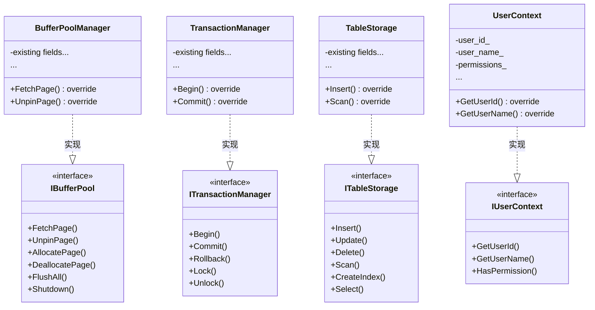

# SQLCC v1.4.0 架构设计 - 目标架构

**版本**: v1.4.0  
**创建日期**: 2026-02-03 16:55  
**作者**: 高小原 🌱  
**状态**: 目标架构设计

---

## 🎯 设计目标

**李哥要求**:
1. 重构后不再互相依赖的类图
2. 分析清楚
3. 列出最小接口
4. 被子类实现或继承
5. 连同子类一起重构和测试

---

## 📐 一、目标架构设计

### 1.1 重构后的模块依赖关系 (Mermaid)

```mermaid
flowchart TB
    subgraph High ["高层模块 (依赖接口)"]
        EC["ExecutionContext\n(只依赖接口)"]
        UE["UnifiedExecutor\n(只依赖接口)"]
    end
    
    subgraph Interface ["接口层 (无实现)"]
        IBuffer["IBufferPool\n(缓冲区接口)"]
        ITxn["ITransactionMgr\n(事务接口)"]
        ITab["ITableStorage\n(表存储接口)"]
        IUser["IUserContext\n(用户上下文接口)"]
    end
    
    subgraph Low ["低层模块 (实现接口)"]
        BPM["BufferPoolImpl\n(实现IBufferPool)"]
        TM["TransactionMgrImpl\n(实现ITransactionMgr)"]
        TS["TableStorageImpl\n(实现ITableStorage)"]
    end
    
    subgraph CoreDB ["Core Database Manager"]
        DBMgr["DatabaseManager\n(组合接口，不含实现)"]
    end
    
    %% 依赖方向：高层 → 接口 → 低层
    EC --> IUser
    UE --> IBuffer
    UE --> ITab
    DBMgr --> IBuffer
    DBMgr --> ITxn
    DBMgr --> ITab
    
    BPM ..|> IBuffer : 实现
    TM ..|> ITxn : 实现
    TS ..|> ITab : 实现
    
    style IBuffer fill:#85e3ff
    style ITxn fill:#85e3ff
    style ITab fill:#85e3ff
    style IUser fill:#85e3ff
```

### 1.2 核心变化

| 重构前 ❌ | 重构后 ✅ |
|----------|----------|
| Core 包含 Storage 实现 | Core 只依赖接口 |
| Execution 引用 Core 具体类 | Execution 引用接口 |
| 循环依赖 Core ↔ Execution | 无循环依赖 |
| 无法独立测试 | 可以 Mock 接口测试 |

---

## 🔌 二、最小接口清单

### 2.1 接口列表

| 接口名 | 所在文件 | 抽象方法数 | 被谁使用 |
|-------|---------|----------|---------|
| `IBufferPool` | storage_engine/buffer_pool/buffer_pool_interface.h | 6 | DatabaseManager, Execution |
| `ITransactionManager` | transaction/transaction_interface.h | 5 | DatabaseManager |
| `ITableStorage` | storage_engine/table_storage/table_storage_interface.h | 8 | Execution |
| `IUserContext` | core/user_context_interface.h | 5 | ExecutionContext |

### 2.2 接口定义 (最小化)

#### IBufferPool (6 个方法)

```cpp
// storage_engine/buffer_pool/buffer_pool_interface.h

class IBufferPool {
public:
    virtual ~IBufferPool() = default;
    
    // 页面管理 (4 个方法)
    virtual std::unique_ptr<Page> FetchPage(PageId id) = 0;
    virtual bool UnpinPage(PageId id, bool dirty) = 0;
    virtual PageId AllocatePage() = 0;
    virtual bool DeallocatePage(PageId id) = 0;
    
    // 生命周期 (2 个方法)
    virtual bool FlushAll() = 0;
    virtual void Shutdown() = 0;
};
```

#### ITransactionManager (5 个方法)

```cpp
// transaction/transaction_interface.h

class ITransactionManager {
public:
    using TransactionId = uint64_t;
    
    virtual ~ITransactionManager() = default;
    
    // 事务生命周期 (3 个方法)
    virtual TransactionId Begin() = 0;
    virtual bool Commit(TransactionId id) = 0;
    virtual bool Rollback(TransactionId id) = 0;
    
    // 锁管理 (2 个方法)
    virtual bool Lock(TransactionId id, ResourceId rid) = 0;
    virtual void Unlock(TransactionId id) = 0;
};
```

#### ITableStorage (8 个方法)

```cpp
// storage_engine/table_storage/table_storage_interface.h

class ITableStorage {
public:
    virtual ~ITableStorage() = default;
    
    // CRUD (4 个方法)
    virtual bool Insert(const Record& record) = 0;
    virtual bool Update(const Key& key, const Record& record) = 0;
    virtual bool Delete(const Key& key) = 0;
    virtual std::vector<Record> Scan() = 0;
    
    // 索引 (2 个方法)
    virtual bool CreateIndex(const std::string& col) = 0;
    virtual std::vector<Record> Select(const Predicate& pred) = 0;
    
    // 模式 (2 个方法)
    virtual Schema GetSchema() const = 0;
    virtual std::string GetName() const = 0;
};
```

#### IUserContext (5 个方法)

```cpp
// core/user_context_interface.h

class IUserContext {
public:
    virtual ~IUserContext() = default;
    
    virtual UserId GetUserId() const = 0;
    virtual std::string GetUserName() const = 0;
    virtual bool HasPermission(Permission perm) const = 0;
    virtual Role GetRole() const = 0;
    virtual bool IsAuthenticated() const = 0;
};
```

---

## 📦 三、子类实现关系

### 3.1 实现类清单

| 接口 | 实现类 | 位置 | 改动 |
|------|-------|------|------|
| `IBufferPool` | `BufferPoolManager` | storage_engine/buffer_pool/ | 添加接口继承 |
| `ITransactionManager` | `TransactionManager` | transaction/ | 添加接口继承 |
| `ITableStorage` | `TableStorage` | storage_engine/table_storage/ | 添加接口继承 |
| `IUserContext` | `UserContext` | core/ | 新建（从 ExecutionContext 拆分） |

### 3.2 实现关系图 (Mermaid)



---

## 🔄 四、重构步骤

### 阶段 1: 创建接口 (4 小时)

| 步骤 | 任务 | 输出 |
|------|------|------|
| 1.1 | 创建 `IBufferPool` 接口 | `storage_engine_interface.h` |
| 1.2 | 创建 `ITransactionManager` 接口 | `transaction_interface.h` |
| 1.3 | 创建 `ITableStorage` 接口 | `table_storage_interface.h` |
| 1.4 | 创建 `IUserContext` 接口 | `user_context_interface.h` |

### 阶段 2: 实现接口 (8 小时)

| 步骤 | 任务 | 改动 |
|------|------|------|
| 2.1 | `BufferPoolManager` 实现 `IBufferPool` | 添加 `: public IBufferPool` |
| 2.2 | `TransactionManager` 实现 `ITransactionManager` | 添加 `: public ITransactionManager` |
| 2.3 | `TableStorage` 实现 `ITableStorage` | 添加 `: public ITableStorage` |
| 2.4 | 新建 `UserContext` 实现 `IUserContext` | 从 `ExecutionContext` 拆分 |

### 阶段 3: 修改依赖 (4 小时)

| 步骤 | 任务 | 改动 |
|------|------|------|
| 3.1 | `DatabaseManager` 改用 `IBufferPool*` | 替换具体类型 |
| 3.2 | `DatabaseManager` 改用 `ITransactionManager*` | 替换具体类型 |
| 3.3 | `ExecutionContext` 改用 `IUserContext*` | 替换具体类型 |
| 3.4 | `Execution` 引用接口而非实现 | 更新 includes |

### 阶段 4: 测试验证 (4 小时)

| 步骤 | 任务 | 验证 |
|------|------|------|
| 4.1 | 编译所有模块 | `bazel build //...` |
| 4.2 | 运行单元测试 | `bazel test //tests/...` |
| 4.3 | 验证无循环依赖 | `bazel query` |
| 4.4 | 接口测试 | Mock 测试 |

---

## 📊 五、验收标准

### 5.1 接口验收

| 标准 | 检验命令 |
|------|---------|
| 接口编译通过 | `bazel build //src/...:*_interface` |
| 实现类编译通过 | `bazel build //src/...:*` |
| 方法数量正确 | `grep "virtual.*= 0;"` (期望 24 个) |

### 5.2 依赖验收

| 标准 | 检验命令 |
|------|---------|
| 无循环依赖 | `bazel query "allpaths(//src/core:*, //src/execution:*)"` (空) |
| Core 不含 Storage 实现 | `grep "buffer_pool_sharded" src/core/*.h` (无输出) |

### 5.3 测试验收

| 标准 | 检验命令 |
|------|---------|
| 所有测试通过 | `bazel test //tests/...` |
| 覆盖率不下降 | `bazel coverage` (≥ 67%) |

---

## 📌 六、总结

### 重构前 vs 重构后

| 指标 | 重构前 ❌ | 重构后 ✅ |
|------|----------|----------|
| Core → Storage | 具体实现 | 接口 |
| Execution → Core | 具体类 | 接口 |
| 循环依赖 | 有 | 无 |
| 可测试性 | 困难 | Mock 接口 |
| 编译顺序 | 敏感 | 无关 |

### 接口统计

| 接口数 | 实现类数 | 总方法数 |
|-------|---------|---------|
| 4 个 | 4 个 | 24 个 |

### 下一步

1. [ ] 李哥审查目标架构设计
2. [ ] 确认接口清单
3. [ ] 开始阶段 1: 创建接口
4. [ ] 阶段 2: 实现接口
5. [ ] 阶段 3: 修改依赖
6. [ ] 阶段 4: 测试验证

---

**李哥，这个设计是否符合你的要求？**

**重点**:
1. ✅ 4 个最小接口
2. ✅ 每个接口都有实现类
3. ✅ 依赖方向: 高层 → 接口 → 低层
4. ✅ 无循环依赖
5. ✅ 可独立测试

**请审查后告诉我：**
- 接口是否足够？
- 实现类是否正确？
- 可以开始执行吗？💪
