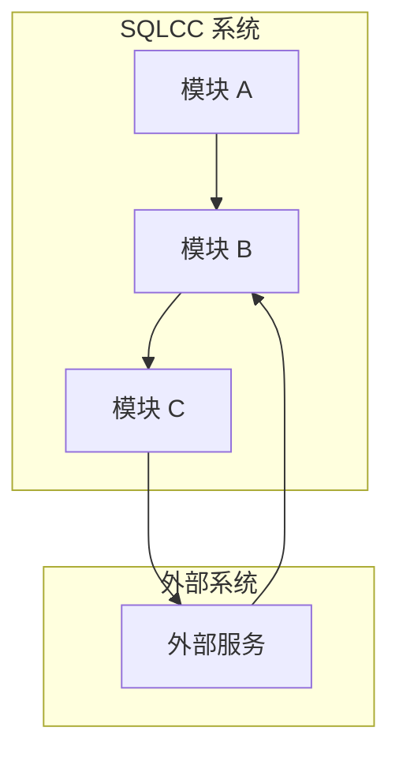
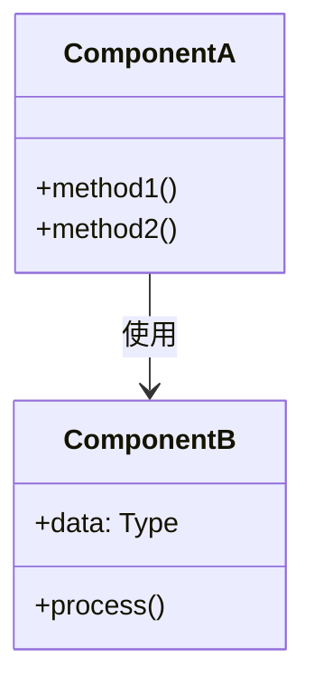
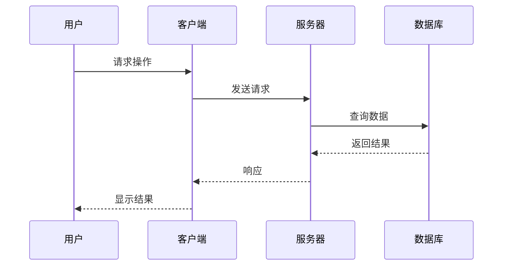
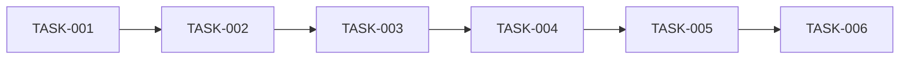

# SQLCC 规范驱动开发 (SDD) 使用指南 v1.3.10

**版本**: 1.3.10
**生效日期**: 2026-02-02
**适用范围**: SQLCC 项目所有开发活动

---

## 📋 目录

1. [什么是规范驱动开发 (SDD)](#什么是规范驱动开发-sdd)
2. [SDD 核心原则](#sdd-核心原则)
3. [SDD 工作流程](#sdd-工作流程)
4. [SQLCC SDD 模板](#sqlcc-sdd-模板)
5. [实施指南](#实施指南)
6. [与其他规范的关系](#与其他规范的关系)
7. [最佳实践](#最佳实践)

---

## 什么是规范驱动开发 (SDD)

### 核心概念

**规范驱动开发 (Spec-Driven Development, SDD)** 是一种以规范文档为核心驱动力的软件开发方法论。它强调在编写代码之前先建立清晰的规范，通过规范来指导开发、测试和重构。

### SDD vs 传统开发

| 方面 | 传统开发 | 规范驱动开发 (SDD) |
|------|---------|-------------------|
| **起点** | 需求理解后直接编码 | 需求 → 规范 → 编码 |
| **文档** | 可选、后期补充 | 必需、前置驱动 |
| **变更处理** | 口头沟通 | 规范更新驱动 |
| **测试** | 代码完成后编写 | 规范阶段定义 |
| **质量保障** | 依赖开发者经验 | 规范评审验证 |

### SDD 价值主张

```
┌─────────────────────────────────────────────────────────────────┐
│                                                                 │
│   需求        规范        设计        实现        验证          │
│    │           │           │           │           │           │
│    ▼           ▼           ▼           ▼           ▼           │
│   ──▶  EARS   ──▶  SDD   ──▶  Mermaid ──▶  Bazel  ──▶  GTest  │
│        格式        模板        图          构建        验证      │
│                                                                 │
│   "先思考、后动手"                                           │
│   "规范即契约"                                               │
│   "文档即代码"                                               │
│                                                                 │
└─────────────────────────────────────────────────────────────────┘
```

### 为什么 SQLCC 需要 SDD

| 痛点 | SDD 解决方案 |
|------|-------------|
| 需求理解不一致 | EARS 格式精确定义 |
| 设计变更频繁 | 规范评审前置捕获 |
| 测试覆盖不足 | 规范阶段定义测试 |
| 重构风险高 | 规范作为回归基准 |
| 知识传承困难 | 规范即文档 |

---

## SDD 核心原则

### 1. 规范优先 (Spec-First)

> "任何代码变更都应从规范更新开始"

```markdown
## 规范驱动开发检查清单

- [ ] 需求已转化为 EARS 格式规范
- [ ] 设计已用 Mermaid 图表述
- [ ] 测试已作为规范一部分定义
- [ ] 实现任务已分解并分配
- [ ] 评审已通过
```

### 2. 渐进式精化 (Progressive Refinement)

```
┌─────────────────────────────────────────────────────────────────┐
│  Level 1: 需求层                                                 │
│  "做什么" → EARS 格式需求                                         │
├─────────────────────────────────────────────────────────────────┤
│  Level 2: 设计层                                                 │
│  "怎么做" → 架构图、类图、时序图                                   │
├─────────────────────────────────────────────────────────────────┤
│  Level 3: 实现层                                                 │
│  "做出来" → 代码、测试、构建                                      │
├─────────────────────────────────────────────────────────────────┤
│  Level 4: 验证层                                                 │
│  "做对了" → 测试报告、覆盖率、性能指标                             │
└─────────────────────────────────────────────────────────────────┘
```

### 3. 规范即契约 (Spec as Contract)

- 规范是开发团队的共同语言
- 规范是测试用例的来源
- 规范是代码评审的标准
- 规范是回归测试的基准

### 4. 文档即代码 (Docs as Code)

- 规范使用 Markdown 编写
- 规范版本化管理 (Git)
- 规范与代码同步更新
- 规范可执行验证

---

## SDD 工作流程

### 标准开发流程

```
┌─────────────────────────────────────────────────────────────────────────┐
│                         规范驱动开发 (SDD) 流程                          │
└─────────────────────────────────────────────────────────────────────────┘

  ┌──────────┐
  │  spec-   │  1. 规格初始化
  │   init   │     定义要构建的内容
  └────┬─────┘
       │  spec-init
       ▼
  ┌──────────┐
  │  spec-   │  2. 需求定义 (EARS 格式)
  │require-  │     将需求转化为结构化规范
  │  ments   │
  └────┬─────┘
       │  spec-requirements
       ▼
  ┌──────────┐
  │  spec-   │  3. 架构设计 (Mermaid)
  │  design  │     创建架构图和类图
  └────┬─────┘
       │  spec-design
       ▼
  ┌──────────┐
  │  spec-   │  4. 任务分解
  │  tasks   │     生成实现任务列表
  └────┬─────┘
       │  spec-tasks
       ▼
  ┌──────────┐
  │  spec-   │  5. 代码实现
  │   impl   │     按规范编码
  └────┬─────┘
       │  spec-impl
       ▼
  ┌──────────┐
  │  validate│  6. 验证闭环
  │          │     规范 vs 实现一致性检查
  └──────────┘
```

### 增强现有代码流程

```
  ┌──────────┐
  │ steering │  0. 引导阶段
  │          │     识别需要增强的功能
  └────┬─────┘
       │
       ▼
  ┌──────────┐
  │  spec-   │  1. 规格初始化 (增量)
  │   init   │
  └────┬─────┘
       │
       ▼
  ┌──────────┐
  │ validate │  2. 差距分析
  │   -gap   │     现有 vs 期望
  └────┬─────┘
       │
       ▼
       ... (同标准流程)
```

---

## SQLCC SDD 模板

### 1. 需求规范模板 (requirements.md)

```markdown
# 功能需求规范

## 1. 概述

### 1.1 功能名称
[功能名称]

### 1.2 需求来源
- 来源: [用户反馈/技术优化/产品规划]
- 优先级: [P0/P1/P2]
- 负责人: [开发者]

### 1.3 目标用户
[描述目标用户群体]

---

## 2. 需求定义 (EARS 格式)

### REQ-001: [需求标题]

| 属性 | 值 |
|------|-----|
| ID | REQ-001 |
| 优先级 | [P0/P1/P2] |
| 状态 | [草稿/评审中/已批准/已实现] |
| 来源 | [链接] |

#### 描述

**当** [触发条件/场景],
**我想要** [功能/行为],
**以便于** [价值/收益].

#### 接受标准

- [ ] 场景 1: [预期行为]
- [ ] 场景 2: [预期行为]
- [ ] 场景 3: [预期行为]

#### 边界条件

| 条件 | 处理方式 |
|------|---------|
| [边界条件1] | [处理方式] |
| [边界条件2] | [处理方式] |

#### 相关需求

- 相关 ID: [REQ-XXX]
- 依赖 ID: [REQ-XXX]

---

## 3. 测试用例

### TC-001: [测试用例标题]

| 属性 | 值 |
|------|-----|
| ID | TC-001 |
| 优先级 | [P0/P1/P2] |
| 类型 | [单元/集成/边界/异常] |

#### 前置条件
[测试前需要满足的条件]

#### 测试步骤

1. [步骤1]
2. [步骤2]
3. [步骤3]

#### 预期结果
[期望的测试结果]

#### 实际结果
[测试执行后的结果]

---

## 4. 验收检查表

| 检查项 | 状态 | 备注 |
|--------|------|------|
| [ ] 需求清晰可测 | [通过/未通过] | |
| [ ] 接受标准明确 | [通过/未通过] | |
| [ ] 边界条件完整 | [通过/未通过] | |
| [ ] 测试用例覆盖 | [通过/未通过] | |

---

## 5. 变更历史

| 版本 | 日期 | 变更内容 | 变更人 |
|------|------|---------|--------|
| 1.0 | 2026-02-02 | 初始版本 | [姓名] |
```

### 2. 设计规范模板 (design.md)

```markdown
# 架构设计规范

## 1. 概述

### 1.1 功能名称
[功能名称]

### 1.2 版本
1.0

### 1.3 日期
2026-02-02

### 1.4 作者
[作者]

---

## 2. 架构决策

| 决策 ID | 决策内容 | 理由 | 状态 |
|---------|---------|------|------|
| ADR-001 | [决策描述] | [理由] | 已批准 |

---

## 3. 上下文图



---

## 4. 组件图



---

## 5. 时序图



---

## 6. 数据模型

### 6.1 数据结构

```cpp
// 数据结构定义
struct FeatureData {
    std::string id;              // 标识符
    std::string name;            // 名称
    std::vector<Value> values;   // 值列表
};
```

### 6.2 接口定义

```cpp
// 接口定义
class IFeature {
public:
    virtual ~IFeature() = default;
    virtual bool Initialize() = 0;
    virtual Result Process(const Request& req) = 0;
    virtual void Shutdown() = 0;
};
```

---

## 7. 依赖关系

### 7.1 内部依赖

| 源模块 | 目标模块 | 依赖类型 | 说明 |
|--------|---------|---------|------|
| [模块A] | [模块B] | [编译/运行时] | [说明] |

### 7.2 外部依赖

| 依赖项 | 版本 | 用途 |
|--------|------|------|
| [依赖库] | [版本] | [用途] |

---

## 8. BUILD 配置

```bazel
# src/module/BUILD.bazel
cc_library(
    name = "feature",
    srcs = ["feature.cpp"],
    hdrs = ["feature.h"],
    deps = [
        "//src/dependency:dependency",
        "@external_lib//:lib",
    ],
    copts = [
        "-std=c++20",
        "-Wall",
        "-Werror",
    ],
)
```

---

## 9. 测试策略

### 9.1 测试覆盖目标

| 类型 | 目标覆盖率 | 最低覆盖率 |
|------|-----------|-----------|
| 单元测试 | 80% | 70% |
| 集成测试 | 60% | 50% |
| 边界测试 | 100% | 90% |

### 9.2 测试用例

```cpp
// tests/module/feature_test.cpp
TEST(FeatureTest, NormalOperation) {
    auto feature = std::make_unique<Feature>();
    EXPECT_TRUE(feature->Initialize());
}
```

---

## 10. 评审检查表

| 检查项 | 状态 | 备注 |
|--------|------|------|
| [ ] 架构决策合理 | [通过/未通过] | |
| [ ] 类图准确 | [通过/未通过] | |
| [ ] 时序图完整 | [通过/未通过] | |
| [ ] 依赖关系清晰 | [通过/未通过] | |
| [ ] BUILD 配置正确 | [通过/未通过] | |

---

## 11. 变更历史

| 版本 | 日期 | 变更内容 | 变更人 |
|------|------|---------|--------|
| 1.0 | 2026-02-02 | 初始设计 | [姓名] |
```

### 3. 任务规范模板 (tasks.md)

```markdown
# 实现任务清单

## 1. 概述

### 1.1 功能名称
[功能名称]

### 1.2 版本
1.0

### 1.3 日期
2026-02-02

---

## 2. 任务列表

### 阶段 1: 基础设施

| ID | 任务 | 依赖 | 负责人 | 状态 | 估计时间 |
|----|------|------|--------|------|----------|
| TASK-001 | [任务描述] | 无 | [姓名] | 待处理 | 2h |
| TASK-002 | [任务描述] | TASK-001 | [姓名] | 待处理 | 4h |

### 阶段 2: 核心功能

| ID | 任务 | 依赖 | 负责人 | 状态 | 估计时间 |
|----|------|------|--------|------|----------|
| TASK-003 | [任务描述] | TASK-002 | [姓名] | 待处理 | 8h |
| TASK-004 | [任务描述] | TASK-003 | [姓名] | 待处理 | 4h |

### 阶段 3: 测试与优化

| ID | 任务 | 依赖 | 负责人 | 状态 | 估计时间 |
|----|------|------|--------|------|----------|
| TASK-005 | [任务描述] | TASK-004 | [姓名] | 待处理 | 4h |
| TASK-006 | [任务描述] | TASK-005 | [姓名] | 待处理 | 2h |

---

## 3. 任务详情

### TASK-001: [任务标题]

**描述**: [任务详细描述]

**验收标准**:
- [ ] 标准 1
- [ ] 标准 2
- [ ] 标准 3

**相关文件**:
- 源文件: `src/module/file.cpp`
- 头文件: `src/module/file.h`
- 测试: `tests/module/file_test.cpp`

**注意事项**: [特殊注意事项]

**估计时间**: 2h
**实际时间**: ___h

---

## 4. 依赖图



---

## 5. 进度跟踪

| 周次 | 完成任务 | 累计进度 | 状态 |
|------|----------|----------|------|
| 第 1 周 | TASK-001, TASK-002 | 33% | 🟢 进行中 |
| 第 2 周 | TASK-003, TASK-004 | 66% | 🟡 待开始 |
| 第 3 周 | TASK-005, TASK-006 | 100% | ⚪ 待开始 |

---

## 6. 风险与缓解

| 风险 | 影响 | 概率 | 缓解措施 |
|------|------|------|----------|
| [风险1] | [影响] | [概率] | [措施] |

---

## 7. 变更历史

| 版本 | 日期 | 变更内容 | 变更人 |
|------|------|---------|--------|
| 1.0 | 2026-02-02 | 初始任务列表 | [姓名] |
```

---

## 实施指南

### 1. 创建新功能 SDD

```bash
# 1. 创建 SDD 目录
mkdir -p docs/sdd/features/new_feature

# 2. 创建需求文档
cat > docs/sdd/features/new_feature/requirements.md << 'EOF'
# 功能需求规范
EOF

# 3. 创建设计文档
cat > docs/sdd/features/new_feature/design.md << 'EOF'
# 架构设计规范
EOF

# 4. 创建任务文档
cat > docs/sdd/features/new_feature/tasks.md << 'EOF'
# 实现任务清单
EOF
```

### 2. 模板使用流程

```
┌─────────────────────────────────────────────────────────────────┐
│  阶段 1: 需求定义                                                │
│  使用 requirements_template.md 创建需求规范                      │
│  输出: docs/sdd/features/[feature]/requirements.md              │
├─────────────────────────────────────────────────────────────────┤
│  阶段 2: 架构设计                                                │
│  使用 design_template.md 创建设计规范                            │
│  输出: docs/sdd/features/[feature]/design.md                    │
├─────────────────────────────────────────────────────────────────┤
│  阶段 3: 任务分解                                                │
│  使用 tasks_template.md 创建任务清单                             │
│  输出: docs/sdd/features/[feature]/tasks.md                     │
├─────────────────────────────────────────────────────────────────┤
│  阶段 4: 代码实现                                                │
│  按任务清单编码                                                  │
│  输出: src/ 模块代码                                             │
├─────────────────────────────────────────────────────────────────┤
│  阶段 5: 验证闭环                                                │
│  对比规范 vs 实现                                                │
│  输出: 验证报告                                                  │
└─────────────────────────────────────────────────────────────────┘
```

### 3. 模板位置

所有模板位于: `docs/sdd/templates/`

| 模板 | 路径 |
|------|------|
| 需求模板 | `docs/sdd/templates/requirements_template.md` |
| 设计模板 | `docs/sdd/templates/design_template.md` |
| 任务模板 | `docs/sdd/templates/tasks_template.md` |

---

## 与其他规范的关系

```
┌─────────────────────────────────────────────────────────────────┐
│                    SQLCC 规范体系                               │
├─────────────────────────────────────────────────────────────────┤
│                                                                 │
│   ┌─────────────────┐                                           │
│   │   SDD 规范      │  规范驱动开发 (Spec-Driven)               │
│   │   核心流程      │  需求 → 设计 → 任务 → 实现                │
│   └────────┬────────┘                                           │
│            │                                                    │
│            ▼                                                    │
│   ┌─────────────────────────────────────────────────────────┐  │
│   │                    质量保障规范                          │  │
│   │  ┌──────────────┐  ┌──────────────┐  ┌──────────────┐   │  │
│   │  │  AI 开发规范 │  │ BUILD 规范   │  │ 测试规范     │   │  │
│   │  │AI_DEVELOPMENT│  │BUILD_FILE_   │  │improvement_  │   │  │
│   │  │_GUIDELINES   │  │SPECIFICATION │  │guide         │   │  │
│   │  └──────────────┘  └──────────────┘  └──────────────┘   │  │
│   └─────────────────────────────────────────────────────────┘  │
│                                                                 │
│   ┌─────────────────────────────────────────────────────────┐  │
│   │                    实施规范                              │  │
│   │  ┌──────────────┐  ┌──────────────┐  ┌──────────────┐   │  │
│   │  │  C++ 开发规范│  │  重构规范    │  │  CI/CD 规范  │   │  │
│   │  │CPP_DEVELOP-  │  │systematic_   │  │  GitHub      │   │  │
│   │  │MENT_         │  │refactoring_  │  │  Actions     │   │  │
│   │  │SPECIFICATION │  │knowledge_    │  │              │   │  │
│   │  │              │  │base          │  │              │   │  │
│   │  └──────────────┘  └──────────────┘  └──────────────┘   │  │
│   └─────────────────────────────────────────────────────────┘  │
│                                                                 │
└─────────────────────────────────────────────────────────────────┘
```

### 规范层级

| 层级 | 规范 | 作用 |
|------|------|------|
| **L1: 流程规范** | SDD 规范 | 定义开发流程 |
| **L2: 质量规范** | AI 开发、BUILD、测试 | 保障代码质量 |
| **L3: 实施规范** | C++ 开发、重构、CI/CD | 指导具体实现 |

---

## 最佳实践

### 1. 规范编写

- ✅ **先写规范后编码**: 任何功能从规范开始
- ✅ **使用 EARS 格式**: 需求清晰可测
- ✅ **图文并茂**: 用 Mermaid 表达设计
- ✅ **任务可追踪**: 每个任务有负责人和状态

### 2. 规范评审

- ✅ **定期评审**: 每周审查进行中的规范
- ✅ **多方参与**: 开发、测试、产品共同参与
- ✅ **迭代改进**: 根据反馈持续优化规范

### 3. 规范维护

- ✅ **同步更新**: 代码变更同步更新规范
- ✅ **版本管理**: 使用 Git 管理规范版本
- ✅ **定期清理**: 清理过时或废弃的规范

### 4. 常见问题

| 问题 | 解决方案 |
|------|---------|
| 规范过于简略 | 补充接受标准和边界条件 |
| 规范与代码脱节 | 建立规范代码同步机制 |
| 规范难以执行 | 拆分为更小的任务项 |

---

## 参考资源

### cc-sdd 项目

| 资源 | 链接 |
|------|------|
| cc-sdd 主页 | https://github.com/gotalab/cc-sdd |
| Kiro 设置 | `{{KIRO_DIR}}/settings/` |

### SQLCC 规范文档

| 资源 | 路径 |
|------|------|
| AI 开发规范 | `docs/ai_tools/AI_DEVELOPMENT_GUIDELINES.md` |
| BUILD 文件规范 | `docs/ai_tools/BUILD_FILE_SPECIFICATION.md` |
| C++ 开发规范 | `docs/ai_tools/CPP_DEVELOPMENT_SPECIFICATION.md` |
| 测试规范 | `docs/ai_tools/improvement_guide.md` |
| 重构知识库 | `docs/ai_tools/systematic_refactoring_knowledge_base.md` |

---

## 附录

### A. EARS 格式说明

EARS (Easy Approach to Requirements Syntax) 是一种简洁的需求语法:

```
当 [触发条件],
我想要 [功能],
以便于 [价值].
```

### B. Mermaid 图表类型

| 类型 | 用途 |
|------|------|
| `graph` | 流程图 |
| `classDiagram` | 类图 |
| `sequenceDiagram` | 时序图 |
| `stateDiagram` | 状态图 |
| `erDiagram` | ER 图 |

### C. 模板变量

| 变量 | 说明 | 示例 |
|------|------|------|
| `[功能名称]` | 功能名称 | "缓冲池管理" |
| `[作者]` | 文档作者 | "SQLCC Team" |
| `[日期]` | 文档日期 | "2026-02-02" |
| `[优先级]` | 需求优先级 | "P0/P1/P2" |
| `[状态]` | 状态 | "草稿/评审中/已批准" |

---

**维护者**: SQLCC AI 开发团队
**最后更新**: 2026-02-02
**版本**: v1.3.10
