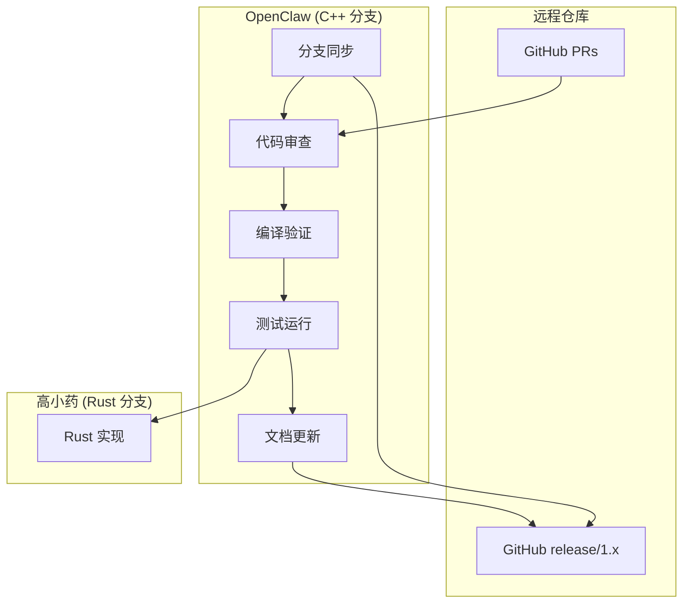
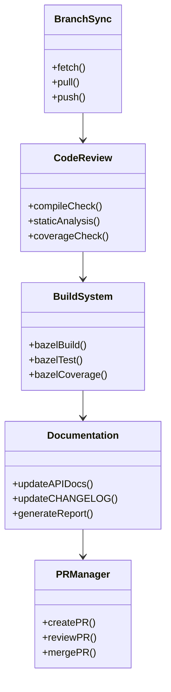
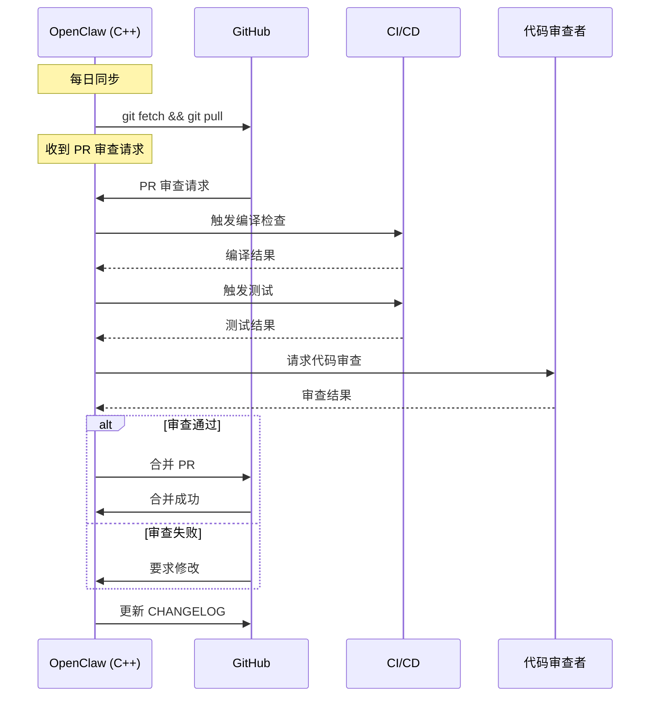

# OpenClaw C++ 分支架构设计规范

> **分支**: release/1.x (C++主线)
> **负责人**: OpenClaw
> **版本**: 1.0
> **日期**: 2026-02-15
> **状态**: 评审中

---

## 1. 概述

### 1.1 功能名称
SQLCC C++ 主线维护与持续集成

### 1.2 版本
1.0

### 1.3 日期
2026-02-15

### 1.4 作者
OpenClaw-SDD

---

## 2. 架构决策

| 决策 ID | 决策内容 | 理由 | 状态 |
|---------|---------|------|------|
| ADR-001 | 采用双分支并行开发 | 分支隔离，技术对比 | 已批准 |
| ADR-002 | C++ 分支维护现有架构 | 保持稳定，对照基准 | 已批准 |
| ADR-003 | PR 审核后合并 | 保证代码质量 | 已批准 |

---

## 3. 上下文图



---

## 4. 组件图



---

## 5. 时序图



---

## 6. 数据模型

### 6.1 分支状态

```cpp
struct BranchStatus {
    std::string branch_name;      // 分支名称
    std::string remote_url;       // 远程仓库 URL
    std::string local_commit;     // 本地提交 SHA
    std::string remote_commit;    // 远程提交 SHA
    bool is_synced;              // 是否同步
    std::vector<std::string> pending_commits;  // 待提交列表
};
```

### 6.2 PR 状态

```cpp
struct PRStatus {
    int pr_number;               // PR 编号
    std::string title;           // PR 标题
    std::string author;          // 作者
    std::string status;          // 状态: open/merged/closed
    bool compile_passed;          // 编译是否通过
    bool tests_passed;           // 测试是否通过
    bool review_passed;          // 审查是否通过
};
```

---

## 7. 依赖关系

### 7.1 内部依赖

| 源模块 | 目标模块 | 依赖类型 | 说明 |
|--------|---------|---------|------|
| BranchSync | CodeReview | 运行时 | 同步后触发审查 |
| CodeReview | BuildSystem | 运行时 | 审查触发构建 |
| BuildSystem | Documentation | 运行时 | 构建触发文档更新 |

### 7.2 外部依赖

| 依赖项 | 版本 | 用途 |
|--------|------|------|
| Git | 2.40+ | 版本控制 |
| Bazel | 8.5.0+ | 构建系统 |
| Clang | 20+ | 编译器 |
| GoogleTest | 1.14.0 | 测试框架 |

---

## 8. BUILD 配置

```bazel
# docs/sdd/features/openclaw-cpp-maintenance/BUILD.bazel
cc_library(
    name = "openclaw-cpp-maintenance",
    srcs = [
        "branch_sync.cpp",
        "code_review.cpp",
        "build_system.cpp",
        "documentation.cpp",
        "pr_manager.cpp",
    ],
    hdrs = [
        "branch_sync.h",
        "code_review.h",
        "build_system.h",
        "documentation.h",
        "pr_manager.h",
    ],
    deps = [
        "//src/utils:utils",
        "//src/logger:logger",
        "@bazel_tools//tools/build_defs/repo:git.bzl",
    ],
    visibility = ["//visibility:public"],
)

cc_test(
    name = "openclaw_cpp_maintenance_test",
    srcs = ["openclaw_cpp_maintenance_test.cpp"],
    deps = [
        ":openclaw-cpp-maintenance",
        "@com_google_googletest//:gtest_main",
    ],
    tags = ["maintenance", "daily"],
)
```

---

## 9. 测试策略

### 9.1 测试覆盖目标

| 类型 | 目标覆盖率 | 最低覆盖率 |
|------|-----------|-----------|
| 单元测试 | 80% | 70% |
| 集成测试 | 60% | 50% |
| 每日检查 | 100% | 100% |

### 9.2 每日检查清单

```bash
#!/bin/bash
# daily-check.sh - OpenClaw C++ 分支每日检查

echo "=== OpenClaw C++ 分支每日检查 ==="
echo "日期: $(date)"

# 1. 分支同步检查
echo "[1/4] 检查分支同步..."
git fetch origin
LOCAL=$(git rev-parse @)
REMOTE=$(git rev-parse @{u})
if [ "$LOCAL" = "$REMOTE" ]; then
    echo "✅ 分支已同步"
else
    echo "⚠️ 分支有更新，需要 pull"
fi

# 2. 编译检查
echo "[2/4] 执行编译检查..."
bazel build //... --build_tag_filters=-manual
if [ $? -eq 0 ]; then
    echo "✅ 编译成功"
else
    echo "❌ 编译失败"
fi

# 3. 测试运行
echo "[3/4] 运行测试..."
bazel test //... --test_tag_filters=foundation,core --test_output=errors
if [ $? -eq 0 ]; then
    echo "✅ 测试通过"
else
    echo "❌ 测试失败"
fi

# 4. 覆盖率检查
echo "[4/4] 检查覆盖率..."
bazel coverage //tests/level1_foundation:all
echo "✅ 覆盖率报告已生成"

echo "=== 检查完成 ==="
```

---

## 10. 评审检查表

| 检查项 | 状态 | 备注 |
|--------|------|------|
| [ ] 架构决策合理 | ☐ | |
| [ ] 类图准确 | ☐ | |
| [ ] 时序图完整 | ☐ | |
| [ ] 依赖关系清晰 | ☐ | |
| [ ] BUILD 配置正确 | ☐ | |

---

## 11. 变更历史

| 版本 | 日期 | 变更内容 | 变更人 |
|------|------|---------|--------|
| 1.0 | 2026-02-15 | 初始设计 | OpenClaw-SDD |
