# OpenClaw C++ 分支实现任务清单

> **分支**: release/1.x (C++主线)
> **负责人**: OpenClaw
> **版本**: 1.0
> **日期**: 2026-02-15
> **状态**: 评审中

---

## 1. 概述

### 1.1 功能名称
SQLCC C++ 主线维护与持续集成

### 1.2 版本
1.0

### 1.3 日期
2026-02-15

---

## 2. 任务列表

### 阶段 1: 每日维护任务

| ID | 任务 | 依赖 | 负责人 | 状态 | 估计时间 |
|----|------|------|--------|------|----------|
| TASK-001 | 分支同步检查 | 无 | OpenClaw | 待处理 | 5min |
| TASK-002 | 编译验证 | TASK-001 | OpenClaw | 待处理 | 10min |
| TASK-003 | 测试运行 | TASK-002 | OpenClaw | 待处理 | 30min |
| TASK-004 | 覆盖率检查 | TASK-003 | OpenClaw | 待处理 | 15min |

### 阶段 2: 代码审查任务

| ID | 任务 | 依赖 | 负责人 | 状态 | 估计时间 |
|----|------|------|--------|------|----------|
| TASK-005 | PR 审查请求处理 | TASK-004 | OpenClaw | 待处理 | 30min |
| TASK-006 | 编译检查 | TASK-005 | OpenClaw | 待处理 | 15min |
| TASK-007 | 静态分析 | TASK-006 | OpenClaw | 待处理 | 20min |
| TASK-008 | 审查结果反馈 | TASK-007 | OpenClaw | 待处理 | 10min |

### 阶段 3: 文档更新任务

| ID | 任务 | 依赖 | 负责人 | 状态 | 估计时间 |
|----|------|------|--------|------|----------|
| TASK-009 | 更新 CHANGELOG | TASK-008 | OpenClaw | 待处理 | 10min |
| TASK-010 | 生成进度报告 | TASK-009 | OpenClaw | 待处理 | 15min |
| TASK-011 | 提交进度同步 | TASK-010 | OpenClaw | 待处理 | 5min |

### 阶段 4: Rust 分支对照任务

| ID | 任务 | 依赖 | 负责人 | 状态 | 估计时间 |
|----|------|------|--------|------|----------|
| TASK-012 | 接口对照检查 | TASK-011 | OpenClaw | 待处理 | 30min |
| TASK-013 | 功能对比测试 | TASK-012 | OpenClaw | 待处理 | 1h |
| TASK-014 | 性能基准测试 | TASK-013 | OpenClaw | 待处理 | 2h |

---

## 3. 任务详情

### TASK-001: 分支同步检查

**描述**: 检查本地分支与远程分支的同步状态

**验收标准**:
- [ ] 执行 `git fetch origin`
- [ ] 比较本地和远程 commit SHA
- [ ] 如有差异，输出提示信息

**相关文件**:
- 脚本: `scripts/daily-branch-sync.sh`

**注意事项**: 网络中断时重试 3 次

**估计时间**: 5min
**实际时间**: ___min

---

### TASK-002: 编译验证

**描述**: 验证项目编译是否正常

**验收标准**:
- [ ] 执行 `bazel build //...`
- [ ] 编译成功（0 错误）
- [ ] 警告数量 < 10

**相关文件**:
- BUILD 文件: `BUILD.bazel`

**注意事项**: 使用 `--build_tag_filters` 跳过手动测试

**估计时间**: 10min
**实际时间**: ___min

---

### TASK-003: 测试运行

**描述**: 运行基础测试验证功能

**验收标准**:
- [ ] 运行 `//tests/level1_foundation:all`
- [ ] 运行 `//tests/level2_core:all`
- [ ] 测试通过率 >= 95%

**相关文件**:
- 测试目录: `tests/level1_foundation/`
- 测试目录: `tests/level2_core/`

**注意事项**: 使用 `--test_output=errors` 减少输出

**估计时间**: 30min
**实际时间**: ___min

---

### TASK-004: 覆盖率检查

**描述**: 生成代码覆盖率报告

**验收标准**:
- [ ] 执行 `bazel coverage //tests/level1_foundation:all`
- [ ] 生成 HTML 报告
- [ ] 覆盖率 >= 90%

**相关文件**:
- 脚本: `scripts/generate_l1_complete_coverage.sh`
- 报告目录: `coverage_report_l1_complete/`

**注意事项**: 使用 `llvm-cov` 工具链

**估计时间**: 15min
**实际时间**: ___min

---

### TASK-005: PR 审查请求处理

**描述**: 处理来自 Rust 分支的 PR 审查请求

**验收标准**:
- [ ] 接收 PR 审查请求通知
- [ ] 读取 PR 内容和变更
- [ ] 执行 TASK-006 ~ TASK-008

**相关文件**:
- GitHub PR 页面

**注意事项**: 保持审查及时性（24h 内）

**估计时间**: 30min
**实际时间**: ___min

---

### TASK-006: 编译检查

**描述**: 对 PR 代码进行编译验证

**验收标准**:
- [ ] 切换到 PR 分支
- [ ] 执行 `bazel build //...`
- [ ] 记录编译结果

**相关文件**:
- PR 分支代码

**注意事项**: 记录错误信息用于反馈

**估计时间**: 15min
**实际时间**: ___min

---

### TASK-007: 静态分析

**描述**: 对 PR 代码进行静态分析

**验收标准**:
- [ ] 运行 `clang-check` 或 `cppcheck`
- [ ] 检查高危问题
- [ ] 生成分析报告

**相关文件**:
- 分析工具配置

**注意事项**: 只关注高危和中危问题

**估计时间**: 20min
**实际时间**: ___min

---

### TASK-008: 审查结果反馈

**描述**: 将审查结果反馈给 PR 作者

**验收标准**:
- [ ] 汇总编译、测试、静态分析结果
- [ ] 给出审查意见（通过/修改/拒绝）
- [ ] 提交审查结果到 GitHub

**相关文件**:
- GitHub PR Review

**注意事项**: 保持反馈建设性

**估计时间**: 10min
**实际时间**: ___min

---

### TASK-009: 更新 CHANGELOG

**描述**: 记录完成的变更

**验收标准**:
- [ ] 打开 `CHANGELOG.md`
- [ ] 添加新的变更条目
- [ ] 遵循现有格式

**相关文件**:
- `CHANGELOG.md`

**注意事项**: 使用 `git log` 获取变更列表

**估计时间**: 10min
**实际时间**: ___min

---

### TASK-010: 生成进度报告

**描述**: 生成双分支开发进度报告

**验收标准**:
- [ ] 统计 C++ 分支进度
- [ ] 对比 Rust 分支进度
- [ ] 生成 Markdown 报告

**相关文件**:
- `docs/project/versions/v1.x/PROGRESS.md`

**注意事项**: 每周五生成周报

**估计时间**: 15min
**实际时间**: ___min

---

### TASK-011: 提交进度同步

**描述**: 将进度同步到远程仓库

**验收标准**:
- [ ] 执行 `git add .`
- [ ] 执行 `git commit`
- [ ] 执行 `git push`

**相关文件**:
- Git 仓库

**注意事项**: 提交信息遵循规范格式

**估计时间**: 5min
**实际时间**: ___min

---

### TASK-012: 接口对照检查

**描述**: 对比 C++ 和 Rust 分支的接口定义

**验收标准**:
- [ ] 提取 C++ 接口定义
- [ ] 对比 Rust 接口定义
- [ ] 生成对照报告

**相关文件**:
- `src/core/interfaces/`
- `sqlcc-rs/src/`

**注意事项**: 关注功能等价性

**估计时间**: 30min
**实际时间**: ___min

---

### TASK-013: 功能对比测试

**描述**: 使用相同测试用例对比两个实现

**验收标准**:
- [ ] 运行 C++ 测试
- [ ] 运行 Rust 测试
- [ ] 对比测试结果

**相关文件**:
- `tests/sql92_compliance/`
- `sqlcc-rs/tests/`

**注意事项**: 记录差异点

**估计时间**: 1h
**实际时间**: ___min

---

### TASK-014: 性能基准测试

**描述**: 对比两个实现的性能指标

**验收标准**:
- [ ] 运行 C++ 性能测试
- [ ] 运行 Rust 性能测试
- [ ] 生成性能对比报告

**相关文件**:
- `tests/performance/`
- `sqlcc-rs/tests/performance/`

**注意事项**: 使用相同硬件环境

**估计时间**: 2h
**实际时间**: ___min

---

## 4. 依赖图

```mermaid
graph LR
    TASK-001 --> TASK-002
    TASK-002 --> TASK-003
    TASK-003 --> TASK-004

    TASK-004 --> TASK-005
    TASK-005 --> TASK-006
    TASK-006 --> TASK-007
    TASK-007 --> TASK-008

    TASK-008 --> TASK-009
    TASK-009 --> TASK-010
    TASK-010 --> TASK-011

    TASK-011 --> TASK-012
    TASK-012 --> TASK-013
    TASK-013 --> TASK-014
```

---

## 5. 进度跟踪

| 周次 | 完成任务 | 累计进度 | 状态 |
|------|----------|----------|------|
| Week 1 | TASK-001 ~ TASK-004 | 28% | 🟢 进行中 |
| Week 2 | TASK-005 ~ TASK-008 | 56% | ⚪ 待开始 |
| Week 3 | TASK-009 ~ TASK-011 | 78% | ⚪ 待开始 |
| Week 4 | TASK-012 ~ TASK-014 | 100% | ⚪ 待开始 |

---

## 6. 风险与缓解

| 风险 | 影响 | 概率 | 缓解措施 |
|------|------|------|----------|
| 同步冲突频繁 | 进度延迟 | 中 | 每日同步，小步提交 |
| Rust 分支进度慢 | 对比延迟 | 高 | 定期同步进展，及时调整 |
| 审查积压 | PR 延迟 | 中 | 设定 24h 审查时限 |

---

## 7. 变更历史

| 版本 | 日期 | 变更内容 | 变更人 |
|------|------|---------|--------|
| 1.0 | 2026-02-15 | 初始任务列表 | OpenClaw-SDD |
