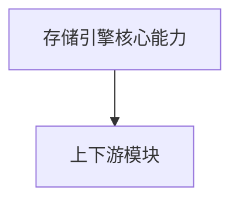

# 架构设计规范

## 1. 概述

### 1.1 功能名称
存储引擎核心能力

### 1.2 版本
1.0

### 1.3 日期
2026-02-06

### 1.4 作者
SQLCC Team

---

## 2. 架构决策

| 决策 ID | 决策内容 | 理由 | 状态 |
|---|---|---|---|
| ADR-001 | 模块接口保持稳定 | 降低依赖耦合 | 草稿 |

---

## 3. 上下文图

---

## 4. 接口与依赖

- 核心接口:
- BufferPool
- DiskManager
- TableStorage
- BPlusTreeIndex
- 依赖模块:
- types
- utils
- exception
- transaction

---

## 5. 验证方式

- 编译验证
- 单元测试验证
- 覆盖率验证

---

## 6. 风险与权衡

- 风险：接口变更影响范围大
- 权衡：优先保证稳定性与可验证性

---

## 7. 变更历史

| 版本 | 日期 | 变更内容 | 变更人 |
|---|---|---|---|
| 1.0 | 2026-02-06 | 初始版本 | SQLCC Team |

---

## 8. 设计参考

- `docs/design/storage_engine/storage_engine_overview.md`
- `docs/design/storage_engine/storage_engine_design.md`
- `docs/design/storage_engine/buffer_pool.md`
