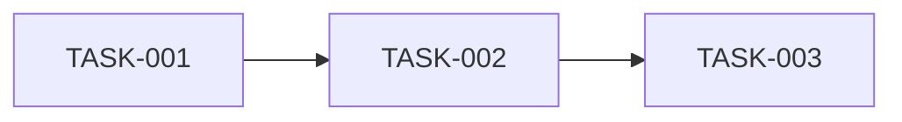

# 实现任务清单

## 1. 概述

### 1.1 功能名称
存储引擎核心能力

### 1.2 版本
1.0

### 1.3 日期
2026-02-06

---

## 2. 任务列表

| ID | 任务 | 依赖 | 负责人 | 状态 | 估计时间 |
|---|---|---|---|---|---|
| TASK-001 | 补齐规范文档 | 无 | SQLCC Team | 待处理 | 2h |
| TASK-002 | 补齐验证文档 | TASK-001 | SQLCC Team | 待处理 | 2h |
| TASK-003 | 设计评审与修订 | TASK-002 | SQLCC Team | 待处理 | 2h |

---

## 3. 依赖图

---

## 4. 风险与缓解

| 风险 | 影响 | 概率 | 缓解措施 |
|---|---|---|---|
| 需求不清晰 | 实现偏差 | 中 | 评审后再进入实现 |

---

## 5. 变更历史

| 版本 | 日期 | 变更内容 | 变更人 |
|---|---|---|---|
| 1.0 | 2026-02-06 | 初始版本 | SQLCC Team |
