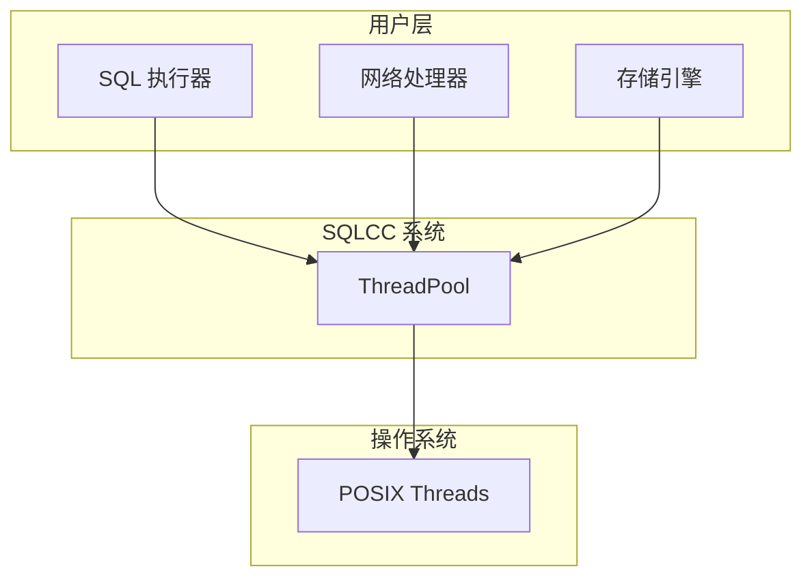
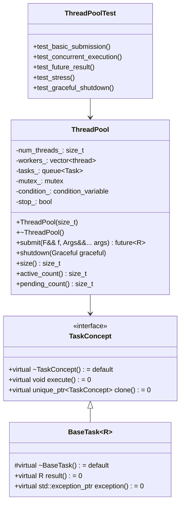
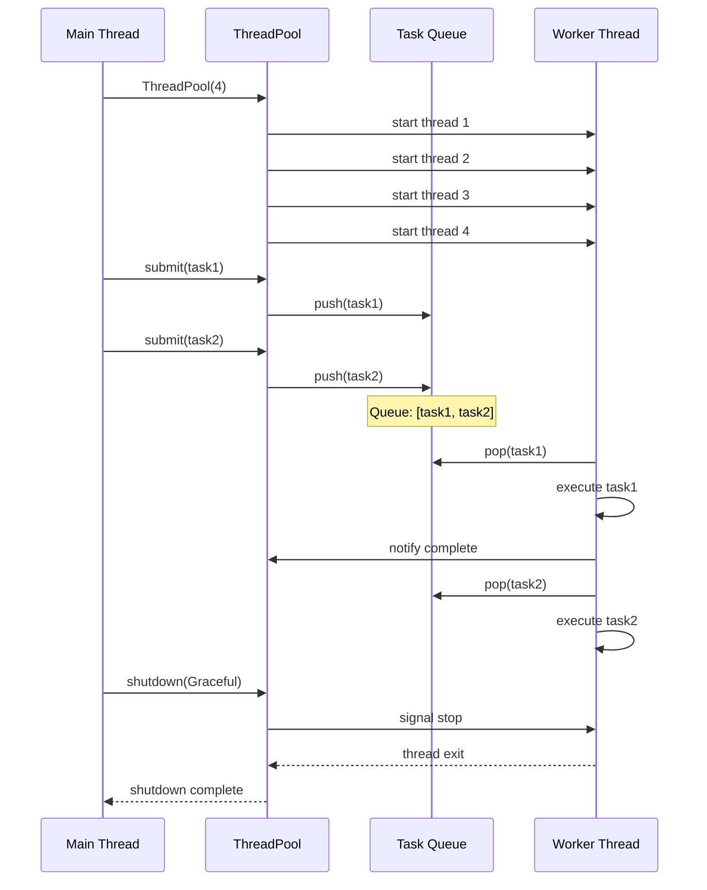
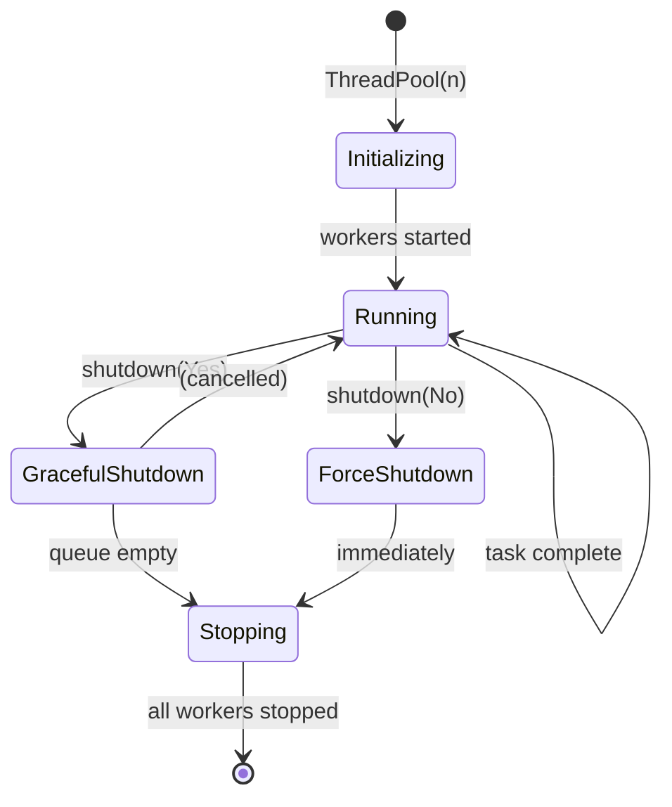

# ThreadPool 架构设计规范

## 1. 概述

### 1.1 功能名称
ThreadPool（线程池管理器）

### 1.2 版本
1.0

### 1.3 日期
2026-02-02

### 1.4 作者
AI Assistant

### 1.5 状态
已实现

### 1.6 对应需求
REQ-THREAD-001 到 REQ-THREAD-006

---

## 2. 架构决策

### 2.1 决策列表

| 决策 ID | 决策内容 | 理由 | 状态 |
|---------|---------|------|------|
| ADR-001 | 使用生产者-消费者模式 | 标准线程池模式，高效队列管理 | 已批准 |
| ADR-002 | 使用条件变量同步 | 比 semaphore 更灵活 | 已批准 |
| ADR-003 | 任务使用 shared_ptr 包装 | 支持多引用计数 | 已批准 |
| ADR-004 | 支持两种关闭模式 | 满足不同场景需求 | 已批准 |

### 2.2 详细决策

#### ADR-001: 生产者-消费者模式

**问题**: 如何高效管理任务队列和线程？

**选项**:
- 选项 A: 信号量 + 互斥锁
  - 优点: 性能略高
  - 缺点: 不支持条件通知
- 选项 B: 互斥锁 + 条件变量
  - 优点: 灵活，支持多个条件
  - 缺点: 略微复杂

**决策**: 选项 B

**影响**: 代码更清晰，易于扩展

---

## 3. 系统上下文

### 3.1 上下文图



### 3.2 输入输出

| 输入 | 来源 | 说明 |
|------|------|------|
| 任务函数 | 调用者 | 需要异步执行的可调用对象 |
| 关闭指令 | 调用者 | 关闭线程池 |

| 输出 | 目标 | 说明 |
|------|------|------|
| future | 调用者 | 任务执行结果 |
| 线程资源 | 操作系统 | 线程复用 |

---

## 4. 组件架构

### 4.1 组件图



### 4.2 组件说明

#### ThreadPool: 线程池管理器

**职责**: 管理线程生命周期、任务队列和任务分发

**接口**:

```cpp
class ThreadPool {
public:
    // 构造函数：创建指定数量的工作线程
    explicit ThreadPool(size_t num_threads);

    // 析构函数：确保资源正确释放
    ~ThreadPool();

    // 禁止拷贝
    ThreadPool(const ThreadPool&) = delete;
    ThreadPool& operator=(const ThreadPool&) = delete;

    // 允许移动
    ThreadPool(ThreadPool&&) noexcept;
    ThreadPool& operator=(ThreadPool&&) noexcept;

    // 提交任务：返回 future 支持获取结果
    template <typename F, typename... Args>
    auto submit(F&& f, Args&&... args)
        -> std::future<std::invoke_result_t<std::decay_t<F>, std::decay_t<Args>...>>;

    // 关闭线程池
    void shutdown(Graceful graceful = Graceful::Yes);

    // 状态查询
    size_t size() const { return workers_.size(); }
    size_t active_count() const;
    size_t pending_count() const;

private:
    // 工作线程函数
    void worker_loop();

    // 成员变量
    std::vector<std::thread> workers_;
    std::queue<Task> tasks_;
    mutable std::mutex mutex_;
    std::condition_variable condition_;
    bool stop_ = false;
};
```

**依赖**:
- `std::thread`: POSIX 线程封装
- `std::mutex`: 互斥锁
- `std::condition_variable`: 条件变量
- `std::future`: 异步结果

---

## 5. 详细设计

### 5.1 数据结构

```cpp
// 任务类型定义
using Task = std::function<void()>;

// 任务包装器（支持返回值）
template <typename T>
class TaskWrapper {
public:
    template <typename F, typename... Args>
    explicit TaskWrapper(F&& f, Args&&... args)
        : promise_(std::make_shared<std::promise<T>>()) {
        task_ = [this, f = std::forward<F>(f), args...]() mutable {
            try {
                auto result = std::apply(std::forward<F>(f), std::forward<Args>(args)...);
                promise_->set_value(std::move(result));
            } catch (...) {
                promise_->set_exception(std::current_exception());
            }
        };
    }

    void operator()() { task_(); }
    std::shared_ptr<std::promise<T>> get_promise() const { return promise_; }

private:
    Task task_;
    std::shared_ptr<std::promise<T>> promise_;
};

// 关闭模式
enum class Graceful { Yes, No };
```

### 5.2 核心算法

#### 任务提交算法

```cpp
template <typename F, typename... Args>
auto ThreadPool::submit(F&& f, Args&&... args)
    -> std::future<std::invoke_result_t<std::decay_t<F>, std::decay_t<Args>...>> {

    using ReturnType = std::invoke_result_t<std::decay_t<F>, std::decay_t<Args>...>;

    // 创建 promise 和 future
    auto promise = std::make_shared<std::promise<ReturnType>>();
    auto future = promise->get_future();

    // 包装任务
    auto task = [promise, f = std::forward<F>(f), args...]() mutable {
        try {
            // 解包参数并执行
            if constexpr (std::is_void_v<ReturnType>) {
                std::apply(std::forward<F>(f), std::forward<Args>(args)...);
                promise->set_value();
            } else {
                auto result = std::apply(std::forward<F>(f), std::forward<Args>(args)...);
                promise->set_value(std::move(result));
            }
        } catch (...) {
            promise->set_exception(std::current_exception());
        }
    };

    // 提交到队列
    {
        std::unique_lock lock(mutex_);
        tasks_.push(std::move(task));
    }

    // 通知工作线程
    condition_.notify_one();

    return future;
}
```

#### 工作线程循环

```cpp
void ThreadPool::worker_loop() {
    while (true) {
        Task task;

        // 获取任务
        {
            std::unique_lock lock(mutex_);

            // 等待任务或停止信号
            condition_.wait(lock, [this] {
                return stop_ || !tasks_.empty();
            });

            // 检查是否需要停止
            if (stop_ && tasks_.empty()) {
                return;
            }

            // 取出一个任务
            task = std::move(tasks_.front());
            tasks_.pop();
        }

        // 执行任务
        task();
    }
}
```

---

## 6. 交互设计

### 6.1 时序图



### 6.2 状态图



---

## 7. 依赖关系

### 7.1 内部依赖

| 源模块 | 目标模块 | 依赖类型 | 说明 |
|--------|---------|---------|------|
| ThreadPool | std::thread | 运行时 | 工作线程 |
| ThreadPool | std::mutex | 编译/运行时 | 同步 |
| ThreadPool | std::condition_variable | 运行时 | 通知 |

### 7.2 外部依赖

| 依赖项 | 版本 | 用途 | 许可证 |
|--------|------|------|--------|
| C++20 | C++20 | 标准库 | ISO |

---

## 8. BUILD 配置

```bazel
# src/utils/BUILD.bazel
load("@rules_cc//cc:defs.bzl", "cc_library", "cc_test")

cc_library(
    name = "thread_pool",
    srcs = ["thread_pool.cpp"],
    hdrs = ["thread_pool.h"],
    deps = [
        "//src/exception:exception",
    ],
    copts = [
        "-std=c++20",
        "-stdlib=libc++",
        "-Wall",
        "-Wextra",
        "-Werror",
    ],
    visibility = ["//visibility:public"],
)

cc_test(
    name = "thread_pool_test",
    srcs = ["thread_pool_test.cpp"],
    deps = [
        ":thread_pool",
        "@com_google_googletest//:gtest_main",
    ],
    tags = [
        "foundation",
        "utils",
    ],
    timeout = "short",
)
```

---

## 9. 测试策略

### 9.1 测试覆盖目标

| 类型 | 目标覆盖率 | 最低覆盖率 | 说明 |
|------|-----------|-----------|------|
| 单元测试 | 90% | 80% | 核心逻辑 |
| 集成测试 | 70% | 60% | 线程交互 |
| 边界测试 | 100% | 100% | 边界条件 |

### 9.2 测试用例

```cpp
// tests/level1_foundation/utils/thread_pool_test.cpp

class ThreadPoolBasicTest : public testing::Test {
protected:
    ThreadPool pool{4};
};

TEST_F(ThreadPoolBasicTest, SubmitAndGetResult) {
    auto future = pool.submit([] { return 42; });
    EXPECT_EQ(future.get(), 42);
}

TEST_F(ThreadPoolBasicTest, MultipleTasks) {
    std::vector<std::future<int>> futures;
    for (int i = 0; i < 10; ++i) {
        futures.push_back(pool.submit([i] { return i * i; }));
    }

    int sum = 0;
    for (auto& f : futures) {
        sum += f.get();
    }
    EXPECT_EQ(sum, 285);  // 0^2 + 1^2 + ... + 9^2
}
```

---

## 10. 性能考虑

### 10.1 性能目标

| 指标 | 目标值 | 说明 |
|------|--------|------|
| 任务提交延迟 | < 100μs | 单次 submit |
| 吞吐量 | > 10000 QPS | 并发任务 |
| 内存开销 | < 1MB | 线程栈 + 队列 |

### 10.2 性能优化策略

- **无锁队列**: 高并发时考虑使用
- **任务批处理**: 减少队列操作
- **线程本地存储**: 减少锁竞争

---

## 11. 安全性考虑

### 11.1 安全需求

- 线程安全：所有公开方法线程安全
- 异常安全：RAII 保证资源释放
- 资源限制：队列有最大容量

### 11.2 安全措施

- 互斥锁保护共享状态
- 异常捕获和传播
- 资源自动释放

---

## 12. 评审检查表

| 检查项 | 状态 | 备注 |
|--------|------|------|
| [x] 架构决策合理 | 通过 | 基于成熟模式 |
| [x] 类图准确 | 通过 | 完整接口定义 |
| [x] 时序图完整 | 通过 | 覆盖主要场景 |
| [x] 依赖关系清晰 | 通过 | 无循环依赖 |
| [x] BUILD 配置正确 | 通过 | 符合项目规范 |
| [x] 测试策略完整 | 通过 | 覆盖所有需求 |
| [x] 性能考虑充分 | 通过 | 有量化目标 |
| [x] 安全措施到位 | 通过 | 线程安全设计 |

---

## 13. 评审签字

| 角色 | 姓名 | 日期 | 签字 |
|------|------|------|------|
| 架构师 | | | |
| 开发负责人 | | | |
| 测试负责人 | | | |

---

## 14. 变更历史

| 版本 | 日期 | 变更内容 | 变更人 | 审批人 |
|------|------|---------|--------|--------|
| 1.0 | 2026-02-02 | 初始设计 | AI Assistant | |
