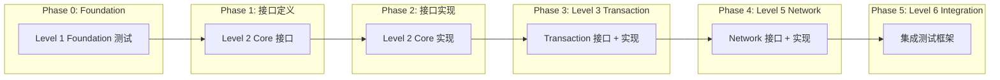

# SQLCC 核心模块重构总览 v1.0

**版本**: 1.0
**日期**: 2026-02-02
**状态**: 规划中
**适用范围**: Level 2-6 重构工作

---

## 📋 目录

1. [重构概述](#重构概述)
2. [重构目标](#重构目标)
3. [各层级重构概览](#各层级重构概览)
4. [SDD 规范整合](#sdd-规范整合)
5. [依赖关系图](#依赖关系图)
6. [整体任务规划](#整体任务规划)
7. [质量门禁](#质量门禁)

---

## 重构概述

### 背景

SQLCC 项目基于现有代码进行重构，目标：
- 解耦模块依赖
- 消除"上帝类"
- 提高可测试性
- 支持增量编译

### 重构原则

| 原则 | 说明 |
|------|------|
| **接口抽象** | 通过接口解耦具体实现 |
| **单一职责** | 拆分职责过重的类 |
| **依赖注入** | 使用 DI 容器管理依赖 |
| **渐进式重构** | 分阶段、小步前进 |
| **测试保护** | 每步重构都有测试覆盖 |

---

## 重构目标

### 功能性目标

| 目标 | 说明 | 状态 |
|------|------|------|
| 消除 28 个反向依赖 | execution 不再直接依赖 core 具体实现 | 规划中 |
| 接口抽象 | 定义 IExecutionContext 等核心接口 | 规划中 |
| 职责分离 | 拆分上帝类为单一职责组件 | 规划中 |
| 增量编译 | 支持独立编译和测试各模块 | 规划中 |

### 质量目标

| 指标 | 当前值 | 目标值 |
|------|--------|--------|
| 代码覆盖率 | ~56% | 70% |
| 模块耦合度 | 高 | 低 |
| 编译时间 | 长 | 减少 30% |
| 可测试性 | 差 | 好 |

---

## 各层级重构概览

### Level 1 Foundation（✅ 已完成）

| 模块 | 测试用例数 | 覆盖率 | 状态 |
|------|-----------|--------|------|
| Exception | 32 | - | ✅ |
| Types | ~60 | - | ✅ |
| Logger | ~30 | - | ✅ |
| Config | ~40 | - | ✅ |
| Utils (ThreadPool) | 47+ | 95%+ | ✅ |
| **总计** | **209+** | **95%+** | **✅** |

**SDD 文档**:
- requirements.md: `docs/sdd/refactoring/level1_foundation/requirements.md`
- design.md: `docs/sdd/refactoring/level1_foundation/design.md`
- tasks.md: `docs/sdd/refactoring/level1_foundation/tasks.md`

**里程碑**:
- M1: Exception 测试 (2026-01-25) ✅
- M2: Types 测试 (2026-01-26) ✅
- M3: Logger 测试 (2026-01-27) ✅
- M4: Config 测试 (2026-01-28) ✅
- M5: Utils 测试 (2026-02-02) ✅
- M6: 覆盖率验证 (2026-02-02) ✅

### Level 2 Core（最高优先级 P0）

| 模块 | 问题 | 解决方案 | 状态 |
|------|------|---------|------|
| execution_context.h | 上帝类，28 个反向依赖 | 拆分为多个接口 | 设计完成 |
| user_manager.h | 与执行模块紧耦合 | IUserContext 接口 | 设计完成 |
| permission_validator.h | 权限检查逻辑复杂 | IPermissionContext 接口 | 设计完成 |

**SDD 文档**:
- requirements.md: `docs/sdd/refactoring/level2_core/requirements.md`
- design.md: `docs/sdd/refactoring/level2_core/design.md`
- tasks.md: `docs/sdd/refactoring/level2_core/tasks.md`

### Level 3 Transaction（高优先级 P0）

| 模块 | 问题 | 解决方案 | 状态 |
|------|------|---------|------|
| wal_manager.cpp | 54.3 KB，职责过多 | 拆分为 WriteAheadLog, LogManager, CheckpointManager, RecoveryManager | 设计完成 |
| transaction_manager.cpp | 43.9 KB，逻辑复杂 | TransactionScheduler, IsolationLevelManager | 设计完成 |
| 缺少事务接口 | 执行模块无法解耦 | ITransactionContext 接口 | 设计完成 |

**SDD 文档**:
- requirements.md: `docs/sdd/refactoring/level3_transaction/requirements.md`
- design.md: `docs/sdd/refactoring/level3_transaction/design.md`
- tasks.md: `docs/sdd/refactoring/level3_transaction/tasks.md`

### Level 5 Network（中优先级 P1）

| 模块 | 问题 | 解决方案 | 状态 |
|------|------|---------|------|
| ConnectionHandler | 5 种职责混合 | 拆分为 ConnectionHandler, MessageProcessor, AuthHandler, SessionManager, ProtocolHandler | 设计完成 |
| 消息处理 | 与连接管理耦合 | IMessageProcessor 接口 | 设计完成 |

**SDD 文档**:
- requirements.md: `docs/sdd/refactoring/level5_network/requirements.md`
- design.md: `docs/sdd/refactoring/level5_network/design.md`
- tasks.md: `docs/sdd/refactoring/level5_network/tasks.md`

### Level 6 Integration（中优先级 P1）

| 模块 | 问题 | 解决方案 | 状态 |
|------|------|---------|------|
| 端到端测试 | 缺少集成测试框架 | IntegrationTestFramework | 设计完成 |
| 分布式查询 | 缺少查询路由 | QueryRouter | 设计完成 |

**SDD 文档**: `docs/sdd/refactoring/level6_integration/`

---

## SDD 规范整合

### SDD 工作流程与重构结合

```
┌─────────────────────────────────────────────────────────────────────────┐
│                    重构 SDD 工作流程                                     │
├─────────────────────────────────────────────────────────────────────────┤
│                                                                         │
│  ┌──────────────┐    ┌──────────────┐    ┌──────────────┐              │
│  │ 重构需求分析  │───▶│  架构设计    │───▶│  任务分解    │              │
│  │ (refactoring │    │  (接口抽象    │    │  (TDD 驱动    │              │
│  │  requirements)│    │   Mermaid)   │    │   测试优先)   │              │
│  └──────────────┘    └──────────────┘    └──────────────┘              │
│         │                   │                   │                      │
│         ▼                   ▼                   ▼                      │
│  ┌──────────────┐    ┌──────────────┐    ┌──────────────┐              │
│  │  EARS 格式    │    │  ADR 决策    │    │  依赖图 +     │              │
│  │  问题定义     │    │  架构图      │    │  燃尽图       │              │
│  └──────────────┘    └──────────────┘    └──────────────┘              │
│                                                                         │
│                            │                                          │
│                            ▼                                          │
│                    ┌──────────────┐                                   │
│                    │   代码实现    │                                   │
│                    │  (接口 + 实现)│                                   │
│                    └──────────────┘                                   │
│                            │                                          │
│                            ▼                                          │
│                    ┌──────────────┐                                   │
│                    │   验证测试    │                                   │
│                    │  (覆盖率达标) │                                   │
│                    └──────────────┘                                   │
│                                                                         │
└─────────────────────────────────────────────────────────────────────────┘
```

### 重构核心需求（EARS 格式）

#### REQ-REFACTOR-001: 接口抽象解耦

| 属性 | 值 |
|------|-----|
| ID | REQ-REFACTOR-001 |
| 优先级 | P0 |
| 状态 | 进行中 |

**描述**:

**当** SQLCC 模块间存在紧耦合依赖时,
**我想要** 通过接口抽象解耦 execution 与 core,
**以便于** 支持增量编译和独立测试.

**接受标准**:
- [x] 定义 IExecutionContext 接口
- [x] 定义 IUserContext 接口
- [x] 定义 IPermissionContext 接口
- [x] 定义 ITransactionContext 接口
- [ ] execution 模块仅依赖接口

#### REQ-REFACTOR-002: 职责分离

| 属性 | 值 |
|------|-----|
| ID | REQ-REFACTOR-002 |
| 优先级 | P0 |
| 状态 | 进行中 |

**描述**:

**当** 核心模块（如 execution_context.h）职责过多时,
**我想要** 将其拆分为多个单一职责组件,
**以便于** 提高代码可维护性和可测试性.

**接受标准**:
- [ ] 消除上帝类（>500 行）
- [ ] 每个类职责单一
- [ ] 支持独立测试
- [ ] 编译时间减少 30%

#### REQ-REFACTOR-003: 依赖注入

| 属性 | 值 |
|------|-----|
| ID | REQ-REFACTOR-003 |
| 优先级 | P1 |
| 状态 | 规划中 |

**描述**:

**当** 模块间依赖硬编码时,
**我想要** 引入依赖注入模式,
**以便于** 灵活配置和替换实现.

**接受标准**:
- [ ] 定义 DependencyContainer
- [ ] 支持接口注册
- [ ] 支持工厂方法
- [ ] 支持生命周期管理

---

## 依赖关系图

### 模块依赖关系（重构后）

```mermaid
graph TB
    subgraph "Level 1 Foundation"
        EXC[Exception]
        LOG[Logger]
        TYP[Types]
        UTILS[Utils]
    end

    subgraph "Level 2 Core Interfaces"
        IEXEC[IExecutionContext]
        IUSER[IUserContext]
        IPERM[IPermissionContext]
        ITRAN[ITransactionContext]
    end

    subgraph "Level 2 Core Impl"
        EXEC_IMPL[ExecutionContextImpl]
        USER_IMPL[UserContextImpl]
        PERM_IMPL[PermissionContextImpl]
        TRAN_IMPL[TransactionContextImpl]
    end

    subgraph "Level 2 Execution"
        DDL[DDL Strategy]
        DML[DML Strategy]
        DCL[DCL Strategy]
        UTIL[Utility Strategy]
        UNIFIED[UnifiedExecutor]
    end

    subgraph "Level 3 Transaction"
        TRAN[Transaction Manager]
        WAL[WAL Manager]
    end

    subgraph "Level 4 SQL Processing"
        PARSER[SQL Parser]
    end

    subgraph "Level 5 Network"
        HND[Handler]
        SESS[Session Manager]
    end

    %% 依赖关系
    EXC --> IEXEC
    LOG --> IEXEC
    TYP --> IEXEC
    UTILS --> IEXEC

    IEXEC <|.. EXEC_IMPL
    IUSER <|.. USER_IMPL
    IPERM <|.. PERM_IMPL
    ITRAN <|.. TRAN_IMPL

    EXEC_IMPL --> USER_IMPL
    EXEC_IMPL --> PERM_IMPL
    EXEC_IMPL --> TRAN_IMPL

    DDL --> IEXEC
    DML --> IEXEC
    DCL --> IEXEC
    UTIL --> IEXEC
    UNIFIED --> IEXEC

    EXEC_IMPL --> TRAN
    EXEC_IMPL --> WAL
    TRAN --> ITRAN
    WAL --> ITRAN

    EXEC_IMPL --> PARSER
    DDL --> PARSER
    DML --> PARSER

    HND --> IEXEC
    SESS --> IEXEC
```

### 重构任务依赖关系



---

## 整体任务规划

### 任务统计

| 层级 | 任务数 | 预计时间 | 接口数 | 实现类数 | 状态 |
|------|--------|----------|--------|----------|------|
| **Level 1 Foundation** | **24** | **已完成** | - | 5 | ✅ |
| Level 2 Core | 32 | 6 周 | 4 | 4 | 进行中 |
| Level 3 Transaction | 24 | 4 周 | 1 | 5 | 规划中 |
| Level 5 Network | 20 | 3 周 | 2 | 5 | 规划中 |
| Level 6 Integration | 16 | 2 周 | 1 | 3 | 规划中 |
| **总计** | **116** | **15+ 周** | **8** | **17** | |

### 里程碑规划

| 里程碑 | 时间 | 目标 | 状态 |
|--------|------|------|------|
| M0: Foundation 完成 | 已完成 | Level 1 测试覆盖 95%+ | ✅ |
| M1: 接口定义完成 | 第 2 周 | 所有核心接口定义完成 | 进行中 |
| M2: Core 实现完成 | 第 6 周 | Level 2 Core 重构完成 | 规划中 |
| M3: Transaction 完成 | 第 10 周 | Level 3 Transaction 重构完成 | 规划中 |
| M4: Network 完成 | 第 13 周 | Level 5 Network 重构完成 | 规划中 |
| M5: 集成测试完成 | 第 15 周 | 所有测试覆盖达标 | 规划中 |

### 详细任务列表

#### Phase 0: Level 1 Foundation（已完成）

| 阶段 | 任务数 | 时间 | 说明 |
|------|--------|------|------|
| 0.1 Exception 测试 | 4 | 1 天 | 32 个测试用例 |
| 0.2 Types 测试 | 4 | 1 天 | ~60 个测试用例 |
| 0.3 Logger 测试 | 4 | 1 天 | ~30 个测试用例 |
| 0.4 Config 测试 | 4 | 1 天 | ~40 个测试用例 |
| 0.5 Utils 测试 | 5 | 2 天 | 47+ 测试，95%+ 覆盖 |
| 0.6 覆盖率验证 | 3 | 半天 | 生成覆盖率报告 |

**统计**: 24 任务, 209+ 测试用例, 100% 通过率, 95%+ 覆盖率

#### Phase 1: Level 2 Core（6 周）

| 阶段 | 任务数 | 时间 | 说明 |
|------|--------|------|------|
| 1.1 接口定义 | 8 | 1 周 | 定义 4 个核心接口 |
| 1.2 接口实现 | 8 | 2 周 | 实现 4 个实现类 |
| 1.3 模块适配 | 10 | 2 周 | 修改 DDL/DML/DCL/Utility/UnifiedExecutor |
| 1.4 测试覆盖 | 6 | 1 周 | 补充测试用例 |

#### Phase 2: Level 3 Transaction（4 周）

| 阶段 | 任务数 | 时间 | 说明 |
|------|--------|------|------|
| 2.1 WAL 拆分 | 10 | 2 周 | 拆分为 4 个组件 |
| 2.2 事务接口 | 8 | 1 周 | ITransactionContext + 实现 |
| 2.3 测试覆盖 | 6 | 1 周 | 补充测试用例 |

#### Phase 3: Level 5 Network（3 周）

| 阶段 | 任务数 | 时间 | 说明 |
|------|--------|------|------|
| 3.1 ConnectionHandler 拆分 | 12 | 2 周 | 拆分为 5 个组件 |
| 3.2 测试覆盖 | 8 | 1 周 | 补充测试用例 |

#### Phase 4: Level 6 Integration（2 周）

| 阶段 | 任务数 | 时间 | 说明 |
|------|--------|------|------|
| 4.1 测试框架 | 8 | 1 周 | 集成测试框架 |
| 4.2 端到端测试 | 8 | 1 周 | 端到端测试用例 |

---

## 质量门禁

### 代码质量标准

| 检查项 | 标准 | 验证方法 |
|--------|------|----------|
| 代码覆盖率 | >= 70% | bazel coverage |
| 测试通过率 | 100% | bazel test |
| 编译成功率 | 100% | bazel build |
| 静态分析 | 无警告 | clang-tidy |
| 文档完整性 | 100% | SDD 文档检查 |

### 重构质量标准

| 检查项 | 标准 | 验证方法 |
|--------|------|----------|
| 循环依赖消除 | 0 个 | bazel query 'deps(//...)' |
| 接口抽象 | 所有模块 | 接口覆盖率 |
| 单一职责 | 类 < 300 行 | 代码统计 |
| 增量编译 | 模块独立编译 | bazel build //src/module:all |

### 验收检查表

| 层级 | 验收项 | 状态 |
|------|--------|------|
| **通用** | SDD 文档完整 | ✅ |
| | 代码注释完整 | ⏳ |
| | BUILD 文件正确 | ⏳ |
| **Level 2** | 接口定义完成 | ✅ |
| | 28 个反向依赖消除 | ⏳ |
| | UnifiedExecutor 通过接口调用 | ⏳ |
| **Level 3** | WAL 职责分离 | ⏳ |
| | TransactionContext 接口定义 | ⏳ |
| **Level 5** | ConnectionHandler 拆分 | ⏳ |
| | IMessageProcessor 定义 | ⏳ |
| **Level 6** | 集成测试框架 | ⏳ |
| | 端到端测试覆盖 | ⏳ |

---

## 相关文档

### SDD 模板

| 模板 | 路径 |
|------|------|
| 需求模板 | `docs/sdd/templates/requirements_template.md` |
| 设计模板 | `docs/sdd/templates/design_template.md` |
| 任务模板 | `docs/sdd/templates/tasks_template.md` |

### 各层级重构文档

| 层级 | 需求 | 设计 | 任务 |
|------|------|------|------|
| Level 2 Core | `level2_core/requirements.md` | `level2_core/design.md` | `level2_core/tasks.md` |
| Level 3 Transaction | `level3_transaction/requirements.md` | `level3_transaction/design.md` | `level3_transaction/tasks.md` |
| Level 5 Network | `level5_network/requirements.md` | `level5_network/design.md` | `level5_network/tasks.md` |
| Level 6 Integration | `level6_integration/requirements.md` | `level6_integration/design.md` | `level6_integration/tasks.md` |

---

## 变更历史

| 版本 | 日期 | 变更内容 | 变更人 |
|------|------|---------|--------|
| 1.0 | 2026-02-02 | 初始版本，整合所有层级重构文档 | SQLCC AI |

---

**维护者**: SQLCC AI 开发团队
**最后更新**: 2026-02-02
**版本**: v1.0
