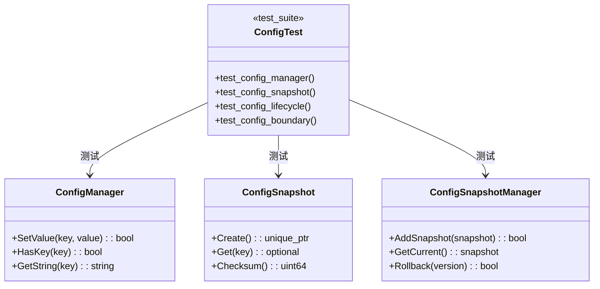

# Config 模块重构设计

**模块**: config  
**版本**: v1.3.8  
**日期**: 2026-01-31  
**状态**: ✅ 已完成

---

## 1. 架构决策

| 决策 | 内容 | 理由 | 状态 |
|------|------|------|------|
| ADR-C001 | 新增 ConfigLifecycle 测试 | 覆盖格式化/解析函数 | 已批准 |
| ADR-C002 | 新增 ConfigSnapshot 测试 | 覆盖快照管理 | 已批准 |
| ADR-C003 | 修复 ConfigManager 死锁 | 提升并发性能 | 已批准 |

---

## 2. 测试架构



---

## 3. 测试用例设计

### 3.1 ConfigLifecycle 测试 (12 用例)

| 测试组 | 测试数 | 覆盖函数 |
|--------|--------|----------|
| FormatConfigValue | 4 | bool, int, double, string |
| ParseConfigValue | 4 | bool, int, double, string |
| 空白处理 | 4 | trim, 解析 |

### 3.2 ConfigSnapshot 测试 (9 用例)

| 测试组 | 测试数 | 覆盖功能 |
|--------|--------|----------|
| 快照创建 | 2 | 创建、获取 |
| 键操作 | 2 | HasKey, GetKeys |
| 校验和 | 1 | 计算 |
| 克隆比较 | 2 | Clone, Equals |
| 合并 | 2 | Merge |

### 3.3 ConfigSnapshotManager 测试 (7 用例)

| 测试组 | 测试数 | 覆盖功能 |
|--------|--------|----------|
| 快照管理 | 3 | Add, Get, Current |
| 版本历史 | 2 | 历史记录 |
| 回滚清理 | 2 | Rollback, Purge |

---

## 4. BUILD 配置

```bazel
# tests/level1_foundation/config/BUILD.bazel

cc_test(
    name = "config_test",
    srcs = ["config_test.cpp"],
    copts = [
        "-fprofile-instr-generate",
        "-fcoverage-mapping",
    ],
    linkopts = ["-fprofile-instr-generate"],
    deps = [
        "@com_google_googletest//:gtest",
        "@com_google_googletest//:gtest_main",
        "//src/utils:utils_coverage",
    ],
    tags = ["coverage", "level1", "config"],
)
```

---

**维护者**: SQLCC Team  
**完成日期**: 2026-01-31
