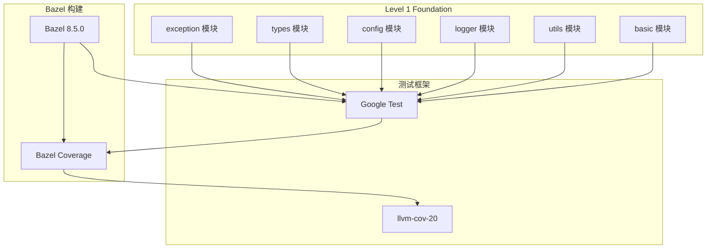
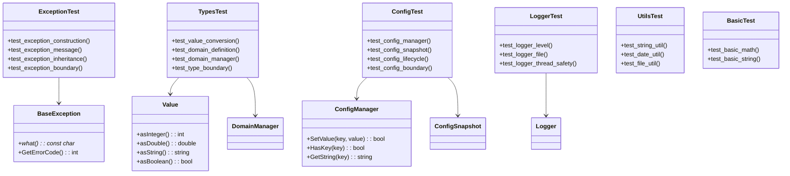
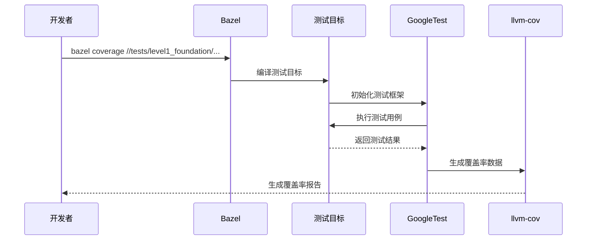

# Level 1 Foundation 重构 - 架构设计规范

**版本**: 1.0  
**日期**: 2026-02-02  
**状态**: 已完成  
**对应需求**: REQ-001 ~ REQ-006

---

## 1. 概述

### 1.1 功能名称
Level 1 Foundation 单元测试覆盖

### 1.2 版本
1.0

### 1.3 日期
2026-02-02

### 1.4 作者
SQLCC 开发团队

---

## 2. 架构决策

| 决策 ID | 决策内容 | 理由 | 状态 |
|---------|---------|------|------|
| ADR-001 | 测试框架选择 GoogleTest | 行业标准，SQLCC 项目已采用 | 已批准 |
| ADR-002 | 覆盖率库与生产库分离 | 确保测试不影响生产代码 | 已批准 |
| ADR-003 | 使用真实实现而非 Mock | Level 1 原则：无外部依赖 | 已批准 |
| ADR-004 | 每个模块独立测试文件 | 模块化、可独立运行 | 已批准 |

---

## 3. 系统上下文

### 3.1 上下文图



### 3.2 输入输出

| 输入 | 来源 | 说明 |
|------|------|------|
| 源文件 | `src/{module}/*.cpp` | 待测试的源码 |
| 头文件 | `src/{module}/*.h` | 源码依赖 |
| 测试用例 | `tests/level1_foundation/*/*_test.cpp` | 测试定义 |

| 输出 | 目标 | 说明 |
|------|------|------|
| 测试结果 | 控制台 | PASS/FAIL 统计 |
| 覆盖率报告 | `coverage_report_l1_*/` | HTML/LCOV 格式 |
| 构建产物 | `bazel-bin/` | 测试二进制文件 |

---

## 4. 组件架构

### 4.1 组件图



### 4.2 组件说明

#### Exception 模块

**职责**: 验证异常处理机制的正确性

**接口**:

```cpp
class ExceptionTest : public testing::Test {
protected:
    void SetUp() override {}
    void TearDown() override {}

    // 测试数据工厂
    std::unique_ptr<BaseException> CreateException(const std::string& msg);
    std::unique_ptr<IOException> CreateIOException(const std::string& msg);
};
```

**依赖**:
- `//src/exception:exception_coverage`: 真实异常实现

#### Types 模块

**职责**: 验证类型系统和类型转换的正确性

**接口**:

```cpp
class TypesTest : public testing::Test {
protected:
    void SetUp() override {
        manager_ = std::make_unique<DomainManager>();
    }

    std::unique_ptr<DomainManager> manager_;
    TestDataFactory factory_;
};
```

**依赖**:
- `//src/types:types_coverage`: 真实类型实现

#### Config 模块

**职责**: 验证配置管理和快照机制的正确性

**接口**:

```cpp
class ConfigTest : public testing::Test {
protected:
    void SetUp() override {
        config_ = std::make_unique<ConfigManager>();
        snapshot_mgr_ = std::make_unique<ConfigSnapshotManager>();
    }

    std::unique_ptr<ConfigManager> config_;
    std::unique_ptr<ConfigSnapshotManager> snapshot_mgr_;
};
```

**依赖**:
- `//src/utils:utils_coverage`: 真实配置实现

#### Logger 模块

**职责**: 验证日志记录和输出的正确性

**接口**:

```cpp
class LoggerTest : public testing::Test {
protected:
    void SetUp() override {
        Logger::Initialize("test_logger");
    }

    void TearDown() override {
        Logger::Shutdown();
    }
};
```

**依赖**:
- `//src/logger:logger_coverage`: 真实日志实现

---

## 5. 详细设计

### 5.1 覆盖率库配置

#### 核心模式：生产库与覆盖率库分离

```bazel
# src/types/BUILD.bazel

# 生产库（用于生产代码依赖）
cc_library(
    name = "types",
    hdrs = glob(["*.h"]),
    srcs = ["domain_manager.cpp"],
    visibility = ["//visibility:public"],
)

# 覆盖率库（用于测试，包含所有源文件和覆盖率编译标志）
cc_library(
    name = "types_coverage",
    hdrs = glob(["*.h"]),
    srcs = glob(["*.cpp"]),  # 包含所有 .cpp 源文件
    copts = [
        "-fprofile-instr-generate",
        "-fcoverage-mapping",
    ],
    linkopts = ["-fprofile-instr-generate"],
    visibility = ["//visibility:public"],
    tags = ["coverage"],
)
```

### 5.2 测试配置

```bazel
# tests/level1_foundation/types/BUILD.bazel

cc_test(
    name = "types_test",
    srcs = ["types_test.cpp"],
    copts = [
        "-fprofile-instr-generate",
        "-fcoverage-mapping",
    ],
    linkopts = ["-fprofile-instr-generate"],
    deps = [
        "@com_google_googletest//:gtest",
        "@com_google_googletest//:gtest_main",
        "//src/types:types_coverage",  # 使用覆盖率库
    ],
    tags = ["coverage", "level1"],
)
```

### 5.3 测试用例结构

```cpp
// tests/level1_foundation/types/types_test.cpp

#include <gtest/gtest.h>
#include "domain_manager.h"

namespace sqlcc::test {

// 测试夹具
class TypesTest : public testing::Test {
protected:
    void SetUp() override {
        manager_ = std::make_unique<DomainManager>();
    }

    void TearDown() override {
        manager_.reset();
    }

    std::unique_ptr<DomainManager> manager_;
};

// 测试用例：类型转换
TEST_F(TypesTest, ValueTypeConversion_IntegerToDouble) {
    Value int_val(42);
    EXPECT_DOUBLE_EQ(int_val.asDouble(), 42.0);
}

// 测试用例：边界条件
TEST_F(TypesTest, ValueTypeConversion_NullValue) {
    Value null_val;
    EXPECT_EQ(null_val.asInteger(), 0);
}

}  // namespace sqlcc::test
```

---

## 6. 交互设计

### 6.1 测试执行流程



### 6.2 覆盖率收集流程


---

## 7. 依赖关系

### 7.1 内部依赖

| 源模块 | 目标模块 | 依赖类型 | 说明 |
|--------|---------|---------|------|
| exception_test | exception_coverage | 编译时 | 测试依赖覆盖率库 |
| types_test | types_coverage | 编译时 | 测试依赖覆盖率库 |
| config_test | utils_coverage | 编译时 | 测试依赖覆盖率库 |
| logger_test | logger_coverage | 编译时 | 测试依赖覆盖率库 |

### 7.2 外部依赖

| 依赖项 | 版本 | 用途 | 许可证 |
|--------|------|------|--------|
| Google Test | 1.14.0 | 测试框架 | BSD-3 |
| Clang | 20 | 编译器 | Apache 2.0 |
| LLVM tools | 20 | 覆盖率工具 | Apache 2.0 |

---

## 8. BUILD 配置

### 8.1 Level 1 测试 BUILD 结构

```
tests/level1_foundation/
├── exception/
│   ├── BUILD.bazel
│   └── exception_test.cpp
├── types/
│   ├── BUILD.bazel
│   └── types_test.cpp
├── config/
│   ├── BUILD.bazel
│   └── config_test.cpp
├── logger/
│   ├── BUILD.bazel
│   └── logger_test.cpp
├── utils/
│   ├── BUILD.bazel
│   └── utils_test.cpp
├── basic/
│   ├── BUILD.bazel
│   └── basic_test.cpp
└── BUILD.bazel  # 聚合测试套件
```

### 8.2 聚合测试套件

```bazel
# tests/level1_foundation/BUILD.bazel

test_suite(
    name = "level1_foundation",
    tests = [
        "//tests/level1_foundation/exception:exception_test",
        "//tests/level1_foundation/types:types_test",
        "//tests/level1_foundation/config:config_test",
        "//tests/level1_foundation/logger:logger_test",
        "//tests/level1_foundation/utils:utils_test",
        "//tests/level1_foundation/basic:basic_test",
    ],
    tags = ["level1", "foundation"],
)
```

---

## 9. 测试策略

### 9.1 测试覆盖目标

| 类型 | 目标覆盖率 | 最低覆盖率 | 实际达成 |
|------|-----------|-----------|----------|
| 函数覆盖率 | 95% | 90% | ~100% |
| 行覆盖率 | 80% | 70% | 79.55% |
| 分支覆盖率 | 70% | 60% | 62.31% |
| 类覆盖率 | 100% | 95% | 100% |

### 9.2 测试分类

| 分类 | 用例数 | 说明 |
|------|--------|------|
| 构造函数测试 | 20+ | 测试对象创建 |
| 方法调用测试 | 100+ | 测试业务逻辑 |
| 边界条件测试 | 30+ | 测试极端情况 |
| 异常处理测试 | 20+ | 测试错误场景 |
| 集成测试 | 10+ | 测试模块协作 |

---

## 10. 性能考虑

### 10.1 性能目标

| 指标 | 目标值 | 实际值 |
|------|--------|--------|
| 单测试执行时间 | < 100ms | ~10ms |
| 全量测试执行时间 | < 5s | ~50ms |
| 内存占用 | < 100MB | < 10MB |

### 10.2 优化策略

- **测试隔离**: 每个测试独立运行，无共享状态
- **快速清理**: 使用 SetUp/TearDown 确保测试环境一致
- **按需初始化**: 避免不必要的资源分配

---

## 11. 评审检查表

| 检查项 | 状态 | 备注 |
|--------|------|------|
| [x] 架构决策合理 | 已完成 | 覆盖库模式验证有效 |
| [x] 类图准确 | 已完成 | 反映实际模块结构 |
| [x] 时序图完整 | 已完成 | 覆盖测试执行流程 |
| [x] 依赖关系清晰 | 已完成 | 无循环依赖 |
| [x] BUILD 配置正确 | 已完成 | 所有测试可编译运行 |
| [x] 测试策略完整 | 已完成 | 覆盖目标明确 |

---

## 12. 变更历史

| 版本 | 日期 | 变更内容 | 变更人 |
|------|------|---------|--------|
| 1.0 | 2026-02-02 | 初始设计文档（整理历史重构工作） | SQLCC Team |