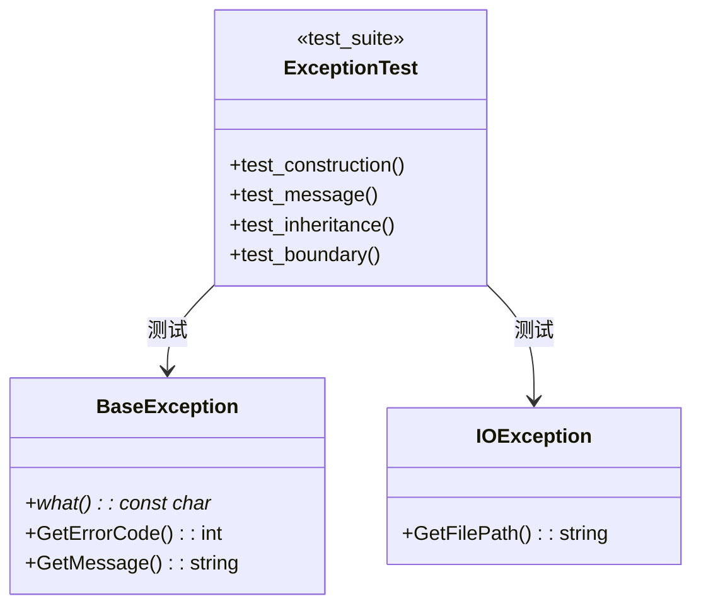

# Exception 模块重构设计

**模块**: exception  
**版本**: v1.3.7  
**日期**: 2026-01-29  
**状态**: ✅ 已完成

---

## 1. 架构决策

| 决策 | 内容 | 理由 | 状态 |
|------|------|------|------|
| ADR-E001 | 测试框架使用 GoogleTest | 项目标准 | 已批准 |
| ADR-E002 | 使用真实异常类实现 | Level 1 原则 | 已批准 |
| ADR-E003 | 覆盖率库与生产库分离 | 避免影响生产代码 | 已批准 |

---

## 2. 测试架构



---

## 3. 测试用例设计

### 3.1 构造函数测试

| 测试用例 | 输入 | 预期输出 |
|----------|------|----------|
| DefaultConstruction | - | 空消息，ERROR_NONE |
| MessageConstruction | "error msg" | 消息正确存储 |
| CodeConstruction | code=123 | 错误码正确 |

### 3.2 边界测试

| 测试用例 | 边界条件 | 预期行为 |
|----------|----------|----------|
| EmptyMessage | msg="" | 返回空字符串 |
| LongMessage | msg>4KB | 正常处理 |
| SpecialCharMessage | msg="中文\n\t" | 正确编码 |

---

## 4. BUILD 配置

```bazel
# tests/level1_foundation/exception/BUILD.bazel

cc_test(
    name = "exception_test",
    srcs = glob(["*_test.cpp"]),
    copts = [
        "-fprofile-instr-generate",
        "-fcoverage-mapping",
    ],
    linkopts = ["-fprofile-instr-generate"],
    deps = [
        "@com_google_googletest//:gtest",
        "@com_google_googletest//:gtest_main",
        "//src/exception:exception_coverage",
    ],
    tags = ["coverage", "level1", "exception"],
)
```

---

**维护者**: SQLCC Team  
**完成日期**: 2026-01-29
