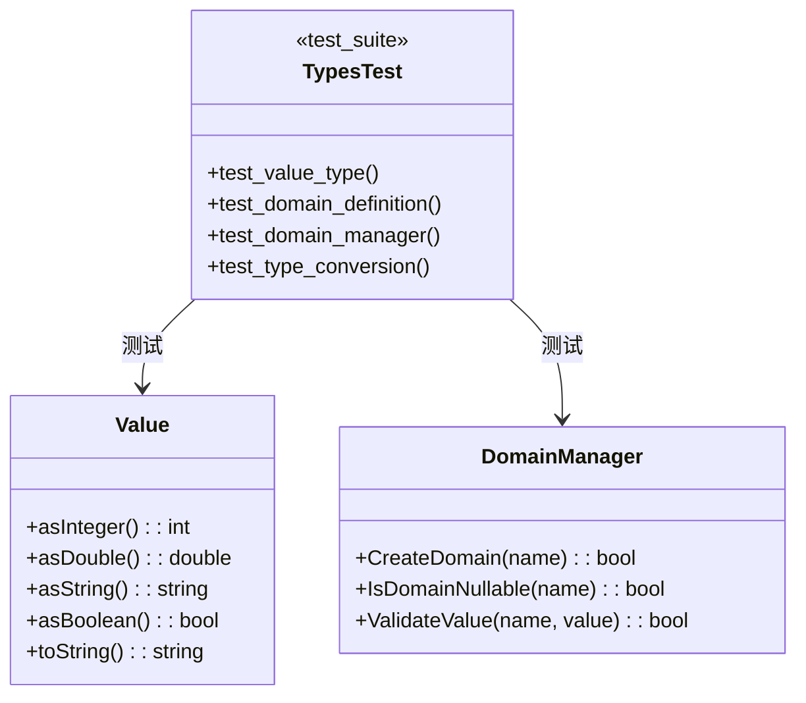

# Types 模块重构设计

**模块**: types  
**版本**: v1.3.8  
**日期**: 2026-01-30  
**状态**: ✅ 已完成

---

## 1. 架构决策

| 决策 | 内容 | 理由 | 状态 |
|------|------|------|------|
| ADR-T001 | 添加 ValueTypeConversionTest | 覆盖所有类型转换路径 | 已批准 |
| ADR-T002 | 修复 Value::toString() | 统一 NULL 值表示 | 已批准 |
| ADR-T003 | 添加构造函数重载 | 支持更多输入类型 | 已批准 |

---

## 2. 测试架构



---

## 3. 测试用例设计

### 3.1 类型转换测试 (19 用例)

| 测试组 | 测试数 | 覆盖类型 |
|--------|--------|----------|
| toInteger() | 4 | DOUBLE, STRING, BOOLEAN, NULL_VALUE |
| toDouble() | 4 | INTEGER, STRING, BOOLEAN, NULL_VALUE |
| toString() | 4 | 所有非 STRING 类型 |
| toBoolean() | 7 | 所有类型 |

### 3.2 边界测试

| 测试用例 | 输入 | 预期行为 |
|----------|------|----------|
| DoubleToInteger | 3.14 | 截断为 3 |
| NegativeToBoolean | -1 | true |
| ZeroDoubleToBoolean | 0.0 | false |
| NullToBoolean | NULL_VALUE | false |

---

## 4. BUILD 配置

```bazel
# tests/level1_foundation/types/BUILD.bazel

cc_test(
    name = "types_test",
    srcs = ["types_test.cpp"],
    copts = [
        "-fprofile-instr-generate",
        "-fcoverage-mapping",
    ],
    linkopts = ["-fprofile-instr-generate"],
    deps = [
        "@com_google_googletest//:gtest",
        "@com_google_googletest//:gtest_main",
        "//src/types:types_coverage",
    ],
    tags = ["coverage", "level1", "types"],
)
```

---

**维护者**: SQLCC Team  
**完成日期**: 2026-01-30
